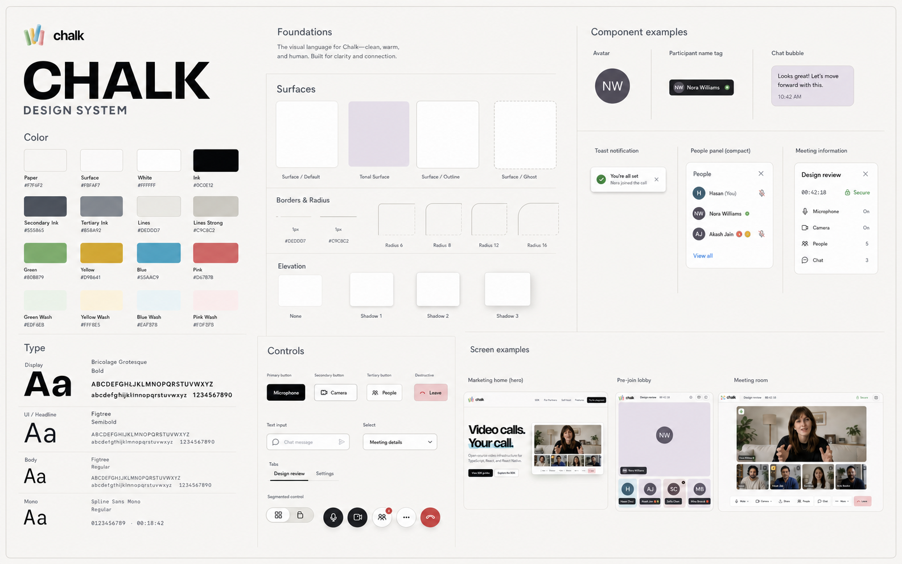

# Chalk Design System

> Descriptive snapshot, last verified against code on 2026-08-02. Not a source of truth.

This document describes Chalk's visual language across marketing, web, meetings, SDK surfaces, and mobile. It defines a composable appearance system built around calm surfaces, precise structure, direct controls, and the four colors in the Chalk mark.



The 2026-08-01 board remains the base-light visual reference. The paired appearance families documented below extend that foundation; written tokens and rules remain reference guidance rather than implementation source code.

## Character

Chalk should feel clear, warm, and quietly confident. It is a realtime work surface, so the design must help people understand the room at a glance and act without hesitation.

Five principles govern the system:

1. **The content owns the room.** Video, shared screens, whiteboards, and conversation take the available space. Controls sit in reserved chrome and never cover participant content.
2. **Structure comes from spacing and lines.** Use a consistent grid, generous whitespace, and crisp one-pixel borders. Shadows explain elevation only when one surface truly floats above another.
3. **Black means decisive.** Primary calls to action and live microphone or camera controls use near-black. The result is direct, stable, and easy to find.
4. **Chalk color carries meaning.** Green, yellow, blue, and pink identify states, participants, sections, or gentle background washes. They do not become decorative gradients or compete with content.
5. **Every state stays legible.** Active, muted, selected, loading, error, and focus states must remain clear without relying on color alone.

## Foundations

### Color

The product uses warm neutrals as its base. Pure white is reserved for contained surfaces, while the page and application shell remain slightly warm.

| Token             | Value     | Use                                     |
| ----------------- | --------- | --------------------------------------- |
| `--paper`         | `#F7F6F2` | Page canvas, meeting shell background   |
| `--paper-2`       | `#F1F0EB` | Recessed or grouped control background  |
| `--surface`       | `#FFFFFF` | Cards, inputs, panels, dialogs          |
| `--surface-muted` | `#FBFAF7` | Headers, soft panels, app chrome        |
| `--ink`           | `#0C0E12` | Primary text, primary actions           |
| `--ink-2`         | `#555B65` | Supporting text and icons               |
| `--ink-3`         | `#858A92` | Metadata, placeholders, inactive labels |
| `--line`          | `#DEDDD7` | Default dividers and borders            |
| `--line-strong`   | `#C9C8C2` | Outer frames and emphasized boundaries  |

The Chalk colors retain the light character of the logo.

| Token            | Value     | Soft companion           | Use                                           |
| ---------------- | --------- | ------------------------ | --------------------------------------------- |
| `--chalk-green`  | `#80B879` | `--wash-green: #EDF6EB`  | Success, connected, available                 |
| `--chalk-yellow` | `#D9B641` | `--wash-yellow: #FFF8E5` | Attention, hand raise, pending                |
| `--chalk-blue`   | `#55AAC9` | `--wash-blue: #EAF7FB`   | Selection, information, active tools          |
| `--chalk-pink`   | `#D67B7B` | `--wash-pink: #FDF0F0`   | Destructive context, recording, leave support |

Semantic colors use darker values where text or icons need contrast:

| State       | Foreground | Background |
| ----------- | ---------- | ---------- |
| Success     | `#4F8C4A`  | `#E8F1E4`  |
| Information | `#315F72`  | `#E6F3F8`  |
| Warning     | `#9A7314`  | `#FDF2CF`  |
| Danger      | `#B94C4C`  | `#F8E4E4`  |

Color rules:

- Keep large page regions neutral. A tinted wash may identify one bounded section, tile, or status surface.
- Do not put two bright Chalk colors in competition inside one component.
- Do not use color as the only status cue. Pair it with an icon, label, shape, or position.
- Do not use gradients on avatars, controls, cards, or panels. Soft cross-color washes are allowed only as quiet environmental backgrounds, such as an empty camera preview.
- Light and dark palettes are designed counterparts, never automatic inversions. Preserve each family’s temperature, contrast philosophy, accent relationships, and functional state colors in both modes.

#### Appearance composition

Appearance has two independent axes:

1. **Palette** defines color, contrast, and the visual identity of a family.
2. **Texture** adds a material layer without changing the underlying color tokens.

The default `Chalk Light` palette remains the baseline. Seven designed families pair an intentional light and dark expression:

| Family   | Light palette  | Dark palette       |
| -------- | -------------- | ------------------ |
| Warm     | Warm Porcelain | Warm Charcoal      |
| Graphite | Cool Mist      | Cool Graphite      |
| Ink      | Paper & Ink    | High-contrast Ink  |
| Espresso | Cream & Clay   | Espresso Night     |
| Atelier  | Studio Canvas  | Chalkboard Atelier |
| Prism    | Prism Daylight | Prism Nocturne     |
| Signal   | Signal White   | OLED Signal        |

Every palette supports `Clean`, `Paper Grain`, and `Slate`. Texture remains optional and must not encode selection, availability, error, or other product state. The Appearance settings apply palette and texture independently to the active surface, including panels, dialogs, controls, messages, and participant fields.

### Typography

Chalk uses three type families, each with a narrow job.

| Role      | Family                | Weight         | Use                                                     |
| --------- | --------------------- | -------------- | ------------------------------------------------------- |
| Display   | `Bricolage Grotesque` | `660` to `680` | Marketing headlines and major product moments           |
| Interface | `Figtree`             | `400` to `650` | Product headings, body text, buttons, inputs, labels    |
| Mono      | `Spline Sans Mono`    | `400` to `600` | Time, sequence, performance numbers, technical metadata |

Type scale:

| Style         | Desktop                   | Mobile           | Line height | Typical use                    |
| ------------- | ------------------------- | ---------------- | ----------- | ------------------------------ |
| Display XL    | `clamp(58px, 7vw, 100px)` | `50px` to `72px` | `1.02`      | Marketing hero                 |
| Display L     | `38px` to `68px`          | `36px` to `50px` | `1.02`      | Marketing section title        |
| Product title | `28px` to `40px`          | `28px` to `36px` | `1.08`      | Lobby and empty-state title    |
| Panel title   | `20px` to `24px`          | `20px`           | `1.2`       | Dialog and side-panel title    |
| UI heading    | `16px`                    | `16px`           | `1.35`      | Room and card headings         |
| Body          | `15px` to `16px`          | `15px` to `16px` | `1.5`       | Product and marketing copy     |
| Label         | `13px` to `14px`          | `13px` to `14px` | `1.35`      | Form and control labels        |
| Meta          | `11px` to `12px`          | `11px` to `12px` | `1.4`       | Time, counts, secondary status |

Display text uses tight tracking between `-0.035em` and `-0.055em`. Interface text uses normal tracking. Sentence case is the default. Uppercase is limited to short external conventions or a rare visual specimen, never routine navigation.

### Spacing

Use a four-pixel base grid. Product UI favors the smaller steps; marketing compositions may use the larger steps.

| Token      | Value  | Typical use                            |
| ---------- | ------ | -------------------------------------- |
| `space-1`  | `4px`  | Icon adjustment, tight group           |
| `space-2`  | `8px`  | Related controls                       |
| `space-3`  | `12px` | Control clusters, compact card padding |
| `space-4`  | `16px` | Default component gap                  |
| `space-5`  | `20px` | Panel padding                          |
| `space-6`  | `24px` | Section inside a card                  |
| `space-8`  | `32px` | Desktop panel and card padding         |
| `space-10` | `40px` | Page-level breathing room              |
| `space-14` | `56px` | Desktop container edge                 |
| `space-22` | `88px` | Minimum marketing section space        |

Spacing describes relationships. Use less space inside a component, more space between component groups, and the most space between page sections.

### Shape

Corners are restrained so the interface feels precise rather than toy-like.

| Token         | Value   | Use                                     |
| ------------- | ------- | --------------------------------------- |
| `--radius-sm` | `6px`   | Buttons, tags, tabs                     |
| `--radius-md` | `10px`  | Cards, panels, media tiles              |
| `--radius-lg` | `16px`  | Large dialogs and special containers    |
| Circle        | `999px` | Avatars and round meeting controls only |

Use one-pixel borders. A component should not combine a heavy border, large shadow, and tinted background unless it represents a critical state.

### Elevation

Chalk has two standard shadows:

```css
--shadow-sm: 0 1px 2px rgba(12, 14, 18, 0.04), 0 6px 18px rgba(12, 14, 18, 0.05);

--shadow-md: 0 2px 4px rgba(12, 14, 18, 0.05), 0 20px 50px rgba(12, 14, 18, 0.09);
```

Use no shadow for elements that remain in normal document flow. Use `shadow-sm` for a compact floating control or card. Use `shadow-md` for a modal, lobby frame, or hero product image. Full-screen dialogs may use `0 28px 80px rgba(12, 14, 18, 0.20)` because the dimmed backdrop establishes a separate layer.

### Icons

Icons use a simple rounded-outline family with consistent optical weight. Standard sizes are `15px`, `18px`, and `20px`; large meeting controls may use `22px` to `24px`.

- Use icons to reinforce clear labels, not replace unfamiliar concepts.
- Keep decorative icons out of headings and marketing copy.
- Use filled status dots only for small persistent state, such as online or unread.
- Destructive icons use danger red. Muted state icons appear without a surrounding border inside participant lists.

### Logo

Use the full-color Chalk mark on paper, muted surface, or white. Preserve its proportions and clear space. The divider after the logo sits `12px` to `16px` away, followed by the room name at the same interval. Do not stretch the mark, recolor individual chalk sticks, put it inside a pill, or add a glow.

## Components

### Buttons

All buttons have a clear hierarchy.

| Variant     | Appearance                                        | Use                                        |
| ----------- | ------------------------------------------------- | ------------------------------------------ |
| Primary     | Ink background, white text, `6px` to `8px` radius | Join, save, confirm, main marketing action |
| Secondary   | White background, strong line border, ink text    | Alternate action                           |
| Ghost       | Transparent background, ink or secondary ink      | Toolbar, panel, row action                 |
| Active      | Pale blue surface, blue border or ink icon        | Selected tool or panel                     |
| Destructive | `#C94343` background, white text                  | Leave, remove, irreversible action         |

Standard product buttons are `40px` to `44px` high. Marketing buttons are `50px` high. Icon-only buttons must have at least a `36px` target on desktop and `44px` on touch surfaces.

Primary controls may lift by one pixel on hover. Active press returns them to their resting position. Do not animate controls with bounce, elastic scale, or glow.

### Meeting media controls

Microphone and camera are the visual anchors of the dock. When available, both use circular ink buttons with white icons. A small adjacent chevron opens the related device menu. Off state keeps the dark control but uses a clear crossed icon and danger cue.

Other meeting actions use circular white buttons with a line border. Selected actions use a pale blue surface. Leave is always separated from the rest of the cluster and uses a red circle.

The dock sits in a reserved footer row. It may float visually, but it must never overlap a video tile, participant label, or side panel.

### Inputs and text areas

Inputs use a white or muted surface, `1px` strong-line border, `8px` radius, and a minimum height of `40px`.

| State    | Treatment                                                      |
| -------- | -------------------------------------------------------------- |
| Rest     | `#C9C8C2` border, ink text                                     |
| Hover    | Slightly darker border                                         |
| Focus    | Single `#74B7CF` border or a two-pixel ink outline with offset |
| Error    | Danger border and concise error copy                           |
| Disabled | Reduced opacity with disabled cursor                           |

Never stack a browser outline, colored ring, and box shadow. A focused field gets one crisp focus treatment, not a double blue glow.

Labels sit above fields and remain visible after input. Placeholders provide examples, not labels. Chat composition uses the same field treatment, with the send button remaining disabled until content is valid.

### Selects and device menus

Select triggers follow input dimensions and show one down chevron. Custom menus open as white panels with a strong-line border, `10px` to `12px` radius, and a medium shadow.

- Put the menu near its trigger without covering the control that opened it.
- Use a section title only when it resolves ambiguity, such as “Camera” or “Microphone.”
- Show the selected item with a check or blue-tinted row, not a colored radio dot alone.
- Truncate long device names after preserving the distinctive part.
- Keep menu rows at least `44px` high on touch devices.

### Tabs and segmented controls

Tabs use text with a two-pixel ink underline. Segmented controls sit on `--paper-2` with `4px` inner padding. The selected segment uses white plus a tiny shadow; unselected segments remain ghost controls.

Layout controls in the meeting header use the segmented pattern at `32px` square per option. They remain visually quiet because layout is a secondary action.

### Avatars and identity

Chalk avatars are flat circles. Use an uploaded image when available; otherwise show one or two initials on a deterministic, muted solid color. Approved identity colors come from this set:

`#315F72`, `#5C6650`, `#6B5B4F`, `#64576B`, `#49645D`, `#665D42`, `#4D5D73`, `#6D5158`.

Do not use gradients, artificial faces, 3D lighting, glows, or decorative rings. A speaking state may add a thin green boundary around the media tile, not the avatar itself.

Name tags sit at the lower-left of media tiles on `rgba(12, 14, 18, 0.80)`. They use white text, a `5px` radius, and optional compact state icons. Tags must never grow tall enough to cover meaningful video content.

### Media tiles

Tiles use a `8px` to `10px` radius and no shadow. Camera-off tiles use pale Chalk washes with a flat avatar centered inside. Alternate the wash by participant so adjacent tiles remain distinct without becoming colorful noise.

The active speaker receives space, not spectacle. In spotlight layout, the speaker occupies the large stage and the remaining participants form a stable filmstrip. Poor connection, muted, and raised-hand indicators stay compact and attach to a corner or name tag.

The raised-hand circle must remain smaller than the avatar and clear of the identity label. In side panels it becomes a compact yellow icon, not an overlay.

### Panels

People, chat, and other meeting panels use a shared shell:

- `340px` desktop width
- white surface
- `10px` radius
- line border
- title row with count or secondary action
- close button in the top-right
- fixed header and footer when the center content scrolls

Opening a panel reduces the stage width on desktop. It overlays the stage only at narrow breakpoints, where it keeps safe space above the control dock.

Participant rows are calm list items with `56px` to `72px` height. Role labels and “You” remain secondary. Row menus open next to the triggering button and contain only actions available for that participant.

### Chat

Chat messages prioritize readable conversation over decorative bubbles. Local messages may use ink with white text; remote messages use a neutral surface with a line border. Avatars are optional when sequential messages come from the same person. Time and delivery status use meta type.

The composer stays pinned to the panel bottom. It uses a single clean focus treatment and a send button with a clear enabled state. Empty chat and file states use direct product language without illustration clutter.

### Popovers and dialogs

Popovers anchor to their trigger, use a white surface, strong-line border, `10px` to `12px` radius, and one medium shadow. Their content should be scannable without a second card nested inside.

Dialogs center on a dimmed `rgba(12, 14, 18, 0.20)` backdrop. Use `14px` to `16px` radius and a maximum width based on the task:

| Dialog          | Width              |
| --------------- | ------------------ |
| Confirmation    | `420px` to `500px` |
| Meeting details | `560px` to `640px` |
| Settings        | Up to `720px`      |

Meeting details contains the room name, time, join link, security note, and connection information. Settings uses a left navigation on desktop and horizontal tabs on mobile. Close actions remain in the top-right, and the initial focus moves inside the dialog.

### Notifications

Notifications appear in the top-right on desktop and below the safe header on mobile. They use a muted surface, strong-line border, `12px` radius, and a single elevated shadow.

Each notification has a `36px` tinted icon tile, one concise sentence, an optional action, and a close control. Default duration is five seconds, but errors and actions that require a decision remain until dismissed. Announce non-critical updates with `aria-live="polite"` and errors with `aria-live="assertive"`.

### Whiteboard and shared screens

Whiteboard and screen share replace the main stage. They do not appear as small floating cards over video.

The Excalidraw surface inherits Chalk's paper, ink, blue selection, restrained radii, and line colors. Preserve its familiar drawing behavior and accessibility while restyling its shell and tool islands.

A screen-share placeholder should resemble real working software. Include recognizable browser or document chrome, realistic hierarchy, and a small “shared by” label. Do not use abstract rectangles or fake dashboards that cannot plausibly exist.

## Layouts

### Marketing

Marketing pages use a centered container up to `1320px`, with responsive side padding from `22px` to `56px`. The navigation is `74px` high. Major sections use at least `88px` vertical space and one clear boundary.

The hero pairs a large display headline with a realistic product surface. Use the blue chalk stroke as a single highlight behind one phrase. Technology proof uses logos alone. Supporting sections use rows, ruled grids, and gentle washes rather than stacks of generic floating cards.

### Lobby

The lobby has three levels:

1. A `72px` header with the Chalk logo, compact divider, room name, and “Device setup” metadata.
2. A centered preparation frame up to `1260px` wide.
3. A media preview on the left and a focused join form on the right.

On desktop, the join form is `400px` wide. Microphone and camera toggles sit directly below the preview and appear only once. The name field and join action stay together. On mobile, the preview stacks above the form and all touch controls meet the `44px` minimum.

### Meeting room

The meeting shell uses a centered maximum width of `1440px` with quiet side borders. Its vertical structure is fixed:

1. Meeting header, `76px`
2. Flexible stage and optional panel
3. Reserved control row with safe-area padding

The stage has `12px` tile gaps and outer padding from `12px` on mobile to `32px` on desktop. Opening People or Chat creates a `340px` second column at desktop sizes. The header shows the room name, duration, information action, and subtle layout selector.

Grid layout gives peers equal weight. Spotlight layout gives the active or pinned participant the large stage and keeps others in a stable filmstrip. Sidebar layout reserves a narrow participant column. Screen share and whiteboard take the full main stage while participant access remains available.

### Mobile

Mobile preserves the same hierarchy rather than shrinking desktop UI.

- The marketing home moves to one column and uses full-width actions where needed.
- The lobby stacks preview, media toggles, and join form in that order.
- The meeting room keeps the header compact, uses one dominant tile or a two-column grid, and opens People and Chat as sheets or full-height panels.
- The meeting dock may scroll horizontally only when every visible control retains a `44px` target. Primary mic, camera, and leave controls remain immediately reachable.
- Safe-area insets apply to headers, docks, composers, and sheets.

## Interaction and motion

Motion confirms state changes and spatial relationships. It should never perform decoration by itself.

| Motion            | Duration           | Curve                           |
| ----------------- | ------------------ | ------------------------------- |
| Hover and press   | `120ms` to `160ms` | ease-out                        |
| Popover and toast | `160ms` to `200ms` | `cubic-bezier(0.16, 1, 0.3, 1)` |
| Panel and dialog  | `200ms` to `240ms` | `cubic-bezier(0.16, 1, 0.3, 1)` |
| Layout change     | up to `300ms`      | ease-out                        |

Animate opacity and transform. Avoid layout-janking height animation, continuous floating, shimmer on loaded content, elastic overshoot, and repeated status pulsing. Recording may use one restrained pulse. Respect `prefers-reduced-motion` by reducing all non-essential movement to an immediate state change.

## Accessibility

Chalk targets WCAG 2.2 AA.

- Body text and essential icons need at least `4.5:1` contrast; large text and non-text boundaries need at least `3:1`.
- Every icon-only control has an accessible name and visible tooltip where the meaning is not universal.
- Focus order follows the visible layout. Opening a menu, panel, or dialog moves focus predictably and returns it to the trigger on close.
- Keyboard users can operate all meeting controls, device menus, tabs, participant actions, and the chat composer.
- Touch targets are at least `44px` square. Closely grouped controls still keep enough separation to prevent accidental activation.
- Live captions, notification announcements, recording status, hand raises, and connection problems expose semantic status text.
- Video tiles identify participants and state to assistive technology without reading the same name twice.
- Do not communicate camera, microphone, connection, or recording state through color alone.

## Product language

Copy is calm, direct, and role-neutral. Use familiar meeting terms: “People,” “Chat,” “Share,” “Board,” “Settings,” and “Leave.” Labels state the result of an action when state changes, such as “Mute microphone” and “Turn off camera.”

Avoid technical provider names, implementation status, or SDK language inside the meeting experience. Error messages state what happened, whether the meeting can continue, and the next available action.

## Implementation contract

The first-party CSS tokens live in `apps/web/src/styles/tokens.css`. Product components should consume these semantic values instead of adding nearby hex values. Shared React components must expose state and composition without forcing a separate visual language.

Use these layers consistently:

| Layer       | Z-index | Content                           |
| ----------- | ------- | --------------------------------- |
| Base        | `0`     | Canvas and normal content         |
| Tile        | `10`    | Video, whiteboard, shared content |
| Tile chrome | `20`    | Name tags and tile status         |
| Dock        | `30`    | Meeting controls                  |
| Panel       | `40`    | People, chat, transcript          |
| Dialog      | `70`    | Meeting details and settings      |
| Popover     | `80`    | Device and participant menus      |
| Toast       | `90`    | Notifications and urgent feedback |

New components should reuse the existing color, type, space, radius, elevation, and motion scales. If a design requires a new token, add a semantic token here and in the shared implementation before using it in a component.

## Release checklist

A Chalk interface is ready when all of the following are true:

- The primary task is obvious without a decorative label or onboarding sentence.
- Content has more space than chrome.
- Controls do not obscure video, avatars, labels, whiteboard tools, or shared content.
- Every interactive state is visible with keyboard, pointer, and touch input.
- Inputs have one focus treatment and no glow stack.
- Avatars are flat and deterministic.
- Popovers are anchored, dialogs are centered, and side panels preserve the stage where space allows.
- Chalk colors serve meaning and remain secondary to ink and paper.
- Mobile composition is intentional and respects safe areas.
- Reduced motion, empty, loading, error, disconnected, permission-denied, and long-content states have been checked in a real browser or device.
