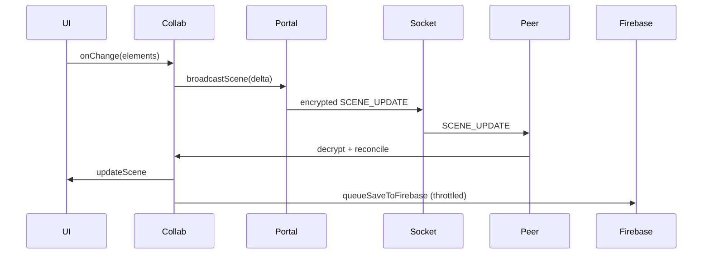
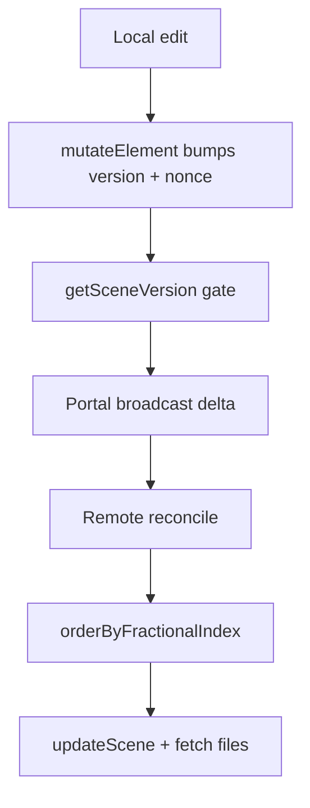

# Excalidraw Sync Notes

Source:
- Repo: github.com/excalidraw/excalidraw
- Commit: f39ac4a653335efaaaf9834bf28e9ffc1452cb59
- Cloned: 2026-02-04
- Scope: collab + sync + persistence + versioning

**Key Files**
- `excalidraw-app/collab/Collab.tsx:483` start/join, socket init, reconcile, broadcast, idle, presence.
- `excalidraw-app/collab/Portal.tsx:25` socket wrapper, encryption, delta vs full sync, file upload.
- `excalidraw-app/data/firebase.ts:83` Firestore scene storage, encryption, reconcile on save, file storage.
- `excalidraw-app/data/index.ts:43` syncable element filter + WS payload types + room links.
- `packages/excalidraw/data/reconcile.ts:23` conflict resolution rules, ordering by fractional index.
- `packages/excalidraw/data/restore.ts:621` restoreElements + binding repair + bumpElementVersions.
- `packages/element/src/mutateElement.ts:29` version + versionNonce bump on element change.
- `packages/element/src/index.ts:12` getSceneVersion = sum of element.version (deprecated but used).
- `packages/excalidraw/data/encryption.ts:5` AES-GCM + IV 12 bytes.
- `packages/excalidraw/data/encode.ts:322` compress+encrypt binary file blobs.
- `excalidraw-app/App.tsx:658` onChange -> collabAPI.syncElements.
- `excalidraw-app/app_constants.ts:1` time constants + WS subtypes.

**Room + Link**
- Link format `#room=<roomId>,<roomKey>`; roomKey length validation (22). `excalidraw-app/data/index.ts:131`
- roomId: random bytes -> hex. `excalidraw-app/data/index.ts:68`
- roomKey: generateEncryptionKey (AES-GCM key, 128-bit). `packages/excalidraw/data/encryption.ts:12` + `packages/common/src/constants.ts:348`

**Transport + Payloads**
- socket.io client; transports: websocket, polling. `excalidraw-app/collab/Collab.tsx:520`
- messages encrypted per payload with AES-GCM + per-message IV. `excalidraw-app/collab/Portal.tsx:85` + `packages/excalidraw/data/encryption.ts:50`
- WS events: server-broadcast, server-volatile-broadcast. `excalidraw-app/app_constants.ts:16`
- message subtypes: SCENE_INIT, SCENE_UPDATE, MOUSE_LOCATION, IDLE_STATUS, USER_VISIBLE_SCENE_BOUNDS. `excalidraw-app/app_constants.ts:23`
- volatile channel used for cursor + idle + bounds. `excalidraw-app/collab/Portal.tsx:185`

**Client Lifecycle**
- startCollaboration: generate/join room; pause LocalData save; open socket; fallback init timer. `excalidraw-app/collab/Collab.tsx:483`
- new room path: convert saved images -> pending; drop deleted elements; persist to Firebase. `excalidraw-app/collab/Collab.tsx:540`
- existing room path: reset scene before join. `excalidraw-app/collab/Collab.tsx:536`
- socket "client-broadcast": decrypt -> switch by subtype; INIT merges + updates; UPDATE merges + updates; others update presence or viewport. `excalidraw-app/collab/Collab.tsx:565`
- socket "first-in-room": load scene from Firebase. `excalidraw-app/collab/Collab.tsx:677`
- stopCollaboration: flush throttles; save to Firebase; close socket; resume local save. `excalidraw-app/collab/Collab.tsx:355`

**Reconciliation + Ordering**
- restoreElements before reconcile to repair/migrate elements. `excalidraw-app/collab/Collab.tsx:760` + `packages/excalidraw/data/restore.ts:621`
- conflict rules: discard remote when local is editing/resizing/newElement OR local version newer OR same version with lower versionNonce. `packages/excalidraw/data/reconcile.ts:23`
- merged list ordered by fractional index; invalid indices sync + validate (dev/test). `packages/excalidraw/data/reconcile.ts:110`
- bumpElementVersions after reconcile to avoid local-remote version regression. `excalidraw-app/collab/Collab.tsx:771` + `packages/excalidraw/data/restore.ts:813`

**Versioning Primitives**
- mutateElement/newElementWith bump version + versionNonce + updated timestamp. `packages/element/src/mutateElement.ts:29`
- getSceneVersion = sum of element.version (deprecated but used for collab gating). `packages/element/src/index.ts:12`
- used to avoid echo + gate sends. `excalidraw-app/collab/Collab.tsx:942`

**Broadcast Strategy**
- per-update send only elements whose version increased since last broadcast; track broadcastedElementVersions. `excalidraw-app/collab/Portal.tsx:151`
- periodic full sync of all elements every 20s. `excalidraw-app/collab/Collab.tsx:958` + `excalidraw-app/app_constants.ts:6`
- cursor throttled ~30fps. `excalidraw-app/app_constants.ts:8` + `excalidraw-app/collab/Collab.tsx:912`

**Persistence (Firebase)**
- scenes stored encrypted (AES-GCM) with sceneVersion, ciphertext, iv. `excalidraw-app/data/firebase.ts:87`
- saveToFirebase uses Firestore transaction: decrypt stored scene, restore, reconcile with local, re-encrypt, update doc. `excalidraw-app/data/firebase.ts:187`
- FirebaseSceneVersionCache used to skip redundant saves + prevent unload gating. `excalidraw-app/data/firebase.ts:118`
- loadFromFirebase restores + filters deleteInvisibleElements. `excalidraw-app/data/firebase.ts:249`

**Syncable Element Filter**
- syncable if not invisibly small; if deleted, only sync if updated within 1 day. `excalidraw-app/data/index.ts:46` + `excalidraw-app/app_constants.ts:9`
- new room creation removes deleted elements to avoid persisting deleted data. `excalidraw-app/collab/Collab.tsx:546`

**Files (Images)**
- FileManager tracks save/fetch, versions, status. `excalidraw-app/data/FileManager.ts:22`
- encodeFilesForUpload compress + encrypt dataURL bytes + metadata. `excalidraw-app/data/FileManager.ts:206` + `packages/excalidraw/data/encode.ts:322`
- upload to Firebase storage; on success update element status -> "saved" to signal fetch. `excalidraw-app/collab/Portal.tsx:104`
- remote clients fetch missing images after scene update. `excalidraw-app/collab/Collab.tsx:787`

**Presence + Follow**
- MOUSE_LOCATION includes pointer, button, selectedElementIds, username. `excalidraw-app/data/index.ts:95`
- IDLE_STATUS and USER_VISIBLE_SCENE_BOUNDS handled in Collab. `excalidraw-app/collab/Collab.tsx:661`
- follow-user flow: emits user-follow; peers respond with bounds on follow room change. `excalidraw-app/collab/Portal.tsx:226` + `excalidraw-app/collab/Collab.tsx:688`

**Local Data Interaction**
- collab start pauses LocalData save; stop resumes. `excalidraw-app/collab/Collab.tsx:503` + `excalidraw-app/data/LocalData.ts:116`
- normal onChange saves locally when not paused; collab path sends syncElements. `excalidraw-app/App.tsx:658`

**Diagrams**

