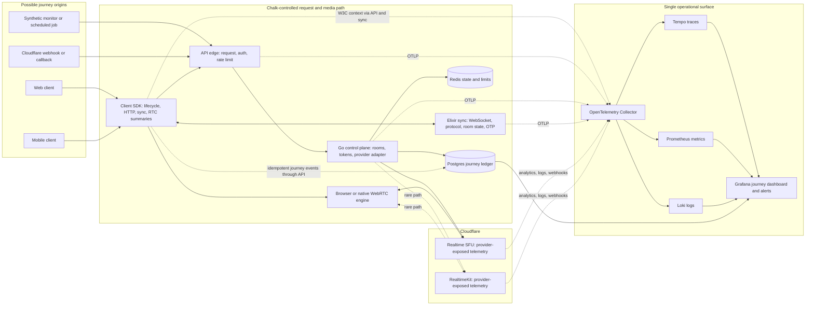

# End-to-end observability

Chalk observability follows a journey from the first layer that can see it to
every downstream layer that Chalk controls. A journey can begin in a client,
the API, the sync service, an RTC callback, a scheduled monitor, or a provider
webhook. The first observer creates a journey ID and W3C trace context when no
upstream context exists. Every downstream boundary propagates both.

## Correlation contract

The stable correlation key is `journey_id`. HTTP carries it in
`x-chalk-journey-id`; WebSocket frames carry `journey_id`; telemetry uses the
`chalk.journey.id` attribute. `traceparent` and `tracestate` preserve the active
W3C trace whenever a parent exists.

Synchronous work and explicitly propagated OTP work use parent-child spans.
Fan-out across independent journeys and late callbacks use span links. A new root is valid when a layer is the
first observer. The durable Postgres journey ledger records ordered lifecycle
events with idempotent event IDs, so a journey still tells one story when a
trace is split by a reconnect, background execution, retry, or provider
callback.

The terminal journey result is derived from the highest ordered terminal event.
Late retries and lower sequence numbers cannot rewrite the final result.

The public client telemetry runtime is opt-in. Chalk's mobile surface enables it
when a token provider can authenticate intake. The public web surface requires
both `VITE_CHALK_TELEMETRY_ENABLED=true` and an authenticated
`VITE_CHALK_API_URL`; an unauthenticated marketing deployment stays inert.

Normal client events share a short, bounded batching window and a request holds
at most 100 events. An explicit flush and a page-unload keepalive flush send
without waiting for that window.

The append-only intake accepts verified Chalk meeting and API session
credentials. The isolated, rate-limited intake route verifies bearer and cookie
credentials through the same revoked-session and expiry checks as the rest of
the API. Tenant attribution and related governance controls are deferred beyond
v1.

## Coverage

| Layer                  | Captured in v1                                                                                                      | Connection to the journey                           |
| ---------------------- | ------------------------------------------------------------------------------------------------------------------- | --------------------------------------------------- |
| TypeScript client      | lifecycle, fan-out, diagnostics, HTTP, sync frames, bounded aggregate RTC statistics, exporter health and drops     | journey ID, W3C trace context, parent event IDs     |
| Go API                 | edge requests, authentication, rate limits, business phases, provider calls, errors, runtime signals, ledger intake | propagated context and durable ledger               |
| Elixir sync            | upgrade, protocol frames, room/state operations, OTP handoffs, connection terminal paths, BEAM health               | propagated frame/header context and span links      |
| Cloudflare SFU         | Chalk adapter calls and endpoint RTC summaries; provider analytics, logs, and webhooks are deployment inputs        | provider IDs mapped to journey and trace attributes |
| Cloudflare RealtimeKit | the same adapter-boundary and endpoint coverage on the uncommon path                                                | provider IDs mapped to journey and trace attributes |
| Data stores            | operation timing, failures, pool/runtime health, journey writes                                                     | active trace and journey attributes                 |
| Telemetry pipeline     | collector health, rejected/refused exports, stale-pipeline canary                                                   | independent critical alerts                         |
| Operations             | traces, metrics, logs, profiles, durable journey timeline, alert state                                              | one provisioned Grafana surface                     |

## Shipping contract

Observability is part of each feature's acceptance criteria. New or changed API
and service behavior must preserve `journey_id`, `traceparent`, and `tracestate`
across every boundary Chalk controls, then expose meaningful success, rejection,
retry, timeout, and terminal-failure signals through the existing stack. Prefer
bounded attributes that identify the operation and failure class; credentials,
tokens, webhook secrets, and sensitive request or event bodies never belong in
telemetry.

A local execution trace is an explanation aid, not operational proof. The
relevant end-to-end check must exercise a successful journey and an
operationally distinct failure, then query the resulting trace, metrics, logs,
and durable journey events where the lifecycle uses the ledger. Add alerts when
an operator must act, and verify the alert's signal source rather than assuming
dashboard presence proves it works.

Every new deployed service must join uptime coverage in the same change. Add an
appropriate health or synthetic target to the registry in
`infrastructure/uptime-worker/src/index.ts`, cover it with focused tests, and add
status projection when customers experience it as a distinct component. The
proof must observe the deployed check fail and recover; a handler returning 200
in isolation is insufficient.

## Deliberate limits and blind spots

Cloudflare's private SFU implementation is outside Chalk's process and account
boundary. Chalk can observe every request it sends, every response and webhook
it receives, provider analytics made available to the account, and both WebRTC
endpoints. It cannot instrument Cloudflare's internal packet scheduler,
host-to-host routing, queues, kernel state, or proprietary decision logic.
Cloudflare telemetry narrows that gap but does not remove it. Closing it fully
would require Cloudflare to expose those internal signals or run Chalk-owned
media infrastructure.

The repository provisions the intake, correlation contract, and single surface
for provider-exposed telemetry. Connecting a live Cloudflare account still
requires enabling the account's available analytics, logs, and webhooks and
routing them through a deployment-specific connector. The local proof cannot
exercise that account boundary, so v1's executable proof covers Chalk's
provider adapters and WebRTC endpoint observations.

The following remain unknowable or lossy in v1:

- code that executes before the telemetry runtime starts, and a hard process or
  device loss before a queued event is persisted or exported;
- browser, operating-system, device-driver, radio, ISP, and carrier internals
  beyond the events and aggregate statistics their public APIs expose;
- React Native peer connections that RealtimeKit never registers as a client-owned
  send or receive transport, including opaque SDK background work outside its
  call-stats boundary; registered transports remain attributable across
  asynchronous initialization and overlapping sessions, while unregistered
  connections remain unassigned instead of being attached to the wrong journey;
- encrypted media contents and exact per-packet media payloads; v1 records
  connection and quality metadata instead;
- provider activity that produces no API response, webhook, analytics record,
  endpoint symptom, or other externally visible effect;
- exact global ordering when clocks are wrong; per-journey sequence and receive
  time provide a deterministic operational ordering without claiming perfect
  wall-clock truth;
- unsampled production detail when deployment sampling is enabled to control
  cost; errors, terminal events, pipeline health, and the durable journey
  skeleton should remain unsampled;
- delivery of an alert after Grafana unless the notification channel is tested
  independently.

These limits are represented as first-observed layers, upstream visibility,
telemetry drop/failure signals, and pipeline-canary alerts. Missing upstream
visibility is therefore visible evidence rather than an implied complete
trace.

## Cost boundary

The local stack has no software-license cost and runs on developer hardware.
Production cost comes from telemetry volume, storage retention, query load,
egress, managed Grafana or backend plans, Cloudflare analytics products, and
alert delivery. Client RTC data is summarized, routine signals may be sampled,
and retention can be tiered while journey terminal events, errors, and pipeline
health remain complete. Production budgets and retention values are deployment
decisions; this repository does not claim a zero-cost production topology.

## Local proof

`pnpm run observability:start` starts the single-surface Grafana stack.
The stack also starts an independent canary that emits a trace, metric, and log
every minute so the stale-pipeline alert has a recurring source.
`pnpm run observability:smoke` sends and queries a trace, metric, and correlated
log and verifies the dashboard and critical alert rules. The API and sync gates
exercise the durable intake, idempotency, propagation, and service health
contracts.
