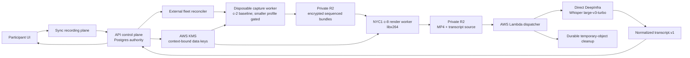

# Recording and transcription

Chalk's managed recording path is implemented and has end-to-end evidence from
a separate qualification environment. The production-placement delta below is
not yet deployed or cloud-qualified. An
Episode can move from a durable start command through encrypted capture,
rendering, download, managed transcription, and deletion of temporary source
objects. This document records the architecture, the decisions behind it, the
measured cost model, and the boundary of that qualification.

## Production implementation status (2026-09-15)

| Area                                                            | Implemented                                                                                                                                                                              | Remaining release evidence                                                        |
| --------------------------------------------------------------- | ---------------------------------------------------------------------------------------------------------------------------------------------------------------------------------------- | --------------------------------------------------------------------------------- |
| Existing encrypted capture, rendering, verification and cleanup | Preserved; prior qualification described below                                                                                                                                           | Exact new release end-to-end smoke                                                |
| Shared backend controls                                         | Separate capture/render fleet processes and direct-TLS issuer; dedicated control image, rootless units, private persistent state, per-state process locks, versioned inputs and rollback | Host headroom, direct peer identity and restart proof in the approved environment |
| Capacity                                                        | Zero spare; ten capture and ten render nodes; rendering does not consume live-capture admission                                                                                          | Ten-way cold readiness and overlapping capture/render workload                    |
| Startup cadence                                                 | Successful durable transitions fast-follow at 100 ms for at most 32 steps; idle/error polling remains 5 seconds                                                                          | Provider ready latency, quota and noisy-neighbor behavior                         |
| Scheduled Space preparation                                     | Durable revision-fenced prepare/get/cancel; five-minute lead and five-minute no-show grace; atomic consumption on real recording start                                                   | Integration adoption and scheduled smoke                                          |
| ASR                                                             | Direct DeepInfra native Whisper turbo; explicit optional Cloudflare fallback, disabled in the cost-first profile                                                                         | Approved provider corpus, privacy acceptance and exact adapter qualification      |
| Smaller capture profile                                         | Ordered 1 GiB / 2 GiB shared-CPU candidates, disabled without evidence; `c-2` retained                                                                                                   | Paced one-hour cloud comparison against `c-2`                                     |

Preparation uses the tenant-scoped Space `recording-preparation` resource.
`PATCH` accepts `starts_at` and `expected_revision` (`0` for the initial intent);
`GET` returns the current revision, preparation window and observed capacity;
`POST .../cancel` accepts the revision. Retries of the same command are
idempotent. A newer revision fences stale reschedules and cancels. Preparation
does not create an Episode, freeze a presentation or capture media. It becomes
`warming` only within the lead window, and `ready` only with fresh, unoccupied
capacity. Readiness is an observation, not a guaranteed admission reservation.
An actual recording consumes the intent atomically; cancellation never stops
that recording. Maintenance durably expires unused intents after the grace.

See [shared-host rollout](../infrastructure/managed-episode/recording-control.md)
and the [cost-first profile](../infrastructure/recorder/profiles/cost-first.json).
No production enablement, ingress change, secret issuance, paid provider call or
new cloud resource is authorized by local verification.

## Architecture

Postgres is the sole authority for intent, admission, assignments, leases,
fences, attempts, and terminal state. R2 is an object store, not a job queue.
DigitalOcean workers are disposable executors with short-lived workload
identity and object-scoped grants; they do not receive reusable DigitalOcean,
KMS, or R2 control credentials.

The implementation is split at stable boundaries:

- Sync serializes recording intent with the Episode control row and reserves the
  external operation.
- The API checks qualified capacity and health, freezes the presentation facts,
  creates fenced capture/render work, and independently verifies every reported
  object before committing completion.
- The external reconciler scales separate capture and render pools from zero,
  bootstraps immutable digest-pinned nodes, replaces unhealthy nodes, and drains
  them without making provider inventory authoritative.
- Capture writes encrypted, ordered media or explicit gap bundles. A controlled
  gap is data: it preserves the timeline across pauses, absent tracks, or worker
  handoff instead of silently shortening the recording.
- Render downloads only the accepted bundle set, reconstructs the frozen
  presentation, and produces the final MP4 plus recorder-owned transcription
  sources.
- The Lambda dispatcher claims fenced transcription chunks, invokes one selected
  provider, writes normalized conditional results, finalizes one deterministic
  transcript, and durably retries cleanup until temporary objects are absent.
- The public API exposes recording and transcript list/get operations and
  short-lived download authority; provider and object keys are not client
  controls.

## End-to-end flow

1. A participant with `manageRecording` starts recording. Sync durably reserves
   the operation before acknowledging it.
2. The API admits the request only against qualified, public-safe pool health,
   then creates generation- and fence-bound jobs.
3. The reconciler supplies an SGP1 CPU-Optimized `c-2` capture node. The worker
   joins the SFU as a controlled subscriber and writes encrypted sequenced
   bundles to a recording-scoped temporary R2 prefix.
4. Episode end closes the capture plan. The API validates continuity, checksums,
   sizes, codecs, and object ownership before accepting capture.
5. A deadline-aware scaler supplies an NYC1 CPU-Optimized `c-8` render node. The
   measured profile uses eight browser frame producers and `libx264`; GPU render
   remains an optional, separately qualified configuration.
6. The API verifies the MP4 in R2, atomically commits the artifact, and issues
   short-lived download authority.
7. The committed recorder source is split into fenced transcription jobs. The
   Lambda dispatcher sends audio to
   DeepInfra's `openai/whisper-large-v3-turbo`, normalizes the results, and finalizes the
   stable transcript document.
8. Durable cleanup jobs delete transcript intermediates and recorder sources.
   Completion is accepted only after independent absence checks.

## Decisions

| Decision                                                              | Reason                                                                                                                            |
| --------------------------------------------------------------------- | --------------------------------------------------------------------------------------------------------------------------------- |
| Durable control facts precede external work                           | A retry, process crash, or provider timeout cannot invent or lose acknowledged Episode state.                                     |
| Jobs use generation, fence, lease, and compare-and-set completion     | Late or replaced workers cannot overwrite newer truth.                                                                            |
| Provider inventory is reconciled outside OpenTofu                     | Pools can scale and replace nodes quickly while OpenTofu continues to own immutable policy, caps, firewalls, and image contracts. |
| Workers receive one-time bootstrap and job-scoped authority           | A compromised media worker cannot create infrastructure, enumerate a bucket, or decrypt another recording.                        |
| Capture stores encrypted sequenced bundles rather than one open movie | Work can resume after a handoff, discontinuities remain explicit, and render can verify a closed input set.                       |
| Presentation facts and UI build hash are frozen before render         | A retry renders the same participant layout and assets instead of whatever the current web release happens to serve.              |
| The qualified renderer is CPU-based                                   | The NYC1 `c-8`/`libx264` profile was available and met the measured deadline; a GPU dependency was unnecessary.                   |
| Transcription has one pinned provider per attempt                     | Provider failover cannot silently change privacy, residency, output shape, or billing semantics.                                  |
| Transcript finalization and source cleanup are durable jobs           | Provider success is not confused with a complete customer artifact, and cleanup survives partial failure.                         |

## Cost model

The table below is the historical Cloudflare/c-2 qualification baseline, not
the new deployment's measured invoice. Direct DeepInfra currently lists
$0.00020 per submitted audio minute, or $24–72 for 2,000–6,000 audio hours.
That range depends on actual per-Participant audio submitted, retries and
silence—not merely wall-clock recording time. [DeepInfra model API and price](https://deepinfra.com/openai/whisper-large-v3-turbo/api)

The native adapter persists its requested model and adapter contract separately
from observed request/model/execution metadata. Missing metadata stays absent;
optional identity pins fail closed when evidence is missing or mismatched.
`providerReportedCostUsd` is recorded only when returned by the provider. A
final transcript sums it only when every chunk reports it. This excludes
unobserved failed/retried calls and is not an invoice or a fabricated billed
audio-duration claim. No OpenRouter routing guarantee is claimed.

Prices below are public list prices checked on 2026-09-10. They are an
incremental artifact-pipeline estimate, not a total Chalk or SFU bill.

| Component                  |                                                          Public unit price |                                                                                                    Measured or normalized cost |
| -------------------------- | -------------------------------------------------------------------------: | -----------------------------------------------------------------------------------------------------------------------------: |
| Capture compute            |                         DigitalOcean CPU-Optimized `c-2`: **$0.0625/hour** |                                                  **$0.0625 per recorded hour** at one fully utilized active recording per node |
| Render compute             |                           DigitalOcean CPU-Optimized `c-8`: **$0.25/hour** |                                  The qualification rendered 556.372 seconds in about 324 seconds: **$0.146 per recorded hour** |
| Transcription              |                Workers AI Whisper large-v3-turbo: **$0.0005/audio minute** |                                **$0.03 per audio hour submitted**; the 2.394-minute qualification input cost about **$0.0012** |
| Final MP4 storage          |                                           R2 Standard: **$0.015/GB-month** | The 22.823 MB, 556.372-second proof normalizes to about 0.148 GB per recorded hour: **$0.0022 per stored recorded-hour-month** |
| R2 operations and delivery | Class A **$4.50/million**, Class B **$0.36/million**, Internet egress free |                                                     Small beside compute at this object count; monthly free tier may absorb it |
| Envelope encryption        |    AWS KMS key **$1/month**, requests **$0.03/10,000** after the free tier |                                              Fixed key cost is shared by the environment; request cost depends on bundle count |

The normalized capture plus render compute is about **$0.208 per recorded
hour**. With one audio hour submitted for transcription, the direct variable
total is about **$0.238 per recorded hour**, plus approximately **$0.0022 for
each month the resulting hour remains stored**. Add these deployment-specific
terms separately:

- ready-spare or scheduled-prewarm time, underutilized nodes, and retry work;
- one transcription charge for every audio minute actually submitted (for
  example, multiple isolated tracks increase the total);
- temporary R2 byte-hours and operations;
- KMS, Lambda, control-plane, observability, SFU, and provider-account charges;
- taxes, discounts, and future price changes.

Sources: [DigitalOcean Droplet pricing](https://www.digitalocean.com/pricing/droplets),
[Cloudflare Workers AI pricing](https://developers.cloudflare.com/workers-ai/platform/pricing/),
[Cloudflare R2 pricing](https://developers.cloudflare.com/r2/pricing/), and
[AWS KMS pricing](https://aws.amazon.com/kms/pricing/).

## Prior qualification environment

The 2026-09-10 qualification used the immutable recorder release built from
commit `0f2c5d0a` and exercised the real API, Sync, Cloudflare SFU/R2/Workers AI,
AWS KMS/Lambda, and DigitalOcean pools:

- two browser participants exchanged bidirectional audio and video while a real
  capture worker subscribed through the SFU;
- ordered audio/video bundles and eleven contiguous explicit gap bundles closed
  without a timeline discontinuity;
- the CPU renderer completed on its first attempt and produced a 22,823,192-byte
  MP4 with a 556.372-second probed duration;
- API list, get, and signed download returned the same bytes as the independently
  read R2 object;
- two transcription chunks completed on their first attempt, finalization
  produced a 19-cue transcript, and API/download bytes matched R2;
- all five cleanup jobs completed on their first attempt and every temporary
  transcript/source object returned not found;
- capture and render returned naturally to zero active jobs, reservations, and
  nodes, with future demand cleared.

The proof also caught and corrected a coupled-release failure: the render worker
image and API's allowed presentation UI hash must move together. That invariant
is now treated as part of the release tuple, not mutable deployment trivia.

This qualification does **not** claim completion of live in-Space captions,
first-party mobile recording/transcript wiring, every regional load ceiling,
every possible worker-loss timing, or managed observability and notification
configuration. Those remain separate product and operational milestones.
