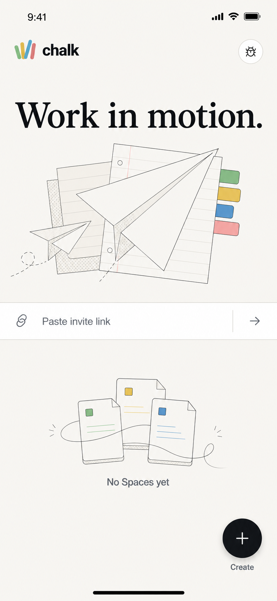
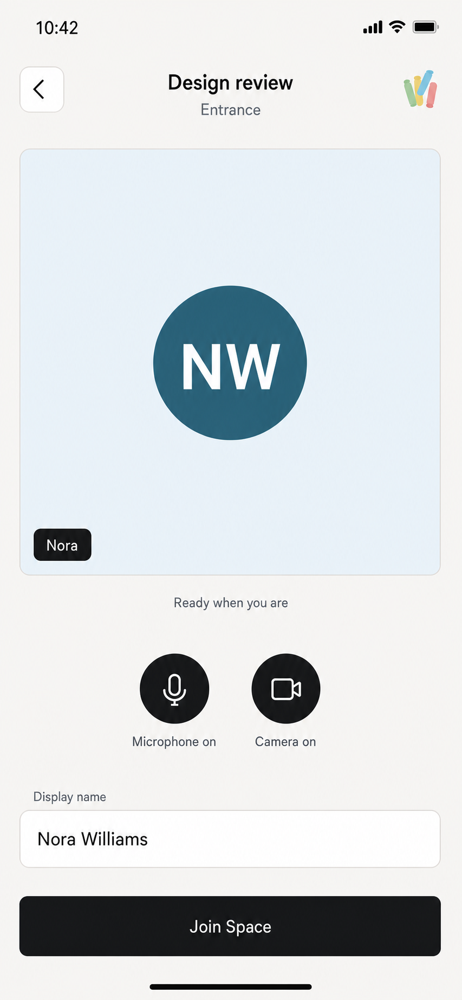
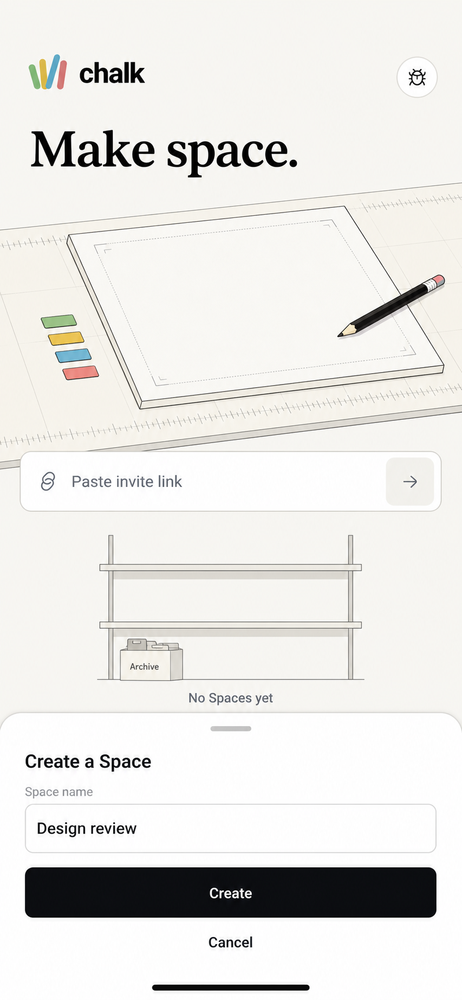
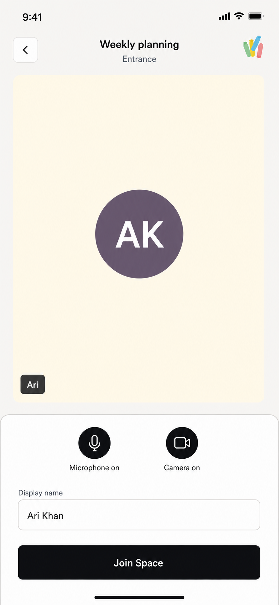
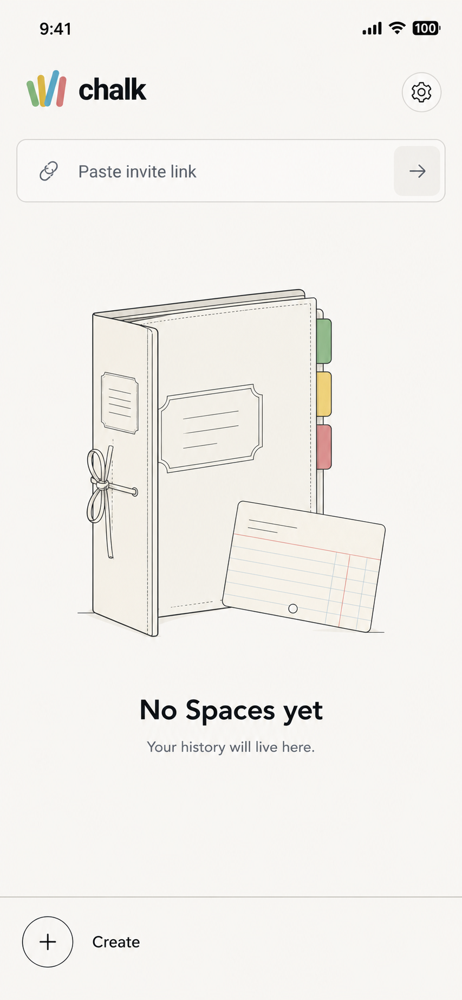
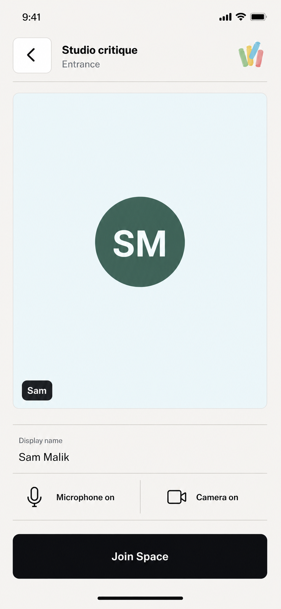

# Chalk mobile feedback inspiration

These six portrait mockups explore plausible Home and Entrance directions in Chalk Light. They use the current physical-device screens as structural baselines and [`docs/design.md`](../../design.md) plus [`GLOSSARY.md`](../../../GLOSSARY.md) as the design and language contract. They are inspiration for product discussion, not implementation commitments.

## Gallery

| Home                                                                                                                                                                                                                   | Entrance                                                                                                                                                                                                               |
| ---------------------------------------------------------------------------------------------------------------------------------------------------------------------------------------------------------------------- | ---------------------------------------------------------------------------------------------------------------------------------------------------------------------------------------------------------------------- |
| <a href="./01-home-editorial-canvas.png"></a><br>[01 Home editorial canvas](./01-home-editorial-canvas.png)                          | <a href="./04-entrance-cinematic-preview.png"></a><br>[04 Entrance cinematic preview](./04-entrance-cinematic-preview.png) |
| <a href="./02-home-illustrated-workbench.png"></a><br>[02 Home illustrated workbench](./02-home-illustrated-workbench.png) | <a href="./05-entrance-bottom-controls.png"></a><br>[05 Entrance bottom controls](./05-entrance-bottom-controls.png)           |
| <a href="./03-home-quiet-spaces-library.png"></a><br>[03 Home quiet Spaces library](./03-home-quiet-spaces-library.png)      | <a href="./06-entrance-compact-editorial.png"></a><br>[06 Entrance compact editorial](./06-entrance-compact-editorial.png) |

## Design theses and final prompts

### 01 Home editorial canvas

Home becomes an editorial canvas instead of a stack of cards: one strong line, a flat paper-plane composition, a direct invite field, and a polished archive empty state establish the hierarchy. Create stays available as a quiet closed launcher, so it does not compete with the history surface.

<details><summary>Final prompt</summary>

```text
Use case: ui-mockup
Asset type: high-fidelity portrait mobile app Home screen inspiration
Input images: current physical-device Home is a structural reference only, not an edit target.
Primary request: Reimagine Chalk Home as a realistic shippable editorial canvas.
Canvas: edge-to-edge 1080x2400-ish iPhone-class portrait, Chalk Light warm porcelain #F7F6F2, realistic safe areas, no device frame.
Composition: compact full-color Chalk mark and settings row; no header label or separator. Use "Work in motion.", a refined flat illustration of ruled pages and paper planes with four subtle Chalk-color tabs, a thin "Paste invite link" field, and a polished archive-sheet history illustration with "No Spaces yet". Add a subtle closed circular plus launcher labeled "Create" near the lower-right safe area.
Style: crisp native hierarchy, original flat editorial linework, fine rules, restrained radii, minimal elevation.
Constraints: use exact canonical vocabulary and minimal exact copy; no large carded Create section, stock imagery, 3D art, decorative gradients, clutter, watermark, or invented claims.
```

</details>

### 02 Home illustrated workbench

This direction makes the illustration a functional metaphor: a measured workbench conveys making without turning Create into a promotional card. The open bottom sheet proves the launcher model can support a focused creation flow while the invite and history layers remain visible behind it.

<details><summary>Final prompt</summary>

```text
Use case: ui-mockup
Asset type: high-fidelity portrait mobile app Home screen inspiration
Input images: current physical-device Home is a structural reference only, not an edit target.
Primary request: Reimagine Chalk Home as an illustrated workbench with the elegant Create bottom sheet open.
Canvas: edge-to-edge 1080x2400-ish iPhone-class portrait, Chalk Light warm porcelain #F7F6F2, realistic safe areas, no device frame.
Composition: compact full-color Chalk mark and settings row; no header label, separator, or marketing eyebrow. Use "Make space." above an original flat angled paper workbench with ruler marks, one pencil, and four small Chalk-color swatches. Add "Paste invite link" and a small shelf-like history empty state labeled "No Spaces yet". Cover the lower 38% with the only elevated surface: a bottom sheet containing "Create a Space", "Space name", "Design review", "Create", and "Cancel".
Style: realistic native UI, crisp hierarchy, editorial line illustration, one-pixel rules, restrained radii.
Constraints: canonical vocabulary and minimal exact copy; no large Create card in Home content, stock imagery, decorative gradients, nested cards, watermark, or invented claims.
```

</details>

### 03 Home quiet Spaces library

History becomes the Home screen's center of gravity. The archival folio gives an empty library real craft and personality, while the invite action moves up and the outlined Create rail stays grounded, closed, and secondary.

<details><summary>Final prompt</summary>

```text
Use case: ui-mockup
Asset type: high-fidelity portrait mobile app Home screen inspiration
Input images: current physical-device Home is a structural reference only, not an edit target.
Primary request: Reimagine Chalk Home as a quiet Spaces library with history centered and Create closed.
Canvas: edge-to-edge 1080x2400-ish iPhone-class portrait, Chalk Light warm porcelain #F7F6F2, realistic safe areas, no device frame.
Composition: narrow full-color Chalk mark and settings row with no header label or separator; a compact "Paste invite link" strip; a large original flat illustration of an upright archival folio, index tabs, and ruled catalog card; "No Spaces yet" and "Your history will live here." beneath it; a thin bottom action rail with an outlined closed plus launcher labeled "Create".
Style: calm editorial native UI, precise flat linework, fine rules, restrained radii, nearly shadowless.
Constraints: canonical vocabulary and minimal exact copy; no large Create card, stock imagery, 3D art, decorative gradients, generic dashboard cards, watermark, or invented claims.
```

</details>

### 04 Entrance cinematic preview

The preview dominates this direction, but a camera-off identity keeps it product-native instead of photographic. The lowered header clears the status bar, and the sparse caption creates a deliberate transition into media, name, and Join controls grouped near the bottom.

<details><summary>Final prompt</summary>

```text
Use case: ui-mockup
Asset type: high-fidelity portrait mobile app Entrance screen inspiration
Input images: current physical-device Entrance is the structural baseline; the prior mobile SDK Entrance is a hierarchy reference. Neither is an edit target.
Primary request: Create a realistic shippable Entrance with a cinematic dominant camera-off preview and calm lower controls.
Canvas: edge-to-edge 1080x2400-ish iPhone-class portrait, Chalk Light warm porcelain #F7F6F2, realistic safe areas, no device frame.
Composition: move the clear back control, centered "Design review" and "Entrance", and current four-stroke Chalk mark comfortably below the status bar. Use a tall 16:10 pale-blue preview with flat solid "NW" avatar, "Nora" tag, and "Ready when you are" beneath it. Group "Microphone on", "Camera on", labeled "Display name" with "Nora Williams", and "Join Space" near the bottom.
Style: realistic native UI, crisp hierarchy, restrained radii and elevation. The Chalk mark is the only gradient treatment.
Constraints: exact canonical vocabulary, tall preview, 44px touch targets, flat avatar, minimal exact copy, no people, stock imagery, duplicate controls, watermark, errors, or invented claims.
Targeted correction: change only the "NW" avatar fill to flat solid #315F72; preserve everything else.
```

</details>

### 05 Entrance bottom controls

The preview receives almost the whole upper canvas while a grounded white control sheet reserves the bottom for preparation. That separation makes the preview feel generous without allowing controls to float over identity or media content.

<details><summary>Final prompt</summary>

```text
Use case: ui-mockup
Asset type: high-fidelity portrait mobile app Entrance screen inspiration
Input images: current physical-device Entrance is the structural baseline; the prior mobile SDK Entrance is a hierarchy reference. Neither is an edit target.
Primary request: Create a realistic shippable Entrance with a large preview and grounded bottom control sheet.
Canvas: edge-to-edge 1080x2400-ish iPhone-class portrait, Chalk Light warm porcelain #F7F6F2, realistic safe areas, no device frame.
Composition: move the back control, centered "Weekly planning" and "Entrance", and current Chalk mark below the status bar. Make a tall 4:5 camera-off preview with pale-yellow fill, flat "AK" avatar, and "Ari" tag. Anchor a restrained white sheet to the lower 34%, containing "Microphone on", "Camera on", "Display name", "Ari Khan", and "Join Space" above the safe area.
Style: realistic native UI, one-pixel borders, restrained radii, minimal elevation. The Chalk mark is the only gradient treatment.
Constraints: canonical vocabulary, preview-first hierarchy, bottom-grouped 44px controls, minimal exact copy, no people, stock imagery, duplicate controls, watermark, errors, or invented claims.
Targeted correction: change only the preview fill to flat #FFF8E5 and the "AK" avatar fill to flat #64576B; preserve everything else.
```

</details>

### 06 Entrance compact editorial

The most compact direction removes the control card entirely. Hairline rules, left-aligned identity, and one horizontal media row make the lower controls scan like a native settings list while the tall preview still owns the screen.

<details><summary>Final prompt</summary>

```text
Use case: ui-mockup
Asset type: high-fidelity portrait mobile app Entrance screen inspiration
Input images: current physical-device Entrance is the structural baseline; the prior mobile SDK Entrance is a hierarchy reference. Neither is an edit target.
Primary request: Create a compact editorial Entrance using lines and typography instead of a large control card.
Canvas: edge-to-edge 1080x2400-ish iPhone-class portrait, Chalk Light warm porcelain #F7F6F2, realistic safe areas, no device frame.
Composition: put the back control, left-aligned "Studio critique" and "Entrance", and current Chalk mark below the status bar, followed by one thin rule. Use a tall flat pale-blue preview with flat "SM" avatar and "Sam" tag. Beneath it, use ruled rows for "Display name" with "Sam Malik", then "Microphone on" and "Camera on" in one horizontal row. Anchor "Join Space" above the bottom safe area.
Style: realistic native UI, strong editorial alignment, fine rules, restrained radii, no cards except the preview. The Chalk mark is the only gradient treatment.
Constraints: canonical vocabulary, tall preview, bottom-grouped 44px controls, minimal exact copy, no people, stock imagery, giant controls, duplicate controls, watermark, errors, or invented claims.
Targeted correction: change only the preview fill to flat #EAF7FB and the "SM" avatar fill to flat #49645D; preserve everything else.
```

</details>

## Reference roles

- The current physical-device Home screenshot supplied the content order and exposed the oversized Home hero and Create treatment to reconsider.
- The current physical-device Entrance screenshot supplied the real safe-area, preview, media-control, name-field, and Join structure.
- The prior mobile SDK Entrance mockup supplied hierarchy and spacing guidance only; its photographic preview was deliberately not carried forward.
- [`docs/design.md`](../../design.md) governed Chalk Light color, typography, spacing, shape, safe areas, control hierarchy, avatar treatment, and mobile composition.
- [`GLOSSARY.md`](../../../GLOSSARY.md) governed every visible product noun.

All outputs were generated with the built-in image generation path in `ui-mockup` mode. The reference images were style and composition references, never edit targets.
