# Chalk mobile SDK mockups

This set is an implementation reference for the Chalk React Native mobile flow. It covers Onboarding, Entrance, the default Space stage, and the progressive surfaces that reveal secondary collaboration and management actions.

All twelve PNGs were produced with the built-in imagegen mode in `ui-mockup` mode. The generation used [`chalk-design-system-board.png`](../chalk-design-system-board.png) as Image 1, the core style reference, and `.private/design/light-mode-ideation-2026-08-03/01-warm-porcelain.png` as Image 2, a supporting style and layout reference. Neither source image was an edit target.

## Flow gallery

|   # | Preview and file                                                                                                                                                                                                        | State                                                                      | Progressive-disclosure relationship                                                                              | Compact prompt note                                                                                          |
| --: | ----------------------------------------------------------------------------------------------------------------------------------------------------------------------------------------------------------------------- | -------------------------------------------------------------------------- | ---------------------------------------------------------------------------------------------------------------- | ------------------------------------------------------------------------------------------------------------ |
|  01 | <a href="./01-onboarding-welcome-value.png">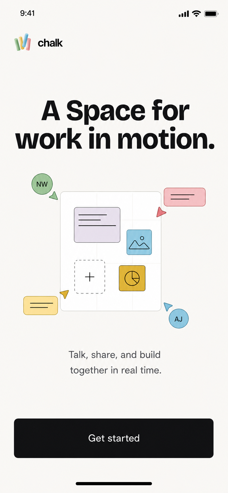</a> [Open PNG](./01-onboarding-welcome-value.png)                           | Onboarding welcome and product value.                                      | Root of the first-run flow; the primary action advances to identity.                                             | Warm paper welcome, compact Chalk mark, bold value statement, flat collaboration motif, one decisive action. |
|  02 | <a href="./02-onboarding-profile-identity.png">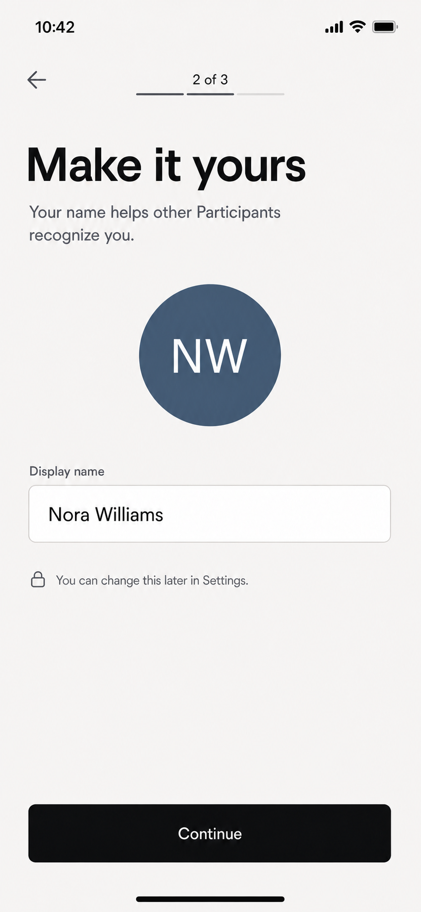</a> [Open PNG](./02-onboarding-profile-identity.png)               | Onboarding identity with a display name and deterministic initials avatar. | Follows welcome; Continue advances to device access.                                                             | Step progress, persistent field label, identity preview, privacy note, bottom-safe primary action.           |
|  03 | <a href="./03-onboarding-device-permissions.png">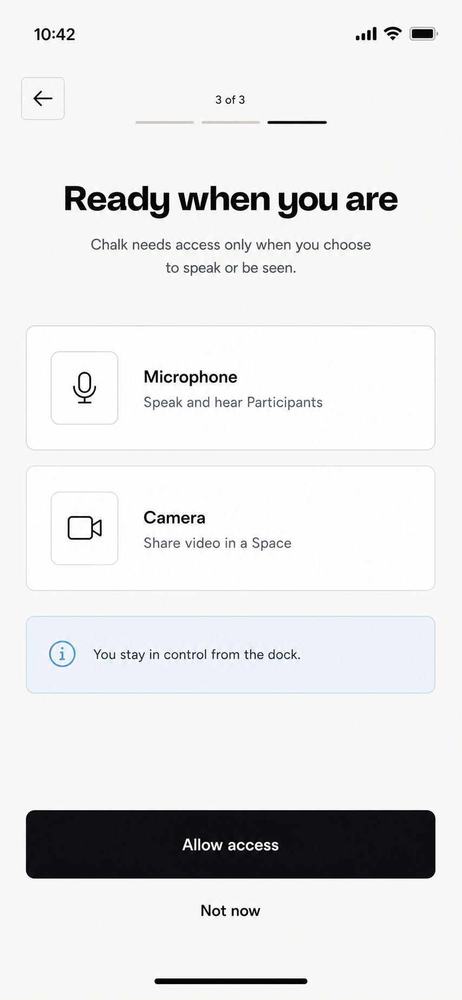</a> [Open PNG](./03-onboarding-device-permissions.png)           | Device-access primer for microphone and camera.                            | Final Onboarding state; access can be granted now or deferred before Entrance.                                   | Two purpose-led access rows, pale-blue control note, primary and defer actions without premature switches.   |
|  04 |  [Open PNG](./04-entrance-ready-self-preview.png)                   | Entrance ready state with self-preview, media controls, and display name.  | Primary Entrance state; Join Space enters directly or moves to approval waiting when admission applies.          | Dominant live preview, single media-control pair, labeled name field, unambiguous Join Space action.         |
|  05 | <a href="./05-entrance-approval-waiting.png">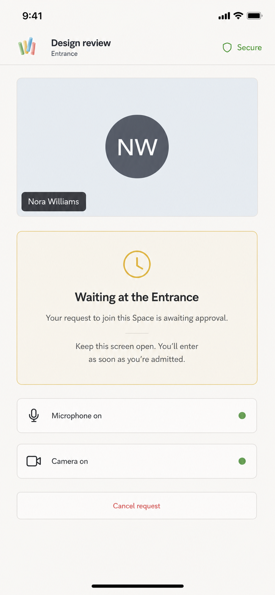</a> [Open PNG](./05-entrance-approval-waiting.png)                           | Entrance waiting state for approval.                                       | Conditional branch from Entrance; admission returns the Participant to the live Space automatically.             | Camera-off preview, yellow pending surface, read-only device status, one cancel action.                      |
|  06 | <a href="./06-space-default-live-stage.png">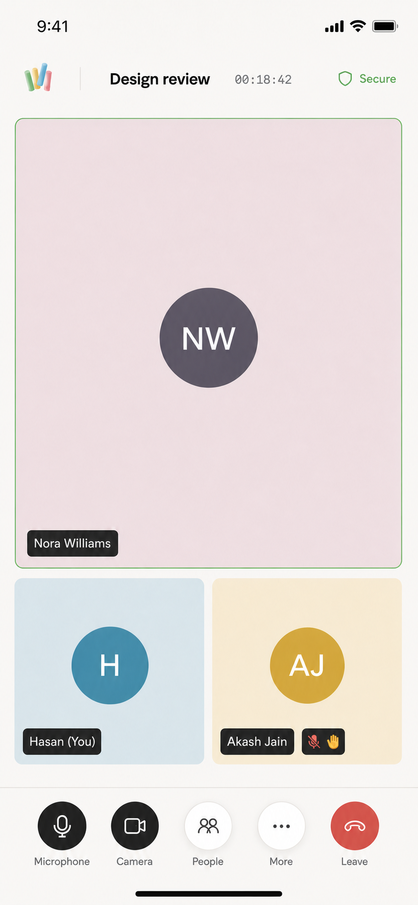</a> [Open PNG](./06-space-default-live-stage.png)                               | Default live Space with a dominant Participant and stable filmstrip.       | Base state for every Space disclosure below.                                                                     | Quiet secure header, elapsed-time metadata, dominant stage, compact status indicators, reserved footer dock. |
|  07 | <a href="./07-space-more-actions-sheet.png">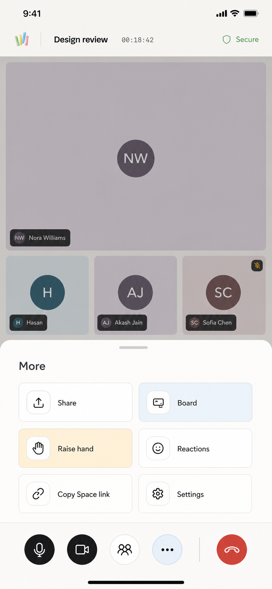</a> [Open PNG](./07-space-more-actions-sheet.png)                                     | More action sheet with Share, Board, hand, reactions, link, and Settings.  | First layer from the More dock action; Board and Settings each open a deeper focused surface.                    | Dimmed stage, half-height sheet, scannable two-column actions, semantic blue and yellow washes.              |
|  08 | <a href="./08-space-people-sheet.png">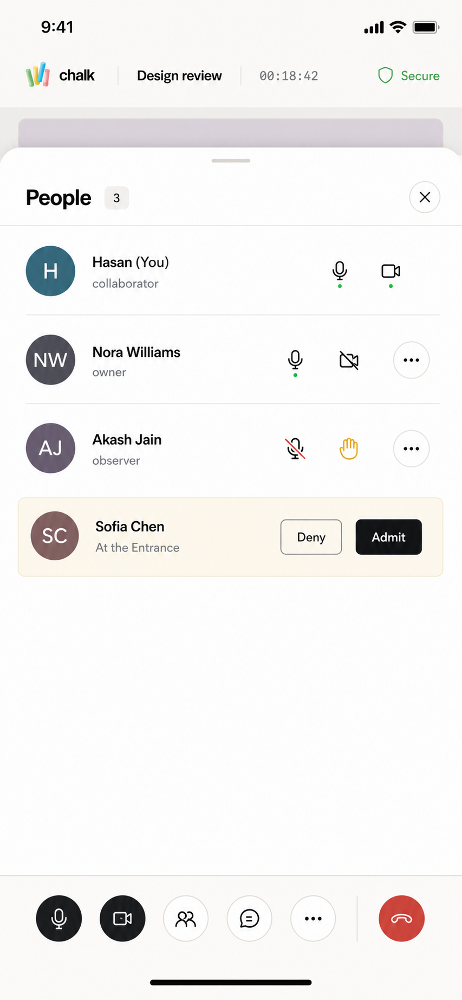</a> [Open PNG](./08-space-people-sheet.png)                                                             | People sheet with Participant state, roles, and Entrance admission.        | First layer from People; a row overflow action opens the Participant actions shown in 11.                        | Fixed sheet header, calm 64px rows, media status, role-neutral admission controls, dock remains reserved.    |
|  09 | <a href="./09-space-chat-sheet.png">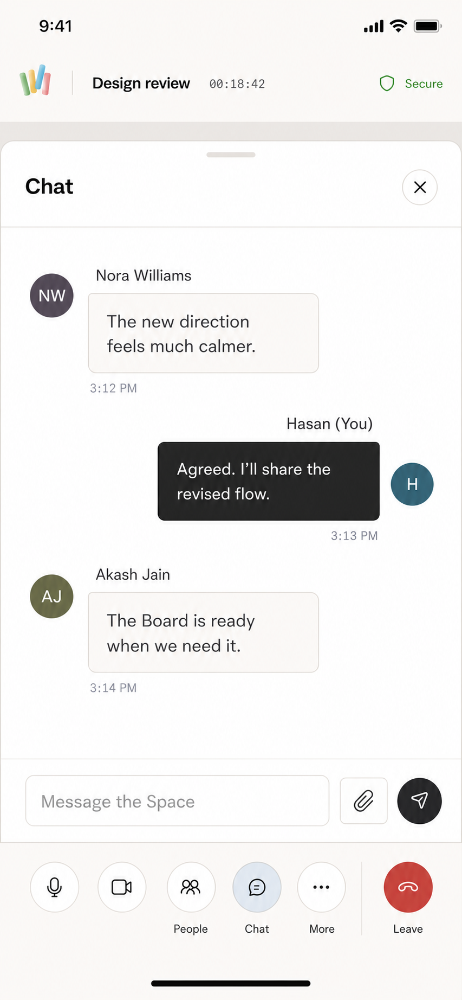</a> [Open PNG](./09-space-chat-sheet.png)                                                                     | Chat sheet with local and remote messages plus a pinned composer.          | First layer from Chat; dismissing returns to the unchanged stage.                                                | Neutral remote messages, ink local message, Spline-like times, composer separated from the dock.             |
|  10 | <a href="./10-space-board-sharing.png">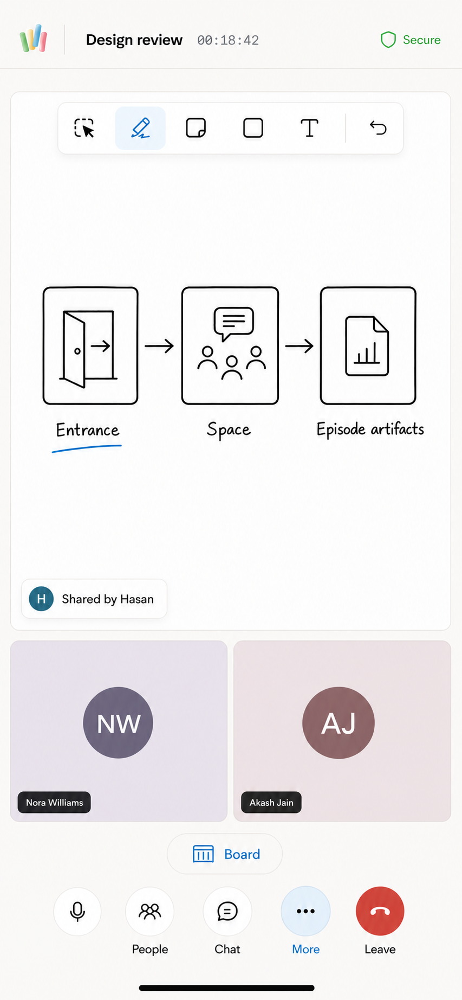</a> [Open PNG](./10-space-board-sharing.png)                                                   | Board as the primary shared content with a stable Participant filmstrip.   | Deeper state opened from More; replaces the stage while keeping People, Chat, More, and Leave reachable.         | Plausible drawing tools, canonical Entrance-to-Space diagram, shared-by label, distinct Board status.        |
|  11 | <a href="./11-space-participant-actions-popover.png">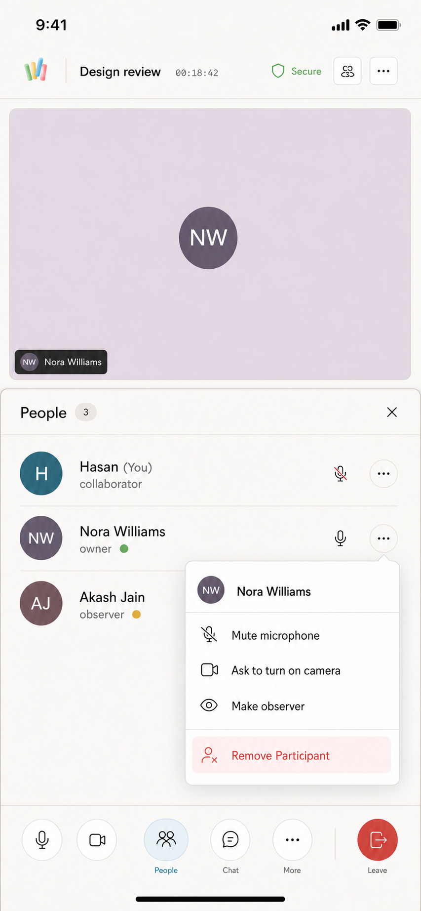</a> [Open PNG](./11-space-participant-actions-popover.png) | Capability-driven actions for one Participant.                             | Second layer anchored from a row in People; dismissal returns focus to that row.                                 | Anchored popover, 44px action rows, calm media requests, separated Remove Participant action.                |
|  12 | <a href="./12-space-settings-sheet.png">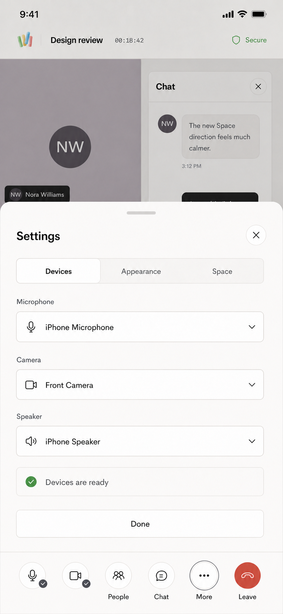</a> [Open PNG](./12-space-settings-sheet.png)                                                     | Settings sheet on the Devices tab.                                         | Deeper state opened from More; tabs disclose Appearance and Space configuration without expanding the base dock. | Mobile segmented tabs, practical device selectors, ready status, clear Done action, stage context retained.  |

## Shared prompt contract

Every screen used the same final visual contract:

- Render one high-fidelity, edge-to-edge iPhone-class portrait app canvas with realistic safe areas and no device frame.
- Use Chalk's warm paper, white, and ink surfaces; crisp one-pixel rules; restrained 6px, 10px, and 16px radii; and Chalk accents only to communicate state.
- Use Figtree-like interface typography, Bricolage-like major moments, and Spline-like time metadata.
- Keep touch targets at least 44px, reserve the live footer dock below content, and keep sheets, composers, labels, and shared content clear of the dock.
- Use flat deterministic initials avatars and glossary-canonical product language: Space, Episode, Participant, Entrance, People, Chat, Board, Settings, and Leave.
- Avoid decorative clutter, control and avatar gradients, generic marks, tiny unreadable text, watermarks, and legacy product vocabulary.

The per-screen notes in the gallery are the compact final prompt set. They specify the state-specific layout and copy layered on top of this shared contract.
