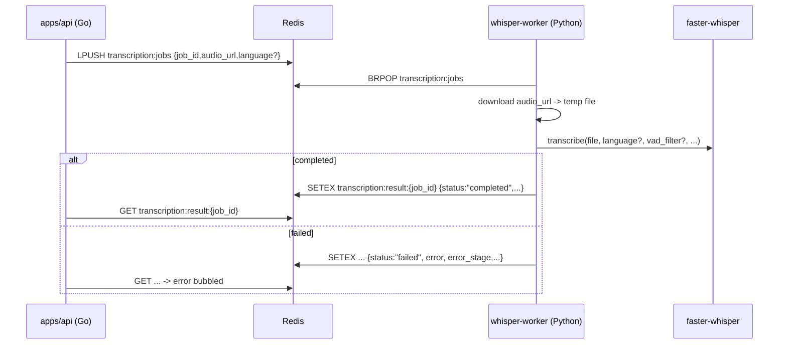
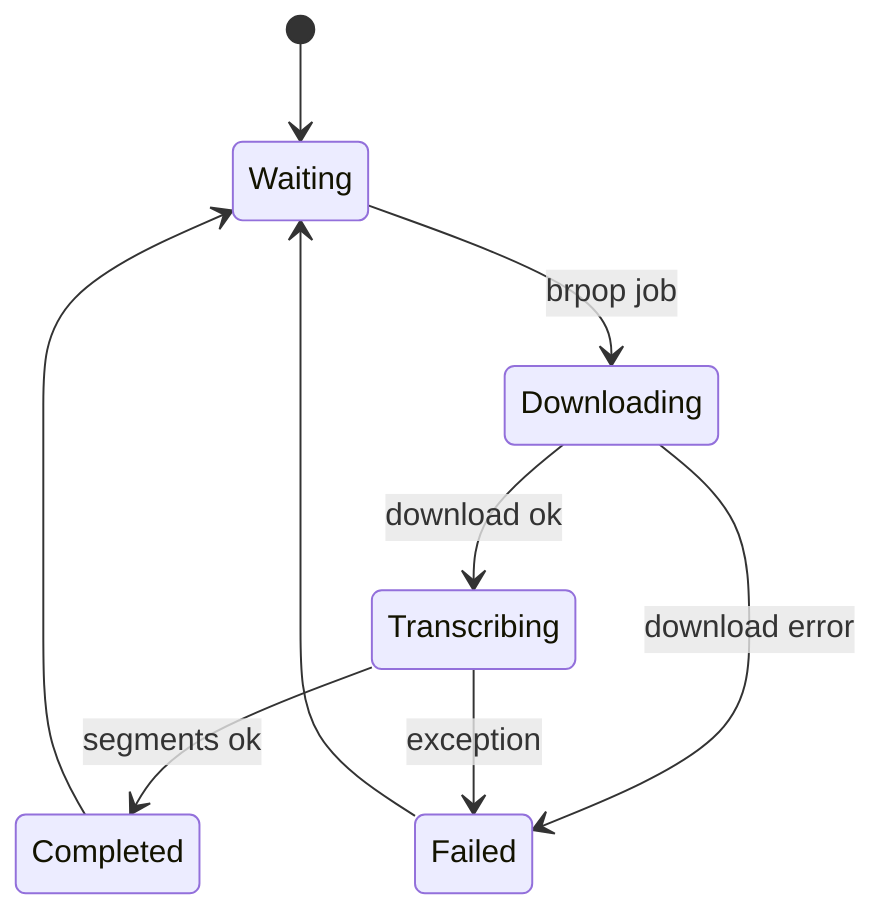

# faster-whisper v1.2.1 (Implementation Notes)

Target runtime: EC2 `g4dn.xlarge` (1x NVIDIA T4 16GB VRAM, 4 vCPU, 16GB RAM).

Goal: chalk whisper-worker (post_meeting transcription) upgrade + correct/efficient usage.

---

## Version + Deltas

- Version: `faster-whisper==1.2.1` (tag `v1.2.1`).
- Release notes: https://github.com/SYSTRAN/faster-whisper/releases/tag/v1.2.1
  - Upgrades Silero VAD to V6.
  - Adds official support for running with `transformers==4.53` (but chalk worker uses CTranslate2 path, not transformers).
  - "Fix language probabilities" when `language` is provided.
  - Retry logic offloaded to HF hub (model downloads).
- Prior release: `v1.2.0`: https://github.com/SYSTRAN/faster-whisper/releases/tag/v1.2.0
  - `revision=` supported for HF downloads (branch/tag/commit).
  - Adds support for `distil-large-v3.5`.
  - Adds "remove silence" in batched transcription.

---

## GPU Runtime Requirements (Docker/AMI)

From upstream README (CUDA + cuDNN): https://github.com/SYSTRAN/faster-whisper

- Audio decode:
  - Unlike `openai-whisper`, system FFmpeg is not required.
  - faster-whisper decodes audio with PyAV, which bundles FFmpeg libraries.

- Needs CUDA + cuDNN libraries available at runtime for GPU inference.
- Upstream Docker example uses a CUDA + cuDNN image:
  - `nvidia/cuda:12.3.2-cudnn9-runtime-ubuntu22.04`
- If not using a cuDNN runtime base image, upstream suggests installing:
  - `pip install nvidia-cublas-cu12 nvidia-cudnn-cu12==9.*`

Practical for `g4dn.xlarge`:

- T4 supports FP16 well; expect best perf with `compute_type="float16"` or `compute_type="int8_float16"`.

---

## Model Names (v1.2.1)

Source: `faster_whisper/utils.py` inside `faster-whisper==1.2.1` wheel.

Model name -> HF repo mapping (selected):

- `large-v3` -> `Systran/faster-whisper-large-v3`
- `large` -> `Systran/faster-whisper-large-v3` (alias)
- `large-v3-turbo` / `turbo` -> `mobiuslabsgmbh/faster-whisper-large-v3-turbo`
- `distil-large-v3` -> `Systran/faster-distil-whisper-large-v3`
- `distil-large-v3.5` -> `distil-whisper/distil-large-v3.5-ct2`

NOTE: Some docstrings in v1.2.1 don't list `distil-large-v3.5`, but it is supported via `_MODELS`.

---

## API Surface (v1.2.1)

### WhisperModel init

Signature (v1.2.1):

```py
WhisperModel(
  model_size_or_path: str,
  device: str = "auto",
  device_index: int | list[int] = 0,
  compute_type: str = "default",
  cpu_threads: int = 0,
  num_workers: int = 1,
  download_root: str | None = None,
  local_files_only: bool = False,
  files: dict | None = None,
  revision: str | None = None,
  use_auth_token: str | bool | None = None,
  **model_kwargs,
)
```

Key knobs:

- `compute_type`: CTranslate2 compute type (see link below).
- `cpu_threads`: overrides `OMP_NUM_THREADS` when non-zero.
- `num_workers`: parallelism for concurrent transcribe calls from multiple Python threads (increased memory usage).
- `download_root`: maps to HF hub cache dir.
- `revision` / `use_auth_token`: for pinned/private HF models.

### WhisperModel.transcribe (default / "accurate" path)

Important defaults in v1.2.1:

- `vad_filter=False` (off by default)
- `without_timestamps=False` (timestamps ON by default)
- `clip_timestamps="0"` (type: `str | list[float]`)

Signature: see `faster_whisper/transcribe.py` in the wheel.

### BatchedInferencePipeline.transcribe (fast path)

Upstream exposes:

```py
pipeline = BatchedInferencePipeline(model)
segments, info = pipeline.transcribe(..., batch_size=8)
```

Important defaults in v1.2.1:

- `vad_filter=True` (on by default)
- `without_timestamps=True` (timestamps OFF by default)
- `batch_size=8`
- `clip_timestamps: list[{"start": float, "end": float}] | None` (DIFFERENT type vs WhisperModel.transcribe)

Also: several args are documented as "Unused Arguments" and effectively ignored/forced (e.g. `condition_on_previous_text=False` always).

Accuracy warning (real-world reports): https://github.com/SYSTRAN/faster-whisper/issues/1179

### Quick Diff: WhisperModel vs BatchedInferencePipeline

| Topic                        | WhisperModel.transcribe                                      | BatchedInferencePipeline.transcribe                                  |
| ---------------------------- | ------------------------------------------------------------ | -------------------------------------------------------------------- |
| Primary goal                 | accuracy / feature-complete                                  | throughput / batching                                                |
| `vad_filter` default         | `False`                                                      | `True`                                                               |
| `without_timestamps` default | `False`                                                      | `True`                                                               |
| `clip_timestamps` type       | `str` (`"0"`/`"0,30"`) or `list[float]`                      | `list[{"start": float, "end": float}]`                               |
| Required segmentation        | not required                                                 | required for long audio: VAD or clip timestamps, else throws         |
| Temperature behavior         | supports fallback across temps                               | uses first temperature only                                          |
| Prompt carryover             | `condition_on_previous_text` supported                       | forced `False` (documented unused)                                   |
| "No speech" behavior         | can hit language-detect crash on empty features (see gotcha) | handles empty audio more safely (dummy features for language detect) |

---

## Output Objects

`transcribe()` returns: `(segments_iterable, info)`

`info` is `TranscriptionInfo`:

- `language`, `language_probability`
- `duration` (full audio seconds)
- `duration_after_vad` (post-VAD seconds)
- `all_language_probs` (optional)
- `transcription_options`, `vad_options`

`segments_iterable` yields `Segment` objects:

- `start`, `end` (seconds)
- `text`
- `words` only if `word_timestamps=True`

NOTE: `segments_iterable` is a generator; actual inference happens while iterating.

---

## Performance Knobs (practical for T4)

### compute_type (CTranslate2)

Docs: https://opennmt.net/CTranslate2/quantization.html

Useful values on T4:

- `float16`: fast, good accuracy, higher VRAM.
- `int8_float16`: lower VRAM, often good perf; best "throughput per VRAM" option to try.
- `int8`: smallest VRAM; may trade accuracy/speed depending on kernel support.

### batch_size (batched pipeline only)

- Higher `batch_size` -> higher throughput, more VRAM.
- Start `batch_size=8` on T4; benchmark and try `16` if VRAM headroom.

Upstream benchmark reference (NOT T4; RTX 3070 Ti 8GB, 13min audio, beam_size=5):

- `large-v2`: fp16 `1m03s` @ `4525MB`; int8_float16 `59s` @ `2926MB`; batched int8_float16 batch=8 `17s` @ `6090MB`
- `distil-large-v3` (batch=16): fp16 `25s` @ `3525MB`; int8_float16 `16s` @ `2926MB`
  Source: https://github.com/SYSTRAN/faster-whisper

### beam_size

- Default `beam_size=5` is quality-focused.
- For speed/throughput, try `beam_size=1` or `2` (measure WER/quality on chalk meeting samples).

### timestamps

- `without_timestamps=True` often faster; but segment boundaries become coarser (chunk-based).
- If chalk consumers need accurate segment timing, keep timestamps enabled (`without_timestamps=False`) or use `word_timestamps` selectively.

### VAD

VadOptions defaults (v1.2.1 `VadOptions`):

- `threshold=0.5`
- `min_silence_duration_ms=2000`
- `speech_pad_ms=400`

BatchedInferencePipeline defaults differ:

- if `vad_filter=True` and `vad_parameters is None`, it builds:
  - `VadOptions(max_speech_duration_s=chunk_length, min_silence_duration_ms=160)`
- if you pass `vad_parameters={"max_speech_duration_s": ...}`, it is ignored/overridden by `chunk_length`.

For meeting audio, you likely want smaller `min_silence_duration_ms` (e.g. 200-500ms) to avoid merging long monologues into huge segments.

---

## Audio Decode Gotcha (PyAV)

PyAV behavior differs from CLI ffmpeg on some corrupted/truncated media:

- PyAV can stop decode early, while ffmpeg might salvage more frames.
- Upstream discussion: https://github.com/SYSTRAN/faster-whisper/issues/988

If chalk sees "corrupt tail" recordings in the wild:

- optional pre-clean step with system `ffmpeg` to re-mux / drop invalid tail data (trade: extra CPU + latency).

---

## Critical Gotcha: max() arg is an empty sequence (v1.2.1)

The upstream `detect_language()` implementation can crash with:

```
ValueError: max() arg is an empty sequence
```

Root cause:

- `detect_language()` builds `detected_language_info = {}`
- It loops over `range(0, features.shape[-1], nb_max_frames)`
- If `features.shape[-1] == 0` (empty features), loop never runs, `detected_language_info` stays empty
- For-loop `else:` executes and calls `max(detected_language_info, ...)` -> crash

How `features` becomes empty in practice:

- Using VAD can produce zero speech segments (silent/near-silent recordings)
- `collect_chunks(..., chunks=[])` returns `[np.array([], dtype=float32)]`
- That can lead to empty/zero-frame features, then language detection runs (when `language=None`)

Mitigations to bake into chalk implementation:

- Prefer always passing `language` (skip language detection entirely) when you can.
- Or: if using VAD, handle "no speech detected" as a first-class outcome: return empty transcript (`text=""`, `segments=[]`, `word_count=0`) instead of error
- Or: detect language on non-VAD audio first (vad_filter=False), then call `transcribe(..., language=detected_lang, vad_filter=True)`
- Or: switch to `BatchedInferencePipeline` which explicitly adds a dummy feature for language detection when audio is empty.

---

## Recommended Baseline Config (chalk whisper-worker on g4dn.xlarge)

Shipped defaults (current plan):

- Model: `distil-large-v3.5` (override with `WHISPER_MODEL`)
- Device: `cuda` (override with `WHISPER_DEVICE`)
- Compute: `float16` (override with `WHISPER_COMPUTE_TYPE`; consider `int8_float16` if you need more VRAM headroom)
- Multilingual: `True` (always on; `WHISPER_MULTILINGUAL=1`)
- VAD: enabled (`WHISPER_VAD_FILTER=1`) with `min_silence_duration_ms=500` (override with `WHISPER_VAD_MIN_SILENCE_MS`)
- Segment timestamps: enabled (`WHISPER_WITHOUT_TIMESTAMPS=0`)
- Batch size caps (T4 16GB): distil `WHISPER_BATCH_SIZE_MAX=16`; non-distil `WHISPER_BATCH_SIZE_MAX=8` (fallback halves on OOM)
Runtime: backlog (>1 job total) => `BatchedInferencePipeline`; otherwise => `WhisperModel.transcribe`; silent/near-silent => `completed` empty transcript.

---

## Chalk Pipeline Diagrams
### Sequence

### Worker State Machine (single job)

