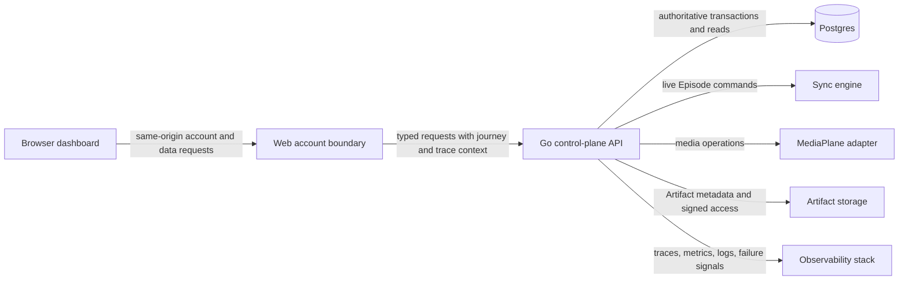
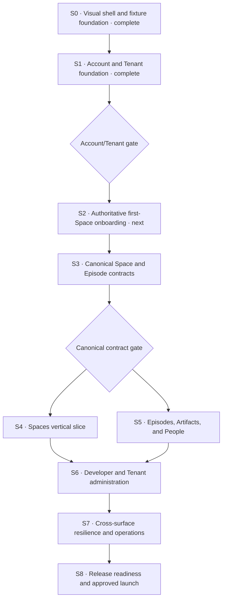

# Chalk dashboard

Status: executing
Date: 2026-08-04
Owner: Chalk
Risk: major

## Background

Chalk began this work with a public web surface, a live collaboration surface, and a broad control-plane API, but no customer dashboard. The web app had no protected shell, browser Account client, Tenant context, dashboard routes, or dashboard test path. S0 and S1 established that foundation; several resource routes remain intentionally fixture-backed until their canonical contracts land.

The first Account/Tenant seam now supports a safe entry into first run: Account registration can continue into atomic owner onboarding, an Account can list only its authorized Tenants, and the same-origin boundary keeps the raw credential out of browser JavaScript. The remaining first-run gap is authoritative first-Space creation and resume state. The broader resource contract still predates the canonical Space and Episode model.

The desired state is a calm general collaboration product where a new customer can create an account, create and own a Tenant, create a Space, invite people, and join or continue work without touching internal tools. Returning customers can understand live activity, inspect immutable Episode history and Artifacts, manage Tenant access, and diagnose failures. A secondary Developer area provides API keys, webhooks, integrations, and SDK-oriented setup without framing the whole product as an administration console.

The dashboard is a control-plane product. It does not replace the embedded `<Chalk />` experience or the Entrance. Anonymous participation remains first class and never requires a dashboard account.

## Implementation status

S0 and S1 are implemented. `apps/web` now has the shared responsive shell, public Account entry, a protected Account/Tenant gate, recoverable Tenant onboarding, authorized Tenant selection, Account and Tenant reads, Home, Spaces, the New Space dialog, and honest routed states for the remaining areas. The Go API exposes self-scoped Tenant discovery and atomic idempotent Tenant-plus-owner-access onboarding. A Cloudflare Pages same-origin boundary owns hardened cookies, CSRF and Origin checks, OAuth return validation, upstream allowlisting, token stripping, private cache policy, trace propagation, and boundary health.

The Account/Tenant gate passed against both a browser fixture and the real Go API on a fresh PostgreSQL database. The next implementation seam is S2: make first-run state fully resumable through authoritative backend state and carry the customer into first-Space creation. Space and Episode pages remain fixture-backed until S3 lands the canonical contracts.

## Product defaults

These settled defaults keep the plan executable:

1. The first release is a general product centered on Spaces and the work inside them. Developer capabilities are a secondary area.
2. Customer-facing copy uses `Tenant`; `GLOSSARY.md` now distinguishes Tenant access from Space membership.
3. Browser account traffic crosses a same-origin web boundary. The browser never stores a raw account token or an API key secret.
4. The core first-run milestone is account → Tenant → Space → invite or Quick join. Developer onboarding branches later into API key → SDK quickstart.
5. Dashboard metrics display only backend-owned aggregates. The UI never derives expensive or misleading totals by draining paginated collections.

## Done

The dashboard is complete when all of these checks are observable:

- [ ] A visitor can sign up with email and password, sign in, sign out, and use Google sign-in when configured.
- [x] A new Dashboard Account can create a Tenant in one recoverable onboarding flow and receives owner-level Tenant access atomically.
- [ ] Core onboarding reaches a first Space without forcing API-key creation; Developer onboarding can create a key later and shows its secret once.
- [x] A returning Account can discover only its authorized Tenants, select one, reload the page, and remain inside an authorized Tenant context.
- [x] The protected shell consistently renders Home, Spaces, Episodes, Artifacts, People, Developer, Activity, Tenant settings, and Account across desktop and mobile.
- [ ] An Account with the required Tenant authorization can create, view, update, archive, and restore a Space.
- [ ] A Space detail view separates durable Members from Participants in its live Episode and never shows Presence while the Space has no live Episode.
- [ ] Episode history is tenant-queryable and immutable. An Episode detail view shows its Space, timing, attendance, config snapshot, Recordings, and Transcripts.
- [ ] The optional Start Episode action is secondary. The UI never implies that an Episode must be created before an authorized join can begin one.
- [ ] A join names only a Space; concurrent authorized joins converge on at most one live Episode, blip rejoins respect the linger window, and ended Episodes stay frozen.
- [ ] API keys can be listed, created, rotated, and revoked with step-up confirmation for destructive actions and one-time secret handling.
- [ ] Webhooks, integration connections, Tenant access, and audit history have focused management surfaces backed by typed contracts.
- [x] Account and Tenant settings expose only operations supported by the backend. Unsupported settings do not render as decorative controls.
- [ ] Loading, empty, stale, unauthorized, forbidden, rate-limited, offline, dependency failure, and retry states are covered by focused tests.
- [x] Every dashboard request carries the Chalk journey identifier and W3C trace context. Success and failure paths are visible in structured telemetry without secrets or sensitive payloads.
- [x] Private dashboard responses bypass service-worker caches and use appropriate browser security headers.
- [ ] A public synthetic proves sign-in reachability and an authenticated synthetic proves the critical dashboard path without using production customer data.
- [ ] `pnpm run gate` passes, plus the focused API and browser gates required by the files changed.

The work stops at the customer control plane. Billing, plans, SSO, legal hold, Team or Workspace grouping, incident administration, and an internal operations debugger are out of scope unless separate contracts make them real.

## Primary journeys

### First run

1. The visitor creates an account or signs in with Google.
2. The account boundary returns an HttpOnly account cookie and redirects to onboarding.
3. The Account holder names a Tenant and chooses a supported region.
4. One backend transaction creates the Tenant and owner-level Tenant access. Retrying the request is idempotent.
5. The Account holder creates the first Space and receives its join target plus an invite action.
6. Home records completion of the first-run milestones from authoritative state, not browser flags.

If the Account holder leaves after any step, returning to the dashboard resumes from backend state. Tenant, API-key, and Space creation use persisted idempotency keys. A replay returns the same resource metadata but never replays a secret after its original response; a lost secret is recovered only by rotation.

### Returning Account

1. The protected shell resolves the current Dashboard Account and authorized Tenants before rendering private content.
2. The last selected Tenant is used only as a hint. Authorization is checked again on every request.
3. Home shows backend-owned summaries, active Episodes, recent Spaces, recent Episodes, and actionable failures.
4. Navigation preserves Tenant context, query filters, and pagination without putting secrets in the URL.

### Space management

The Spaces index is the durable inventory. Each row shows name, slug, archive state, whether an Episode is live, Member count, last activity, and the next scheduled time when recurrence exists. A Space with no live Episode does not show online Participants.

The Space detail uses these tabs:

- Overview: durable identity, join target, live Episode summary, schedule, and recent history.
- Members: durable User and Agent assignments with their Roles.
- Content: hidden in the first release. It appears only after Chat streams and Whiteboard scenes become Space-owned and Episode ranges reference that shared state.
- Episodes: immutable history for this Space.
- Settings: Roles, Capabilities, admission policy, recurrence, duration policy, archive, and restore.

### Episode and Artifact inspection

The Episodes index is tenant-wide history with filters for Space, state, date, and Artifact availability. The active Episode is visually distinct but uses the same resource model.

The Episode detail is read-oriented. It shows immutable configuration, attendance, Participants, timing, termination reason, Recordings, Transcripts, and processing failures. Actions are limited to live operations that the backend explicitly authorizes, such as ending or extending a live Episode. Episode identity, configuration, and attendance freeze at end. Server-side Artifact processing may move from pending to a terminal state afterward; the dashboard exposes no edit controls, and terminal Artifact metadata then freezes except for retention deletion.

### Developer onboarding and integration management

Developer onboarding begins from the secondary Developer area. It creates an appropriately scoped API key, presents the secret once, and leads into an SDK quickstart that targets an existing or newly created Space. It never blocks the general-product first run.

API keys list only metadata: name, prefix, state, created time, last used time, and creator. Create and rotate dialogs present a secret once. Revocation requires the Account holder to name or identify the target key and explains the effect before confirmation.

Webhook endpoints expose URL, subscribed event types, state, delivery health, secret rotation, test delivery, and recent delivery history. Integration connections expose only supported services and actions. Provider tokens and raw provider errors never enter the browser.

## Information architecture

| Area            | Routes                                                                  | Primary source                                                      |
| --------------- | ----------------------------------------------------------------------- | ------------------------------------------------------------------- |
| Public account  | `/sign-in`, `/sign-up`, `/auth/callback`                                | account service                                                     |
| Onboarding      | `/onboarding`                                                           | Dashboard Account, Tenant access, region, first Space               |
| Home            | `/home`                                                                 | continue-work projection and tenant overview aggregate              |
| Spaces          | `/spaces`, `/spaces/$spaceId`                                           | Space, Member, live Episode summary                                 |
| Episodes        | `/episodes`, `/episodes/$episodeId`                                     | Episode, attendance, Artifact                                       |
| Artifacts       | `/artifacts`, `/artifacts/$artifactId`                                  | Recording and Transcript projections                                |
| People          | `/people`                                                               | Tenant-visible customer identities and Space membership projections |
| Developer       | `/developer/api-keys`, `/developer/webhooks`, `/developer/integrations` | server-owned credentials and delivery metadata                      |
| Activity        | `/activity/audit`                                                       | audit log                                                           |
| Tenant settings | `/settings/tenant`, `/settings/access`                                  | Tenant and Dashboard Account access                                 |
| Account         | `/account`                                                              | current Dashboard Account and authenticated account state           |

The desktop shell uses a fixed left navigation, a Tenant selector at the top, a restrained status/footer area, and one page canvas. Home prioritizes “Continue where you left off,” recent Spaces, recent Episodes, Artifacts, and Quick join. Developer stays below the core product navigation. The mobile shell collapses navigation into a Sheet and keeps all touch targets at least 44 pixels.

## Canonical language

| Term              | Meaning in the dashboard                                                                                    |
| ----------------- | ----------------------------------------------------------------------------------------------------------- |
| Dashboard Account | The identity that signs in to the Chalk control plane. It is separate from customer application identities. |
| Tenant access     | A Dashboard Account assignment to a Tenant with control-plane authorization. It is not a Space Member.      |
| Tenant            | Customer, deployment, isolation, and billing boundary. One Dashboard Account may access several.            |
| User              | A durable human identity registered by a customer application and keyed by tenant-scoped `external_id`.     |
| Agent             | A durable non-human identity with the same platform standing as a User.                                     |
| Space             | Durable identity, configuration, Members, recurring schedule, and living content.                           |
| Member            | A durable User or Agent assignment to a Space with a Role.                                                  |
| Episode           | One bounded run of activity inside a Space. It is immutable after it ends.                                  |
| Participant       | A live or historical seat in one Episode.                                                                   |
| Guest             | An unregistered visitor whose Role expires with the Episode.                                                |
| Presence          | Live availability inside a live Episode only.                                                               |
| Role              | A customer-defined bundle of Capabilities.                                                                  |
| Capability        | The mechanical authorization check for one action.                                                          |
| Artifact          | A Recording or Transcript left by an Episode.                                                               |
| Entrance          | The pre-live place where a visitor prepares and waits for admission.                                        |

The dashboard does not infer authority from Role names. Controls render from Capabilities. Internal provider vocabulary and pre-glossary resource names remain behind adapters and never appear in product copy.

## System boundaries

The web account boundary owns cookie transport, CSRF protection, OAuth return handling, safe redirects, and response-cache policy. It does not own Tenant authorization or business rules.

The Go API owns Dashboard Account authentication, Tenant authorization, onboarding transactions, dashboard aggregates, canonical resources, validation, and audit events. Postgres is the durable source of truth. The sync engine owns live projections but does not become the source of historical dashboard facts.

The browser uses a typed, browser-safe account client. Server API-key helpers and webhook verification code stay out of browser bundles. Dashboard-specific domain behavior belongs in a reusable package when it is shared; route composition and page layout remain in `apps/web`.

## Required backend contracts

The current API has Account, Tenant, API-key, legacy membership, Space-equivalent, Episode-equivalent, Recording, Transcript, webhook, integration, and audit capabilities. The dashboard consumes the following contract program across its seams. S1 landed self-scoped Tenant discovery and atomic onboarding; the remaining items stay gated as described below:

1. Separate Dashboard Account and Tenant-access concepts from customer application User, Agent, Space Member, Guest, and Episode Participant concepts. Define whether an Account may be linked to a registered customer identity without conflating the rows.
2. Add a self-scoped Tenant discovery contract derived from the authenticated Account. Preserve the system-wide Tenant inventory as a separate internal route.
3. Add an idempotent onboarding transaction that creates a Tenant and owner-level Tenant access atomically, with an idempotency key, request fingerprint, rollback proof, and conflict behavior.
4. Add Tenant access invite, accept, decline, revoke, and last-owner protection flows. Reserve `Member` for Space assignments in product copy.
5. Add a glossary-aligned Space and Episode contract plus regenerated OpenAPI and TypeScript clients. The migration plan covers database names, queries, sync protocol seams, fixtures, SDK types, docs, and route inventory rather than a label-only adapter.
6. Make the lifecycle laws executable: a join names only a Space slug; a Space is readable while it has no live Episode; archive blocks new joins; concurrent authorized joins converge on one live Episode; natural end respects linger; deadline, extension, explicit end, and recovery are Capability-gated; ended Episode identity, config, and attendance freeze.
7. Separate Tenant authorization from Space Roles. Space Roles are customer-defined Capability bundles with defaults `owner`, `collaborator`, and `observer`; the server returns effective Capabilities and the UI never interprets Role names.
8. Add tenant-wide Episode reads with stable sorting, bounded Space/state/UTC-date/Artifact filters, opaque cursors, and supporting indexes. Add Participant attendance and immutable ended snapshots.
9. Add a Home projection with bounded time windows, documented freshness, active Episode summaries, recent Spaces/Episodes/Artifacts, and no fake trends derived from telemetry intake.
10. Add Tenant-visible customer identity and Space Member reads before the People surface ships. Do not map Tenant access assignments into Space Members.
11. Add persisted idempotency for API-key and Space creation. Replay returns the same resource metadata but never replays a secret after the original response.
12. Add a recent-auth challenge bound to the Account, action, and resource for API-key and webhook-secret create, rotate, and revoke. API-key principals cannot authorize those browser actions.
13. Hide Space Content until Chat streams and Whiteboard scenes migrate to Space ownership with Episode range references and a cross-Episode continuity test.
14. Keep Account profile editing, email verification, password recovery, Account device management, and revoke-all controls hidden until their complete contracts, expiry/rate-limit rules, delivery provider, audit, and tests exist.
15. Define Artifact finalization precisely: server processing may move pending Recordings and Transcripts to one terminal state after Episode end; the browser cannot edit them, and terminal metadata freezes except for retention deletion.

Every new endpoint uses the established endpoint contract workflow, migrations, checked-in schema, generated queries, OpenAPI generation, SDK generation, and focused success/failure observability proof. The data and contract gate runs migration up/down/up, schema and query generation, OpenAPI and SDK regeneration, `pnpm run check:sdk-generated`, focused API gates, and the banned-language inventory before web page work begins.

## Browser account and security contract

The browser account design has these invariants:

- Account tokens and API key secrets never enter local storage, session storage, URLs, analytics, logs, error reports, or service-worker caches.
- The deployed same-origin boundary is a named Pages Function or Worker surface with an upstream allowlist, environment contract, local emulator, tests, deployment owner, health behavior, and no Tenant business authorization.
- The boundary consumes upstream auth responses server-side, sets a `__Host-` HttpOnly, Secure cookie with exact Path, SameSite, TTL, rotation, and clearing behavior, and returns only Account data plus expiry to browser JavaScript.
- The boundary strips inbound `Authorization`, unexpected cookies, upstream token fields, and cache headers. It never forwards a browser-supplied Tenant API key.
- State-changing requests require strict Origin/Referer validation plus an explicit CSRF token. Server bearer routes remain a separate transport.
- OAuth callback state is single-use, expires, and returns to a validated internal path.
- Redirect parameters accept internal paths only.
- Every private response uses `Cache-Control: no-store`. The service worker bypasses exact `/api` and `/api/*` plus account-boundary paths before Cache API handling, and a test proves that no private response creates a cache entry.
- The web deployment sets CSP, frame, referrer, permissions, content-type, and transport security headers appropriate to each surface.
- Tenant identifiers are routing context, never authorization proof.
- API key and webhook-secret creation, rotation, and revocation require the server-enforced recent-auth challenge and a one-time display state.
- Secrets never enter Web Storage, IndexedDB, service-worker caches, URLs, logs, analytics, telemetry, fixtures, error payloads, or automated browser snapshots. User-triggered clipboard or download is explicit, warned, and never automatic.
- Dashboard requests carry `x-chalk-journey-id`, `traceparent`, and `tracestate` across browser, boundary, API, and downstream calls. Response correlation and redacted failure events are tested.
- Telemetry uses an allowlisted schema before its queue can write to local storage; arbitrary UI form fields and secret-shaped values are rejected or redacted.

## UI and interaction expectations

The mockup suite under `docs/redesign/dashboard-mockups/` is a design proposal. `GLOSSARY.md`, backend contracts, and `docs/design.md` remain the behavioral and vocabulary constraints.

The dashboard uses warm paper, white contained surfaces, near-black primary actions, one-pixel boundaries, restrained 6 to 16 pixel radii, Figtree interface type, and Spline Sans Mono for identifiers and technical metadata. Chalk green, yellow, blue, and pink carry bounded meaning and never become decorative gradients.

Shared controls must meet the product size contract. Existing small primitives need explicit dashboard sizes or shared variants before reuse. Missing shared primitives include Dialog, Sheet, Tabs, Select, Table, Avatar, pagination, disclosure, and shell navigation.

Every page has loading, empty, error, and forbidden states. Tables preserve headers and primary actions on narrow screens by changing composition, not by shrinking below readable or touchable sizes. Dialog focus moves inside on open and returns to its trigger on close. Destructive actions require clear consequences and never rely on color alone.

## Failure and offline behavior

- Unauthenticated requests redirect to sign-in with a validated return path.
- Forbidden Tenant access clears the invalid Tenant hint and returns to Tenant selection without leaking resource existence.
- A stale page remains readable while a non-destructive refresh retries. Mutations do not silently retry unless their idempotency contract makes that safe.
- Offline mode is read-only for already rendered data. The dashboard does not promise durable offline storage.
- Rate limits show when the Account holder may retry and keep entered non-secret form data.
- A dependency failure names the failed capability in product language, states whether other work can continue, and offers the next safe action.
- A one-time secret view cannot be reconstructed after dismissal. The recovery path is rotation, not browser history.

## Implementation seams

### Seam checklist

- [x] **S0 — Visual shell and fixture foundation.** Shared responsive shell, Home, Spaces, New Space dialog, routed placeholders, mockup index, and desktop/mobile proof. Output: an honest interaction and visual baseline with no pretend backend behavior.
- [x] **S1 — Account and Tenant foundation.** Self-scoped Tenant discovery, idempotent atomic Tenant-plus-owner-access onboarding, Account-only routes, the same-origin Pages boundary, hardened cookies, CSRF and Origin checks, OAuth return-path validation, no-store policy, trace propagation, browser client, sign-in/sign-up/onboarding/selection UI, and focused tests are implemented. The seam did not rename Space/Episode storage or build resource pages.
- [x] **Account/Tenant gate.** Migration up/down/up, rollback and replay behavior, concurrent convergence, cross-Account isolation, generated SQL/OpenAPI/SDK parity, raw-token and cache-header stripping, service-worker bypass, CSRF rejection, security headers, trace propagation, Pages Functions compilation, browser first run, real boundary-to-Go-API integration, and sign-out passed. The full Go API gate, complete web test/type/build bundle, and monitor suite also passed on the M4 verification host.
- [ ] **S2 — Authoritative first-Space onboarding.** Add the minimum backend onboarding-state projection, resume from authoritative Tenant and Space state after interruption, make first-Space creation idempotent, and land the customer on an actionable first Space with invite and Quick join paths. The existing Account/Tenant gate remains the protected entry; no API key is required in core onboarding, and general Space pages stay fixture-backed until S3 closes the canonical contract gate.
- [ ] **S3 — Canonical Space and Episode contracts.** Land the controlled Room→Space and Session→Episode schema/API/query/sync/SDK migration, Space Role/Capability model, lifecycle laws, Episode snapshots and history, Participant attendance, Home aggregates, and idempotent Space creation. This seam owns the shared migrations, router, generated queries, OpenAPI, and generated SDK output so later pages do not build on legacy nouns.
- [ ] **Canonical contract gate.** Run migration up/down/up on a unique non-production database; prove concurrent join convergence, linger rejoin, immutable ended Episodes, effective Capabilities, tenant isolation, route inventory, language ratchet, trace harness success/failure paths, generated client parity, and the API gate.
- [ ] **S4 — Spaces vertical slice.** Replace fixtures with Space list/detail/create/update/archive/restore, Quick join, invite actions, Members, creation/settings dialogs, pagination, empty/error/offline states, and responsive browser journeys. Space Content remains hidden until its durable ownership contract lands.
- [ ] **S5 — Episodes, Artifacts, and People.** Add immutable Episode list/detail, attendance and config snapshot, Recording/Transcript processing states, Tenant-visible customer identity reads, and Space Member management without conflating Tenant access or live Participants.
- [ ] **S6 — Developer and Tenant administration.** Add one-time API-key creation/rotation/revocation with recent-auth, webhook and integration management, Tenant access invite/accept/decline/revoke with last-owner protection, Tenant settings, Account reads, audit Activity, and supported creation/confirmation dialogs. Billing, plans, SSO, and legal hold remain out of scope.
- [ ] **S7 — Cross-surface resilience and operations.** Reconcile navigation, Tenant context, Capability rendering, loading/stale/unauthorized/forbidden/rate-limited/dependency-failure states, keyboard/mobile accessibility, structured telemetry, private-data redaction, boundary health, monitor registry coverage, and dedicated safe synthetics with failure/recovery proof.
- [ ] **S8 — Release readiness and approved launch.** Run focused gates plus `pnpm run gate`, browser acceptance against an approved non-production environment, public-language and mockup-parity review, migration/deploy/rollback rehearsal, release notes, and final security review. Production deployment and live verification require explicit approval in the active thread.

S4 and S5 may run in parallel only after S3 is integration-ready; every other seam is sequential because it consumes the prior seam's contracts. Contract choices, integration, migration safety, browser acceptance, and release sign-off remain orchestrator-owned.

## Anti-slop rules

- Do not build the dashboard against pre-glossary resource names and promise to rename later.
- Do not treat a Tenant ID from local storage or the route as proof of authorization.
- Do not put account tokens or API key secrets in Web Storage, IndexedDB, query strings, telemetry, automated browser snapshots, fixtures, errors, or logs. Explicit user copy/download is the only allowed browser egress.
- Do not let the service worker cache authenticated responses.
- Do not infer Capabilities from Role names.
- Do not show Presence, online counts, or live Participants for a dormant Space.
- Do not let ended Episode edits leak through a generic form.
- Do not manufacture dashboard totals by fetching every page of a list.
- Do not ship controls for account, retention, billing, or workspace behavior without a real backend contract.
- Do not copy shared domain behavior into `apps/web`; package ownership remains authoritative.
- Do not let mockup text override `GLOSSARY.md`.
- Do not touch production during implementation or verification without explicit approval in the active thread.

## Evidence anchors

- `apps/web/src/server/account-boundary.ts` and `apps/web/functions/api/[[path]].ts` implement the shared Pages boundary contract; the Vite adapter runs the exact handler locally.
- `apps/web/src/components/dashboard/DashboardAccount.tsx`, `AuthPage.tsx`, and `TenantOnboarding.tsx` implement the protected Account/Tenant journey.
- `apps/web/scripts/prepare-pages-spa.mjs` explicitly bypasses `/api` requests before navigation or asset caching.
- `apps/api/internal/httpapi/account_tenants.go`, `internal/tenants/service.go`, and `internal/adapters/postgres/account_tenants.go` implement self-scoped discovery and atomic onboarding.
- `apps/api/db/migrations/20260804120000_add_tenant_onboarding_requests.sql` and its integration tests prove persisted idempotency, rollback, isolation, and concurrent convergence.
- `contract/generated/openapi.json` is the generated inventory of current control-plane routes.
- `GLOSSARY.md` defines the canonical Space, Episode, Participant, Member, Capability, Role, Artifact, Entrance, and banned vocabulary.
- `docs/design.md` defines the visual, responsive, interaction, and accessibility expectations.
- `product.yaml` and `checklist.md` mark first-party Tenant administration and the account-to-first-integration journey incomplete.
