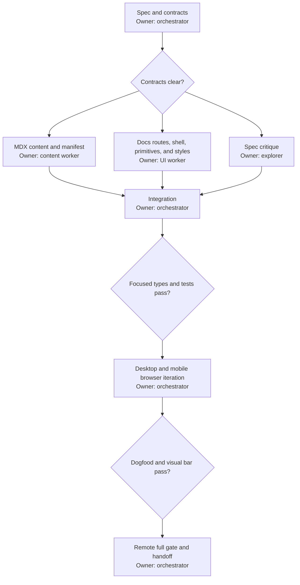

# Chalk docs site

## Background

Chalk has strong SDK and platform documentation in repository Markdown files,
but it has no public docs surface. A builder must search the repository before
they can understand why Chalk exists or how to put a Space in their product.

The desired state is a public docs section at `/docs` inside `apps/web`. It
opens with the reason to use Chalk, moves directly into a working quickstart,
and then teaches the product through TypeScript, React, React Native,
whiteboard, webhook, and public API guides. It looks and reads like the Chalk
landing page while giving technical content a calm, dense reading surface.

This change is local application work. It does not deploy or change production.

## Done

The first release is done when all of these checks pass:

- `/docs` presents Why Chalk and makes Quickstart the next clear action.
- The docs contain 20 to 30 substantive pages with no placeholder copy.
- TypeScript, React, and React Native are first-class paths.
- The whiteboard guide explains the Excalidraw-backed surface.
- Webhook and public API guides are present and use the public contract.
- Every page follows `~/.codex/writing-style.md` and `GLOSSARY.md`.
- Desktop has a header, grouped sidebar, readable article column, and on-page
  outline. Mobile has usable search and navigation without horizontal page
  overflow.
- Search finds pages by title, description, group, and declared keywords.
- Code blocks have syntax highlighting, copy feedback, and safe horizontal
  scrolling.
- Every docs deep link has route-specific title, description, canonical, and
  social metadata in the served HTML before client JavaScript runs.
- Current navigation, previous and next links, heading anchors, focus states,
  keyboard search, and reduced motion work.
- An unknown docs slug renders a useful docs 404 with navigation and search.
- Canonical Quickstart imports and options compile against the current public
  SDK exports.
- A docs-specific language check covers the complete banned-terms table after
  excluding fenced and inline code.
- Each page body loads in its own chunk, and the initial docs shell stays below
  the bundle budget recorded during verification.
- Focused tests, web type checks, the canonical gate, and browser dogfood pass.

This release does not include docs versioning, localization, hosted analytics,
an external search service, generated TypeDoc reference, or a production
deployment. Public API reference pages may summarize the current OpenAPI
contract; a full generated reference can follow.

## Behavior

`/docs` is the Why Chalk page. It explains that Chalk is a real-time
collaboration and communication layer built around durable Spaces and bounded
Episodes. Its primary action opens `/docs/quickstart`.

The sidebar order is Why Chalk, Quickstart, core concepts, SDKs, features,
platform, and operations. Selecting a page updates the article, active
navigation, on-page outline, document title, and previous or next destination.

Search opens from the header, `/`, or Command/Ctrl+K. It filters the local
manifest and lets the reader open a result with the keyboard. An empty query
shows useful starting points. A query with no match says so and leaves the
navigation available.

Code copy reports success without changing the code. A failed clipboard write
keeps the code readable and exposes a useful failure message.

Unknown docs slugs keep the docs shell visible, explain that the page does not
exist, and offer search plus links to Why Chalk and Quickstart.

## Language

The docs use the canonical model in `GLOSSARY.md`: a Space contains at most one
live Episode, Participants are present in that Episode, Users and Agents are
durable identity kinds, and AccessGrant is the opaque client access envelope.
The banned-terms table has no docs exception.

Every page opens with its answer. Paragraphs explain a claim, the mechanism,
and the consequence. Lists hold genuinely parallel facts. Technical guides use
this flow when it fits: answer, code, explanation, proof, recovery, next step.
They do not open with “In this guide” or pad the page with generic claims.

## System

The docs live inside `apps/web` and use its TanStack Router, Vite build, fonts,
brand assets, and Cloudflare Pages deployment. A `/docs` parent route owns the
shell, an index route owns Why Chalk, and one dynamic child route renders the
remaining flat slugs.

MDX is the authoring boundary. A typed manifest is the source of truth for
page metadata, order, grouping, search terms, navigation, and module loading.
The manifest loads page MDX with dynamic imports, so the shell and search index
do not eagerly load every article body. MDX supplies prose and code while
shared components own rendering and interaction. Build-time Shiki highlighting
keeps the highlighter out of the browser bundle. Search is a small in-memory
manifest filter because the launch set is bounded.

The existing SPA build remains in place. Its post-build preparation emits a
docs HTML entry for every manifest path with that page's title, description,
canonical URL, and social metadata. Article rendering may hydrate on the client
for this release, but crawlers must not receive one generic metadata shell for
every docs URL.

All docs CSS is scoped below `.docs-site`. It consumes the existing `--site-*`,
brand, font, radius, and shadow tokens without changing app or landing styles.

## UI and UX

The docs reuse the landing page's white and off-white paper, chalkboard green,
Nunito Sans, Spline Sans Mono, thin grey lines, 16px cards, and quiet shadows.
The header shares the Chalk logo and button language. Dense articles do not
copy the landing page's large negative overlaps, full-width closing art, or
centered section heads.

Why Chalk may use one existing landing illustration and a small card grid.
Technical pages stay left-aligned with a 68 to 72 character measure. Mint,
blue, yellow, and pink are reserved for notes, information, cautions, and
failures. Motion is limited to short hover, drawer, search, and copy-feedback
transitions and respects reduced motion.

## Initial sitemap

- Start: Why Chalk, Quickstart
- Concepts: Spaces and Episodes, Participants and Presence, Users Agents and
  Guests, Roles and Capabilities, AccessGrants
- SDKs: TypeScript, React, React Native, Turnkey UI, Custom UI
- Features: Media, Screen sharing, Chat, Reactions, Whiteboard, Entrance and
  admission
- Platform: Authentication, Webhooks, Webhook events, Public API, API errors
- Operations: Recovery, Diagnostics, Performance, Troubleshooting

## Implementation

Add MDX compilation before the React Vite plugin, with GFM, stable heading ids,
linked headings, and build-time Shiki output. Keep the dependency list small
and use only maintained official unified or Shiki packages.

Keep the manifest, content, components, routes, styles, and tests in separate
cohesive files. The route layer selects a manifest entry and passes it to the
page renderer. It does not contain article copy. The content layer does not
reach into router or app state.

The public API guide uses an explicit public-operation allowlist. It labels the
contract preview and excludes private operations, telemetry intake, and
monitoring routes. Webhook docs exclude reserved Recording and Transcript
events from supported subscription examples and label their schemas as
reserved until their pipelines are enabled.

The whiteboard page separates React/web from React Native. It explains that the
native surface uses the local embedded renderer, keeps credentials in the
native host, and must not fetch a remote Excalidraw bundle.

Verification includes a compile fixture for the Quickstart's canonical client
and React imports. A content check scans prose against every banned term in
`GLOSSARY.md`, with fenced code and inline code excluded so vendored API names
can remain exact.

## Execution

- [x] Spec and contracts
- [x] MDX content and manifest
- [x] Docs routes, shell, primitives, and styles
- [x] Spec critique
- [x] Integration
- [x] Focused types and tests
- [x] Desktop and mobile browser iteration
- [x] Dogfood and visual sign-off
- [x] Remote full gate and handoff

The content worker owns only `apps/web/src/docs/content/**` and
`apps/web/src/docs/manifest.ts`. The UI worker owns docs components, docs route
files, docs CSS, MDX component wiring, Vite MDX configuration, and focused UI
tests. Neither worker edits existing landing components or shared UI packages.
The orchestrator owns dependency installation, shared-file integration,
browser decisions, final fixes, the changelog, staging, and sign-off.

## Anti-slop rules

- Do not invent capabilities, endpoints, props, or event names. Derive examples
  from the checked-in SDK types, OpenAPI contract, and existing guides.
- Do not use app-only or legacy vocabulary when `GLOSSARY.md` gives a public
  name.
- Do not hide instructional content in decorative images or `aria-hidden`
  diagrams.
- Do not use a bento card where prose or one code block is clearer.
- Do not add dark mode, gradients on cards, scroll choreography, or decorative
  animation for launch.
- Do not make code smaller to prevent overflow. Let code scroll inside its own
  boundary.
- Do not import server-only webhook code into the browser bundle.
- Do not expose OpenAPI operations unless they are on the public allowlist.
- Do not present reserved webhook schemas as events customers can subscribe to.
- Do not eagerly import MDX page bodies through the metadata manifest.
- Do not edit or normalize unrelated dirty files in the shared worktree.
