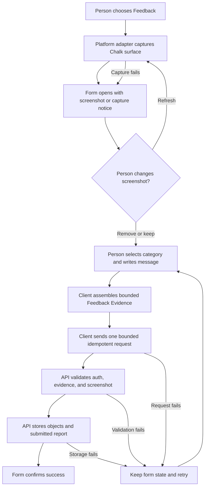
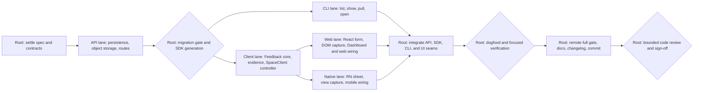

# Chalk Feedback

- Status: ready for execution
- Date: 2026-08-19
- Project: Chalk

## Background

### The problem

People can experience a bug, think of an improvement, or have another useful
observation while they are using Chalk. Chalk has no direct way to collect that
feedback with the evidence needed to understand the moment. A message sent
later loses the current Space, Episode, Participant, app, device, connection,
Journey, trace, and client diagnostic context.

Chalk is a one-person team today. The operator workflow should favor a small,
durable intake path and fast local investigation over a support desk, ticket
workflow, or internal dashboard.

### Current state

Chalk already propagates Journey and W3C trace context across the client SDK,
API, Sync, RTC, and provider boundaries. The client keeps bounded telemetry and
diagnostic timelines, the API persists Episode Diagnostics, and the private
Episode Diagnostics CLI can resolve a Diagnostic Reference into a focused
investigation. These parts do not create or store a Feedback Report.

The React and React Native `<Chalk />` surfaces expose Diagnostics from their
existing More actions. The Chalk web and mobile apps use those SDK surfaces,
and the Dashboard has an account-authenticated shell with an existing dialog
pattern. None of them has a Feedback form or a screenshot capture adapter.

The API already has Tenant-bound authentication, account and Participant
principals, PostgreSQL repositories, R2-compatible object storage, generated
SDK contracts, audit logs, and Journey-aware observability. The existing
Episode Diagnostics read API is an operator surface with different lifecycle
and authorization rules, so Feedback must not be hidden inside that domain.

### Desired state

A person can open Feedback from embedded `<Chalk />`, Chalk's web or mobile
app, or the Dashboard. Chalk automatically attempts to capture the current
Chalk surface before the form covers it. The form shows the screenshot and lets
the person refresh or remove it. The person chooses Bug, Feature request, or
Other, writes one message, and submits it directly to Chalk.

Submission automatically adds a bounded, typed evidence bundle. Its JSON
includes only allowlisted Chalk-owned local state, safe cookie context, app and
SDK versions, device and connection metadata, current Space, Episode, and
Participant identifiers when available, recent safe diagnostics, and current
Journey, trace, and Diagnostic references. It never dumps the host origin's
storage, cookies, credentials, content, or media payloads. The screenshot is a
separate, intentional capture of visible Chalk content: the person previews it
and may remove it before submission.

The Feedback Report is durable in PostgreSQL. Its evidence JSON and optional
screenshot live in object storage. A Chalk operator uses Feedback commands in
the existing observability tooling to list reports, inspect one, download its
evidence, and open the strongest related Diagnostic, Journey, or trace. Chalk
is the only recipient. The product makes no promise of a reply.

## Done

The change is done only when all of the following are observable.

### Submission

- [ ] Embedded React and React Native `<Chalk />`, Chalk web/mobile, and the
      Dashboard each expose a Feedback action in an existing utility or More
      surface.
- [ ] The form has exactly three categories, one message field, a clear note
      that Chalk receives the feedback and diagnostics, and a submit action.
- [ ] Opening the form automatically attempts a screenshot before the form
      covers the target surface. A successful capture appears as a thumbnail
      that can be refreshed or removed.
- [ ] Screenshot capture failure never blocks feedback. The form explains the
      failure briefly and still accepts a report without a screenshot.
- [ ] A successful submission shows one confirmation and closes cleanly. A
      failed submission keeps the message and current screenshot in memory and
      offers retry. One idempotency key is bound to the authenticated submitter
      and canonical request digest, so the same retry returns the same report
      and changed content returns a conflict.
- [ ] Keyboard, screen reader, focus, loading, validation, and reduced-motion
      behavior matches the surrounding Chalk surface.

### Evidence and privacy

- [ ] Every submission contains a versioned Feedback Evidence document even
      when the screenshot was removed or capture failed.
- [ ] Web local storage and cookies are collected through explicit key
      registries. The collector never enumerates or uploads arbitrary host
      origin state.
- [ ] Authentication, CSRF, AccessGrant, Sync, media, provider, API, and
      SecureStore credentials are excluded. HttpOnly cookie values remain
      inaccessible; the server may record only safe authentication-kind and
      presence facts.
- [ ] Evidence JSON excludes display names, email addresses, IP addresses, raw
      chat or whiteboard content, SDP, ICE candidates, request or response
      bodies, media, and unrestricted URLs. Existing diagnostic redaction rules
      apply before serialization and again at the API boundary. A screenshot
      may contain visible Chalk content because that is its purpose; the form
      states this and gives the person final control through preview and Remove.
- [ ] The screenshot targets the Chalk surface or current Dashboard content,
      not another app, browser tab, window, or the device screen. The Feedback
      form itself is not included.
- [ ] Evidence and screenshots have enforced MIME, dimension, item-count, and
      byte limits. The v1 request keeps evidence JSON at or below 128 KiB, the
      compressed screenshot at or below 450 KiB and 1920 by 1080 pixels, and the
      complete JSON request below the API's 1 MiB body limit. Oversized or
      invalid evidence fails safely without leaking its contents into logs,
      traces, audit records, or errors.

### Persistence and access

- [ ] PostgreSQL is authoritative for the Feedback Report, normalized
      correlation fields, submitter references, evidence manifest,
      idempotency binding, and submitted timestamp.
- [ ] R2-compatible object storage is authoritative for the versioned evidence
      JSON and optional screenshot. Object keys are generated by the server and
      are Tenant- and report-bound. A handled write or database failure removes
      partial objects and never exposes an incomplete report.
- [ ] The matching Goose migration, schema snapshot, and generated sqlc queries
      are present, applied to a disposable database, and verified before the API
      can reference the new table. Chalk does not add an API startup migrator.
- [ ] Dashboard creation derives its Tenant and Dashboard Account from the
      authenticated account session and normal Tenant authorization. Embedded,
      web, and mobile creation uses the existing Episode Diagnostic participant
      credential, whose verifier binds Tenant, Space, Episode, Participant,
      Diagnostic, environment, audience, and expiry. Sync, media, AccessGrant,
      API-key, and arbitrary bearer credentials are rejected.
- [ ] Tenant principals can submit Feedback but cannot list or read submitted
      reports. Only Chalk's internal operator authorization can retrieve them.
- [ ] No automatic or feature-specific retention policy is added. Reports and
      evidence remain until explicitly deleted or a future platform-wide data
      policy applies.

### Investigation

- [ ] The repository observability tooling supports `feedback list`,
      `feedback show <id>`, `feedback pull <id>`, and
      `feedback open <id>` with the existing environment, credential, bounded
      output, redaction, typed error, and exit-code conventions.
- [ ] `list` can filter by category, source, Tenant, and time and defaults to
      newest first. `show` prints the message, safe metadata, evidence state,
      and correlation references without downloading binary evidence.
- [ ] `pull` writes a uniquely named local directory containing the evidence
      JSON, optional screenshot, and a checksum manifest. It never overwrites a
      non-empty path.
- [ ] `open` launches the strongest available investigation target in this
      order: Diagnostic Reference, Journey, then W3C trace. If launch is not
      available, it prints the exact safe command or URL instead.
- [ ] Human CLI output escapes ANSI and terminal control characters in the
      user-authored message. `open` parses correlations with existing strict
      parsers, permits only configured Chalk observability hosts, and launches
      with argv rather than shell interpolation.
- [ ] Retrieval is audited without copying the message, evidence, object URL,
      or screenshot into the audit record.

### API, SDK, and operations

- [ ] The public submission routes use endpoint contracts and regenerate the
      OpenAPI and TypeScript SDK artifacts. Internal operator retrieval remains
      outside the customer API contract.
- [ ] The TypeScript client SDK owns the pure Feedback domain, safe evidence
      assembly, idempotent submission, and receipt handling. React, React
      Native, web, mobile, and Dashboard code remain thin platform adapters.
- [ ] Submission and retrieval propagate the incoming Journey and W3C trace
      context and emit bounded spans, metrics, structured logs, and failure
      signals for validation, authorization, report persistence, object writes,
      compensation, and retrieval.
- [ ] The Execution Trace Harness proves one successful Feedback submission and
      one object-storage or validation failure without recording sensitive
      content.
- [ ] Focused API, SDK, UI, CLI, migration, and observability tests pass. Real
      browser dogfood proves the web and Dashboard flows; the available native
      verification surface proves the mobile flow; the full repository gate
      passes.
- [ ] Public SDK docs and the changelog explain Feedback, automatic evidence,
      screenshot removal, privacy boundaries, and the lack of a reply promise.

### Out of scope

The first version has no support conversation, reply channel, Tenant inbox,
operator dashboard, assignment, triage state, SLA, voting, comments,
notification, automatic deletion, offline background queue, arbitrary file
attachment, screenshot annotation, or production deployment. A failed network
submission stays in the open form for manual retry and is not persisted as a
background draft.

## Behavior



The screenshot attempt starts before the form becomes visible. Refresh repeats
the attempt against the same target surface. Remove deletes the in-memory
capture and marks the screenshot absent in the evidence manifest. It does not
remove the automatic diagnostics.

Submission uses one client-generated idempotency key for every retry while the
form remains open. The API binds it to the authenticated submitter and a
canonical digest of the request. A retry with the same content returns the same
receipt; reuse with changed content returns `feedback.idempotency_conflict`.
Only complete reports appear in operator queries. The service removes partial
objects and rolls back the report when it handles a storage or database
failure.

The client takes the diagnostic snapshot at submit time so it describes the
latest state. It records the screenshot capture time separately because the
image was taken when the form opened or refreshed. If an Episode Diagnostic is
disabled or already disposed, the evidence states that it was unavailable and
still includes safe SpaceSnapshot and Journey context.

## Language

- **Feedback** is the user-facing feature and action.
- A **Feedback Report** is the durable submission received by Chalk.
- **Feedback Category** is exactly `bug`, `feature_request`, or `other`.
- **Feedback Evidence** is the versioned safe JSON document plus its optional
  screenshot.
- **Feedback Source** is `embedded`, `chalk_web`, `chalk_mobile`, or
  `dashboard`.
- Support, ticket, case, inbox, assignee, and reply are not names for this
  feature.

## System

### Ownership and boundaries

The pure Feedback types, evidence schema, redaction, limits, and submission
controller live under `sdks/typescript/client/src/feedback/`. The SpaceClient
exposes a `feedback` controller so SDK UI can use current private connection and
Episode Diagnostic context without importing internal files. The only public
command is `feedback.send`; platform screenshot and local-state adapters supply
typed evidence inputs and never receive an AccessGrant or credential.

This is a deliberate addition to the SpaceClient controller surface and must be
reflected in `GLOSSARY.md`, React/RN public-surface contracts, SDK docs, and
controller parity tests. No new public React hook is added because the glossary
defines a closed hook set.

React owns the browser `<Chalk />` form and DOM capture adapter. React Native
owns the native sheet and view-capture adapter. `apps/web` supplies the
first-party Space and Dashboard relays, account CSRF context, safe Dashboard
state registry, and Dashboard dialog entry. `apps/mobile` supplies first-party
device metadata and app context. Apps do not reimplement evidence validation or
submission rules.

The Go API domain lives under `apps/api/internal/feedback/`, with pure service
rules and repository/object-store/audit ports. PostgreSQL and R2 implementations
remain adapters. HTTP handlers authenticate, parse, authorize, and translate
errors; they do not own Feedback behavior.

### Data model

`feedback_reports` contains:

- a Chalk-minted report ID and authenticated Tenant ID;
- category, source, message, creation time, and submitted time;
- submitter kind and the safe Dashboard Account, User, Guest, Participant,
  Space, and Episode references that are available;
- originating Journey ID, trace ID, span ID, and Diagnostic Reference when
  available, plus the separate submission Journey and trace context;
- a client idempotency key and request digest unique to the authenticated
  submitter within the Tenant;
- evidence and screenshot object keys, MIME types, byte sizes, digests, and
  capture timestamps; and
- evidence schema version and safe failure reason when an optional screenshot
  is absent.

Every repository read or mutation binds both Tenant ID and report ID. Operator
cross-Tenant listing is a separate privileged query with explicit scope and a
stable `(created_at, id)` cursor. The table has no reply, owner, priority,
vote, or triage columns.

Object keys use a server-generated shape such as
`feedback/<tenant-id>/<report-id>/evidence-v1.json` and
`feedback/<tenant-id>/<report-id>/screenshot.<ext>`. Clients never choose or
persist raw object keys. Downloads use short-lived signed URLs or a bounded API
stream and safe content disposition.

### Submission API

Feedback uses one bounded JSON submission instead of a client-visible object
upload workflow. The API validates the request, decodes the compressed optional
screenshot, writes evidence and screenshot objects, and inserts the complete
database row. Handled failures compensate object writes and do not expose an
incomplete report. This is intentionally optimized for a low-volume basic
feature and stays within the existing 1 MiB request limit.

The same request and response schemas serve two explicit authentication
boundaries:

| Caller                            | Method and path                                 | Operation ID                      | Authentication and ownership                                                                                                                                          |
| --------------------------------- | ----------------------------------------------- | --------------------------------- | --------------------------------------------------------------------------------------------------------------------------------------------------------------------- |
| Dashboard                         | `POST /v1/tenants/{tenant_id}/feedback-reports` | `createAccountFeedbackReport`     | Account session only, normal Tenant access check; API keys are rejected                                                                                               |
| Embedded, Chalk web, Chalk mobile | `POST /v1/feedback-reports`                     | `createParticipantFeedbackReport` | Existing Episode Diagnostic participant credential; Tenant, Space, Episode, Participant, Diagnostic, environment, audience, and expiry come from the verified subject |

The participant route adds a purpose-specific endpoint auth mode backed by the
existing Episode Diagnostic participant verifier. It does not accept Sync,
media, API-key, AccessGrant, or generic bearer credentials. `SpaceClientCore`
passes the verified diagnostic credential and safe subject context into an
internal `FeedbackContext`; the public controller and UI never receive them.

The Dashboard uses a dedicated same-origin, CSRF-protected Feedback gateway
route. It is explicitly added to the account-boundary allowlist, permits only
the account Feedback path, raises its own bounded body limit to 1 MiB, strips
cookies before the upstream request, and propagates Journey and W3C context.
The generic Dashboard transport keeps its current 64 KiB limit.

Both routes require `Idempotency-Key`, use the authenticated write rate limit,
and accept this closed request:

```ts
type FeedbackReportRequestV1 = {
  schema_version: "FeedbackReportRequest/v1";
  category: "bug" | "feature_request" | "other";
  message: string;
  source: "embedded" | "chalk_web" | "chalk_mobile" | "dashboard";
  evidence: FeedbackEvidenceV1;
  screenshot?: {
    schema_version: "FeedbackScreenshot/v1";
    mime_type: "image/jpeg" | "image/png" | "image/webp";
    width: number;
    height: number;
    captured_at: string;
    data_base64: string;
  };
};

type FeedbackReportReceiptV1 = {
  schema_version: "FeedbackReportReceipt/v1";
  id: string;
  submitted_at: string;
};
```

Success is `201 Created` with `FeedbackReportReceipt/v1`. A replay with the
same submitter, idempotency key, and canonical request digest returns the same
receipt without rewriting objects.

The API trims the message, requires 1 through 8,000 UTF-8 bytes, permits line
breaks and tabs, and rejects other control characters. It rejects source and
auth combinations that do not match the table. The screenshot is at most 450
KiB after base64 decoding and 1920 by 1080 pixels. Evidence JSON is at most 128
KiB, contains at most 50 telemetry events, 50 diagnostic events, 32 local-state
entries, and 16 cookie entries, and the full body remains at most 1 MiB.

Public failures use the existing request error envelope and this closed set:
`request.invalid`, `request.payload_too_large`, `request.unauthenticated`,
`request.forbidden`, `request.rate_limited`, `feedback.invalid_evidence`,
`feedback.invalid_screenshot`, `feedback.idempotency_conflict`,
`feedback.storage_unavailable`, and `internal`. Errors never echo message,
evidence, base64 data, credentials, or object details.

Neither route grants report read access.

The operator API provides internal list, detail, evidence-download, and
correlation-resolution routes under `/_internal/feedback-reports`. It reuses
the existing observability operator credential rules, environment checks,
Tenant scopes, safe errors, download bounds, and read audit behavior, with
distinct `feedback.read` and `feedback.evidence.read` capabilities. The private
`tools/episode-diagnostics` package gains a Feedback command dispatcher and
typed client beside its existing diagnostic-reference parser; Feedback words
are never passed through the diagnostic parser. Shared operator credential,
environment, safe-download, and typed-error primitives have one implementation.

| Method and path                                   | Capability               | Result                                                             |
| ------------------------------------------------- | ------------------------ | ------------------------------------------------------------------ |
| `GET /_internal/feedback-reports`                 | `feedback.read`          | Cursor page filtered by category, source, Tenant, and time         |
| `GET /_internal/feedback-reports/{id}`            | `feedback.read`          | Report detail and normalized correlations without object bytes     |
| `GET /_internal/feedback-reports/{id}/evidence`   | `feedback.evidence.read` | Bounded evidence JSON download with checksum                       |
| `GET /_internal/feedback-reports/{id}/screenshot` | `feedback.evidence.read` | Optional bounded image download with checksum and safe disposition |

### Evidence contract

`FeedbackEvidence/v1` is a closed schema with these typed sections:

```ts
type FeedbackEvidenceV1 = {
  schema_version: "FeedbackEvidence/v1";
  collected_at: string;
  app?: { name: string; version?: string; build?: string };
  sdk: { client: string; react?: string; react_native?: string };
  platform: {
    kind: "web" | "ios" | "android" | "macos";
    os_name?: string;
    os_version?: string;
    browser_name?: string;
    browser_version?: string;
    device_class?: "phone" | "tablet" | "desktop";
    device_model?: string;
  };
  connection?: { state: string; error_code?: string };
  scope?: { space_id?: string; episode_id?: string; participant_id?: string };
  correlations: {
    journey_id?: string;
    root_journey_id?: string;
    trace_id?: string;
    span_id?: string;
    request_id?: string;
    command_id?: string;
    diagnostic_reference?: string;
  };
  diagnostics: {
    availability: "available" | "disabled" | "disposed" | "unavailable";
    dropped_count: number;
    telemetry_events: SafeJourneyEvent[];
    diagnostic_events: DiagnosticEventDraft[];
  };
  local_state: {
    registry_version: "FeedbackLocalState/v1";
    entries: FeedbackLocalStateEntryV1[];
  };
  cookies: {
    registry_version: "FeedbackCookies/v1";
    entries: FeedbackCookieEntryV1[];
  };
  screenshot: {
    state: "captured" | "partial" | "removed" | "unavailable";
    captured_at?: string;
    failure_code?: "capture_failed" | "unsupported" | "tainted" | "secure_surface" | "too_large";
  };
};
```

`SafeJourneyEvent` and `DiagnosticEventDraft` reuse the existing bounded
telemetry and diagnostics-contracts validators after redaction. They do not add
a new attribute escape hatch. Scope and correlation identifiers use the
existing safe-ID and reference parsers. Unknown fields, unknown enum values,
unrestricted URLs, and unredacted diagnostic attributes are rejected before
object persistence.

The v1 local-state registry is exact:

- `chalk.web.telemetry.v1.*` and `chalk.mobile.telemetry.v1` are parsed through
  their typed telemetry storage adapters. Evidence normalizes each platform to
  the exact `chalk.web.telemetry.v1` or `chalk.mobile.telemetry.v1` registry key
  with bounded queue, timeline, and dropped counts. It includes up to 50
  redacted events in diagnostics, never raw stored JSON.
- `chalk.tenant-hint` contributes only a validated Tenant ID.
- `chalk.dashboard-request.*` contributes only a validated action key whose
  value is the boolean `true` while a request is pending. Fingerprints and
  idempotency keys are omitted.

No other local storage or AsyncStorage entry is eligible. Prefix matching alone
does not authorize collection. Mobile SecureStore is always excluded.

The v1 cookie registry is also exact: `chalk_theme` contributes its
`light|dark|system` value, `chalk_sidebar_state` contributes a boolean, and the
account and CSRF cookie names contribute presence only. Their values never
enter browser evidence. No other cookie is eligible.

The evidence JSON is validated by the same versioned contract in the SDK and
API. The API stores normalized correlation fields separately so operator
listing does not need to read object storage.

### Screenshot adapters

The browser adapter captures a passed Chalk or Dashboard root element. It does
not use `getDisplayMedia`, which would prompt for a whole screen, tab, or
window. A vetted DOM capture dependency may be added because no current package
provides this behavior. Capture is best effort: same-origin DOM, canvas, and
available video frames are included, while a tainted cross-origin or protected
subtree may be omitted and produces `partial`. If no useful capture can be
produced, the adapter returns a typed `tainted`, `secure_surface`, or
`capture_failed` unavailable result. Every negative path leaves submission
available.

The React Native adapter captures a passed native root view through a vetted
view-shot module or the smallest equivalent native bridge. It bounds bitmap
dimensions and memory, compresses before upload, respects secure surfaces, and
returns a typed unavailable result when the platform cannot capture.

Both adapters mark the Feedback dialog and other private overlays as excluded
from capture. Tests cover a normal same-origin fixture, a partial media fixture,
an unavailable fixture, refresh, and remove. Neither adapter owns submission or
evidence redaction.

### UI placement

Embedded web Feedback appears beside Settings and Diagnostics in the utility
actions. React explicitly wires `onOpenFeedback` through `<Chalk />`,
`SpaceView`, and `ControlBar`; it does not assume the currently unwired More
callback exists. React Native adds the same action to `SpaceActionMenu`. The
Chalk web and mobile apps inherit these entries from their SDK surfaces and
supply their first-party adapters. The Dashboard adds Feedback near Tenant
settings and the account utility area and reuses its existing dialog shell.

The form remains intentionally small. Category changes the message guidance but
does not add steps-to-reproduce or other fields. The screenshot thumbnail has
Refresh and Remove actions. Copy identifies Chalk as the recipient and says
that diagnostic context is included. It does not use Support language or
promise a response.

### Observability and audit

The request's submission Journey remains distinct from the Journey being
reported. Both are stored with explicit names. HTTP, service, repository,
object-storage, and finalization spans preserve the submission trace. Metrics
cover accepted, validation-rejected, unauthorized, rate-limited, upload-failed,
verification-failed, submitted, and operator-read outcomes with bounded
dimensions.

Logs and audit records may contain the report ID, safe principal kind, source,
category, environment, operation, outcome, and bounded error class. They never
contain the message, evidence fields, screenshot bytes, object URLs, digests,
credentials, or unrestricted correlation payloads. Feedback adds no deployed
service, so it needs no new uptime monitor.

## Implementation route

1. Add the API domain, migration, sqlc repository, object-store workflow,
   account and diagnostic-participant submission routes, operator routes,
   observability, audit behavior, route contracts, focused tests, and Execution
   Trace Harness scenario. Root then regenerates and verifies API/SDK artifacts.
2. Add the client Feedback domain and controller, evidence schema and redaction,
   bounded submission transport, internal `FeedbackContext`, SpaceClient
   integration, public exports, controller parity, and focused tests.
3. Add browser and native capture adapters, Feedback form/sheet surfaces, app
   wiring, Dashboard relay/dialog, accessibility behavior, and focused tests.
4. Add Feedback commands to the observability tooling with safe download/open
   behavior and focused CLI fixtures.
5. Integrate the seams, dogfood all reachable surfaces, run focused gates and
   the full remote gate, update docs and changelog, review the committed diff,
   and fix verified findings within the two-review ceiling.

## Execution



### Execution checklist

- [ ] **A: Root owns specification and interfaces.** Deliverable: this ready
      spec plus exact contract names, limits, auth boundaries, and lane file
      fences. Scope fence: no production or implementation delegation before
      the destination and seams are coherent.
- [ ] **B: API lane owns `apps/api` and its tests.**
      Deliverable: migration-safe submission and internal retrieval API with
      object storage, telemetry, audit, harness, and endpoint contracts. Scope
      fence: no generated TypeScript SDK, UI, CLI, React, RN, or app behavior.
- [ ] **C: Root owns the API contract gate.** Deliverable: reviewed migration,
      endpoint, auth, focused API gate evidence, `contract/generated`, and
      generated files under `sdks/typescript/client/src/generated`. Scope fence:
      downstream lanes do not guess around unfinished contracts.
- [ ] **D: Client lane owns `sdks/typescript/client/src/feedback`, SpaceClient
      integration outside `src/generated`, and glossary/controller contract
      edits.** Deliverable: pure Feedback controller and evidence assembly over
      the generated API. Scope fence: no generated SDK files, DOM, React Native,
      app, CLI, or API implementation.
- [ ] **E: CLI lane owns Feedback files under `tools/episode-diagnostics`, root
      command wiring, and CLI tests.** Deliverable: list/show/pull/open with the
      operator API and existing safety conventions. Scope fence: no API, SDK,
      or UI edits.
- [ ] **F: Web lane owns `sdks/typescript/react`, relevant `packages/ui`
      primitives, and `apps/web`.** Deliverable: embedded/web/Dashboard Feedback
      UX and browser capture with focused tests. Scope fence: no RN/mobile, API,
      CLI, or client core edits.
- [ ] **G: Native lane owns `sdks/typescript/react-native` and `apps/mobile`.**
      Deliverable: native Feedback UX and view capture with focused tests. Scope
      fence: no web, API, CLI, or client core edits.
- [ ] **H: Root owns integration.** Deliverable: mutually consistent generated
      types, controller interfaces, auth wiring, UI adapters, CLI routes, and a
      clean scope diff. Scope fence: do not redo valid lane work.
- [ ] **I: Root owns dogfood and diagnosis.** Deliverable: durable screenshots,
      browser/native flow proof, focused checks, and fixes for causal failures.
- [ ] **J: Root owns final verification and commit.** Deliverable: API gate,
      remote full gate, docs, changelog, staged scope, and conventional commit.
- [ ] **K: Root owns review and sign-off.** Deliverable: one bounded commit
      review, at most one re-review after fixes, falsified false positives, and
      a debrief with the trace command and durable proof paths.

## Anti-slop rules

- Do not turn Feedback into Support, a ticket system, or a customer-facing
  inbox.
- Do not make the host app collect credentials or reconstruct private SDK
  diagnostic state.
- Do not enumerate `localStorage`, `document.cookie`, AsyncStorage, or
  SecureStore and filter afterward. Collection starts from an explicit registry.
- Do not store or emit message text or evidence in logs, spans, metrics, audit
  details, exceptions, analytics, snapshots, or test fixtures.
- Do not make screenshot success a requirement for submission.
- Do not attach raw chat, whiteboard, transcript, SDP, ICE, media, request
  bodies, response bodies, URLs with query strings, or third-party app state.
- Do not add a new Feedback hook; use the existing SpaceClient and UI binding
  structure defined by the glossary.
- Do not implement app-only submission rules. Packages own behavior; apps own
  platform context and thin wiring.
- Do not use Episode Diagnostics operator credentials for customer submission,
  and do not expose Feedback reads to Tenant principals.
- Do not hand-edit generated sqlc, OpenAPI, or TypeScript SDK files.
- Do not touch production, deploy, push, or include private diagnostic artifacts
  in the public repository.
