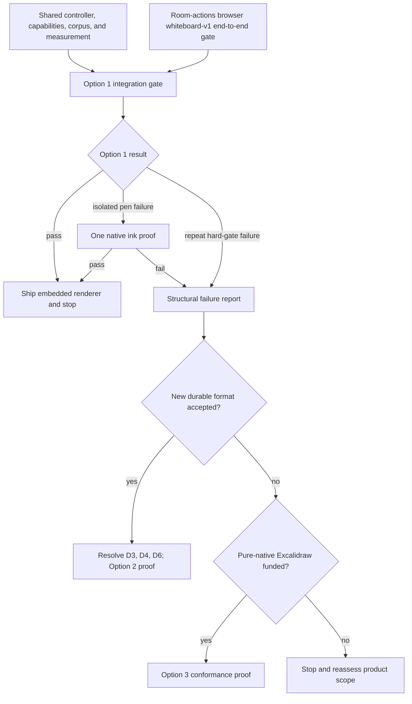
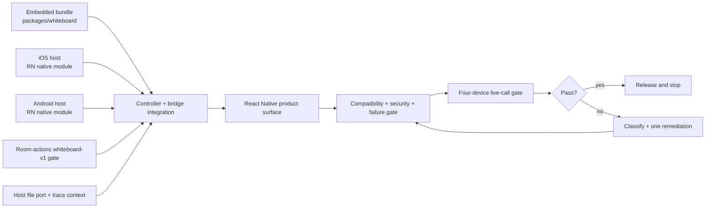

# Chalk Native Whiteboard Options

Status: draft
Date: 2026-07-29
Decision owner: Hasan Shoaib

## Decision

Review the options in this order:

1. Embed the Excalidraw renderer.
2. Build Chalk's whiteboard engine.
3. Reimplement Excalidraw in Swift and Kotlin.

That is the right order for evaluation, but it is not a three-step implementation plan. Chalk should prove Option 1 first and stop if it passes. If it fails across the editor, the next choice depends on the format requirement:

- If Chalk can make its own document format authoritative, evaluate Option 2.
- If lossless Excalidraw compatibility remains mandatory and a browser renderer is no longer acceptable, evaluate Option 3.

Option 2 cannot preserve every Excalidraw behavior and still remain a smaller greenfield engine. Requiring both turns it into an Excalidraw port under a new name.

## Background

### Problem

Chalk has a collaborative Excalidraw whiteboard on the web but no mobile renderer. A mobile participant can join the room and receive whiteboard state through the React Native SDK, yet cannot open and edit the shared board.

The mobile experience must feel like part of the meeting: it must start quickly, remain responsive while audio and video are active, support touch and pen input, recover after app and network interruptions, and expose a safe SDK surface.

### Current state

`@q9labsai/chalk-whiteboard` owns the web renderer integration, Excalidraw reconciliation, scene and file sync, cursor presence, and math elements. The current collaboration engine depends on Excalidraw's restore, reconciliation, ordering, element-version, deletion, and file rules.

The in-progress `whiteboard-v1` contract adds a durable scene epoch and revision, typed Excalidraw elements, acknowledged updates, image transfer, permission checks, and recovery. The renderer must consume that boundary; it must not invent a second room or collaboration model.

The current React Native `useWhiteboard` hook wraps the legacy manager-shaped native core. Its subscriptions and commands are inert, so it is not reusable whiteboard infrastructure. The room-actions work instead makes `ChalkSessionStore.whiteboard: ChalkWhiteboardV1Transport | null` the canonical native integration point. The native provider and product have not consumed it yet.

The current `whiteboard-v1` update envelope accepts at most 128 elements and 256 KiB. The collaboration engine can submit every changed element in one delta and every element in one periodic full sync. A 1,000-element proof therefore requires a transport and engine change before renderer performance can be measured honestly.

### Desired state

A mobile participant can open the same board as a web participant, draw or observe according to room capability, and recover the same committed scene after reconnecting. A Chalk-owned controller keeps room truth outside the replaceable renderer. Failures stay inside the board and never break the live meeting.

### Confirmed constraints

- Existing web and mobile Excalidraw scenes must round-trip without loss unless Hasan explicitly changes the format policy.
- An embedded renderer is acceptable if real-device proof shows native-grade input, layout, lifecycle, and accessibility.
- Agents can implement the work, but device behavior and compatibility still require measured proof.
- The draft launch surface is the first-party React Native app plus a public React Native component. The iOS and Android host views remain internal implementation details until Hasan selects a standalone native SDK.
- Reconnect recovery is required. New offline authoring is not part of the first release: clients freeze edits while disconnected, retry already-submitted operations through the transport's pending-operation store, and recover a committed snapshot.

## Language

| Term                       | Meaning                                                                                                                                                    |
| -------------------------- | ---------------------------------------------------------------------------------------------------------------------------------------------------------- |
| Document                   | The durable whiteboard content and its format version.                                                                                                     |
| Scene                      | One active collaborative epoch inside a Chalk Session. Clearing the board creates a new scene.                                                             |
| Renderer                   | The editor that displays a document and turns user input into document changes.                                                                            |
| Controller                 | The Chalk-owned adapter that consumes `ChalkWhiteboardV1Transport`, owns the active scene and revision, and sends validated renderer outcomes to the room. |
| Host                       | The native or web shell that mounts a renderer and owns lifecycle, files, permissions, and telemetry.                                                      |
| Bridge                     | The versioned message boundary between a native host and an embedded web renderer.                                                                         |
| Capability                 | One allowed action, such as draw, clear, upload, copy, export, or convert.                                                                                 |
| Lossless round trip        | Open, edit, save, and reopen a document on another client without dropping fields, changing supported behavior, or reviving deleted content.               |
| Conformance corpus         | Versioned fixtures and expected results used by every renderer to prove the same behavior.                                                                 |
| Compatibility manifest     | The exact Excalidraw baseline, supported fields and features, fonts, bridge versions, and client-skew rules for one release.                               |
| Native-grade               | Meets the agreed device thresholds for input, frame time, startup, gestures, accessibility, and recovery while a meeting is active.                        |
| Legacy Excalidraw document | A document whose durable format remains Excalidraw-compatible.                                                                                             |
| Chalk document             | A future document whose durable format and behavior Chalk owns.                                                                                            |

## Shared Product Contract

All three options must fit the same product and host boundary. A renderer may change; room, permission, recovery, and SDK semantics must not.

### Ownership

| Layer                              | Owns                                                                                                                                                           | Must not own                                                            |
| ---------------------------------- | -------------------------------------------------------------------------------------------------------------------------------------------------------------- | ----------------------------------------------------------------------- |
| `ChalkSession` and `whiteboard-v1` | Room identity, authority, scene epoch, revision, acknowledgements, recovery, cursors, and file grants                                                          | Canvas widgets, native gestures, or editor history                      |
| `ChalkWhiteboardController`        | Active transport subscription, scene and revision cursor, capability derivation, renderer generation, operation submission, recovery, files, and trace context | Canvas behavior or a second durable document                            |
| `@q9labsai/chalk-whiteboard`       | Renderer adapter types, Excalidraw conversion, shared fixtures, controller implementation, and renderer telemetry                                              | App navigation or meeting lifecycle                                     |
| Renderer                           | Canvas, tools, selection, local undo and redo, hit testing, text editing, and local input                                                                      | Participant authority, durable revision, file grants, or room reconnect |
| Native host                        | View lifecycle, safe areas, keyboard, clipboard, share sheet, accessibility shell, local file bytes, and platform input routing                                | Scene reconciliation, signed links, or durable room state               |
| Product surface                    | Meeting layout, open and close behavior, permission messaging, and recoverable error UI                                                                        | A separate whiteboard transport                                         |

### Controller and renderer interfaces

`whiteboard-v1` remains operation-based. The renderer never owns or exports the room revision. User exports such as PNG, SVG, or an Excalidraw file are separate commands; they do not replace the transport snapshot.

The exact syntax may change during implementation, but these ownership rules and outcomes may not:

```ts
type RendererOutcome =
  | { type: "ready"; capabilities: RendererCapabilities }
  | { type: "local_change"; generation: string; elements: readonly WhiteboardWireElement[] }
  | { type: "cursor"; x: number; y: number }
  | { type: "camera"; x: number; y: number; zoom: number }
  | { type: "file_request"; fileId: string; operation: "read" | "write" }
  | { type: "metric"; sample: RendererMetric }
  | { type: "error"; error: RendererError };

interface ExcalidrawRendererAdapter {
  mount(input: RendererMountInput): Promise<RendererCapabilities>;
  applySnapshot(input: { generation: string; sceneId: string; elements: readonly WhiteboardWireElement[]; appState?: SharedAppState }): Promise<ApplyOutcome>;
  applyUpdate(input: { generation: string; elements: readonly WhiteboardWireElement[] }): Promise<ApplyOutcome>;
  setCapabilities(capabilities: RendererCapabilities): void;
  setViewport(viewport: RendererViewport): void;
  exportUserFile(format: "png" | "svg" | "excalidraw"): Promise<Uint8Array>;
  subscribe(listener: (outcome: RendererOutcome) => void): () => void;
  dispose(): Promise<void>;
}

interface ChalkWhiteboardController {
  open(transport: ChalkWhiteboardV1Transport): Promise<OpenOutcome>;
  setRenderer(renderer: ExcalidrawRendererAdapter): void;
  updateProductPolicy(policy: WhiteboardProductPolicy): void;
  close(): Promise<CloseOutcome>;
}
```

The controller assigns a new opaque renderer generation to each accepted snapshot. Local changes from an older generation are discarded before submission. Only a transport commit advances the durable revision. The renderer reports outcomes; it does not return booleans that hide whether a change applied, conflicted, required recovery, or failed.

`RendererCapabilities` includes `canMutate`, `canClear`, `canUploadFiles`, `canCopy`, `canExport`, and `canConvert`. The controller derives mutate, clear, and file rights from `whiteboard-v1`; the product supplies copy, export, and conversion policy. Any capability absent from the current server contract defaults to false.

### Required states

Every product adapter presents the same states:

1. **Closed** — no renderer or whiteboard socket consumes resources.
2. **Opening** — mount the renderer, start the scene subscription, and load the latest committed snapshot.
3. **View only** — show the live scene, remote cursors, and the actions allowed by current capabilities.
4. **Editable** — enable each tool only after the current scene and matching capability are known.
5. **Recovering** — keep the last committed scene visible, freeze edits, request a snapshot, and show one quiet reconnect notice.
6. **Failed** — isolate the board, preserve the meeting, expose retry and close, and emit one structured failure.
7. **Closing** — stop new input, wait for the transport's current submitted operation until its existing timeout, preserve only operations already in the transport pending store, discard renderer-local work with a visible warning, stop subscriptions, and release large buffers.

On capability loss, the renderer cancels the active gesture and removes its uncommitted preview. The controller stops new submissions. An operation already accepted by the transport may commit; if it fails or its authority is stale, the controller requests a snapshot. On scene reset, the controller invalidates the renderer generation, drops every renderer-local change for the old scene, clears old previews, and loads the new snapshot. No close action creates a last-minute update.

### User-visible transitions

| Trigger                                  | Visible state                                                                        | Allowed actions                                      | Recovery                                                            |
| ---------------------------------------- | ------------------------------------------------------------------------------------ | ---------------------------------------------------- | ------------------------------------------------------------------- |
| No board scene yet                       | Empty board with “Start whiteboard” for an allowed host; otherwise a waiting message | Start, close                                         | Server creates the first scene, then sends a snapshot               |
| Draw capability removed                  | View-only banner; active preview disappears                                          | Pan, zoom, inspect, permitted copy or export, close  | Server capability update restores tools                             |
| Clear by another participant             | Brief “Board cleared” notice and empty new scene                                     | Current capabilities on the new scene                | Controller rejects old-generation work and applies the new snapshot |
| Network or SyncEngine interruption       | Last committed scene plus “Reconnecting”; tools disabled                             | Pan, zoom, close                                     | Resume only after snapshot recovery                                 |
| File unavailable                         | Placeholder on the affected object; board remains usable                             | Retry file, continue on unaffected objects, close    | Host file port retries or reports permanent failure                 |
| Unsupported optional content             | Preserve and display what is safe; mark the object unsupported                       | Pan, zoom, close; no destructive edit to that object | Update client or use a supported web client                         |
| Unsupported required version or behavior | Read-only “Update required” state                                                    | Close, update, open supported web client             | Install a compatible client                                         |
| Renderer process terminated              | Board-failed surface inside the meeting                                              | Retry, close                                         | Recreate renderer, then load a fresh snapshot                       |

### Required mobile behavior

- One-finger draw for the active pen or shape tool; two-finger pan and pinch zoom.
- Pen draws while finger pans when the device exposes a pen.
- Palm input does not create marks during pen use.
- Selection, resize, rotate, text edit, undo, redo, copy, paste, delete, and clear behave consistently with the document format.
- Toolbars respect phone, tablet, portrait, landscape, split view, safe areas, and keyboard bounds.
- VoiceOver and TalkBack can reach the close control, tool picker, undo and redo, capability state, selected object actions, and recoverable errors.
- An accessible object navigator lists objects in reading order with type, name or text summary, selection, edit, and delete actions. It restores focus after canvas close, remote delete, and error recovery.
- Dynamic Type or font scaling, high contrast, reduced motion, hardware keyboards, switch navigation, and screen-reader focus order have focused tests. Accessibility failure is a release veto.
- The board never steals meeting-wide audio controls or leaves an invisible focus trap after closing.
- Closing and reopening restores the last committed camera position locally without writing it to the shared scene.

## Shared Proof Bar

The proof runs on an iPhone, an iPad with Apple Pencil, a representative mid-tier Android phone, and a Samsung tablet with S Pen. Each run carries live Chalk audio and video plus at least one remote browser editor. A native blank-canvas reference runs the same gesture and media script on the same device before the option under test.

The corpus includes empty, small, medium, and stress scenes; images; text; math; arrows and bindings; groups and frames; deleted elements; concurrent updates; clear plus stale updates; unknown optional fields; reconnect recovery; rotation; split view; background and resume; and process termination. The medium fixture has 1,000 elements and ten fixed 1024×1024 images totaling no more than 10 MiB encoded. The stress fixture has 5,000 elements and the same image set.

Recommended draft thresholds:

| Measure                   | Draft pass threshold                                                                                                                                                    |
| ------------------------- | ----------------------------------------------------------------------------------------------------------------------------------------------------------------------- |
| Cold open to editable     | p95 at or below 3 seconds for a medium scene                                                                                                                            |
| Warm open to editable     | p95 at or below 1.5 seconds for a medium scene                                                                                                                          |
| Input to visible ink      | p95 at or below 50 ms; no visible gap above 100 ms                                                                                                                      |
| Active pan or zoom        | Fewer than 5% missed display deadlines over a fixed ten-second gesture; no stall above 100 ms                                                                           |
| Medium scene              | 1,000 elements plus 10 images without input regression                                                                                                                  |
| Stress recovery           | 5,000 elements reopen and converge without crash or data loss; editing may degrade with a clear warning                                                                 |
| Bridge or adapter backlog | Bounded; latest camera and cursor data may coalesce, document changes may not disappear                                                                                 |
| Resource endurance        | After warm-up, 20 open/edit/close cycles show under 1% post-close resident-memory slope per cycle; the 30-minute final value stays within 15% of the post-warm baseline |
| Meeting cost              | Board use adds under 2 percentage points of dropped video frames and no sustained audio jitter or round-trip increase above 20 ms versus the same call without a board  |
| Compatibility             | All supported corpus fixtures preserve required fields and converge to the expected scene                                                                               |
| Isolation                 | Renderer crash, network loss, and file failure leave audio, video, chat, and room controls working                                                                      |

Each device runs at least 30 cold opens, 30 warm opens, and three ten-minute gesture loops at normal thermal state. Input-to-photon uses platform event and presented-frame timestamps where available, with one 240 fps video validation per pen platform. Frame results use the device refresh deadline instead of one fixed millisecond budget. Memory includes the native host, WebView or GPU process, decoded images, and temporary files.

These thresholds are an open decision. Phase 0 first records the native reference and measurement variance, then Hasan accepts or changes the pass bar. The threshold may not move after an option fails unless the product requirement changes for every option.

## Option 1 — Embed the Excalidraw Renderer

### Outcome

Ship a pinned, self-contained Chalk Excalidraw build inside `WKWebView` on Apple platforms and Android `WebView`. Internal native host views power the first-party React Native app and public React Native component. The same Excalidraw implementation continues to restore, render, edit, and reconcile every supported scene.

This is the default option.

### Architecture

1. `packages/whiteboard/src/embedded` produces a separate versioned renderer artifact with an exact Excalidraw pin, CSS, fonts, icons, MathJax, Chalk's touch-first editor shell, license notices, and no runtime content-delivery dependency. The current web entry may keep its host-provided dependencies; the embedded artifact may not.
2. `ChalkEmbeddedWhiteboardView` loads the bundle from the application package. It blocks external navigation and accepts messages only through the Chalk bridge.
3. The bridge completes a version and capability handshake before either side sends a scene.
4. `ChalkWhiteboardController` opens `ChalkSessionStore.whiteboard`, starts its subscription, owns scene and revision, and maps exact `snapshot` and `update` events to the renderer. The renderer emits element changes; the controller submits them and waits for a transport commit.
5. Native code owns file bytes, clipboard, share sheet, keyboard bounds, safe areas, lifecycle, and structured telemetry. Signed upload and download links never enter renderer JavaScript.
6. The embedded renderer owns the canvas, tool UI, selection, text edit, history, Excalidraw reconciliation, and final scene serialization.

The bridge batches durable element changes, coalesces camera and cursor updates, sets message-size limits, and preserves order per renderer generation. Each request has a request ID and one typed success or failure response. A new scene invalidates queued messages and previews for the old generation.

Before the medium-scene proof, the transport gains a bounded multipart update operation. The client partitions by both element count and encoded bytes. The server validates all parts, commits them as one revision, and fans out only after the complete batch arrives; incomplete or expired batches have no visible effect. Ordinary small deltas retain the current single-frame path. Initial snapshots keep their existing paged flow. Tests cover full sync, bulk move, group, style, delete, and clear near every item and byte limit.

### Bridge messages

| Direction        | Required messages                                                                                                                                |
| ---------------- | ------------------------------------------------------------------------------------------------------------------------------------------------ |
| Host to renderer | `initialize`, `apply_snapshot`, `apply_update`, `set_capabilities`, `set_viewport`, `provide_file_bytes`, `request_user_export`, `prepare_close` |
| Renderer to host | `ready`, `local_update`, `cursor`, `camera`, `file_read`, `file_write`, `user_export`, `metric`, `error`, `close_ready`                          |

Each envelope carries bridge version, renderer build ID, renderer generation where applicable, message ID, payload size, Chalk journey ID, and W3C trace context. Unknown message types fail closed and produce a redacted diagnostic. Trace spans cover open → subscribe → snapshot → ready, gesture → bridge → durable commit, file transfer, recovery, and close.

### Security and release rules

- Pin the Excalidraw version and renderer bundle hash in each release. Do not use a semver range in the embedded artifact.
- Publish a compatibility manifest with the exact package baseline, supported element types and app-state fields, fonts, restore behavior, optional-field preservation, required-feature refusal, bridge range, and web/mobile skew.
- Gate web features with the same manifest. A document that uses newer required behavior opens read-only with “Update required”; an older client never rewrites it.
- Package Excalidraw CSS, all fonts and icons, MathJax, and license notices locally. An archive-install test runs offline and records zero non-Chalk network requests.
- Use a restrictive content security policy, disable arbitrary navigation, and allowlist bridge commands.
- Validate every bridge envelope and decoded document before it reaches the renderer or room transport.
- Keep auth tokens, signed file links, file bytes, scene elements, and user text out of console output, renderer errors, spans, metrics, and durable diagnostics.
- The host file port validates MIME signature, encoded bytes, pixel dimensions, decoded-memory budget, and SVG safety; it supports cancellation, cache eviction, temporary-file cleanup, process death, and oversized-image refusal.
- Publish bridge compatibility as a version matrix. A native wrapper supports the current bridge and one prior compatible bridge during rolling SDK upgrades.

### Native ink escalation

A PencilKit or Jetpack Ink overlay may sit above the embedded canvas only if the benchmark shows that pen capture fails while the rest of the editor passes. Native code captures and previews a neutral `CapturedStroke` containing samples and the exact camera-transform version. The embedded renderer creates the canonical Excalidraw element and returns an accepted-frame acknowledgement before the overlay removes its preview. Native code never chooses Excalidraw IDs, indices, seeds, versions, nonces, or schema fields.

This is part of Option 1, not a fourth editor. It must pass camera-transform, duplicate-preview, cancellation, undo, capability-loss, rotation, remote visibility, and remote-update tests before release.

### Failure classes and budget

Option 1 gets one measured baseline and one targeted remediation pass for each failing class. The same hard gate failing on two clean reruns after that remediation marks a structural failure.

| Failure class                                                                         | Allowed response                              | Next branch after repeat failure                                                          |
| ------------------------------------------------------------------------------------- | --------------------------------------------- | ----------------------------------------------------------------------------------------- |
| Pen capture only                                                                      | One native ink proof                          | Option 2 if format may change; otherwise Option 3 only if pure native is funded           |
| Host layout, focus, keyboard, or lifecycle                                            | One native-host remediation                   | Same format branch                                                                        |
| Excalidraw canvas performance or JavaScript scheduling                                | One profiling-led renderer remediation        | Option 2 only if its proposed core removes the measured cause; otherwise Option 3 or stop |
| Accessibility content cannot meet the veto gate                                       | One accessible-object-navigator proof         | Format branch                                                                             |
| Compatibility, security, or meeting isolation requires a second source of scene truth | No architectural workaround inside the bridge | Format branch immediately                                                                 |
| Customer policy forbids any WebView                                                   | No technical remediation                      | Option 2 if format may change; Option 3 if it may not                                     |

Every failure report names the failing device, fixture, trace, failure class, attempted remediation, and why the next option removes the cause. A failed option does not justify a fallback that retains the same cause.

### In scope

- Mobile renderer bundle and native host views.
- Touch-first Chalk editor layout.
- First-party React Native integration and a public React Native component.
- Internal iOS and Android host views; standalone SwiftPM, CocoaPods, and Maven products are a later decision.
- Native file, clipboard, share, lifecycle, safe-area, keyboard, and telemetry integration.
- Bridge conformance and real-device proof.
- Optional native pen capture after a measured failure.

### Non-goals

- Rewriting Excalidraw's scene model or reconciliation.
- Streaming every pointer sample over the bridge.
- Loading the editor from Chalk's website.
- General browsing or arbitrary embeds inside the renderer.
- Claiming native-grade behavior before device traces pass.

### Done

- [ ] The embedded renderer opens, edits, and round-trips every supported corpus fixture with the web client.
- [ ] The exact compatibility manifest governs web and mobile; newer required behavior produces read-only “Update required” without rewrite.
- [ ] Two mobile clients and one browser converge under concurrent draw, delete, undo, file, clear, reconnect, and stale-scene tests.
- [ ] Multipart full sync and bulk edits above 128 elements commit atomically near item and byte limits.
- [ ] The shared proof bar passes on all four target device classes during a live call.
- [ ] View-only, permission loss, reconnect, file failure, renderer crash, background, resume, rotation, and close states match the shared behavior.
- [ ] Bridge fuzz, size-limit, ordering, stale-scene, navigation, content-security, and secret-leak tests pass.
- [ ] The public React Native API, bridge matrix, integration guide, limits, and diagnostics guide ship with the SDK.
- [ ] Chalk telemetry can distinguish renderer startup, input delay, frame delay, bridge backlog, scene recovery, file failure, and renderer termination without recording scene content.

If all checks pass, stop. Do not start a new whiteboard engine.

### Pros

- Best chance of lossless compatibility because the same implementation reads and writes the scene.
- Lowest permanent editor burden: one renderer, two thin hosts.
- Fastest route to a real mobile product and public SDK surface.
- Upstream fixes remain deliberate dependency upgrades instead of manual ports.
- The host boundary remains useful if Chalk replaces the renderer later.

### Cons

- Mobile input, keyboard, accessibility, memory, and lifecycle still need product work.
- Bridge serialization and WebView process recovery add failure modes.
- A desktop-first Excalidraw interface must be replaced or adapted for touch.
- Pen latency and palm rejection may require the native ink escalation.
- Some customers may reject a WebView even after it passes the product bar.

## Option 2 — Build Chalk's Whiteboard Engine

### Activation rule

Evaluate this option only when all three statements are true:

1. Option 1 fails across the broader editor, not only pen capture.
2. Chalk wants a product and format that differ materially from Excalidraw.
3. Hasan accepts that new Chalk documents do not promise perpetual lossless Excalidraw export.

The Option 1 failure report must show that the proposed Option 2 core removes the measured cause. If JavaScript scheduling caused the failure, a TypeScript and React Native core is not accepted by default. If full Excalidraw round trips remain mandatory, this option is not available as a smaller path.

### Outcome

Create a versioned Chalk document model and editor for the meeting use case. Create new documents in `chalk/1` only after the new editor passes its release gate.

This option does not fix native editing for existing Excalidraw documents after Option 1 has failed. The default legacy policy is:

- keep web Excalidraw editing;
- allow a read-only embedded mobile viewer only if that narrower viewer passes compatibility, accessibility, and isolation gates;
- let an authorized owner choose **Create Chalk copy**, which freezes one source revision and creates a new document and scene without changing the original;
- show “Open on web” when even the read-only viewer fails.

There is never one live scene with two formats.

After failure attribution, choose the core:

- If the WebView boundary, Excalidraw complexity, or browser UI caused Option 1 to fail while JavaScript scheduling passed, use a framework-neutral TypeScript document core with web Canvas and React Native Skia adapters.
- If JavaScript scheduling, garbage collection, or React Native contention caused the failure, prove a Rust or C++ core before selecting it.
- If pure Swift and Kotlin public renderers are a launch requirement, the lower-level core or Option 3 needs a separate SDK decision.

The core owns serialization, deterministic reduction, geometry, hit testing, selection, history, and collaboration operations. Platform adapters own drawing, text input, accessibility overlays, clipboard, and device gestures.

### Format policy

The default policy is dual format:

- Existing Excalidraw documents continue to edit on web and on any client where the embedded editor passed. The Chalk engine never edits them.
- New Chalk documents use `chalk/1` and a new typed transport revision.
- An owner with `canConvert` may create a Chalk copy from one committed source revision. The service creates a new document ID and scene, records the source revision, and leaves the original unchanged. Collaborators receive a link to the new board; the service never switches an active scene in place.
- Export to Excalidraw is best effort and labeled with unsupported features. It is not called lossless.
- The Session facade remains stable while the transport chooses its adapter by document format.

The first bullet applies only where the embedded editor still passes. If Option 1 failed on mobile, legacy mobile uses the fallback policy above. This policy avoids forcing the new model to preserve every Excalidraw extension and bug. It also means Chalk operates two renderers during migration.

### First complete feature set

The first release is complete only with:

- pen and eraser;
- rectangle, ellipse, line, arrow, and text;
- image placement and protected file lifecycle;
- select, multi-select, move, resize, rotate, duplicate, delete, group, and ordering;
- pan, zoom, fit, local camera restore, and remote cursors;
- local undo and redo with documented remote-change behavior;
- clipboard, import, and PNG/SVG export;
- deterministic collaboration, clear epochs, reconnect recovery, and submitted-operation replay;
- phone and tablet layouts, keyboard behavior, accessibility, and diagnostics.

Frames, embeds, diagram generation, rich text, plugins, and feature parity with all future Excalidraw releases remain out until a later version. Math stays in scope because Chalk already exposes it.

The first release does not accept new edits while disconnected. Reconnect recovery replays only operations already submitted to the transport pending store. Offline authoring, encrypted local drafts, expiry, authority revalidation, conflict UI, and replay ordering require a later spec.

### System changes

- Add `chalk/1` document schemas and a format discriminator; never infer a format from payload shape.
- Add a `whiteboard-v2` transport or an explicit versioned union that can carry Chalk operations without weakening `whiteboard-v1` validation.
- Store immutable document-format identity with each scene.
- Keep shared room permissions, file grants, scene epochs, revisions, receipts, and observability semantics.
- Make operation reduction deterministic and test it on web, iOS, and Android runtimes.
- Preserve unknown optional fields within a Chalk document version and reject unknown required behavior.

### First collaboration rules

- Operations commit in server revision order.
- Independent property changes on one object merge; conflicting writes to the same property use the later committed revision.
- Group transforms commit atomically.
- Delete wins over any earlier edit. An edit based on a deleted object is rejected; recreating content uses a new object ID.
- Text editing uses a short server-backed object lease. With offline authoring disabled, only one client edits the text body at a time; a stale lease cannot overwrite newer text.
- Undo creates a new inverse operation for the participant's latest eligible local action. It never rewinds remote operations. If remote work makes the inverse unsafe, the action is unavailable and explains why.
- A file that arrives after its last live object was deleted is verified and then evicted without restoring the object.
- Math uses the current Chalk model: editable LaTeX metadata plus a rendered vector asset. Create, edit, copy, import, export, and missing-font behavior have corpus fixtures.
- PNG and SVG exports have fixed scene-bounds, font, image, and transparency fixtures. Excalidraw export remains best effort.

### In scope

- New document model, reducer, collaboration operations, editor core, render adapters, and product UI.
- Legacy Excalidraw coexistence and explicit conversion.
- Web and React Native releases from one core.
- Versioned import, export, accessibility, telemetry, and recovery.

### Non-goals

- Reproducing all Excalidraw features.
- Silent conversion of an existing board.
- Calling a best-effort exporter lossless.
- Pure Swift and Kotlin renderer packages unless selected as a separate requirement.
- Removing the embedded legacy editor before its documents age out under an accepted migration policy.
- New offline authoring.

### Done

- [ ] The `chalk/1` model, operations, reducer, and transport have executable schemas and cross-runtime fixtures.
- [ ] Web and React Native editors pass the first complete feature set and shared mobile proof bar.
- [ ] Three clients converge under randomized operation order, reconnect, submitted-operation replay, process restart, clear, permission change, and file delay.
- [ ] Legacy Excalidraw documents follow the accepted web, read-only mobile, and “Create Chalk copy” policy without silent conversion.
- [ ] Conversion freezes one source revision, creates a new document and scene, preserves the original, requires `canConvert`, and has golden visual and semantic fixtures.
- [ ] Accessibility and text editing work with VoiceOver, TalkBack, hardware keyboards, software keyboards, and common input methods.
- [ ] The migration policy, unsupported features, export limits, protocol support window, and rollback behavior ship before new documents default to `chalk/1`.

If this option passes, stop and keep Option 1 only as the legacy Excalidraw path.

### Pros

- Chalk controls product scope, format evolution, collaboration rules, observability, and AI-facing structure.
- One deliberate core can serve web and React Native without browser editor architecture.
- The editor can focus on live meetings instead of carrying every Excalidraw workflow.
- A typed Chalk format can define compatibility and migration rules up front.

### Cons

- Editor work extends far beyond drawing: text, selection, transforms, history, files, accessibility, export, recovery, and conflict handling dominate the long tail.
- Two renderers remain during migration.
- Swift and Kotlin customers do not receive pure-native renderers from the recommended TypeScript core.
- A new format breaks perpetual lossless Excalidraw export.
- Chalk owns every future editor defect, platform regression, and format migration.

## Option 3 — Reimplement Excalidraw in Swift and Kotlin

### Activation rule

Evaluate this option only when all three statements are true:

1. Option 1 fails or a hard customer requirement forbids a WebView.
2. Lossless Excalidraw document compatibility remains mandatory.
3. Pure Swift and Kotlin editor packages are strategically worth maintaining beside the web editor.

This is a reimplementation, not a normal fork. Excalidraw is a React browser editor; its MIT license permits native ports, but the browser implementation does not compile into Swift or Kotlin.

### Outcome

Ship separate Swift and Kotlin editors that preserve the selected Excalidraw baseline's document, render, edit, restore, undo semantics, and reconciliation behavior. Local history storage does not need byte-for-byte parity. Keep the web Excalidraw package as the reference implementation.

The ports share contracts, fixtures, generated schemas, operation traces, geometry vectors, rough-shape seeds, and visual expectations. They do not pretend to share native UI code.

### Compatibility baseline

- Pin one Excalidraw release as the initial native compatibility target.
- Define supported element types, app-state fields, file formats, fonts, exports, and restore behavior for that baseline.
- Bundle the same font files on web and native and use one canonical shaping and measurement engine for supported text. A missing or unsupported font makes the affected object read-only; it never silently reflows on save.
- Run upstream fixtures through the web reference and record semantic results, not private implementation details.
- Require Swift, Kotlin, and web to reach the same final element state for each operation trace.
- Compare visual output with tolerances that distinguish harmless raster differences from changed bounds, text wrapping, bindings, or geometry.
- Preserve unsupported optional fields and refuse edits that would corrupt unsupported required behavior.
- Support the current and one previous compatibility manifest. Web may not create newer required behavior until both native clients support it. An older client opens a newer required document read-only with “Update required.”
- Upgrade only through an explicit baseline change with a compatibility report and migration window. Security fixes may ship sooner only when the manifest proves that they do not create unsupported document behavior.

### Native architecture

Each platform owns:

- scene graph and spatial index;
- drawing and cache layers;
- pen, touch, mouse, trackpad, and keyboard routing;
- selection, handles, snapping, transforms, and hit testing;
- text layout and editing;
- undo and redo;
- clipboard, files, accessibility, and export;
- lifecycle and memory-pressure recovery.

The shared conformance project owns:

- Excalidraw JSON schemas and generated platform models;
- restore and reconciliation vectors;
- element ordering, version, deletion, grouping, frame, arrow, binding, and file fixtures;
- deterministic rough-shape and geometry fixtures;
- operation traces and expected semantic results;
- cross-platform visual comparison reports;
- the upstream-delta ledger.

The native editors continue to consume the same `whiteboard-v1` scene, revision, permission, file, and recovery transport.

### Delivery slices

1. Read-only viewer for the full supported corpus.
2. Pen and primitive creation with lossless web round trips.
3. Selection, transforms, ordering, grouping, undo, and redo.
4. Text, arrows, bindings, frames, images, files, and math.
5. Collaboration, recovery, permissions, clipboard, accessibility, and exports.
6. Full SDK surface, diagnostics, upstream upgrade process, and release proof.

No slice ships as an editor until its create-edit-web-edit-native round trip passes. A read-only viewer may ship only if product language makes the limitation explicit.

### In scope

- Native iOS/iPadOS and Android editors.
- Shared generated models and conformance infrastructure.
- Selected Excalidraw baseline compatibility.
- Public native SDK views and integration guides.
- Upstream delta intake and support policy.

### Non-goals

- Claiming compatibility with untested future Excalidraw releases.
- Sharing UI code merely to reduce file count.
- Replacing the web reference before the ports pass.
- Shipping partial edit support that silently drops unknown elements.
- Using screenshot similarity as the only compatibility proof.

### Done

- [ ] Swift, Kotlin, and web pass the same semantic corpus and operation traces.
- [ ] Native-created and web-created documents survive repeated cross-platform edits without field loss, binding drift, text reflow outside tolerance, deleted-element resurrection, or order changes.
- [ ] Both native editors pass the shared device proof bar and platform accessibility checks.
- [ ] Collaboration converges under randomized concurrency, reconnect, scene clear, permission changes, and file delays.
- [ ] The public Swift and Kotlin APIs expose the same capability and failure model as the shared host contract.
- [ ] Current and previous compatibility manifests, web feature gating, and older-client “Update required” behavior pass.
- [ ] One upstream Excalidraw baseline upgrade completes through the documented delta process before general release, proving that maintenance is real rather than theoretical.
- [ ] Ownership, release cadence, compatibility window, security updates, and deprecation rules are funded as permanent product work.

### Pros

- Highest ceiling for platform input, accessibility, lifecycle, text systems, and public native SDK ergonomics.
- Keeps Excalidraw as the durable format.
- No embedded browser process in the editor.
- Native platforms can adopt PencilKit, Jetpack Ink, and platform controls directly.

### Cons

- Chalk maintains three editors and two native implementations.
- Geometry, text, bindings, restore behavior, ordering, undo semantics, and concurrency must match the web reference, not merely look similar.
- Each upstream Excalidraw change becomes review, port, corpus, and release work.
- Swift and Kotlin will still differ in text, graphics, input, and accessibility behavior.
- This has the highest schedule, regression, and permanent ownership risk.

## Option Comparison

| Question                          | Embed Excalidraw                                        | Chalk engine                                        | Swift and Kotlin ports                     |
| --------------------------------- | ------------------------------------------------------- | --------------------------------------------------- | ------------------------------------------ |
| Current recommendation            | Prove first                                             | Conditional second choice                           | Last choice                                |
| Durable format                    | Excalidraw                                              | Chalk for new documents; Excalidraw legacy          | Excalidraw                                 |
| Lossless Excalidraw editing       | Strongest                                               | Web and any client where the legacy renderer passed | Required but expensive                     |
| Existing mobile Excalidraw boards | Editable                                                | Read-only viewer or web-only; authorized Chalk copy | Editable                                   |
| First release mobile stack        | Internal native host plus public React Native component | Shared core plus public React Native component      | Public pure-native editors                 |
| Standalone native SDK             | Later decision                                          | Not supplied by the default architecture            | Core reason to choose it                   |
| Permanent editors                 | One                                                     | Two during migration                                | Three                                      |
| Main risk                         | Mobile WebView behavior                                 | Editor scope and format migration                   | Cross-platform parity and upstream drift   |
| Exit condition                    | Pass device and compatibility gates                     | Pass new-format product gates                       | Pass corpus plus one real upstream upgrade |

## Open Decisions

### D1 — Mobile proof thresholds

**Decision:** Accept or change the draft startup, input, frame-time, scene-size, and endurance thresholds.

**Why:** “Feels native” is not a release test.

**Options:**

- Accept the absolute thresholds plus the native reference. This yields one support bar across options, but it may exclude older devices.
- Define a premium target and a lower supported-device floor. This widens support but creates two product experiences and twice the release evidence.
- Use only a relative native-reference delta. This adapts to each device but can permit a poor absolute experience.

**Recommendation and default:** Accept the absolute thresholds plus the native reference for the Option 1 proof. Phase 0 records variance before the bar freezes.

### D2 — Native ink inside Option 1

**Decision:** Treat PencilKit and Jetpack Ink capture as an allowed escalation inside the embedded strategy.

**Why:** Pen input can fail even when the rest of the embedded editor succeeds.

**Options:**

- Allow a native ink overlay after measured pen failure.
- Keep Option 1 purely embedded and mark any pen failure as an option failure.

**Recommendation and default:** Allow the overlay. It targets the platform-sensitive path while keeping one scene model and editor.

### D3 — Option 2 format policy

**Decision:** If Chalk builds a new engine, choose perpetual Excalidraw compatibility or a new Chalk format.

**Why:** The choice determines whether Option 2 is a focused product engine or an Excalidraw reimplementation.

**Options:**

- Dual format: legacy Excalidraw documents stay embedded; new documents use `chalk/1`.
- Full Excalidraw compatibility: the new engine must import, export, restore, render, edit, and reconcile the Excalidraw baseline.

**Recommendation and default:** Dual format. If full compatibility remains required, skip Option 2 and evaluate Option 3.

### D4 — Option 2 shared core

**Decision:** Choose the first cross-platform core if Option 2 activates.

**Why:** React Native delivery and pure-native SDK delivery favor different foundations.

**Options:**

- TypeScript core with web Canvas and React Native Skia adapters: fastest fit for Chalk's current apps, but no pure-native public renderer.
- Rust or C++ core with web and native bindings: wider SDK reach, but much higher binding and release cost.

**Recommendation and default:** TypeScript first. Reopen the decision only if pure Swift and Kotlin SDKs become a launch requirement.

The failure report may override this default. A core that retains the measured Option 1 failure cause cannot enter proof.

### D5 — First release consumers

**Decision:** Choose which SDK surfaces ship with the first mobile renderer.

**Why:** Internal React Native integration, a public React Native component, and standalone Swift and Kotlin products have different packaging and support contracts.

**Options:**

- First-party app plus public React Native component; native hosts remain internal. This matches the current repository and limits release work.
- Add public SwiftPM or CocoaPods and Maven host packages for the embedded renderer. This broadens reach but adds ABI policy, native sample apps, install gates, and independent releases.
- Require pure-native public editors. This makes Option 3 or a lower-level Option 2 core part of the launch.

**Recommendation and default:** First-party app plus public React Native component. Treat standalone native distribution as a later product decision.

### D6 — Legacy mobile behavior under Option 2

**Decision:** Decide what a mobile user can do with an existing Excalidraw document after the embedded editor has failed.

**Why:** A new Chalk engine cannot edit an Excalidraw document without becoming the port that Option 2 is meant to avoid.

**Options:**

- Read-only embedded viewer when it passes, plus owner-authorized **Create Chalk copy**; otherwise open on web.
- Web-only legacy access with no mobile viewer. This is simpler but leaves mobile participants outside existing boards.
- Full native legacy editing. This activates Option 3 alongside Option 2 and creates the highest permanent cost.

**Recommendation and default:** Read-only viewer plus **Create Chalk copy**, with an honest web-only fallback when the viewer cannot pass.

## Execution

The room-actions browser `whiteboard-v1` gate is an upstream dependency for cross-client integration. Local bundle, bridge, UI, and device-harness feasibility may run in parallel, but no mobile integration can pass until the backend, TypeScript transport, reducer, files, clear epoch, recovery, and browser adapter work end to end.

Resolve D1, D2, and D5 before the Option 1 proof. Defer D3, D4, and D6 until Option 1 has a structural failure report. Do not block the embedded proof on decisions for an inactive fallback.



### Phase 0 — Shared contract, protocol, and evidence

- [ ] Resolve D1, D2, and D5.
- [ ] Complete the room-actions browser `whiteboard-v1` gate or record it as the named integration blocker.
- [ ] Replace or deprecate the legacy React Native `useWhiteboard` manager path; expose `ChalkSessionStore.whiteboard` through the native provider.
- [ ] Freeze controller and renderer outcomes, capability names, bridge envelope, redacted failure taxonomy, journey IDs, and trace propagation.
- [ ] Add atomic multipart update support so full sync and bulk changes can exceed 128 elements and 256 KiB without partial visibility.
- [ ] Build corpus collection, semantic comparison, visual comparison, concurrency traces, file fixtures, and device benchmark harnesses.
- [ ] Publish the first compatibility manifest and pin web features to it.

### Phase 1 — Option 1 proof



- `packages/whiteboard` owns the embedded artifact, controller, bridge types, Excalidraw adapter, corpus, and multipart engine support.
- `sdks/typescript/client` owns `ChalkWhiteboardV1Transport`, pending operations, summaries, files, and trace propagation.
- `sdks/typescript/react-native` owns the internal iOS and Android hosts, public React Native component, meeting states, and native consumer proof.
- `apps/mobile` remains a thin first-party verification surface.
- The orchestrator runs the clean integration and device gates after each lane's focused tests pass.

### Phase 2A — Option 2 proof, only after activation

- [ ] Resolve D3, D4, and D6 from the Option 1 failure report.
- [ ] Freeze `chalk/1`, operation semantics, offline exclusion, first feature set, and legacy policy.
- [ ] Prove the chosen core removes the measured Option 1 failure before building both render adapters.
- [ ] In parallel, build the deterministic core and fixtures, web adapter, React Native adapter, versioned transport/storage, and owner-authorized copy transaction behind fixed interfaces.
- [ ] Join at randomized convergence, accessibility, file, conversion, migration, product, and rollback gates.
- [ ] Default new documents to Chalk only after the legacy policy and rollback proof work end to end.

### Phase 2B — Option 3 proof, only after activation

- [ ] Freeze the supported Excalidraw baseline.
- [ ] Build the shared generated models, canonical fonts and text shaping, semantic corpus, visual tolerances, operation traces, and delta ledger first.
- [ ] Build read-only Swift and Kotlin corpus viewers in parallel; join at one cross-platform report.
- [ ] Add each edit slice to Swift and Kotlin in parallel only after the prior slice's web-native-web round trips pass.
- [ ] Complete one upstream baseline upgrade before general release.

### Phase 3 — Handoff for the selected option

- [ ] Publish SDK contracts, limits, support matrix, migration or compatibility policy, and diagnostics.
- [ ] Add release notes and upgrade guidance.
- [ ] Run focused package gates, device proof, consumer installation tests, and the repository gate.
- [ ] Verify no renderer, WebView, GPU surface, watcher, or benchmark process remains after close or test cleanup.

## Risks

| Risk                                           | Evidence or trigger                                               | Response                                                                                                                 |
| ---------------------------------------------- | ----------------------------------------------------------------- | ------------------------------------------------------------------------------------------------------------------------ |
| WebView passes demos but fails inside a call   | Device traces breach D1 under live media                          | Fix embedded editor or use native ink; move options only after the broad gate fails                                      |
| Bridge becomes a second state system           | Durable revision or authority appears inside bridge-local state   | Keep `whiteboard-v1` authoritative; the controller owns scene and revision, and bridge messages use an opaque generation |
| Large scenes pass rendering but fail transport | Full sync or bulk edit breaches 128 elements or frame bytes       | Land atomic multipart updates before the renderer proof                                                                  |
| Signed links or unsafe files enter the WebView | Renderer receives provider URLs or decodes an unbounded image     | Keep transfers in the host port and test MIME, dimensions, memory, SVG, cancellation, and cleanup                        |
| New engine quietly becomes an Excalidraw port  | `chalk/1` requirements copy every Excalidraw rule                 | Enforce D3 and the explicit first feature set                                                                            |
| Legacy documents become stranded               | Option 2 cannot edit the document that triggered it               | Enforce D6: read-only viewer or web-only, plus owner-authorized Chalk copy                                               |
| Native ports drift from web                    | Corpus or upstream delta report diverges                          | Block release; do not patch output by dropping fields                                                                    |
| Whiteboard failure harms the meeting           | Audio, video, or room state degrades during renderer fault tests  | Treat as a release blocker for every option                                                                              |
| Sensitive scene content reaches telemetry      | Logs contain element payloads, text, signed links, or file bytes  | Redact at the adapter boundary and test logs with secret fixtures                                                        |
| Fallback retains the failed cause              | Option 2 selects TypeScript after a JavaScript scheduling failure | Require a causal failure report before choosing the next core                                                            |

## Sources

- [Chalk whiteboard package](../packages/whiteboard/README.md)
- [Chalk collaboration engine](../packages/whiteboard/src/collab/engine.ts)
- [React Native whiteboard hook](../sdks/typescript/react-native/src/hooks/useWhiteboard.ts)
- [Chalk `whiteboard-v1` client types](../sdks/typescript/client/src/whiteboard/types.ts)
- [Chalk `whiteboard-v1` protocol limits](../contract/schema/whiteboard-v1.json)
- [Chalk room-actions specification](./chalk-room-actions-spec-2026-07-29.md)
- [Excalidraw installation and browser package](https://docs.excalidraw.com/docs/@excalidraw/excalidraw/installation)
- [Excalidraw restore utilities](https://docs.excalidraw.com/docs/@excalidraw/excalidraw/api/utils/restore)
- [Excalidraw JSON schema](https://docs.excalidraw.com/docs/codebase/json-schema)
- [Excalidraw React Native support response](https://github.com/excalidraw/excalidraw/issues/8664#issuecomment-2423125479)
- [Excalidraw MIT license](https://github.com/excalidraw/excalidraw/blob/master/LICENSE)
- [Apple PencilKit](https://developer.apple.com/documentation/pencilkit)
- [Android Jetpack Ink](https://developer.android.com/develop/ui/views/touch-and-input/stylus-input/about-ink-api)
- [React Native WebView](https://github.com/react-native-webview/react-native-webview)
- [React Native Skia supported platforms](https://shopify.github.io/react-native-skia/docs/getting-started/installation/)
