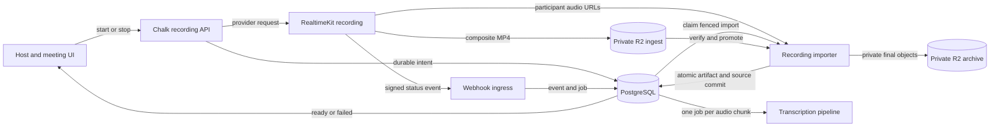

# Chalk Recording System

Status: Ready for implementation review

Owner: Hasan Shoaib

Refreshed: July 15, 2026

Companion: `scratchpad/chalk-recorder-system-guided-spec-2026-07-14.html`

## Decision

Chalk should launch recording on Cloudflare RealtimeKit's managed recording service, not finish the custom Pion capture and DigitalOcean GPU render fleets described in the July 11–14 recorder documents.

RealtimeKit now provides the two outputs Chalk needs: a 720p H.264/AAC composite recording and separate participant audio tracks. Chalk remains the product and lifecycle authority. It admits recording, starts and stops provider jobs, verifies signed provider events, imports durable artifacts, seeds transcription, exposes status, and handles failure. RealtimeKit owns media capture and composition.

This document is the source of truth for the launch path. It supersedes the custom capture/render architecture and cross-cutting recorder decisions in the July 11–14 infrastructure, pipeline, control-plane, capture-worker, render-worker, staging, and guided specs. Those documents remain implementation history. Their PostgreSQL fencing, object-integrity, privacy, observability, and transcription invariants survive where this document repeats them.

## Why this changed

The old design was reasonable when Chalk had to build server-side recording itself. It split live codec capture in Singapore from asynchronous GPU composition in Toronto, requiring a worker certificate authority, a reconciler, 21 compute nodes at launch ceiling, encrypted bundle exchange, a renderer, and five shared protocols.

That system is still only a foundation:

- PostgreSQL reservation, job, fence, and artifact primitives exist.
- Direct Cloudflare SFU helpers and deterministic capture/render fixtures exist.
- The capture and render commands deliberately refuse non-fixture operation.
- The recorder worker router is not mounted by the running API.
- Artifact commit does not update the public recording object used for download.
- Recorder finalization is not connected to the existing transcription dispatcher.
- No real-provider or staging qualification has passed.

Meanwhile RealtimeKit added managed composite recording, participant audio-track recording, direct cloud storage, signed status webhooks, and an explicit provider lifecycle. Completing the old fleets would now duplicate the provider, delay launch, and add more failure boundaries than the product needs.

## Product promise

When Chalk says **Recording**, the provider has entered its `RECORDING` state. The recording survives the host's browser closing or the host leaving. After the meeting stops, Chalk shows one honest processing state until a verified private MP4 is ready. A provider or import failure is visible and retryable where safe; Chalk never fabricates missing media or labels an unconfirmed request as recording.

The meeting can continue when recording is unavailable, but only after the host explicitly chooses **Continue without recording**. Chalk never silently downgrades a meeting that was expected to be recorded.

### User story

Maya schedules a customer interview with recording enabled. Five minutes before start, Chalk creates the meeting and recording intent. When Maya opens the room, Chalk asks RealtimeKit to start composite and participant-track recording. The lobby says **Preparing recording** until the signed provider state is `RECORDING`; only then does the red recording indicator appear and the room open normally.

Maya stops the recording after the interview. The room immediately says **Processing recording**. RealtimeKit uploads the composite MP4 directly to Chalk's dedicated private R2 ingest bucket and makes participant audio tracks available for import. A webhook advances the durable recording, an importer verifies every expected object, the finalizer commits the public recording and transcription source, and the recording page becomes playable. Transcript processing continues independently and cannot revoke a playable video.

If RealtimeKit cannot start within 120 seconds, Maya sees **Recording unavailable** with retry and **Continue without recording** actions. If upload or import later fails, the recording page says **Recording failed** with a stable support reference; it never spins forever.

## Current state and desired state

### Current

Chalk has two incomplete authorities. The public recording API lets callers write status and storage fields, while a separate recorder pipeline owns reservations and fenced jobs. A synthetic fixture can render an MP4, but no production process can claim a real capture or render assignment. The resulting pipeline can be `committed` without satisfying the public download route.

### Desired

One Chalk recording row owns the user-visible lifecycle. PostgreSQL owns every durable state transition. RealtimeKit identifiers and webhook deliveries are provider facts attached to that recording, never a second product authority. One durable finalization transaction makes the imported video downloadable and seeds the complete transcription source.

## Scope

### In scope

- scheduled and host-initiated recording for RealtimeKit meetings;
- a managed 1280×720 H.264/AAC MP4;
- separate WebM participant audio tracks for speaker-aware transcription;
- direct composite upload to a dedicated private Chalk R2 ingest bucket;
- import of participant tracks from provider-managed storage before their seven-day expiry;
- a single PostgreSQL lifecycle and public recording surface;
- signed, deduplicated webhooks with reconciliation polling;
- explicit start, processing, ready, and failure UX;
- private playback through short-lived Chalk download authority;
- bounded retention, cleanup, metrics, traces, audit events, and support references;
- staging qualification of the managed provider before production activation.

### Non-goals

- Chalk-operated Pion capture workers;
- DigitalOcean capture or GPU render fleets;
- Chromium or client-side recording;
- live streaming, RTMP, HLS, editing, clips, or alternate layouts;
- video tracks per participant;
- acoustic diarization or inferring identity from a voice;
- transparent failover between managed and custom recorders;
- production activation, pricing, or entitlement changes in this implementation;
- deleting the old recorder foundation before the managed path is qualified.

## Launch policy

| Policy | Launch behavior |
| --- | --- |
| Recorded rooms | At most 20 concurrently until provider and importer load tests justify a higher limit. |
| Participants | At most 10 in one recorded room and 100 across recorded rooms. An over-limit room may continue only after explicit confirmation that it is unrecorded. |
| Duration | At most 120 minutes. Warn at 110 and 118 minutes; stop recording at 120 while the meeting may continue. |
| Start deadline | Wait at most 120 seconds for provider state `RECORDING`. Before that state, the UI says **Preparing recording**, not **Recording**. |
| Processing target | A playable video is ready within 30 minutes after stop at p95. A miss breaches the release SLO but remains processing until the recovery deadline. |
| Recovery deadline | Retry reconciliation and import for 24 hours, then terminally fail with a support reference. |
| Brief recordings | Treat recordings shorter than five seconds as unsupported and show a bounded failure reason. |
| Empty room | Accept the provider's empty-room stop behavior and surface the resulting transition honestly. |

These are product limits, not claims about RealtimeKit's maximum capacity. They let Chalk qualify a bounded launch and raise ceilings from evidence.

## System boundaries

### Ownership

| Fact | Authority | Notes |
| --- | --- | --- |
| User-visible recording state | PostgreSQL | Only Chalk transitions the product lifecycle. |
| Provider recording state and identifiers | RealtimeKit, recorded by Chalk | Provider facts are append-only inputs to Chalk decisions. |
| Composite bytes before finalization | Dedicated R2 ingest bucket | RealtimeKit may read, write, and list only this bucket. It has no access to canonical storage. |
| Canonical video and participant audio | Chalk private R2 archive | Only Chalk services can promote, read, or delete these objects. |
| Recording metadata and downloadability | PostgreSQL | Finalization updates the public recording and artifact in one transaction. |
| Transcript source and chunk jobs | PostgreSQL | Seeded atomically with the recording artifact; processed independently afterward. |
| Meeting media capture and composition | RealtimeKit | Chalk does not proxy or reconstruct media in the launch path. |

## Lifecycle

The public lifecycle is intentionally small:

1. `requested` — Chalk has durable intent but has not asked the provider.
2. `starting` — RealtimeKit accepted the request; the meeting UI says **Preparing recording**.
3. `recording` — a signed event or authoritative fetch reports provider state `RECORDING`.
4. `processing` — stop was requested or provider state is `UPLOADING`/`UPLOADED`; imports may still be running.
5. `ready` — the verified MP4 and complete transcription source committed atomically.
6. `failed` — start, provider, upload, or import exhausted its recovery policy.
7. `cancelled` — intent was cancelled before recording started.

Provider states map as follows:

| RealtimeKit | Chalk | Rule |
| --- | --- | --- |
| `INVOKED` | `starting` | Never show the red indicator. |
| `RECORDING` | `recording` | First state that earns the recording claim. |
| `UPLOADING` | `processing` | Keep the artifact unavailable. |
| `UPLOADED` | `processing` | Enqueue or wake import; do not mark ready yet. |
| `ERRORED` | `failed` | Preserve a stable bounded failure code and provider reference. |

Transitions are monotonic except an idempotent replay of the current state. Late events cannot move `ready`, `failed`, or `cancelled` backward. Provider events never directly write public status; the recording service evaluates them under a row lock.

## Start and stop contract

The Chalk API, not the browser SDK, starts and stops recording. That keeps credentials, storage configuration, lifecycle decisions, and idempotency on the server.

Start creates or reuses one durable recording intent, sends an idempotent provider request, stores the returned composite and track recording identifiers, and polls if no webhook confirms state. A retry returns the existing intent; it cannot start a second recorder for the same meeting.

Composite recording uses the provider's default H.264 output: 1280×720 MP4 with AAC audio. The start request selects the dedicated R2 ingest bucket and disables the provider-managed composite copy. Track recording captures all consented participant audio as separate WebM files. The importer maps each provider `user_id` to Chalk's authenticated meeting member; unknown identities remain explicitly unknown.

Stop is also idempotent. Chalk asks both provider recordings to stop, records the first accepted stop time, and advances to `processing`. Provider auto-stop, an empty meeting, and a host stop converge on the same state machine.

## Webhook and reconciliation contract

Webhook ingress reads the raw request body, verifies the provider's RSA-SHA256 signature, validates event shape and app identity, and inserts the event keyed by RealtimeKit's unique webhook UUID. A duplicate returns success without a second transition or job.

Ingress performs no object download or transcription work. It commits the event and a durable processing job, then returns `2xx` quickly. Invalid signatures return a non-success response and emit a security event without logging the body.

Webhooks are hints, not the sole recovery mechanism. A reconciler fetches authoritative provider state for recordings stuck in `starting` or `processing`, uses bounded exponential backoff with jitter, and stops after the 24-hour recovery deadline. This covers dropped, delayed, duplicated, and reordered events.

## Storage and finalization

RealtimeKit receives one R2 S3 credential scoped to a dedicated ingest bucket. Cloudflare R2 currently offers bucket-scoped **Object Read & Write**, which also allows listing; it does not offer a write-only S3 token. Isolation therefore comes from a separate bucket, an unguessable per-recording prefix, no canonical objects in that bucket, secret rotation, and audit alerts. Chalk does not send storage credentials in each recording request; operations configure them once in the provider dashboard.

The composite copy in RealtimeKit's managed bucket is disabled only after the external ingest configuration passes a real upload test. If both destinations are disabled or invalid, the provider considers the recording invalid.

Participant track recording currently lands in RealtimeKit-managed R2 and expires after seven days. Chalk imports tracks immediately after `UPLOADED`, verifies file count and duration against provider metadata, and stores them privately. The privacy notice and data inventory must name that temporary provider copy. Launch is blocked if legal or product policy cannot accept that seven-day provider retention.

The importer acts under one leased PostgreSQL job with attempt, owner, lease token, and fencing generation. It:

1. fetches authoritative recording details;
2. checks that composite and track provider IDs belong to the expected meeting;
3. verifies content type, byte size, checksums when supplied, media codecs, duration, and the expected participant-track set;
4. copies accepted objects to server-selected canonical keys using conditional create;
5. writes an immutable import manifest without credentials or signed URLs;
6. atomically commits the public recording, canonical artifact, transcription source, chunks, and one transcription job per chunk; and
7. schedules ingest cleanup.

The transaction is idempotent. The same verified inputs produce the same object and database identities; a stale fenced attempt cannot commit. Transcription failure after finalization changes transcript status only and never revokes a playable recording.

## Failure behavior

| Failure | User experience | System behavior |
| --- | --- | --- |
| Provider does not reach `RECORDING` within 120 seconds | **Recording unavailable**; retry or continue unrecorded | Stop any invoked recorder, close the attempt, preserve the meeting. |
| Provider errors while recording | Indicator changes to **Recording interrupted** | Fetch authoritative state, stop companion track recording, import any valid available output, otherwise fail. No hidden custom fallback. |
| Webhook is missing or duplicated | No visible churn | Reconciliation fetches state; UUID deduplication makes replay harmless. |
| Composite upload is delayed | **Processing recording** | Retry authoritative fetch and object verification until the recovery deadline. |
| Participant track is missing | Video may become ready; transcript says **Unavailable** | Commit video only if the finalization schema records a terminal incomplete transcript source. Never invent speaker audio. |
| Importer dies | No duplicate recording | Lease expires, a fenced attempt retries, conditional writes and the final transaction remain idempotent. |
| Verification finds wrong meeting, codec, or object | **Recording failed** with support reference | Quarantine the ingest prefix, emit a security/quality event, never publish it. |
| 30-minute target is missed | **Still processing** | Page the recorder SLO; continue bounded recovery. The target miss is not itself terminal. |
| 24-hour recovery deadline is missed | **Recording failed** | Terminalize once, retain evidence, and run policy-bound cleanup. |

## Security, privacy, and retention

- Recording requires the existing meeting consent and privilege model. Every participant sees the active recording indicator.
- RealtimeKit API credentials, webhook verification material, and R2 credentials remain server-side secrets.
- Provider storage access is bucket-scoped and separated from canonical storage. Rotate it on provider compromise, staff departure, and the normal secret schedule.
- Signed URLs, raw provider bodies, participant display names, media, and secrets never enter logs, traces, support references, or webhook error responses.
- Canonical objects are private and served only through short-lived tenant-authorized download URLs.
- Ingest objects delete after successful promotion, with a 24-hour lifecycle backstop. Quarantined failures follow the incident retention policy.
- Participant track URLs expire at the provider after seven days. Chalk must not rely on that expiry as its cleanup mechanism.
- Deletion of a Chalk recording removes the canonical video, participant audio, transcript artifacts, import manifest, and provider identifiers according to product retention policy.
- Audit events cover start, stop, consent/privilege result, provider transition, import, publish, download-authority creation, failure, retry, and deletion.

## Observability

One journey ID follows the meeting, Chalk recording, composite provider recording, track provider recording, webhook events, import job, artifact, and transcript source. Provider IDs are safe only as bounded structured fields; media URLs and payloads are not.

Required signals:

- counts and latency for start requests and time to `recording`;
- provider states, webhook verification failures, duplicates, and event lag;
- processing age, import attempts, bytes, verification failures, and cleanup age;
- ready latency from stop at p50, p95, and p99;
- terminal failures by bounded stage and code;
- participant track completeness and transcript-source completeness;
- recordings stuck beyond 10, 30, and 1,440 minutes;
- ingest bucket object age and canonical promotion mismatch;
- synthetic scheduled and host-initiated recording canaries in staging.

Alerts must point to a runbook and a bounded support reference. A dashboard without an operator action is not an acceptance signal.

## Implementation plan

The work is intentionally sequential at the contracts and parallel after them.

### Phase 0 — replace the authority

- [ ] Make one recording service the only writer of status, storage, and provider fields.
- [ ] Remove caller-selected status/storage mutations from the public API or translate them through the new service during a bounded migration.
- [ ] Define the public lifecycle, provider event, import manifest, and finalization schemas.
- [ ] Add migrations for provider IDs, event deduplication, import attempts, failure codes, and processing deadlines.
- [ ] Preserve existing PostgreSQL lease/fence primitives for import and reconciliation jobs.

Gate: a database integration test proves idempotent start, ordered and reordered provider events, stale-fence rejection, one final artifact, and a downloadable public recording.

### Phase 1 — provider and storage seam

- [ ] Implement server-side composite and track start/stop/fetch clients.
- [ ] Configure a dedicated staging ingest bucket and scoped credential; disable the managed composite copy only after an upload proof.
- [ ] Implement raw-body webhook verification, UUID deduplication, fast acknowledgement, and durable dispatch.
- [ ] Implement reconciliation for missing and delayed events.
- [ ] Implement fenced import, media verification, canonical promotion, atomic artifact/transcription finalization, and cleanup.

Gate: one real staging meeting produces a verified private MP4 and participant audio set, becomes downloadable through Chalk, and seeds the existing transcription dispatcher exactly once.

### Phase 2 — product experience and operations

- [ ] Implement preparing, recording, interrupted, processing, ready, and failed surfaces.
- [ ] Enforce privilege, consent, limits, duration warnings, explicit unrecorded continuation, and retry behavior.
- [ ] Add metrics, traces, audit events, dashboards, alerts, canaries, and runbooks.
- [ ] Exercise missing, duplicate, and reordered webhooks; provider errors; delayed uploads; missing tracks; dead importer; quarantine; and cleanup.
- [ ] Qualify 20 concurrent rooms, 100 participants, and ending-together imports against the 30-minute target.

Gate: the immutable staging release passes the acceptance checklist, cleans all test media, and returns provider and Chalk resources to dormant state. Production remains separately authorized.

### Dormant fallback

- [ ] Keep the custom capture/render foundation unmounted and mutation-disabled.
- [ ] Record qualification evidence before deleting or reviving it.
- [ ] Reconsider a custom recorder only if managed recording fails a documented product requirement that Cloudflare cannot address.

## Acceptance

The recorder is done for staging when all of the following are observed on one immutable release:

- [ ] A scheduled recording and an in-meeting start both reach `recording` only after authoritative provider confirmation.
- [ ] Closing the host browser and the host leaving do not stop the recording.
- [ ] Stop leads to a verified 1280×720 H.264/AAC MP4 downloadable through the existing tenant-authorized Chalk route.
- [ ] Consented participant tracks map to authenticated members or explicit unknown identities and seed transcription exactly once.
- [ ] Duplicate and reordered webhook events cannot duplicate work or regress state.
- [ ] A dropped webhook is recovered by reconciliation.
- [ ] A killed importer retries under a new fence without publishing duplicate objects or rows.
- [ ] A wrong-meeting or invalid-media object is quarantined and never becomes downloadable.
- [ ] The UI never says **Recording** during `requested`, `starting`, `processing`, or `failed`.
- [ ] Over-limit and start-timeout flows require explicit confirmation before an unrecorded meeting continues.
- [ ] Twenty concurrent recorded rooms and 100 total participants stay within the start and processing SLOs.
- [ ] Ending-together recordings meet the 30-minute p95 ready target.
- [ ] Successful imports clear ingest objects; the lifecycle backstop clears abandoned objects; no signed URL or secret appears in telemetry.
- [ ] The provider's Beta status, seven-day participant-track copy, GA price model, and rollback trigger are documented for launch approval.
- [ ] Production credentials and production activation remain untouched until separately approved.

## Open decision

One launch decision remains product/legal rather than engineering: whether temporary participant audio in RealtimeKit-managed storage for up to seven days is acceptable. The recommended default is **yes for the bounded Beta**, provided it appears in the data inventory and privacy review and the importer copies tracks immediately. If the answer is no, launch composite video first without speaker-aware transcription; do not rebuild custom capture merely to hide the provider-retention decision.

## Glossary

- **Canonical object** — the private Chalk-owned media object that the public recording references after verification.
- **Composite recording** — one provider-rendered video containing the meeting layout and mixed audio.
- **Fencing generation** — a monotonic attempt number that prevents an expired worker from committing after replacement.
- **Import manifest** — immutable metadata describing provider inputs, verification results, and canonical outputs without embedding credentials or signed URLs.
- **Participant track** — one participant's audio-only WebM recording, identified by provider and authenticated Chalk membership facts.
- **Provider fact** — a signed event or authoritative API response recorded as input, not a direct product-state mutation.
- **Recovery deadline** — the maximum time Chalk retries reconciliation and import before terminal failure.

## References

- [Cloudflare RealtimeKit recording overview](https://developers.cloudflare.com/realtime/realtimekit/recording-guide/)
- [Start recording](https://developers.cloudflare.com/realtime/realtimekit/recording-guide/start-recording/)
- [Monitor recording status](https://developers.cloudflare.com/realtime/realtimekit/recording-guide/monitor-status/)
- [Participant track recording](https://developers.cloudflare.com/realtime/realtimekit/recording-guide/track-recording/)
- [Upload recording to private cloud storage](https://developers.cloudflare.com/realtime/realtimekit/recording-guide/custom-cloud-storage/)
- [Disable the provider-managed composite copy](https://developers.cloudflare.com/realtime/realtimekit/recording-guide/configure-realtimekit-bucket-config/)
- [RealtimeKit webhooks](https://developers.cloudflare.com/realtime/realtimekit/webhooks/)
- [RealtimeKit pricing and Beta status](https://developers.cloudflare.com/realtime/realtimekit/pricing/)
- [Cloudflare R2 API-token permissions](https://developers.cloudflare.com/r2/api/tokens/)
