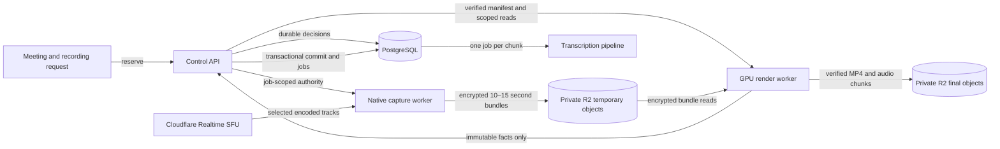
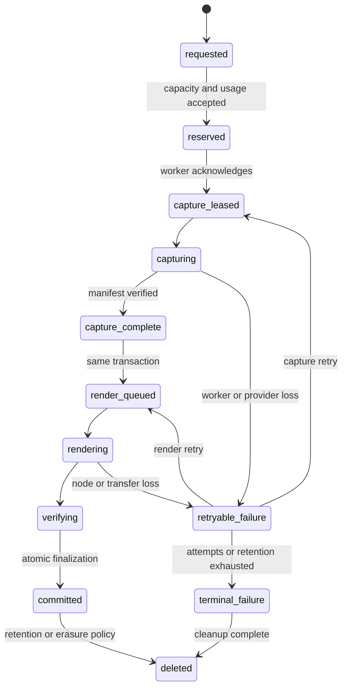
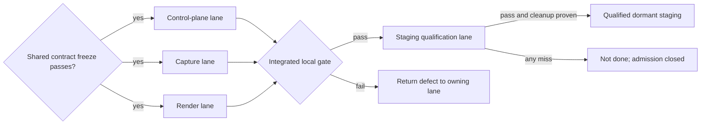

# Chalk Recorder System Guided Spec

Status: Draft orientation and shared-contract decision spec.

Owner: Hasan Shoaib

HTML companion: `scratchpad/chalk-recorder-system-guided-spec-2026-07-14.html`

Binding sources:

- `scratchpad/chalk-infrastructure-readiness-spec-2026-07-11.md`
- `scratchpad/chalk-recorder-pipeline-spec-2026-07-12.md`
- `scratchpad/chalk-recorder-control-plane-spec-2026-07-13.md`
- `scratchpad/chalk-recorder-cloudflare-capture-worker-spec-2026-07-13.md`
- `scratchpad/chalk-recorder-render-finalization-worker-spec-2026-07-13.md`
- `scratchpad/chalk-recorder-staging-qualification-spec-2026-07-13.md`
- `scratchpad/chalk-transcription-spec-2026-07-12.md`

## Purpose, authority, and how to use this spec

This spec is the zero-context map of Chalk recording. It explains the product promise, the systems involved, the recording journey, the five contracts every implementation lane shares, the important failure behavior, the launch ceilings, the work split, and the decisions Hasan must eventually ratify. The HTML companion is the primary reading surface; this Markdown file is the precise source an executor cites.

This document does not replace or weaken its binding sources. When it summarizes a settled rule, the underlying specification remains authoritative. When it recommends a decision that is still open in a companion, the recommendation remains proposed until Hasan ratifies it and the open question is rewritten in place in every affected spec.

This document is an orientation and contract-freeze aid, not permission for one agent to implement the entire recorder. Each implementation lane receives all recorder specs as context and only its named companion as execution authority.

## Grand summary

Chalk recording is a split pipeline. A control plane decides whether recording is safe and affordable, a native capture worker receives selected media from Cloudflare and stores short encrypted bundles, a graphics worker later turns those bundles into the final video and transcription inputs, and a qualification lane proves the integrated release under real load.

PostgreSQL owns every durable decision. Workers receive short-lived authority for one fenced attempt and never receive reusable database, storage, encryption, or infrastructure credentials. The architecture is coherent, but implementation delegation remains blocked until the shared job, identity, storage, event, and finalization contracts are frozen and their open policy choices are ratified.

## Background: what problem this system solves

A meeting recording must survive browser closure, device sleep, weak participant networks, host departure, worker failure, and delayed rendering. Client-side recording cannot provide that guarantee, and a browser-based server recorder would make twenty simultaneous rooms expensive and operationally heavy.

Chalk therefore separates live capture from later composition. Live capture saves only the encoded media and decisions needed to reproduce the accepted stage view. Rendering happens after the meeting on a burstable GPU pool. This keeps live workers small, lets rendering scale to zero, preserves committed capture work across crashes, and makes the final result reproducible.

The system is intentionally bounded for launch: at most twenty simultaneous recorded meetings, one hundred participants globally, ten participants in one recorded room, and one hundred twenty minutes per recording.

The HTML companion places two image-generated overview plates beside the precise diagrams. They are also available directly as the [architecture overview](assets/recorder-pipeline-debrief/architecture.png) and [reservation and job lifecycle](assets/recorder-pipeline-debrief/lifecycle.png).

## The user-visible promise

For a person using Chalk, recording behaves as follows:

1. **Recording is accepted before the meeting relies on it.** A scheduled recording reserves capacity ahead of time. An unscheduled recorded meeting waits for a capture worker for at most 120 seconds; it never begins under a false promise that missing opening minutes were recorded.
2. **The meeting shows a deterministic stage.** Screen share wins the primary stage. Otherwise the active speaker is primary, with a stable strip of at most six other participants. The recording preserves the decisions that produced that view.
3. **The meeting warns before the limit.** Chalk warns ten minutes and two minutes before the accepted duration ends. At the limit, recording stops visibly while the meeting may continue unrecorded.
4. **The recording survives bounded failures.** A dead capture worker loses only the uncommitted interval. Chalk fences it, starts a replacement, preserves committed bundles, and records the real gap instead of inventing media.
5. **The final video arrives on a deadline.** The accepted output is a 720p30 H.264/AAC MP4. It must be committed within thirty minutes after capture ends, with a separate transcript lifecycle that cannot damage the recording if transcription fails.

## System map

The control plane is the authority boundary. Cloudflare transports live media, R2 stores bytes, DigitalOcean runs workers, and the workers report facts. None of those systems may independently decide that a recording, artifact, job, or billable result exists.

## The recording journey

### 1. Admission and reservation

The control plane checks meeting count, participant count, input bitrate, requested duration, capture capacity, render deadline capacity, tenant entitlement, and the funded usage guard in one atomic reservation decision. An accepted reservation creates the recording intent and first capture job in the same PostgreSQL transaction.

Scheduled work prewarms five minutes before start and must be ready two minutes before. Unscheduled work holds meeting opening until capture acknowledges the lease. A no-show releases capacity ten minutes after the scheduled start when no capture lease was acknowledged.

### 2. Worker identity and claim

A new worker exchanges a five-minute, one-time bootstrap assertion for a short-lived node certificate. The assertion binds the environment, role, release, intended machine, region, boot generation, and nonce. The control plane consumes the nonce once and records certificate issuance and revocation.

The authenticated worker claims one PostgreSQL job. Claim commits the lease, attempt, fence, and owner before the API returns the assignment. A copied, late, or replaced worker cannot mutate the current attempt because every write compares the job, attempt, fencing generation, worker identity, and lease token.

### 3. Native selective capture

The capture worker uses Pion as its WebRTC client and joins Chalk's direct Cloudflare Realtime SFU path. The control plane keeps the Cloudflare application secret and proxies the bounded session, track, and renegotiation operations authorized for that assignment.

The worker receives audible Opus tracks, the current screen share, the active speaker layer, and low layers for a strip of at most six participants. It records track ownership, layout decisions, media-clock mapping, mute and presence changes, speaker activity, overlap, keyframes, discontinuities, and gaps on one monotonic timeline.

Every ten to fifteen seconds it closes one independently verifiable bundle containing codec-native fragments and the corresponding timeline slice. The bundle is encrypted with the per-recording data key and uploaded through the exact conditional-create object intent selected by the control plane.

### 4. Capture completion and render scheduling

Capture completion verifies the ordered manifest and creates exactly one render job in the same transaction. The render scheduler uses earliest-deadline discrete packing. It never assumes that dividing total output hours by aggregate GPU throughput proves that every individual job can meet its deadline.

### 5. Deterministic GPU rendering

The render worker receives the complete manifest, scoped input reads, recording-key authority, one final-output intent, transcription-output intents, the pinned timeline and policy versions, and the artifact deadline. It verifies every immutable input fact before decrypting any media.

The renderer replays the recorded layout decisions. It does not recalculate the active speaker, participant names, screen-share winner, strip order, or track identity from current state. Explicit gaps remain visible. The same release and input must reproduce the same layout decisions, speaker-turn manifest, chunk boundaries, and normalized media facts.

### 6. Atomic finalization

After producing and verifying the MP4, speaker-turn manifest, and transcription chunks, the worker reports immutable facts to one private finalization operation. The control plane then performs one database transaction that:

1. commits the final recording artifact exactly once;
2. inserts the complete transcription source and chunk set;
3. creates exactly one fenced transcription job per chunk; and
4. records the render attempt's terminal result.

The transaction either completes all four effects or none. A playable video cannot become committed without its complete transcription handoff, and a retry cannot create duplicate artifact or chunk jobs.

### 7. Cleanup and evidence

Normal finalization deletes capture bundles and wrapped recording-key material within one hour. Transcription chunks delete within one hour after the normalized transcript commits. A twenty-four-hour storage lifecycle is the orphan backstop, while reconciliation forces commit or terminal render failure by hour twenty-three.

Every phase propagates Chalk's journey identifier and W3C trace context. Success, rejection, retry, timeout, fencing, cleanup, and terminal failure appear in bounded metrics, structured logs, traces, health, and the durable evidence ledger without exposing media, plaintext keys, tokens, display names, or full object URLs.

## The five shared contracts

These contracts must be frozen before the four implementation lanes can work independently.

### Contract 1: node identity

The control plane owns bootstrap, certificate issuance, certificate revocation, role, release, and live provider-inventory verification. A worker derives its environment, role, and worker ID from the verified client certificate; request bodies cannot select them.

The certificate proves the node. It does not grant unlimited recorder access. A narrower job lease proves which one attempt the process may execute.

### Contract 2: immutable job assignment

Every assignment carries one protocol version and enough information to finish without guessing:

- job, tenant, session, recording, attempt, fence, lease, role, release, journey, and trace identity;
- capture session authority or render manifest authority;
- participant, track, timeline, layout, media, codec, and resource policy versions;
- scoped object operations and encryption-key authority;
- deadlines, renewal boundaries, expected outputs, cleanup, and reporting requirements.

Renewal may extend time and replenish future object intents. It cannot change job identity, attempt, fence, participant ownership, layout policy, or already committed objects.

### Contract 3: server-owned storage and key authority

The control plane chooses every tenant, owner, object key, method, content type, byte ceiling, write condition, sequence, and expiry before the worker acts. The worker receives one-operation URLs and the minimum plaintext recording-key authority required for that attempt; it never receives reusable R2 or KMS credentials.

Workers upload bytes, inspect them, and report immutable facts. Only the control plane may accept those facts into PostgreSQL and authorize the final artifact.

### Contract 4: progress, fencing, and failure

The proposed default heartbeat is every fifteen seconds. Three missed heartbeats plus bounded jitter make the attempt lost after roughly forty-five seconds. The control plane fences the old attempt before replacement, so two workers cannot both be current.

Progress reports are descriptive. They cannot extend a deadline, increase authority, select a new key, rewrite a prior fact, or keep an expired lease alive. Failures use stable bounded codes; raw provider and tool output never enters the wire contract or logs.

### Contract 5: transactional finalization

Finalization accepts verified artifact, source-manifest, chunk, and terminal facts against server-owned intents. PostgreSQL commits the artifact, complete source set, one job per chunk, and terminal render outcome atomically. Partial source seeding, duplicate jobs, caller-selected ownership, and stale attempts are rejected.

## Data ownership

| Fact                                                         | Authoritative owner                              | Why                                                                                              |
| ------------------------------------------------------------ | ------------------------------------------------ | ------------------------------------------------------------------------------------------------ |
| Reservation, recording state, jobs, leases, attempts, fences | PostgreSQL                                       | Recovery and billing cannot depend on a worker still being alive.                                |
| Node certificate, bootstrap nonce, revocation                | PostgreSQL plus the certificate issuer           | A replaced machine must stop claiming work before a successor starts.                            |
| Participant-to-SFU session and track map                     | Chalk control plane                              | Media identity must come from authenticated application state, never a voice or untrusted label. |
| Object keys, checksums, sizes, owners, conditions            | PostgreSQL                                       | A worker may report bytes but cannot choose tenant ownership or overwrite policy.                |
| Encrypted media and final artifact bytes                     | Private R2                                       | Large bytes belong in object storage, while PostgreSQL stores their immutable facts.             |
| Live media transport                                         | Cloudflare Realtime SFU                          | Cloudflare moves packets but does not own Chalk recording state.                                 |
| Desired and observed worker fleet                            | Control-plane reconciler plus provider inventory | Worker self-report is evidence, not permission to open admission.                                |
| Qualification verdict and evidence                           | Staging evidence ledger                          | Launch claims require observed provider proof tied to one immutable release.                     |

## State and failure model

Failure is expected behavior, not an undefined exception:

| Failure                                 | Active work                                              | New admission                                        | Recovery and visible result                                                                   |
| --------------------------------------- | -------------------------------------------------------- | ---------------------------------------------------- | --------------------------------------------------------------------------------------------- |
| Capture process dies                    | Committed bundles survive.                               | Closes if capacity or health is no longer qualified. | Fence old attempt, replace, request keyframes, record the real gap.                           |
| Control API disappears after renewal    | Existing capture uses only its issued autonomy envelope. | Closed.                                              | Reconcile on return; stop capture when authority expires.                                     |
| Cloudflare join or required audio fails | Attempt stops without claiming success.                  | Closed for the affected capacity or provider state.  | Retry within policy or fail visibly with a bounded provider code.                             |
| Render node dies                        | Encrypted inputs survive.                                | Closes if the deadline schedule becomes unsafe.      | New fenced attempt re-verifies input and writes to new conditional intents.                   |
| Old worker reports late                 | No current work changes.                                 | Unaffected.                                          | Reject the stale attempt and retain its bounded audit fact.                                   |
| Object already exists                   | Never overwrite it.                                      | Depends on reconciliation.                           | Inspect immutable facts; accept an exact idempotent match or reject a conflict.               |
| Cleanup misses one hour                 | Final artifact remains available.                        | May close when safety evidence becomes stale.        | Alert, reconcile, and rely on the twenty-four-hour orphan backstop.                           |
| Provider quota is insufficient          | Existing assigned work is preserved.                     | Closed.                                              | Scale no further and report capacity unavailable instead of substituting an unqualified path. |

## Security boundary

Workers are disposable and deliberately weak in authority:

- they cannot connect to PostgreSQL;
- they never receive DigitalOcean control tokens, KMS credentials, reusable R2 credentials, or the Cloudflare application secret;
- they receive short-lived mTLS identity, one fenced lease, scoped object operations, and bounded key authority;
- they cannot choose tenant, recording, participant ownership, object key, final artifact identity, or lifecycle state;
- they store no persistent plaintext media, and crash dumps, images, snapshots, scratch, logs, and telemetry may not contain media or key material;
- capture encrypts before media leaves Singapore, and render decrypts only inside the bounded TOR1 job.

## Launch ceilings and deadlines

| Constraint                        |                                              Launch value | Consequence of a miss                                                                                              |
| --------------------------------- | --------------------------------------------------------: | ------------------------------------------------------------------------------------------------------------------ |
| Simultaneous recorded meetings    |                                                        20 | Recording admission closes above the ceiling.                                                                      |
| Global recorded participants      |                                                       100 | Admission rejects or removes recording according to the ratified product policy.                                   |
| Participants in one recorded room |                                                        10 | The room may continue, but launch recording is unavailable.                                                        |
| Recording duration                |                                               120 minutes | Capture stops visibly at the accepted limit.                                                                       |
| Input budget                      |                 3 Mbps target, 4 Mbps maximum per meeting | Thumbnail quality degrades before screen-share legibility; an unqualified track shape cannot expand without bound. |
| Capture fleet                     |               11 nodes maximum, including one ready spare | A lower quota blocks launch qualification.                                                                         |
| Render fleet                      |                                      10 GPU nodes maximum | Admission closes before the discrete schedule would miss a deadline.                                               |
| Global recorder compute           |                                          21 nodes maximum | Provider actions clamp at the hard ceiling.                                                                        |
| Final artifact deadline           |                             30 minutes after capture ends | The miss remains visible and blocks qualification.                                                                 |
| Render performance                | At least 15× media speed; no two-hour job over 10 minutes | A slower release fails the twenty-job ending-together proof.                                                       |
| Normal temporary-media deletion   |                                             Within 1 hour | Reconciliation and alerts activate.                                                                                |
| Orphan storage backstop           |                                                  24 hours | By hour 23 the system must commit or terminally fail and schedule deletion.                                        |

## Current implementation state

The repository already contains a useful foundation:

- PostgreSQL recording jobs, lease and fencing queries, immutable bundle and artifact facts, and recorder health projections;
- mTLS identity verification primitives and a recorder worker route foundation;
- versioned Go protocol types, bundle encryption/validation, layout, track, render-plan, and fixture-worker helpers;
- direct Cloudflare SFU room, session, track, and renegotiation proof in the API and TypeScript client;
- fixture capture and render commands plus local health and trace coverage.

The foundation is not the production recorder. The private bootstrap listener, certificate issuer and revocation path, complete assignment envelope, server-owned object intents, authority renewal, transactional render finalization, native Pion capture loop, production GPU executor, fleet reconciler, and real staging proof remain incomplete.

Fixture output and unit tests cannot satisfy the real-media, GPU, provider, failure-recovery, cleanup, cost, or staging gates.

## Proposed shared-contract defaults

These recommendations give the implementation lanes one coherent starting point. They remain proposals until Hasan ratifies them after the HTML walkthrough.

1. **Reserve maximum recording minutes for tenant usage.** Participant count, bytes, and GPU time remain separate capacity and operational meters. This keeps admission understandable while preserving the measurements needed for later billing changes.
2. **Translate legacy recording mutations into the reservation service, then deprecate them.** Existing clients keep working, while PostgreSQL retains one recording authority instead of two competing state machines.
3. **Issue certificates through a dedicated recorder intermediate CA with a KMS-backed signing key.** The control API verifies bootstrap and requests signing; PostgreSQL owns nonce consumption, issued identity, last use, and revocation. Static image certificates are prohibited.
4. **Use a fifteen-second heartbeat and fence after three misses plus jitter.** This detects dead workers quickly enough for capture recovery without treating a brief network wobble as node loss.
5. **Publish both private OpenAPI and JSON Schema artifacts from the Go source types.** OpenAPI explains routes and errors; standalone JSON Schemas give capture and render lanes stable payload fixtures and validation.
6. **Let the media-publication control-plane domain own participant-to-SFU mapping.** It already owns authenticated publication facts, so the recorder consumes one authoritative participant, session, track, class, and epoch catalog.
7. **Use GStreamer for the timeline-driven GPU graph and FFmpeg/ffprobe for final verification.** GStreamer handles dynamic composition and NVIDIA elements; independent verification prevents the compositor from grading its own output.
8. **Bundle Inter plus Noto Sans as the immutable label fonts.** Inter matches Chalk's shared UI, while Noto Sans supplies deterministic fallback coverage. System fonts are not accepted because images and hosts may render them differently.

Capture and render memory, GPU-memory, and scratch ceilings are measured decisions. The implementation lanes must first run production-shaped fixtures, publish peak and sustained use with headroom, and then ratify ceilings before density or GPU qualification. Hasan should approve the visible headroom and cost consequence, not guess byte limits without evidence.

## Four implementation lanes

All lanes read this guide, the umbrella, and all four companions. Execution authority stays narrow.

### Lane 1: control plane

Owns the control-plane companion and shared schemas. It implements bootstrap, certificate lifecycle, private listener, job assignments, leases, object/key authority, finalization, admission, reconciliation, cleanup, and health. It is the only lane allowed to change shared worker contracts after freeze.

Primary phases: C0–C6.

### Lane 2: capture worker

Owns the capture companion. It implements Pion join, selective subscriptions, timeline, authenticated track epochs, encrypted bundles, renewal, replacement, resource proof, and the real Cloudflare staging handoff. It consumes shared contracts and does not edit their meaning.

Primary phases: K0–K6.

### Lane 3: render and finalization worker

Owns the render companion. It implements verified input reconstruction, deterministic composition, the GPU path, artifact and transcription outputs, deadline recovery, and real performance proof. It consumes the capture manifest and shared finalization contract.

Primary phases: R0–R6.

### Lane 4: staging qualification

Owns the qualification companion after the other three lanes merge. It confirms exact staging targets and spend, deploys the immutable release, runs provider, security, single-recording, capture-ceiling, render-ceiling, failure, cleanup, observability, and cost gates, then returns staging to zero compute.

Primary phases: Q0–Q6. It changes no shared contract to make a failed workload pass.

## Orchestration and worktrees

The shared-contract owner creates one immutable baseline commit. Control, capture, and render use separate worktrees and branches from that baseline; no two writing agents share a worktree. The integration owner merges and verifies those lanes before qualification begins. The qualification lane runs from the integrated immutable release, not from an individual worker branch.

Every agent prompt includes all recorder specs as context, one owned companion, explicit phases and paths, the exact base commit, exclusions, verification commands, and the rule that open questions cannot be invented away. Subagents may research or inspect, but the top-level lane owner writes and verifies its own code.

## Guided phase checklist

- [ ] **G0 — Understand and ratify:** Hasan reviews the HTML mini world and diagrams, accepts or changes each proposed shared default, and the affected companion specs are rewritten in place with no contradictory open question.
- [ ] **G1 — Freeze and prove shared contracts:** C0, K0, K1, and R0 pass; versioned schemas, golden fixtures, private route shapes, Cloudflare provider proof, assignment envelopes, object intents, and finalization transaction tests are committed in one baseline.
- [ ] **G2 — Implement local lanes:** C1–C5, K2–K5, and R1–R5 pass in their owned worktrees with focused failure, security, cleanup, observability, and trace evidence.
- [ ] **G3 — Integrate locally:** C6 passes one clean reservation-to-transcription topology with restart, node loss, stale fence, duplicate report, cleanup, and database-backed recovery.
- [ ] **G4 — Qualify staging:** K6, R6, and Q0–Q5 pass against exact approved provider bindings, release digests, quotas, spend, and workload ceilings.
- [ ] **G5 — Close safely:** Q6 records the binary verdict, deletes temporary media, revokes or rotates staging authority, proves zero recorder compute, and leaves staging dormant.

## Acceptance criteria for this guided spec

This guided spec pair is complete when:

- the Markdown and HTML describe the same system, limits, proposals, lanes, and stopping point;
- the HTML opens with zero-context background, defines unfamiliar terms on every occurrence, and leads with diagrams rather than prose;
- the mini world faithfully models normal recording, launch-limit rejection, capture loss, control-plane loss, render loss, stale attempts, deadlines, and cleanup outcomes;
- architecture, workflow, data ownership, state, failure, scope, phases, orchestration, glossary, progress, and open decisions are visually represented;
- every Mermaid diagram parses, every local document link resolves, the mini world works by keyboard and pointer, and light and dark themes remain readable;
- the companion specs remain the only implementation authorities, and this document does not authorize staging or production mutation.

The recorder implementation itself is not done when this documentation pair is complete. System completion still requires G0–G5 and the full C, K, R, and Q evidence.

## Scope and stopping point

In scope:

- understanding the launch recorder from admission through final artifact and transcript handoff;
- freezing the five shared contracts and their ownership;
- explaining user-visible behavior, failure recovery, security, ceilings, current implementation, delegation, and proof;
- making the remaining decisions understandable before Hasan is asked to ratify them.

Out of scope:

- production mutation or enablement;
- managed RealtimeKit recording, browser or client-side capture, or a Chromium compositor;
- arbitrary post-meeting gallery edits, recordings over ten participants or two hours, and acoustic speaker identification;
- implementing the four companion specs through this orientation document;
- changing thresholds after a failed qualification run without explicit re-ratification.

Work stops after the synchronized guided Markdown and HTML exist, their behavior and diagrams are verified, and Hasan has a clear decision surface. Contract implementation begins only after G0.

## Canonical vocabulary

- **Admission:** the decision that enough qualified capture, render, duration, participant, bitrate, entitlement, and usage capacity exists to promise recording.
- **Reservation:** the durable capacity and usage hold created by accepted admission.
- **Control plane:** the API and background control loops that own decisions; they do not carry or render media.
- **SFU:** Cloudflare's media relay, which forwards selected participant tracks without mixing them into one video.
- **Capture worker:** the native process that receives selected encoded tracks and writes encrypted bundles.
- **Bundle:** one immutable ten-to-fifteen-second encrypted slice of encoded tracks plus its timeline.
- **Timeline:** the ordered record of media ownership, layout decisions, clock mapping, speaker activity, screen share, and gaps.
- **Render worker:** the GPU process that replays the timeline and creates the final MP4 and transcription inputs.
- **Job:** durable PostgreSQL work with an identity, attempt, lease, fence, deadline, and terminal result.
- **Lease:** temporary permission for one worker to execute one attempt.
- **Fence:** the generation number that makes every older attempt stale after replacement.
- **Object intent:** a server-selected, one-operation storage grant with an exact key, method, size, condition, and expiry.
- **Finalization:** the one transaction that permanently commits the artifact and complete transcription handoff.
- **Reconciler:** the control loop that compares desired state, provider reality, workers, jobs, objects, cleanup, and usage, then applies idempotent corrections.
- **Qualification:** the real staging proof that the exact release meets limits, failure, security, cleanup, observability, cost, and deadline requirements.

## Decisions presented for later ratification

The HTML companion explains these decisions visually before asking Hasan to choose:

1. Reserve maximum recording minutes for tenant usage, or adopt a more granular unit now.
2. Translate and deprecate legacy recording mutations, or make an immediate breaking change.
3. Use the dedicated KMS-backed recorder intermediate CA, or introduce a separate workload-identity service.
4. Accept the fifteen-second heartbeat and roughly forty-five-second loss threshold.
5. Emit both private OpenAPI and JSON Schema artifacts from the shared Go types.
6. Name the media-publication control-plane domain as the authoritative participant-to-SFU track mapper.
7. Ratify GStreamer-first composition with FFmpeg/ffprobe verification and the Inter/Noto Sans font bundle.
8. Approve measured capture and render resource ceilings after the lanes present headroom and cost evidence.
9. Later, before Q0, confirm the exact staging accounts, projects, regions, quotas, spend ceiling, activation window, load runner, operator, monitoring plan, and cleanup authority.
