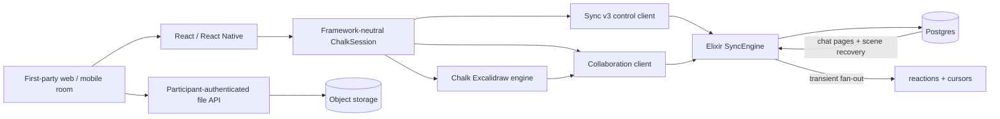
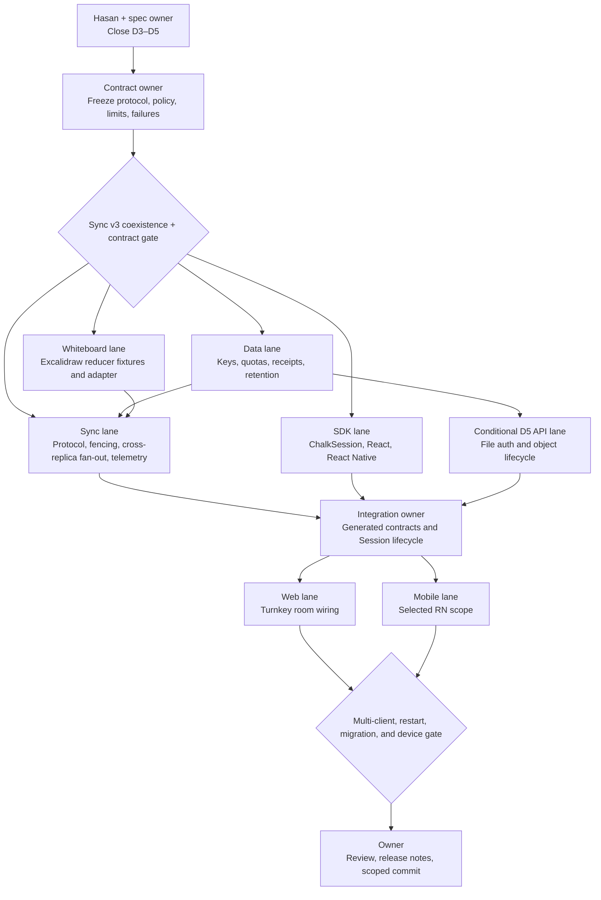

# Chalk Room Actions Implementation Specification

Status: **draft — not executable until D3–D5 are closed**
Date: 2026-07-29
Owner: Chalk
Companion: `chalk-room-actions-spec-2026-07-29.html`

## Outcome

Complete Chalk's networked room experience with one coherent, capability-gated
model for reactions, chat, Excalidraw whiteboard collaboration, directed media
requests, and existing host moderation.

The framework-neutral TypeScript Session is the public source of room state and
actions. React and React Native adapt that model. First-party rooms consume the
SDK rather than owning transport logic. The Elixir SyncEngine authenticates,
authorizes, bounds, orders, and delivers networked behavior. Postgres owns state
that must survive reconnect or process restart.

Recording controls are explicitly out of scope.

## Decision gate

The chat contract and platform scope are settled. Implementation must not start
until the exact retention values, transport shape, and Excalidraw image policy
have an owner and accepted value.

| ID  | Decision          | Outcome                                                            | Status             |
| --- | ----------------- | ------------------------------------------------------------------ | ------------------ |
| D1  | Chat depth        | Durable room-wide text                                             | Accepted           |
| D2  | Platform proof    | All clients for room actions; native mobile whiteboard deferred    | Accepted           |
| D3  | Retention         | One Session collaboration policy; exact values still required      | Partially accepted |
| D4  | Transport shape   | Separate collaboration socket in the Elixir SyncEngine recommended | Open               |
| D5  | Excalidraw images | Staged, participant-authenticated object flow recommended          | Open               |

Only unresolved choices retain decision cards.

## Current state

The turnkey web room proves join, leave, microphone, camera, screen share, hand
raise, roster display, and the participants drawer. It does not expose chat,
reactions, whiteboard, directed requests, or the full moderation surface.

React components already exist for reactions, chat, and whiteboard. The
whiteboard package already contains an Excalidraw collaboration engine.
Component presence is not end-to-end behavior: the unified `ChalkSession`
snapshot and actions do not carry those features, the room does not bind them,
and there is no live multi-client proof.

### Directed media requests

| Layer                               | Current status                                                                                                                                                                                                               |
| ----------------------------------- | ---------------------------------------------------------------------------------------------------------------------------------------------------------------------------------------------------------------------------- |
| Elixir SyncEngine                   | Done below the room: authorizes, rate-limits, and delivers live-only `request_unmute` and `request_start_camera` messages. Requests expire after 30 seconds and have bounded pending, recent, connection, and payload state. |
| Low-level TypeScript Sync v3 client | Done below the Session: exposes `requestUnmute`, `requestStartCamera`, request results, and incoming request listeners.                                                                                                      |
| Framework-neutral `ChalkSession`    | Not done: dependency types, public actions, incoming request state, and subscriptions are missing.                                                                                                                           |
| React and turnkey web room          | Not done: no requester actions, target prompt, or result UI.                                                                                                                                                                 |
| React Native                        | Not done: manager-shaped methods do not provide real end-to-end behavior.                                                                                                                                                    |
| Live proof                          | Not done.                                                                                                                                                                                                                    |

The existing result describes delivery only: delivered, target unavailable,
expired, rejected, or rate-limited. It does not say whether the target later
accepted or declined.

### Host moderation

| Layer                            | Current status                                                                                                                        |
| -------------------------------- | ------------------------------------------------------------------------------------------------------------------------------------- |
| Elixir SyncEngine                | Done below the room for admission, denial, role change, host transfer, mute, stop camera, stop screen share, remove, and end Session. |
| Low-level TypeScript client      | Done below the room with typed commands and replicated control state.                                                                 |
| Framework-neutral `ChalkSession` | Done for the existing moderation actions.                                                                                             |
| React hooks                      | Done for the existing moderation actions.                                                                                             |
| Turnkey web room                 | Not done: `SessionMeetingRoom` does not pass capabilities or moderation callbacks into participant and waiting-room controls.         |
| React Native                     | Not done: visible controls call core methods that are currently no-ops, and the remaining moderation actions are absent.              |
| Live proof                       | Not done.                                                                                                                             |

The participant menu also has an incorrect “Unmute” action. A host cannot force
another participant to publish audio. For a muted participant the menu must say
“Ask to unmute” and use the directed request path.

### Whiteboard

`@chalk/whiteboard` uses Excalidraw 0.18.1 and already provides:

- debounced element updates, periodic full synchronization, and throttled
  cursors;
- scene IDs, clear messages, sync requests, Excalidraw restoration and
  reconciliation helpers, and deleted elements in updates;
- a file synchronization adapter that requires presigned upload and download
  operations.

The missing work is the real SyncEngine collaboration path, durable scene
storage, file routes and access control if D5 includes images, Session/SDK
state, browser room wiring, and live proof. Native mobile whiteboard
implementation is deferred.

The removed historical Go whiteboard implementation is not a valid starting
point. It deleted tombstones and ignored Excalidraw `versionNonce` and scene
epochs, allowing stale updates to win or deleted shapes to return.

## Scope

### Included networked actions

| Group                   | User behavior                                                                                                  | Delivery model                                                                                         |
| ----------------------- | -------------------------------------------------------------------------------------------------------------- | ------------------------------------------------------------------------------------------------------ |
| Reactions               | Send one allowed room reaction and see who sent it.                                                            | Authenticated, bounded, transient fan-out. No replay.                                                  |
| Chat                    | Send room-wide text and recover durable messages after reconnect.                                              | Ordered Postgres stream with acknowledgements, paging, and a durable cursor.                           |
| Whiteboard              | Open a shared Excalidraw board, draw, clear, see cursors, and synchronize image files if images are supported. | Durable scene and elements; transient cursors; client and server Excalidraw-compatible reconciliation. |
| Directed media requests | Ask a participant to unmute or start their camera; the target accepts or declines locally.                     | Existing bounded, live-only Sync v3 directed request path.                                             |
| Host moderation         | Admit or deny, change roles, transfer host, mute, stop camera or screen, remove, and end Session.              | Existing authoritative Sync v3 control commands.                                                       |

### Related actions that are not new SyncEngine features

Picture in picture, device settings, diagnostics, meeting information, invite
copying, and layout selection are useful room utilities, but they are local UI
or media behavior. They do not belong in this protocol scope.

### Out of scope

- recording controls;
- live transcription and captions;
- polls, breakout rooms, and general-purpose app events;
- direct messages;
- whiteboard export or revision history;
- native mobile whiteboard rendering and synchronization;
- chat attachments, edit, delete, typing, durable read receipts, and
  per-message reactions;
- production deployment.

### Platform delivery

The framework-neutral TypeScript Session, React SDK, React Native SDK, turnkey
web room, and first-party iOS and Android rooms must complete reactions, durable
chat, directed media requests, and moderation.

Browser whiteboard is included through the React adapter and must render a real
Excalidraw scene. Native mobile whiteboard state, rendering, synchronization,
and device proof are deferred as one explicit follow-up. The release must hide
or label that control as unavailable on native mobile; a placeholder or no-op
does not count as partial completion.

| Surface            | Reactions | Chat     | Requests | Moderation                | Whiteboard                      |
| ------------------ | --------- | -------- | -------- | ------------------------- | ------------------------------- |
| TypeScript Session | Required  | Required | Required | Existing surface retained | Transport and metadata required |
| React SDK          | Required  | Required | Required | Required                  | Browser adapter required        |
| Turnkey web room   | Required  | Required | Required | Required                  | Real Excalidraw required        |
| React Native SDK   | Required  | Required | Required | Required                  | Deferred                        |
| iOS app proof      | Required  | Required | Required | Required                  | Deferred                        |
| Android app proof  | Required  | Required | Required | Required                  | Deferred                        |

Included React Native behavior must reuse the framework-neutral Session or an
adapter with contract-equivalence tests. It may not preserve the current
parallel no-op core. The existing macOS surface remains outside this release.

## Architecture



The public Session hides the transport split. Apps use one Session snapshot and
one action surface regardless of whether D4 selects one socket or two.
Collaboration is an independently degradable subsystem: a collaboration outage
does not change control/media Session state or prevent leave, moderation, or
directed requests. Pending durable operations remain retryable until their
idempotent outcome is recovered or the caller cancels them.

The durable control event log remains for control state. Chat is a separate
ordered message stream. Whiteboard is a recoverable document with its own
revision and scene epoch. Neither is inserted into the ordinary control event
log.

### Protocol ownership

`contract/schema/sync-v3.json` remains unchanged as the source for existing
control and directed-request frames. Contract generation must keep
`sdks/typescript/client/src/generated/sync-v3.ts` and
`apps/sync/lib/chalk_sync/contract/generated_v3.ex` in agreement.

The recommended D4 choice introduces a strict `collab-v1` handshake, welcome,
policy, frame schema, and generated bindings. Its capability names
(`sendReaction`, `sendChat`, `drawWhiteboard`, and `manageWhiteboard`) live in
the collaboration policy, not the immutable Sync v3 role-capability map. This
keeps existing Sync v3 clients, role limits, state digests, and active Session
policies compatible.

If D4 selects one physical socket, the replacement protocol is Sync v4 or a
separate negotiated WebSocket subprotocol. It is not labeled a compatible Sync
v3 frame extension. The contract gate must prove old Sync v3 coexistence and
active-Session migration behavior.

The collaboration contract must have:

- explicit protocol and capability negotiation;
- a `session_id`, participant Session identity and generation on every
  authenticated connection;
- stable client operation IDs for idempotent writes;
- independent durable cursors for chat and whiteboard;
- bounded frame sizes, batch sizes, queues, pages, and rates;
- typed accepted and rejected outcomes;
- server-owned participant identity, timestamp, sequence, authorization, and
  room routing;
- journey and W3C trace context without content payloads in telemetry.

High-volume whiteboard frames must not block control commands, leave, directed
requests, or moderation.

### Replica fan-out and authority fencing

Every SyncEngine replica subscribes through the existing PostgreSQL
`LISTEN`/`NOTIFY` fan-out infrastructure. Notifications contain only bounded
routing metadata, operation IDs, and new durable heads; they never contain chat
text or board elements. Durable notifications are hints, so a missed
notification is repaired by periodic head watermarks and cursor recovery.
Reactions are lossy per subscriber. Cursor notifications are lossy and
coalesced by participant.

Before committing chat, whiteboard, permission, or file metadata, the database
transaction fences on authoritative Session status, participant status and
generation, and current collaboration policy. End, removal, or generation
replacement invalidates the collaboration connection and any later write.
Two-replica tests pin clients to separate nodes and cover a node crash during
transient and durable sends.

## Public SDK model

The framework-neutral Session owns collaboration connection lifecycle,
authorization metadata, durable cursors, pending operations, and typed
failures. It does not own Excalidraw's browser imperative API or UI panel
visibility. `WhiteboardCanvas` owns the browser Excalidraw adapter; native uses
no whiteboard renderer in this release. The browser adapter consumes a
Session-provided whiteboard transport and publishes acknowledged operations
through it.

Extend `ChalkSessionSnapshot` with bounded collaboration state rather than
separate app-owned stores:

```ts
type ChalkSessionSnapshot = {
  // existing control and media state
  collaboration: {
    status: "disabled" | "connecting" | "ready" | "recovering" | "failed";
    error?: ChalkSessionError;
  };
  participantMedia: Readonly<
    Record<
      string,
      {
        microphone: "active" | "inactive" | "unknown";
        camera: "active" | "inactive" | "unknown";
        screenShare: "active" | "inactive" | "unknown";
      }
    >
  >;
  reactions: readonly RoomReaction[];
  chat: {
    status: "idle" | "loading" | "ready" | "failed";
    messages: readonly ChatMessage[];
    pending: readonly PendingChatMessage[];
    hasOlder: boolean;
    unreadCount: number;
    error?: ChalkSessionError;
  };
  whiteboard: {
    status: "unsubscribed" | "loading" | "ready" | "failed";
    sceneId?: string;
    revision?: number;
    canDraw: boolean;
    canClear: boolean;
    cursors: readonly WhiteboardCursor[];
    error?: ChalkSessionError;
  };
  incomingMediaRequests: readonly IncomingMediaRequest[];
};
```

The chat window and reactions list have frozen maximum lengths and deterministic
eviction. Reaction entries carry event IDs and expiry times for deduplication.
Sequence and revision values use a representation with frozen safe maxima.

`IncomingMediaRequest` contains request ID, kind, authenticated actor ID and
display-name snapshot, target generation, and expiry. It is cleared on expiry,
leave, removal, or generation replacement.

Extend `ChalkSessionActions` with typed operations:

```ts
type ChalkSessionActions = {
  sendReaction(reaction: AllowedReaction): Promise<AcceptedOperation>;
  sendChatMessage(input: SendChatMessageInput): Promise<ChatMessage>;
  loadOlderChatMessages(): Promise<void>;
  markChatRead(): void;
  subscribeWhiteboard(): Promise<WhiteboardTransport>;
  unsubscribeWhiteboard(): void;
  clearWhiteboard(): Promise<CommittedWhiteboardRevision>;
  setWhiteboardDrawPermission(participantSessionId: string, canDraw: boolean): Promise<AcceptedOperation>;
  requestUnmute(participantSessionId: string): Promise<RequestDeliveryResult>;
  requestStartCamera(participantSessionId: string): Promise<RequestDeliveryResult>;
  acceptMediaRequest(requestId: string): Promise<void>;
  declineMediaRequest(requestId: string): void;
  // existing moderation actions remain
};
```

Names may change during contract freeze, but the public semantics may not.
Following the existing Session convention, async actions resolve with their
typed success value and reject with `ChalkSessionError`. Failure codes,
retryability, operation IDs, and pending state are stable and identical through
React and React Native. Adapters may not convert failures to booleans, silent
no-ops, or console messages.

Collaboration capabilities default from the authoritative role policy in
`collab-v1`. The client uses them only to render the interface; the server
repeats every authorization check.

## Behavior contracts

### Reactions

The first allowlist is the existing quick set: `👍`, `❤️`, `😂`, `😮`, `😢`,
and `🎉`. A later contract may broaden it.

1. The sender submits an allowlisted value and client operation ID.
2. SyncEngine validates Session membership, capability, payload, and rate.
3. SyncEngine stamps authenticated sender identity and server time.
4. Current room subscribers receive one event.
5. Clients render it for a bounded lifetime and then remove it.

Reaction frames are not persisted or replayed. Inbound sends are explicitly
accepted or rejected. After acceptance, delivery is best-effort and lossy per
slow subscriber. The client deduplicates by server event ID, caps concurrent
rendered reactions, expires them, announces them accessibly without flooding a
screen reader, and respects reduced-motion preferences. The room picker exposes
only the contracted six values even though the generic picker can display more.

### Chat

The selected contract is room-wide text:

1. The client creates a stable `client_message_id` and shows a pending row.
2. SyncEngine validates live membership, capability, text limits, and rate.
3. One Postgres transaction allocates the next contiguous Session sequence and
   inserts the message.
4. The durable message, including server ID, sequence, authenticated sender
   snapshot, and server time, becomes the send acknowledgement.
5. Live clients receive a hint and advance through the durable
   sequence.
6. Reconnect resumes after the last durable sequence. The cursor is
   `{sequence, retainedFloor}`. A cursor below the floor receives a typed reset
   result. Older history uses a bounded page query.

Recommended base limits are 4,000 Unicode scalar values and 16 KiB of UTF-8 per
message, with final values frozen in the contract. Reusing the same
`client_message_id` for the same participant Session generation returns the
original message. Reusing it with different text is a conflict.

The UI distinguishes pending, sent, and failed and permits retry with the same
client message ID. A failed send preserves the composer text or failed row. The
chat panel exposes load-older loading, empty, end, and failed states. The
attachment control is absent. It never invents a durable server message before
acknowledgement. Unread count and mark-as-read are local; durable read receipts
are outside this release.

### Whiteboard

The browser client keeps using the existing Excalidraw integration:

- publish `getSceneElementsIncludingDeleted()`, not only visible elements;
- restore received elements before applying them;
- reconcile with Excalidraw's `reconcileElements`;
- apply remote scenes with `CaptureUpdateAction.NEVER`;
- use Excalidraw `version`, `versionNonce`, fractional `index`, and
  `isDeleted` semantics;
- send cursor state through the transient cursor path.

The Elixir server implements a deterministic reducer for server-canonical
element winner selection, tombstones, field preservation, and ordering. Golden
fixtures generated from the pinned Excalidraw 0.18.1 reconciliation helpers
cover same-version conflicts, reorder, duplicate or invalid fractional indices,
tombstones, unknown fields, malformed elements, and full synchronization.
Browser-local editing protections remain client-local. A full sync is an
upsert; absence from a client frame never deletes a stored element.

A higher element version wins. If versions tie, the lower `versionNonce` wins.
Unknown Excalidraw element fields are preserved. The adapter sends stable
operation IDs and awaits a committed revision. It retains unacknowledged
updates across reconnect instead of marking them sent before durable
acknowledgement.

Each board has a `scene_id` epoch and monotonically increasing server revision.
A clear operation is an explicit, acknowledged `canClear` action that
atomically starts a new epoch. Replaying the same operation returns the
original scene and revision. Updates for an old epoch are rejected, so a
disconnected client cannot resurrect a cleared scene. Ordinary deletion of the
last visible element sends tombstones and does not implicitly clear unless the
actor has `canClear`. `isDeleted` tombstones remain until cleanup; normal merge
never converts them to physical deletion.

Only a safe shared app-state allowlist is persisted. Viewport, selection,
editing focus, and other user-local state remain local. Cursors expire and are
never part of a durable snapshot.

Opening the panel is local UI state and calls the Session subscription.
Closing it unsubscribes from expensive live presence without clearing the
shared scene. The cursor is `{sceneId, revision}`. Snapshot pages share one
fixed upper revision, may arrive in any order, and apply atomically only after
complete validation. A scene change, retained-floor miss, lost hint, or page
gap produces a documented reset/snapshot path. Periodic head watermarks repair
lost durable notifications.

The existing image tool follows D5:

- full support uses initiate, direct upload, and finalize. Finalize verifies
  provider-observed existence, byte length, hash, MIME, immutable object
  identity, active scene, file-ID uniqueness, and participant authorization
  before server-owned availability becomes visible;
- abandoned uploads have persisted expiry and orphan cleanup;
- if D5 disables images, the image tool and unsupported image elements are
  absent from the room.

### Directed media requests

The requester selects “Ask to unmute” or “Ask to start camera.” Delivery status
reports only whether the prompt reached the target.

The target receives one bounded prompt until expiry. If the requested media is
already active, the prompt resolves locally without toggling it. Accepting is
idempotent and calls the target's existing local microphone or camera action;
success requires the resulting local publication state, not callback return.
Declining is idempotent and dismisses the request. Repeated prompts with the
same actor and kind collapse instead of stacking modals. Browser or
operating-system permission failure leaves a retryable target-side state and is
not misreported to the requester as a delivery failure.

No acceptance receipt is added in this release. Adding one later requires a
new explicit contract.

### Moderation and admission

Controls render only when the local capability and target state allow them:

- active microphone → **Mute**;
- inactive microphone → **Ask to unmute**;
- active camera → **Stop camera**;
- inactive camera → **Ask to start camera**;
- active screen share → **Stop sharing**;
- participant → **Make cohost**;
- cohost → **Remove cohost** where policy permits;
- eligible participant → **Transfer host**, with confirmation;
- waiting participant → **Admit** or **Deny**;
- participant → **Remove**, with confirmation;
- Session → **End for everyone**, with confirmation.

Per-participant playback volume remains a local media action and is not
presented as server moderation. Unknown or recovering participant media state
shows neither a destructive stop action nor a misleading request action until
the authoritative projection resolves.

The waiting-room surface must be wired into the turnkey room rather than
remaining preview-only. Its adapter derives display time from the authoritative
waiting record and tracks per-row pending, success, expiry, and error. Bulk
admit/deny is excluded from this release; it is hidden rather than simulated
with client loops and ambiguous partial failure.

## Persistence

New migrations live in `apps/api/db/migrations` and update `db/schema.sql`.
Postgres used by SyncEngine remains authoritative.

### Chat tables

`sync_chat_streams`

- tenant, room, and Session identity;
- `head_sequence`;
- `retained_floor_sequence`;
- atomic message-count and encoded-byte counters with fixed maxima;
- created and updated timestamps.

`sync_chat_messages`

- Session identity and contiguous `sequence`;
- server `message_id`;
- `client_message_id`;
- request fingerprint;
- participant Session ID and generation;
- display-name snapshot;
- text body;
- server `created_at`.

The unique idempotency key is Session, participant Session, generation, and
`client_message_id`. A duplicate fingerprint returns the original row; a
different fingerprint is a conflict. First-message races use
`INSERT ... ON CONFLICT`, then lock the one Session stream row. The transaction
fences authority, reserves row and byte quotas, allocates the sequence, inserts,
and advances the head. Reads are indexed by Session and sequence.

Future chat expansion adds new tables or columns only after its authorization,
conflict, and deletion semantics are specified.

### Whiteboard tables

`sync_whiteboard_scenes`

- tenant, room, and Session identity;
- active `scene_id`;
- server `revision`;
- retained-floor revision;
- atomic element, tombstone, file, JSON-byte, and object-byte counters with
  fixed maxima;
- shared app-state allowlist;
- created and updated timestamps.

`sync_whiteboard_elements`

- Session and `scene_id`;
- Excalidraw element ID;
- `version`, `version_nonce`, `index`, and `is_deleted`;
- complete element JSON;
- server revision and updated timestamp.

`sync_whiteboard_permissions`

- Session, participant Session identity, and generation;
- `can_draw`;
- `can_clear`;
- granting actor and updated timestamp.

`sync_whiteboard_operation_receipts`

- Session, actor participant Session ID and generation, and operation ID;
- operation kind and request fingerprint;
- committed `scene_id`, revision, and safe result;
- created timestamp and receipt-retention state.

`sync_whiteboard_files`, when D5 selects image support

- Session, `scene_id`, and Excalidraw file ID;
- immutable object key, verified MIME type, byte length, hash, and state;
- owner generation, upload expiry, deletion state, attempts, and timestamps.

An update transaction locks the scene, verifies its epoch and permission,
reserves row and byte quotas, applies bounded deterministic element merges,
stores the receipt, increments the revision, and commits before fan-out. The
same operation and fingerprint returns its prior committed result; a reused ID
with a different fingerprint is a conflict. This also makes clear idempotent.
Snapshot pages are bounded by element count and encoded bytes.

All collaboration tables use explicit composite primary keys and foreign keys
including tenant, room, and Session identity. Elements, receipts, permissions,
and files reference their active scene or participant generation where
applicable. No table relies on a globally unique room or participant string.
Concurrent quota reservations reject before crossing fixed row or byte limits,
including tombstone growth and incomplete uploads.

### Retention

One cleanup workflow expires chat rows, whiteboard rows, receipts, permissions,
and associated objects according to D3. It never cleans a live Session. Cursor
requests below a retained floor receive a typed reset outcome.

Object cleanup is a persisted state machine: mark pending deletion, delete the
object idempotently, then finalize metadata deletion. Retries and an orphan
sweeper cover crashes between those steps. Tombstones are removed only after
the scene epoch is retired or every accepted stale-write window has closed.
Reactions, cursors, and directed requests are live-only and disappear without a
database cleanup path.

## Failure and overload behavior

All public failures use typed codes with a safe message and retryability:

- unauthorized or capability denied;
- participant or Session unavailable;
- invalid payload or stale whiteboard epoch;
- rate-limited;
- payload or page too large;
- transient transport unavailable;
- durable store unavailable;
- object upload or download failure;
- local media permission denied.

Chat is acknowledged only after commit. Whiteboard durable revisions are
acknowledged only after commit. A broadcast failure after commit does not roll
back durable state; clients recover through cursors. No action reports success
merely because a UI callback ran.

Per-room processes, mailboxes, replay windows, dedupe caches, pages, element
batches, pending sends, durable rows, JSON bytes, and object bytes all have
declared bounds and tests at the boundary. Reactions and cursors are lossy for
slow subscribers; cursor updates coalesce. Durable notifications are droppable
hints, while inbound durable writes receive accepted or rejected results. No
subscriber holds a database transaction. Control traffic remains available
under a saturating collaboration load and meets a frozen latency threshold.

## Observability and privacy

Every collaboration operation propagates `journey_id` and W3C trace context.
Structured logs and metrics may contain operation kind, tenant/room/Session
identifiers under existing privacy policy, result code, duration, sizes, and
sequence or revision numbers.

They must not contain chat text, Excalidraw elements, file contents, reaction
values, access tokens, presigned URLs, or raw participant secrets.

Dashboards and tests must distinguish accepted, unauthorized, rate-limited,
stale-epoch, overloaded, database-failed, and object-storage-failed outcomes.

## Decision cards

### D3 — Retention values

The shared-policy shape is accepted. The remaining choice is its exact product
default and lifecycle boundary.

**Recommendation:** retain collaboration data for seven days after Session end.
Never clean an active Session. Reject collaboration writes immediately when the
Session ends. Retention does not create post-meeting history access.

Alternatives:

- **One day:** lower storage and privacy exposure with a shorter recovery
  window.
- **Thirty days:** more operational recovery time with higher storage and
  privacy cost.

Why it matters: retention determines database cleanup, object cleanup,
reconnect and cursor-reset behavior, authorization after leave or Session end,
customer promises, and operational cost.

Default without an explicit duration: implementation remains blocked.

### D4 — Transport shape

**Recommendation: a separate collaboration socket and protocol owned by the
same Elixir SyncEngine.** The unified Session connects it internally.

Alternative:

- **One socket:** introduce Sync v4 or a separate negotiated WebSocket
  subprotocol with proven old-client coexistence and queue isolation. Do not
  add unknown frames or capabilities to strict Sync v3.

Why it matters: Sync v3 currently has a strict accepted frame set and carries
latency-sensitive control. Whiteboard has larger and more frequent frames,
while chat and whiteboard need independent recovery cursors. A separate socket
reduces compatibility and head-of-line risk without creating a second
authority.

Default without an explicit transport choice: implementation remains blocked.

### D5 — Excalidraw images

**Recommendation: support images.** Add initiate/upload/finalize file handling,
provider-side verification, server-owned availability, participant-bound
downloads, fixed quotas, and retention cleanup.

Alternative:

- **Disable images:** remove the image tool and reject image elements in every
  selected client until the file lifecycle is implemented.

Why it matters: the current client adapter can request presigned transfers, but
the repository has no participant-authenticated whiteboard file routes. A
client-provided `saved` flag is not proof that the expected immutable object
exists or is authorized.

Default without an explicit image choice: implementation remains blocked.

## Observable done criteria

This release is done only when the accepted scope has current end-to-end proof.

### Contract and migrations

- [ ] Collaboration and control schemas generate matching TypeScript and Elixir
      bindings with no uncommitted generated drift.
- [ ] Existing Sync v3 clients and active Sessions retain identical accepted
      frames, capability maps, digests, and control behavior.
- [ ] Fresh database migration up, upgrade from the previous schema, down, and
      up again pass.
- [ ] Retention cleanup removes every selected durable row and object without
      crossing tenant, room, or Session boundaries.
- [ ] Concurrent writers stop at every row and byte quota without counter
      drift.

### Reactions

- [ ] Two live clients exchange each allowed reaction with authenticated sender
      identity.
- [ ] Reconnect does not replay reactions.
- [ ] Invalid, unauthorized, rate-limited, and overloaded sends have observable
      typed outcomes.
- [ ] The picker exposes only allowed values, concurrent rendering stays
      bounded, and accessibility plus reduced-motion behavior pass.

### Chat

- [ ] Two clients send concurrently and observe one contiguous order.
- [ ] Retrying a client message ID produces one durable message.
- [ ] Disconnect, reconnect, paging, and SyncEngine restart recover without loss
      or duplication.
- [ ] Lost hints, duplicate hints, a cursor below retention floor, and two
      clients on different SyncEngine replicas recover correctly.
- [ ] Store outage and recovery are visible and do not invent acknowledged
      messages.
- [ ] Pending, sent, failed, retry, preserved composer, load-older, and
      attachment-hidden states pass in the selected room surfaces.

### Whiteboard

- [ ] Two clients concurrently create, edit, reorder, and delete elements and
      converge.
- [ ] A clear followed by stale offline updates cannot resurrect an old scene.
- [ ] Disconnect after commit but before acknowledgement, identical update
      replay, conflicting operation-ID reuse, and clear replay each return one
      committed outcome and do not create extra revisions or epochs.
- [ ] Reconnect and SyncEngine restart restore the same scene and revision.
- [ ] Lost hints, duplicate or reordered snapshot pages, concurrent writes
      during paging, and a cursor below retention floor recover through one atomic
      snapshot apply.
- [ ] Cursors expire, permissions are enforced server-side, and bounded payload
      rejection is visible.
- [ ] Ordinary delete-to-empty produces tombstones; only `canClear` advances the
      epoch.
- [ ] If images are in scope, upload, cross-client download, authorization
      denial, and retention deletion pass end to end.
- [ ] The browser renders a real Excalidraw scene. Native mobile exposes no
      whiteboard placeholder or no-op control.

### Directed requests and moderation

- [ ] An authorized requester delivers each request to another live client,
      which can accept or decline.
- [ ] Target unavailable, expiry, rate limit, and local media-permission denial
      show the correct party the correct result.
- [ ] Prompts deduplicate, expire, clear across generation changes, and prove
      the resulting publication state after acceptance.
- [ ] Every listed moderation and admission action succeeds against a second
      live client and is absent when unauthorized.
- [ ] Participant menus stay correct while media subscriptions change or
      recover, and waiting-room row pending/error/expiry states pass.
- [ ] “Ask to unmute” never invokes forced unmute.

### Product and operations

- [ ] React and React Native expose the same typed state, actions, and failures
      for reactions, chat, directed requests, and moderation.
- [ ] First-party rooms contain no private collaboration transport path.
- [ ] A collaboration-only outage preserves media, control state, leave,
      moderation, and directed requests while collaboration enters a truthful
      recovering or failed state.
- [ ] Two clients pinned to different SyncEngine replicas receive transient
      fan-out and durable recovery; one replica may fail mid-send without durable
      loss or duplicate commits.
- [ ] Saturating collaboration traffic does not exceed the frozen control
      latency threshold.
- [ ] Success, rejection, overload, reconnect, database failure, and object
      failure are visible without content payloads in telemetry.
- [ ] Focused server, database, SDK, package, browser, and selected device gates
      pass from the final tree.
- [ ] The root quality gate, bounded code review, release notes, and scoped
      commit pass under repository policy.

## Execution graph

Execution remains blocked on D3–D5.



### Phase ownership and handoffs

| Phase          | Primary scope                                                                                      | Exit condition                                          |
| -------------- | -------------------------------------------------------------------------------------------------- | ------------------------------------------------------- |
| 0. Decisions   | D3–D5 and exact limits/defaults                                                                    | Decision ledger accepted; document becomes executable   |
| 1. Contracts   | Capabilities, frames, errors, generated bindings                                                   | Compatibility and generator checks pass                 |
| 2. Foundations | Migrations, retention, SyncEngine, file access, reducer fixtures                                   | Fresh/upgrade DB and focused server tests pass          |
| 3. SDK         | Unified Session lifecycle, state/actions, React and native room-action adapters                    | SDK integration tests pass with real SyncEngine         |
| 4. Product     | Turnkey room controls, prompts, panels, permissions                                                | Two-client browser proof and selected device proof pass |
| 5. Hardening   | Two replicas, restart, reconnect, duplicate/reordered delivery, quotas, overload, privacy, cleanup | Full acceptance matrix and root gate pass               |
| 6. Handoff     | Review, release notes, scoped commit                                                               | No unresolved required finding or unverified claim      |

## Implementation constraints

- Do not treat a component, manager name, hook, or button as proof.
- Do not duplicate room behavior across the app, React Native core, and
  framework-neutral Session.
- Do not add chat or whiteboard documents to the ordinary control event log.
- Do not restore the removed Go whiteboard merge implementation.
- Do not physically delete Excalidraw tombstones during normal merge.
- Do not log chat text, whiteboard data, reaction values, files, tokens, or
  presigned URLs.
- Do not allow collaboration traffic to starve control traffic.
- Do not expose a native whiteboard placeholder or no-op control in this
  release.
- Do not wire recording controls as part of this work.
