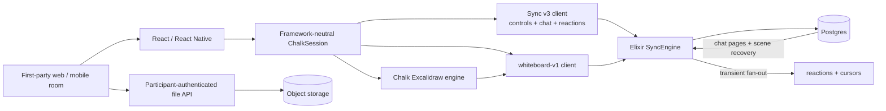
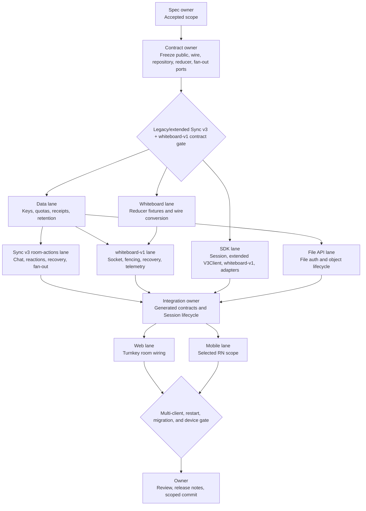

# Chalk Room Actions Implementation Specification

Status: **ready for implementation**
Date: 2026-07-29
Owner: Chalk
Companion: `chalk-room-actions-spec-2026-07-29.html`

## Outcome

Complete Chalk's networked room experience with one coherent, capability-gated
model for reactions, chat, Excalidraw whiteboard collaboration, directed media
requests, and existing host moderation.

The framework-neutral TypeScript Session is the public source of room state and
actions. React and React Native adapt that model. First-party rooms consume the
SDK rather than owning transport logic. The Elixir SyncEngine authenticates,
authorizes, bounds, orders, and delivers networked behavior. Postgres owns state
that must survive reconnect or process restart.

Recording controls are explicitly out of scope.

## Accepted decisions

The chat contract, platform scope, seven-day retention policy, transport shape,
and Excalidraw image lifecycle are settled.

| ID  | Decision          | Outcome                                                                            | Status   |
| --- | ----------------- | ---------------------------------------------------------------------------------- | -------- |
| D1  | Chat depth        | Durable room-wide text                                                             | Accepted |
| D2  | Platform proof    | All clients for room actions; native mobile whiteboard deferred                    | Accepted |
| D3  | Retention         | Seven days after Session end; active Sessions are never cleaned                    | Accepted |
| D4  | Transport shape   | Sync v3 for controls/chat/reactions; separate `whiteboard-v1` for Excalidraw sync  | Accepted |
| D5  | Excalidraw images | Staged, participant-authenticated upload, verified storage, and protected download | Accepted |

## Current state

The turnkey web room proves join, leave, microphone, camera, screen share, hand
raise, roster display, and the participants drawer. It does not expose chat,
reactions, whiteboard, directed requests, or the full moderation surface.

React components already exist for reactions, chat, and whiteboard. The
whiteboard package already contains an Excalidraw collaboration engine.
Component presence is not end-to-end behavior: the unified `ChalkSession`
snapshot and actions do not carry those features, the room does not bind them,
and there is no live multi-client proof.

### Directed media requests

| Layer                               | Current status                                                                                                                                                                                                               |
| ----------------------------------- | ---------------------------------------------------------------------------------------------------------------------------------------------------------------------------------------------------------------------------- |
| Elixir SyncEngine                   | Done below the room: authorizes, rate-limits, and delivers live-only `request_unmute` and `request_start_camera` messages. Requests expire after 30 seconds and have bounded pending, recent, connection, and payload state. |
| Low-level TypeScript Sync v3 client | Done below the Session: exposes `requestUnmute`, `requestStartCamera`, request results, and incoming request listeners.                                                                                                      |
| Framework-neutral `ChalkSession`    | Not done: dependency types, public actions, incoming request state, and subscriptions are missing.                                                                                                                           |
| React and turnkey web room          | Not done: no requester actions, target prompt, or result UI.                                                                                                                                                                 |
| React Native                        | Not done: manager-shaped methods do not provide real end-to-end behavior.                                                                                                                                                    |
| Live proof                          | Not done.                                                                                                                                                                                                                    |

The existing result describes delivery only: delivered, target unavailable,
expired, rejected, or rate-limited. It does not say whether the target later
accepted or declined.

### Host moderation

| Layer                            | Current status                                                                                                                        |
| -------------------------------- | ------------------------------------------------------------------------------------------------------------------------------------- |
| Elixir SyncEngine                | Done below the room for admission, denial, role change, host transfer, mute, stop camera, stop screen share, remove, and end Session. |
| Low-level TypeScript client      | Done below the room with typed commands and replicated control state.                                                                 |
| Framework-neutral `ChalkSession` | Done for the existing moderation actions.                                                                                             |
| React hooks                      | Done for the existing moderation actions.                                                                                             |
| Turnkey web room                 | Not done: `SessionMeetingRoom` does not pass capabilities or moderation callbacks into participant and waiting-room controls.         |
| React Native                     | Not done: visible controls call core methods that are currently no-ops, and the remaining moderation actions are absent.              |
| Live proof                       | Not done.                                                                                                                             |

The participant menu also has an incorrect “Unmute” action. A host cannot force
another participant to publish audio. For a muted participant the menu must say
“Ask to unmute” and use the directed request path.

### Whiteboard

`@chalk/whiteboard` uses Excalidraw 0.18.1 and already provides:

- debounced element updates, periodic full synchronization, and throttled
  cursors;
- scene IDs, clear messages, sync requests, Excalidraw restoration and
  reconciliation helpers, and deleted elements in updates;
- a file synchronization adapter that requires presigned upload and download
  operations.

The missing work is the real SyncEngine collaboration path, durable scene
storage, participant-authenticated file routes and access control, Session/SDK
state, browser room wiring, and live proof. Native mobile whiteboard
implementation is deferred.

The removed historical Go whiteboard implementation is not a valid starting
point. It deleted tombstones and ignored Excalidraw `versionNonce` and scene
epochs, allowing stale updates to win or deleted shapes to return.

## Scope

### Included networked actions

| Group                   | User behavior                                                                                     | Delivery model                                                                                         |
| ----------------------- | ------------------------------------------------------------------------------------------------- | ------------------------------------------------------------------------------------------------------ |
| Reactions               | Send one allowed room reaction and see who sent it.                                               | Authenticated, bounded, transient fan-out. No replay.                                                  |
| Chat                    | Send room-wide text and recover durable messages after reconnect.                                 | Ordered Postgres stream with acknowledgements, paging, and a durable cursor.                           |
| Whiteboard              | Open a shared Excalidraw board, draw, clear, see cursors, and synchronize image files.            | Durable scene and elements; transient cursors; client and server Excalidraw-compatible reconciliation. |
| Directed media requests | Ask a participant to unmute or start their camera; the target accepts or declines locally.        | Existing bounded, live-only Sync v3 directed request path.                                             |
| Host moderation         | Admit or deny, change roles, transfer host, mute, stop camera or screen, remove, and end Session. | Existing authoritative Sync v3 control commands.                                                       |

### Related actions that are not new SyncEngine features

Picture in picture, device settings, diagnostics, meeting information, invite
copying, and layout selection are useful room utilities, but they are local UI
or media behavior. They do not belong in this protocol scope.

### Out of scope

- recording controls;
- live transcription and captions;
- polls, breakout rooms, and general-purpose app events;
- direct messages;
- whiteboard export or revision history;
- native mobile whiteboard rendering and synchronization;
- chat attachments, edit, delete, typing, durable read receipts, and
  per-message reactions;
- production deployment.

### Platform delivery

The framework-neutral TypeScript Session, React SDK, React Native SDK, turnkey
web room, and first-party iOS and Android rooms must complete reactions, durable
chat, directed media requests, and moderation.

Browser whiteboard is included through the React adapter and must render a real
Excalidraw scene. Native mobile whiteboard state, rendering, synchronization,
and device proof are deferred as one explicit follow-up. The release must hide
or label that control as unavailable on native mobile; a placeholder or no-op
does not count as partial completion.

| Surface            | Reactions | Chat     | Requests | Moderation                | Whiteboard                      |
| ------------------ | --------- | -------- | -------- | ------------------------- | ------------------------------- |
| TypeScript Session | Required  | Required | Required | Existing surface retained | Transport and metadata required |
| React SDK          | Required  | Required | Required | Required                  | Browser adapter required        |
| Turnkey web room   | Required  | Required | Required | Required                  | Real Excalidraw required        |
| React Native SDK   | Required  | Required | Required | Required                  | Deferred                        |
| iOS app proof      | Required  | Required | Required | Required                  | Deferred                        |
| Android app proof  | Required  | Required | Required | Required                  | Deferred                        |

Included React Native behavior must reuse the framework-neutral Session or an
adapter with contract-equivalence tests. It may not preserve the current
parallel no-op core. The existing macOS surface remains outside this release.

## Architecture



The public Session hides two fixed transports. Sync v3 carries controls,
directed requests, chat, and reactions over one connection. `whiteboard-v1`
carries Excalidraw synchronization over a separate connection. A
`whiteboard-v1` failure degrades only the board and does not change
control/media Session state or prevent chat, reactions, leave, moderation, or
directed requests. Pending durable operations remain retryable until their
idempotent outcome is recovered or the caller cancels them.

The durable control event log remains for control state. Chat is a separate
ordered message stream. Whiteboard is a recoverable document with its own
revision and scene epoch. Neither is inserted into the ordinary control event
log.

### Protocol ownership

`contract/schema/sync-v3.json` remains the source for the existing frames and
gains a strict `room_actions_v1` extension for chat and reactions. The
extension uses an alternate exact hello/welcome shape, not optional loose
fields:

- the legacy Sync v3 hello and welcome remain valid byte-for-byte;
- an extended hello requests `room_actions_v1` with its chat cursor;
- the extended welcome returns the negotiated extension, chat head, and
  `sendReaction`/`sendChat` policy;
- the server sends room-action frames only after that negotiation;
- an old client never receives an unknown frame, and a new server must support
  old and extended clients in the same active Session.

This is one Sync v3 connection and one `V3Client`. Chat remains a separate
durable stream rather than entering the control event log or state digest.
Reaction frames remain transient. New room-action capabilities live in the
extension policy and do not change the existing 16-name role-capability map,
role limits, or control digest.

`whiteboard-v1` is a second strict protocol in the same Elixir SyncEngine. It
owns its handshake, welcome, scene epoch/revision cursor, update receipts,
snapshot/reset, cursors, and `drawWhiteboard`/`manageWhiteboard` policy. Its
connection, queue, recovery, and overload behavior are independent from Sync
v3.

Contract generation must keep the updated
`sdks/typescript/client/src/generated/sync-v3.ts`, the updated
`apps/sync/lib/chalk_sync/contract/generated_v3.ex`, and the new generated
`whiteboard-v1` bindings in agreement.

The Sync v3 room-actions extension and `whiteboard-v1` must have:

- explicit protocol and capability negotiation;
- a `session_id`, participant Session identity and generation on every
  authenticated connection;
- stable client operation IDs for idempotent writes;
- one feature-specific durable cursor;
- bounded frame sizes, batch sizes, queues, pages, and rates;
- typed accepted and rejected outcomes;
- server-owned participant identity, timestamp, sequence, authorization, and
  room routing;
- journey and W3C trace context without content payloads in telemetry.

The shared Sync v3 socket has separate logical inbound and outbound budgets for
control and room-action frames. The server drains control first with a frozen
maximum room-action burst between control checks. Chat recovery pages have a
smaller encoded-byte ceiling than the socket frame ceiling and may interleave
only between complete control frames. A full room-action queue rejects or
drops room-action work according to its typed policy; it never delays ping,
leave, moderation, or directed requests. High-volume `whiteboard-v1` frames
must not block Sync v3 either.

### Replica fan-out and authority fencing

Every SyncEngine replica subscribes through PostgreSQL `LISTEN`/`NOTIFY`. The
existing `chalk_sync_heads` channel remains unchanged and payload-free beyond
routing metadata and committed heads.

The two feature paths use separate versioned channels:

- the Sync v3 room-actions durable-head channel contains Session routing and
  chat head; its transient channel contains one server-stamped reaction
  envelope;
- `whiteboard-v1` durable heads contain Session routing, scene ID, and revision;
  its transient channel contains one coalesced cursor envelope.

Durable channels never contain chat text or board elements. Transient envelopes
are capped at 1 KiB, best-effort, never persisted or replayed, and never logged.

A missed durable notification is repaired by periodic head watermarks and
cursor recovery. A missed reaction is dropped. Cursor notifications are lossy
and coalesced by participant.

Before committing chat, whiteboard, permission, or file metadata, the database
transaction fences on authoritative Session status, participant status and
generation, and current feature policy. End, removal, or generation replacement
invalidates the relevant extension or connection and any later write.
Two-replica tests pin clients to separate nodes and cover a node crash during
transient and durable sends.

## Public SDK model

The framework-neutral Session owns Sync v3 extension negotiation,
`whiteboard-v1` connection lifecycle, authorization metadata, durable cursors,
pending operations, and typed failures. It does not own Excalidraw's browser
imperative API or UI panel visibility. `WhiteboardCanvas` owns the browser
Excalidraw adapter; native uses
no whiteboard renderer in this release. The browser adapter consumes a
Session-provided whiteboard transport and publishes acknowledged operations
through it.

The existing public shape stays intact:

```ts
type ChalkSessionStore = ChalkSessionActions & {
  readonly getSnapshot: () => ChalkSessionSnapshot;
  readonly subscribe: (listener: () => void) => () => void;
  readonly whiteboard: ChalkWhiteboardV1Transport | null;
};
```

Chat, reactions, requests, and moderation extend the immutable Session snapshot
and action methods. Whiteboard adds one transport port because Excalidraw is an
imperative renderer. It does not add a second Session or manager hierarchy, and
full Excalidraw elements never enter the general Session snapshot.

### Canonical public types

These names and discriminants are the contract-freeze target:

```ts
type ChalkRoomActionsPhase = "disabled" | "negotiating" | "healthy" | "recovering" | "failed" | "stopped";

type ChalkSyncV3RoomActionCapability = "sendReaction" | "sendChat";
type ChalkWhiteboardV1Capability = "drawWhiteboard" | "manageWhiteboard";
type ChalkRoomActionCapability = ChalkSyncV3RoomActionCapability | ChalkWhiteboardV1Capability;

type ChalkParticipantMediaState = {
  readonly microphone: "active" | "inactive" | "unknown";
  readonly camera: "active" | "inactive" | "unknown";
  readonly screenShare: "active" | "inactive" | "unknown";
};

type ChalkReaction = "👍" | "❤️" | "😂" | "😮" | "😢" | "🎉";

type ChalkRoomReaction = {
  readonly eventId: string;
  readonly participantSessionId: string;
  readonly displayName: string;
  readonly reaction: ChalkReaction;
  readonly occurredAt: string;
  readonly expiresAt: string;
};

type ChalkChatMessage = {
  readonly messageId: string;
  readonly clientMessageId: string;
  readonly sequence: string; // unsigned decimal; never a lossy JS bigint cast
  readonly participantSessionId: string;
  readonly displayName: string;
  readonly text: string;
  readonly createdAt: string;
};

type ChalkPendingChatMessage = {
  readonly clientMessageId: string;
  readonly text: string;
  readonly state: "sending" | "failed";
  readonly error: ChalkSessionFailure | null;
};

type ChalkChatState = {
  readonly status: "idle" | "loading" | "ready" | "failed";
  readonly messages: readonly ChalkChatMessage[];
  readonly pending: readonly ChalkPendingChatMessage[];
  readonly hasOlder: boolean;
  readonly historyTruncated: boolean;
  readonly retainedFloorSequence: string | null;
  readonly unreadCount: number;
  readonly error: ChalkSessionFailure | null;
};

type ChalkChatPageResult = { readonly status: "loaded"; readonly count: number; readonly hasOlder: boolean } | { readonly status: "cursor_reset"; readonly retainedFloorSequence: string };

type ChalkSendChatMessageInput = {
  readonly text: string;
  readonly clientMessageId?: string;
};

type ChalkIncomingMediaRequest = {
  readonly requestId: string;
  readonly kind: "unmute" | "start_camera";
  readonly actorParticipantSessionId: string;
  readonly actorDisplayName: string | null; // local roster enrichment
  readonly expiresAt: string;
};

type ChalkDirectedRequestResult = { readonly status: "delivered"; readonly requestId: string } | { readonly status: "target_unavailable" | "expired" | "rejected" | "rate_limited"; readonly requestId: string };

type ChalkWhiteboardSummary = {
  readonly status: "unsubscribed" | "loading" | "ready" | "recovering" | "failed";
  readonly sceneId: string | null;
  readonly revision: string | null;
  readonly capabilities: readonly ChalkWhiteboardV1Capability[];
  readonly canDraw: boolean;
  readonly canClear: boolean;
  readonly error: ChalkWhiteboardV1Failure | null;
};
```

Extend `ChalkSessionSnapshot` without changing the meaning of its existing
fields:

```ts
type ChalkSessionSnapshot = {
  // existing state, subject, control/media connections, participants,
  // admission requests, localMedia, remoteMedia, and failure
  readonly roomActions: {
    readonly phase: ChalkRoomActionsPhase;
    readonly capabilities: readonly ChalkSyncV3RoomActionCapability[];
    readonly error: ChalkSessionFailure | null;
  };
  readonly participantRoomActionCapabilities: Readonly<Record<string, readonly ChalkRoomActionCapability[]>>;
  readonly participantMedia: Readonly<Record<string, ChalkParticipantMediaState>>;
  readonly reactions: readonly ChalkRoomReaction[];
  readonly chat: ChalkChatState;
  readonly whiteboard: ChalkWhiteboardSummary;
  readonly incomingMediaRequests: readonly ChalkIncomingMediaRequest[];
};
```

The chat and reaction windows have frozen maximum lengths and deterministic
eviction. Incoming requests clear on expiry, leave, removal, or generation
replacement.

### Canonical public actions

`CHALK_SESSION_ACTIONS` gains `sendReaction`, `sendChatMessage`,
`retryChatMessage`, `loadOlderChatMessages`, `markChatRead`,
`requestUnmute`, `requestStartCamera`, `acceptMediaRequest`,
and `declineMediaRequest`.
`CHALK_SESSION_ERROR_CODES` gains
`room_actions_unavailable`, `chat_cursor_reset_required`, `rate_limited`, and
`invalid_payload`. Rejections still use the existing `ChalkSessionError` shape
with action, code, recoverability, and a safe message.

```ts
type ChalkSessionActions = {
  // existing join, leave, self-media, hand, admission, role,
  // moderation, transfer, remove, and end actions remain

  readonly sendReaction: (reaction: ChalkReaction) => Promise<ChalkRoomReaction>;
  readonly sendChatMessage: (input: ChalkSendChatMessageInput) => Promise<ChalkChatMessage>;
  readonly retryChatMessage: (clientMessageId: string) => Promise<ChalkChatMessage>;
  readonly loadOlderChatMessages: (limit?: number) => Promise<ChalkChatPageResult>;
  readonly markChatRead: () => void;

  readonly requestUnmute: (participantSessionId: string) => Promise<ChalkDirectedRequestResult>;
  readonly requestStartCamera: (participantSessionId: string) => Promise<ChalkDirectedRequestResult>;
  readonly acceptMediaRequest: (requestId: string) => Promise<void>;
  readonly declineMediaRequest: (requestId: string) => void;
};
```

The SDK generates `clientMessageId` when omitted and retains it in pending state
for retry. Following the existing Session convention, async actions resolve
with their typed success value and reject with `ChalkSessionError`. The action
union and error-code union expand at the same time as these methods. Adapters
may not convert failures to booleans, silent no-ops, or console messages.

Directed request fields intentionally match unchanged Sync v3. `expiresAt` is a
format conversion of `expires_at_ms`; actor display name is optional local
roster enrichment. Results contain only request ID and status because Sync v3
does not send expiry or retry timing.

### Low-level Sync v3 extension types

The generated frame unions remain the wire source. These handwritten client
types freeze the seam used by `ChalkSession`:

```ts
type V3ChatCursor = {
  readonly afterSequence: string | null;
  readonly retainedFloorSequence: string | null;
};

type V3RoomActionsExtensionRequest = {
  readonly name: "room_actions_v1";
  readonly chatCursor: V3ChatCursor;
};

type V3RoomActionsExtensionState = {
  readonly negotiated: boolean;
  readonly capabilities: readonly ChalkSyncV3RoomActionCapability[];
  readonly chatHeadSequence: string | null;
  readonly retainedFloorSequence: string | null;
};

type V3RoomActionClientEvent = { readonly type: "reaction"; readonly reaction: ChalkRoomReaction } | { readonly type: "chat_message"; readonly message: ChalkChatMessage } | { readonly type: "chat_cursor_reset"; readonly retainedFloorSequence: string };

type V3RoomActionsClient = {
  readonly getRoomActionsExtensionState: () => V3RoomActionsExtensionState;
  readonly subscribeRoomActions: (listener: (event: V3RoomActionClientEvent) => void) => () => void;
  readonly sendReaction: (reaction: ChalkReaction) => Promise<ChalkRoomReaction>;
  readonly sendChatMessage: (input: ChalkSendChatMessageInput) => Promise<ChalkChatMessage>;
  readonly readChatPage: (input: { readonly beforeSequence?: string; readonly afterSequence?: string; readonly limit: number }) => Promise<ChalkChatPageResult>;
};
```

The SDK requests the extension in `V3Client` construction. If a strict legacy
server rejects the extended hello, the client reconnects once with the legacy
hello, sets `roomActions.phase` to `"disabled"`, and keeps existing control,
media, presence, and directed-request behavior. Room-action methods then reject
with `room_actions_unavailable`. Deployment remains server-first, but this
fallback prevents an accidental old-server route from breaking the room.

### Whiteboard transport port

```ts
type ChalkJsonValue = null | boolean | number | string | readonly ChalkJsonValue[] | { readonly [key: string]: ChalkJsonValue };

type ChalkWhiteboardV1Element = {
  readonly id: string;
  readonly type: string;
  readonly version: number;
  readonly versionNonce: number;
  readonly index: string;
  readonly isDeleted: boolean;
  readonly payload: Readonly<Record<string, ChalkJsonValue>>;
};

type ChalkSharedWhiteboardAppState = {
  readonly viewBackgroundColor?: string;
};

type ChalkWhiteboardV1UpdateInput = {
  readonly sceneId: string;
  readonly syncAll: boolean;
  readonly elements: readonly ChalkWhiteboardV1Element[];
};

type ChalkWhiteboardV1Event =
  | { readonly type: "snapshot"; readonly sceneId: string; readonly revision: string; readonly elements: readonly ChalkWhiteboardV1Element[]; readonly appState?: ChalkSharedWhiteboardAppState }
  | { readonly type: "update"; readonly sceneId: string; readonly revision: string; readonly elements: readonly ChalkWhiteboardV1Element[] }
  | { readonly type: "cursor"; readonly participantSessionId: string; readonly displayName: string; readonly x: number; readonly y: number; readonly occurredAt: string }
  | { readonly type: "reset_required"; readonly sceneId: string; readonly reason: "scene_changed" | "cursor_expired" | "gap" };

type ChalkWhiteboardV1Commit = {
  readonly operationId: string;
  readonly sceneId: string;
  readonly revision: string;
};

type ChalkWhiteboardV1Operation = "start_scene_subscription" | "submit_update" | "request_snapshot" | "initiate_file_upload" | "finalize_file_upload" | "get_file_download";

type ChalkWhiteboardV1ErrorCode = "unavailable" | "permission_denied" | "invalid_payload" | "stale_scene" | "cursor_reset_required" | "storage_unavailable" | "file_transfer_failed";

type ChalkWhiteboardV1Failure = {
  readonly operation: ChalkWhiteboardV1Operation;
  readonly code: ChalkWhiteboardV1ErrorCode;
  readonly recoverable: boolean;
  readonly message: string;
};

declare class ChalkWhiteboardV1Error extends Error {
  readonly operation: ChalkWhiteboardV1Operation;
  readonly code: ChalkWhiteboardV1ErrorCode;
  readonly recoverable: boolean;
}

type ChalkWhiteboardV1FileTransport = {
  readonly initiateUpload: (input: { readonly fileId: string; readonly mimeType: string; readonly byteLength: number; readonly sha256: string }) => Promise<{ readonly uploadId: string; readonly uploadUrl: string; readonly expiresAt: string }>;
  readonly finalizeUpload: (uploadId: string) => Promise<void>;
  readonly getDownloadUrl: (fileId: string) => Promise<{ readonly downloadUrl: string; readonly expiresAt: string }>;
};

type ChalkWhiteboardV1Transport = {
  readonly startSceneSubscription: () => Promise<void>;
  readonly stopSceneSubscription: () => void;
  readonly subscribe: (listener: (event: ChalkWhiteboardV1Event) => void) => () => void;
  readonly submitUpdate: (input: ChalkWhiteboardV1UpdateInput) => Promise<ChalkWhiteboardV1Commit>;
  readonly sendCursor: (input: { readonly x: number; readonly y: number }) => void;
  readonly requestSnapshot: () => Promise<void>;
  readonly clear: () => Promise<ChalkWhiteboardV1Commit>;
  readonly setDrawPermission: (participantSessionId: string, canDraw: boolean) => Promise<void>;
  readonly files: ChalkWhiteboardV1FileTransport;
};
```

The generated `whiteboard-v1` decoder validates every envelope and JSON value
before it reaches the port. The whiteboard package converts the exact envelope
to the pinned Excalidraw element union and rejects an invalid payload. Shared
app state is limited to `ChalkSharedWhiteboardAppState`; viewport, selection,
and editor state cannot enter the wire type.

`WhiteboardCanvas` adapts this port to `ExcalidrawCollabEngine`. The engine's
current fire-and-forget update callback becomes an acknowledged submission.
`ChalkWhiteboardV1Client` alone generates operation IDs, retains the retry
queue, and recovers committed receipts; the Excalidraw engine awaits the result
without owning transport recovery. Transport methods reject with
`ChalkWhiteboardV1Error`; the client copies its safe fields into
`ChalkWhiteboardV1Failure` when projecting summary state. Sync v3 room actions
continue to reject with `ChalkSessionError`. Only the browser React adapter exports
`useChalkWhiteboardTransport()` in this release.

### React and React Native surface

React keeps the current external-store pattern:

```ts
useChalkSelector<T>(selector: (snapshot: ChalkSessionSnapshot) => T): T;
useChalkActions(): ChalkSessionActions;
useChalkWhiteboardTransport(): ChalkWhiteboardV1Transport; // browser only
```

`ChatPanel` changes from a void send callback to typed async callbacks and
receives pending, retry, and pagination state. Attachment props and controls are
removed from the selected chat contract.

React Native exports canonical `useChalkSelector()` and `useChalkActions()`
hooks with the same generic and return types for reactions, chat, requests, and
moderation. `ChalkNativeProvider` adapts its media plane around the shared
`ChalkSessionStore`; the store's `whiteboard` value is `null` on native in this
release. Existing `useChat()` and `useInteractions()` exports may remain only
as compatibility wrappers over canonical selectors/actions with equivalence
tests. Their manager-shaped no-op implementations and native whiteboard hooks
are not part of the new public path. `clear` and `setDrawPermission` live only
on `ChalkWhiteboardV1Transport`, so the shared `ChalkSessionActions` type does
not expose deferred whiteboard behavior to native.

Chat/reaction capabilities come from the authoritative Sync v3
`room_actions_v1` extension policy. Board capabilities come from
`whiteboard-v1`. The client uses them only to render the interface; each server
path repeats every authorization check.

## Intended call stacks

Names marked **new** are contract targets; names marked **changed** already
exist but need a new seam.

### Durable chat send and delivery

```text
SessionMeetingRoom / ChatPanel.onSend                                  changed
└─ useChalkActions().sendChatMessage                                  new
   └─ ChalkSession.sendChatMessage                                    new
      └─ V3Client.sendChatMessage                                     new
         └─ Sync v3 room_actions_v1 frame
            └─ ChalkSync.Live.Socket.handle_frame                     changed
               └─ ChalkSync.RoomActions.send_chat                     new
                  └─ ChalkSync.RoomActions.ChatRepository.append      new
                     └─ Postgres transaction: fence → quota → sequence → insert
                        └─ Postgres NOTIFY durable-head hint
                           └─ every SyncEngine replica
                              └─ ChalkSync.RoomActions.Fanout.on_head
                                 └─ ChatRepository.read_after
                                    └─ negotiated V3 socket head/page frame
                                       └─ V3Client chat cursor recovery
                                          └─ ChalkSessionSnapshot.chat
                                             └─ useChalkSelector / ChatPanel
```

The send promise resolves from the committed message, not from WebSocket write
success. A lost acknowledgement reuses the same client message ID and returns
the original row.

### Transient reaction

```text
ReactionPicker.onSelect                                               changed
└─ useChalkActions().sendReaction                                     new
   └─ ChalkSession → V3Client.sendReaction                            new
      └─ ChalkSync.RoomActions.send_reaction                          new
         └─ authorize → validate → rate-limit
            └─ bounded room-actions-transient NOTIFY envelope
               └─ every replica selects room_actions_v1 sockets
                  └─ V3Client reaction event
                     └─ ChalkSessionSnapshot.reactions
                        └─ ReactionBubble
```

There is no repository append or reconnect replay in this stack.

### Excalidraw update

```text
WhiteboardCanvas.onChange                                             existing
└─ ExcalidrawCollabEngine.handleChange                                changed
   └─ ChalkWhiteboardV1Transport.submitUpdate                         new
      └─ ChalkWhiteboardV1Client.submitUpdate                         new
         └─ ChalkSync.WhiteboardV1.Session.apply_update               new
            └─ ChalkSync.WhiteboardV1.Reducer.merge                   new
               └─ WhiteboardRepository.commit_update_and_receipt      new
                  └─ Postgres commit + durable-head hint
                     └─ every replica WhiteboardV1 fan-out listener
                        └─ WhiteboardRepository.read_revision
                           └─ subscribed whiteboard-v1 sockets
                              └─ remote ChalkWhiteboardV1Event
                                 └─ ExcalidrawCollabEngine.handleRemoteData
                                    └─ Excalidraw API updateScene
```

The `ChalkWhiteboardV1Client` retains the generated operation and retry state
until `ChalkWhiteboardV1Commit` returns. `ChalkWhiteboardV1Transport.clear`
commits a new scene epoch; ordinary delete-to-empty stays an element update.

### Existing moderation and directed requests

```text
ParticipantOptionsMenu / request prompt                              changed
└─ useChalkActions()                                                  existing
   └─ ChalkSession moderation or request method                       existing/new
      └─ V3Client command or directed request                         existing
         └─ ChalkSync.Live.Session / Sessions.Coordinator             existing
            └─ authoritative control transition or target delivery
               └─ V3 snapshot/request listener
                  └─ ChalkSessionSnapshot
                     └─ selector → menu or target prompt
```

Accepting a directed request then calls the existing local microphone or camera
action and resolves only after its publication state is enabled. These controls
use the same Sync v3 connection as chat/reactions. The `whiteboard-v1` socket
does not participate.

### Recovery and platform paths

```text
ChalkSession.join / room-action recovery
└─ start Sync v3 with room_actions_v1 request → start media
   └─ extended welcome policy + chat cursor
      └─ recover chat and resume transient reactions
         └─ roomActions phase becomes healthy
```

`whiteboard-v1` connects only when the browser calls
`startSceneSubscription()`. It then recovers the scene epoch/revision
independently; closing the board stops only that subscription and never closes
Sync v3.

```text
durable-head hint / periodic watermark / loadOlderChatMessages
└─ V3Client requests after-sequence or bounded older page
   └─ ChatRepository.read_page at one retained floor
      └─ validate contiguous page → dedupe → update Session chat window
```

```text
V3Client.onDirectedRequest
└─ ChalkSessionSnapshot.incomingMediaRequests → target prompt
   └─ acceptMediaRequest
      └─ setMicrophoneEnabled(true) or setCameraEnabled(true)
         └─ media publication projection confirms enabled → resolve
```

```text
ChalkWhiteboardV1Event.reset_required
└─ ChalkWhiteboardV1Transport.requestSnapshot
   └─ fixed-revision snapshot pages → validate and assemble
      └─ ExcalidrawCollabEngine.handleRemoteSnapshot → updateScene
```

```text
NativeMeetingRoom
└─ canonical useChalkSelector / useChalkActions
   └─ NativeSessionAdapter → shared ChalkSessionStore
      ├─ native media-plane adapter
      └─ Sync v3 room_actions_v1 extension
```

## Behavior contracts

### Reactions

The first allowlist is the existing quick set: `👍`, `❤️`, `😂`, `😮`, `😢`,
and `🎉`. A later contract may broaden it.

1. The sender submits an allowlisted value and client operation ID.
2. SyncEngine validates Session membership, capability, payload, and rate.
3. SyncEngine stamps authenticated sender identity and server time.
4. Current room subscribers receive one event.
5. Clients render it for a bounded lifetime and then remove it.

Reaction frames are not persisted or replayed. Inbound sends are explicitly
accepted or rejected. After acceptance, delivery is best-effort and lossy per
slow subscriber. The client deduplicates by server event ID, caps concurrent
rendered reactions, expires them, announces them accessibly without flooding a
screen reader, and respects reduced-motion preferences. The room picker exposes
only the contracted six values even though the generic picker can display more.

### Chat

The selected contract is room-wide text:

1. The client creates a stable `client_message_id` and shows a pending row.
2. SyncEngine validates live membership, capability, text limits, and rate.
3. One Postgres transaction allocates the next contiguous Session sequence and
   inserts the message.
4. The durable message, including server ID, sequence, authenticated sender
   snapshot, and server time, becomes the send acknowledgement.
5. Live clients receive a hint and advance through the durable
   sequence.
6. Reconnect resumes after the last durable sequence. The cursor is
   `{sequence, retainedFloor}`. A cursor below the floor receives a typed reset
   result. Older history uses a bounded page query.

Recommended base limits are 4,000 Unicode scalar values and 16 KiB of UTF-8 per
message, with final values frozen in the contract. Reusing the same
`client_message_id` for the same participant Session generation returns the
original message. Reusing it with different text is a conflict.

The UI distinguishes pending, sent, and failed and permits retry with the same
client message ID. A failed send preserves the composer text or failed row. The
chat panel exposes load-older loading, empty, end, and failed states. The
attachment control is absent. It never invents a durable server message before
acknowledgement. Unread count and mark-as-read are local; durable read receipts
are outside this release.

### Whiteboard

The browser client keeps using the existing Excalidraw integration:

- publish `getSceneElementsIncludingDeleted()`, not only visible elements;
- restore received elements before applying them;
- reconcile with Excalidraw's `reconcileElements`;
- apply remote scenes with `CaptureUpdateAction.NEVER`;
- use Excalidraw `version`, `versionNonce`, fractional `index`, and
  `isDeleted` semantics;
- send cursor state through the transient cursor path.

The Elixir server implements a deterministic reducer for server-canonical
element winner selection, tombstones, field preservation, and ordering. Golden
fixtures generated from the pinned Excalidraw 0.18.1 reconciliation helpers
cover same-version conflicts, reorder, duplicate or invalid fractional indices,
tombstones, unknown fields, malformed elements, and full synchronization.
Browser-local editing protections remain client-local. A full sync is an
upsert; absence from a client frame never deletes a stored element.

A higher element version wins. If versions tie, the lower `versionNonce` wins.
Unknown Excalidraw element fields are preserved. The adapter submits typed
content and awaits a committed revision. The `ChalkWhiteboardV1Client` adds the
stable operation ID and retains unacknowledged updates across reconnect
instead of marking them sent before durable acknowledgement.

Each board has a `scene_id` epoch and monotonically increasing server revision.
A clear operation is an explicit, acknowledged `canClear` action that
atomically starts a new epoch. Replaying the same operation returns the
original scene and revision. Updates for an old epoch are rejected, so a
disconnected client cannot resurrect a cleared scene. Ordinary deletion of the
last visible element sends tombstones and does not implicitly clear unless the
actor has `canClear`. `isDeleted` tombstones remain until cleanup; normal merge
never converts them to physical deletion.

Only a safe shared app-state allowlist is persisted. Viewport, selection,
editing focus, and other user-local state remain local. Cursors expire and are
never part of a durable snapshot.

Opening the panel is local UI state and calls the Session subscription.
Closing it unsubscribes from expensive live presence without clearing the
shared scene. The cursor is `{sceneId, revision}`. Snapshot pages share one
fixed upper revision, may arrive in any order, and apply atomically only after
complete validation. A scene change, retained-floor miss, lost hint, or page
gap produces a documented reset/snapshot path. Periodic head watermarks repair
lost durable notifications.

The image tool uses initiate, direct upload, and finalize. Finalize verifies
provider-observed existence, byte length, hash, MIME, immutable object identity,
active scene, file-ID uniqueness, and participant authorization before
server-owned availability becomes visible. Abandoned uploads have persisted
expiry and orphan cleanup. Downloads are participant-bound, short-lived, and
authorized against the active Session and scene.

### Directed media requests

The requester selects “Ask to unmute” or “Ask to start camera.” Delivery status
reports only whether the prompt reached the target.

The target receives one bounded prompt until expiry. If the requested media is
already active, the prompt resolves locally without toggling it. Accepting is
idempotent and calls the target's existing local microphone or camera action;
success requires the resulting local publication state, not callback return.
Declining is idempotent and dismisses the request. Repeated prompts with the
same actor and kind collapse instead of stacking modals. Browser or
operating-system permission failure leaves a retryable target-side state and is
not misreported to the requester as a delivery failure.

No acceptance receipt is added in this release. Adding one later requires a
new explicit contract.

### Moderation and admission

Controls render only when the local capability and target state allow them:

- active microphone → **Mute**;
- inactive microphone → **Ask to unmute**;
- active camera → **Stop camera**;
- inactive camera → **Ask to start camera**;
- active screen share → **Stop sharing**;
- participant → **Make cohost**;
- cohost → **Remove cohost** where policy permits;
- eligible participant → **Transfer host**, with confirmation;
- waiting participant → **Admit** or **Deny**;
- participant → **Remove**, with confirmation;
- Session → **End for everyone**, with confirmation.

Per-participant playback volume remains a local media action and is not
presented as server moderation. Unknown or recovering participant media state
shows neither a destructive stop action nor a misleading request action until
the authoritative projection resolves.

The waiting-room surface must be wired into the turnkey room rather than
remaining preview-only. Its adapter derives display time from the authoritative
waiting record and tracks per-row pending, success, expiry, and error. Bulk
admit/deny is excluded from this release; it is hidden rather than simulated
with client loops and ambiguous partial failure.

## Persistence

New migrations live in `apps/api/db/migrations` and update `db/schema.sql`.
Postgres used by SyncEngine remains authoritative.

### Chat tables

`sync_chat_streams`

- tenant, room, and Session identity;
- `head_sequence`;
- `retained_floor_sequence`;
- atomic message-count and encoded-byte counters with fixed maxima;
- created and updated timestamps.

`sync_chat_messages`

- Session identity and contiguous `sequence`;
- server `message_id`;
- `client_message_id`;
- request fingerprint;
- participant Session ID and generation;
- display-name snapshot;
- text body;
- server `created_at`.

The unique idempotency key is Session, participant Session, generation, and
`client_message_id`. A duplicate fingerprint returns the original row; a
different fingerprint is a conflict. First-message races use
`INSERT ... ON CONFLICT`, then lock the one Session stream row. The transaction
fences authority, reserves row and byte quotas, allocates the sequence, inserts,
and advances the head. Reads are indexed by Session and sequence.

Future chat expansion adds new tables or columns only after its authorization,
conflict, and deletion semantics are specified.

### Whiteboard tables

`sync_whiteboard_scenes`

- tenant, room, and Session identity;
- active `scene_id`;
- server `revision`;
- retained-floor revision;
- atomic element, tombstone, file, JSON-byte, and object-byte counters with
  fixed maxima;
- shared app-state allowlist;
- created and updated timestamps.

`sync_whiteboard_elements`

- Session and `scene_id`;
- Excalidraw element ID;
- `version`, `version_nonce`, `index`, and `is_deleted`;
- complete element JSON;
- server revision and updated timestamp.

`sync_whiteboard_permissions`

- Session, participant Session identity, and generation;
- `can_draw`;
- `can_clear`;
- granting actor and updated timestamp.

`sync_whiteboard_operation_receipts`

- Session, actor participant Session ID and generation, and operation ID;
- operation kind and request fingerprint;
- committed `scene_id`, revision, and safe result;
- created timestamp and receipt-retention state.

`sync_whiteboard_files`

- Session, `scene_id`, and Excalidraw file ID;
- immutable object key, verified MIME type, byte length, hash, and state;
- owner generation, upload expiry, deletion state, attempts, and timestamps.

An update transaction locks the scene, verifies its epoch and permission,
reserves row and byte quotas, applies bounded deterministic element merges,
stores the receipt, increments the revision, and commits before fan-out. The
same operation and fingerprint returns its prior committed result; a reused ID
with a different fingerprint is a conflict. This also makes clear idempotent.
Snapshot pages are bounded by element count and encoded bytes.

All collaboration tables use explicit composite primary keys and foreign keys
including tenant, room, and Session identity. Elements, receipts, permissions,
and files reference their active scene or participant generation where
applicable. No table relies on a globally unique room or participant string.
Concurrent quota reservations reject before crossing fixed row or byte limits,
including tombstone growth and incomplete uploads.

### Retention

One cleanup workflow expires chat rows, whiteboard rows, receipts, permissions,
and associated objects seven days after Session end. It never cleans a live
Session. Chat and whiteboard writes stop immediately at Session end, and the
retained rows do not create a post-meeting history API. Cursor requests below a
retained floor receive a typed reset outcome.

Object cleanup is a persisted state machine: mark pending deletion, delete the
object idempotently, then finalize metadata deletion. Retries and an orphan
sweeper cover crashes between those steps. Tombstones are removed only after
the scene epoch is retired or every accepted stale-write window has closed.
Reactions, cursors, and directed requests are live-only and disappear without a
database cleanup path.

## Failure and overload behavior

All public failures use typed codes with a safe message and retryability:

- unauthorized or capability denied;
- participant or Session unavailable;
- invalid payload or stale whiteboard epoch;
- rate-limited;
- payload or page too large;
- transient transport unavailable;
- durable store unavailable;
- object upload or download failure;
- local media permission denied.

Chat is acknowledged only after commit. Whiteboard durable revisions are
acknowledged only after commit. A broadcast failure after commit does not roll
back durable state; clients recover through cursors. No action reports success
merely because a UI callback ran.

Per-room processes, mailboxes, replay windows, dedupe caches, pages, element
batches, pending sends, durable rows, JSON bytes, and object bytes all have
declared bounds and tests at the boundary. Reactions and cursors are lossy for
slow subscribers; cursor updates coalesce. Durable notifications are droppable
hints, while inbound durable writes receive accepted or rejected results. No
subscriber holds a database transaction. Control traffic remains available
under a saturating collaboration load and meets a frozen latency threshold.

## Observability and privacy

Every collaboration operation propagates `journey_id` and W3C trace context.
Structured logs and metrics may contain operation kind, tenant/room/Session
identifiers under existing privacy policy, result code, duration, sizes, and
sequence or revision numbers.

They must not contain chat text, Excalidraw elements, file contents, reaction
values, access tokens, presigned URLs, or raw participant secrets.

Dashboards and tests must distinguish accepted, unauthorized, rate-limited,
stale-epoch, overloaded, database-failed, and object-storage-failed outcomes.

## Observable done criteria

This release is done only when the accepted scope has current end-to-end proof.

### Contract and migrations

- [ ] Extended Sync v3 and `whiteboard-v1` schemas generate matching TypeScript
      and Elixir
      bindings with no uncommitted generated drift.
- [ ] The server accepts legacy and extended Sync v3 clients in one active
      Session; legacy clients receive no room-action frame, and existing
      capability maps, digests, and control behavior stay identical.
- [ ] An extended client routed to a legacy server reconnects once with the
      legacy hello, marks room actions disabled, and retains every existing
      Sync v3 behavior.
- [ ] Fresh database migration up, upgrade from the previous schema, down, and
      up again pass.
- [ ] Retention cleanup removes every selected durable row and object without
      crossing tenant, room, or Session boundaries.
- [ ] Concurrent writers stop at every row and byte quota without counter
      drift.

### Reactions

- [ ] Two live clients exchange each allowed reaction with authenticated sender
      identity.
- [ ] Reconnect does not replay reactions.
- [ ] Invalid, unauthorized, rate-limited, and overloaded sends have observable
      typed outcomes.
- [ ] The picker exposes only allowed values, concurrent rendering stays
      bounded, and accessibility plus reduced-motion behavior pass.

### Chat

- [ ] Two clients send concurrently and observe one contiguous order.
- [ ] Retrying a client message ID produces one durable message.
- [ ] Disconnect, reconnect, paging, and SyncEngine restart recover without loss
      or duplication.
- [ ] Lost hints, duplicate hints, a cursor below retention floor, and two
      clients on different SyncEngine replicas recover correctly.
- [ ] Store outage and recovery are visible and do not invent acknowledged
      messages.
- [ ] Pending, sent, failed, retry, preserved composer, load-older, and
      attachment-hidden states pass in the selected room surfaces.

### Whiteboard

- [ ] Two clients concurrently create, edit, reorder, and delete elements and
      converge.
- [ ] A clear followed by stale offline updates cannot resurrect an old scene.
- [ ] Disconnect after commit but before acknowledgement, identical update
      replay, conflicting operation-ID reuse, and clear replay each return one
      committed outcome and do not create extra revisions or epochs.
- [ ] Reconnect and SyncEngine restart restore the same scene and revision.
- [ ] Lost hints, duplicate or reordered snapshot pages, concurrent writes
      during paging, and a cursor below retention floor recover through one atomic
      snapshot apply.
- [ ] Cursors expire, permissions are enforced server-side, and bounded payload
      rejection is visible.
- [ ] Ordinary delete-to-empty produces tombstones; only `canClear` advances the
      epoch.
- [ ] Image upload, provider verification, cross-client download, authorization
      denial, orphan cleanup, and retention deletion pass end to end.
- [ ] The browser renders a real Excalidraw scene. Native mobile exposes no
      whiteboard placeholder or no-op control.

### Directed requests and moderation

- [ ] An authorized requester delivers each request to another live client,
      which can accept or decline.
- [ ] Target unavailable, expiry, rate limit, and local media-permission denial
      show the correct party the correct result.
- [ ] Prompts deduplicate, expire, clear across generation changes, and prove
      the resulting publication state after acceptance.
- [ ] Every listed moderation and admission action succeeds against a second
      live client and is absent when unauthorized.
- [ ] Participant menus stay correct while media subscriptions change or
      recover, and waiting-room row pending/error/expiry states pass.
- [ ] “Ask to unmute” never invokes forced unmute.

### Product and operations

- [ ] React and React Native expose the same typed state, actions, and failures
      for reactions, chat, directed requests, and moderation.
- [ ] First-party rooms contain no private Sync v3 room-action or
      `whiteboard-v1` transport path.
- [ ] When `room_actions_v1` is not negotiated, controls, media, leave,
      moderation, and directed requests continue while chat/reactions remain
      unavailable.
- [ ] A chat-store outage degrades chat while preserving reactions,
      `whiteboard-v1`, media, control, leave, moderation, and directed requests.
- [ ] A `whiteboard-v1` outage degrades only the board while preserving
      Sync v3 chat/reactions and every control action.
- [ ] Two clients pinned to different SyncEngine replicas receive transient
      fan-out and durable recovery; one replica may fail mid-send without durable
      loss or duplicate commits.
- [ ] Saturating Sync v3 room-action frames or `whiteboard-v1` does not exceed
      the frozen Sync v3 control latency threshold or starve the other feature
      path.
- [ ] Success, rejection, overload, reconnect, database failure, and object
      failure are visible without content payloads in telemetry.
- [ ] Focused server, database, SDK, package, browser, and selected device gates
      pass from the final tree.
- [ ] The root quality gate, bounded code review, release notes, and scoped
      commit pass under repository policy.

## Execution graph

All product decisions are closed. Execution starts at the contract-and-types
gate.



### Phase ownership and handoffs

Type-driven development is the sequencing rule: freeze wire schemas, generated
bindings, public TypeScript types, compile-only consumer tests, and failure
unions before runtime implementation. UI work starts only after the integrated
Session surface compiles against the real clients.

| Phase                          | DAG nodes                  | Deliverable and interface                                                                                                                                                                                                                                                                    | Exit proof                                                                                                                                      |
| ------------------------------ | -------------------------- | -------------------------------------------------------------------------------------------------------------------------------------------------------------------------------------------------------------------------------------------------------------------------------------------- | ----------------------------------------------------------------------------------------------------------------------------------------------- |
| 0. Accepted scope              | D                          | All five product decisions and scope fences                                                                                                                                                                                                                                                  | Decision ledger accepted; spec is executable                                                                                                    |
| 1. Contract and types          | F → G1                     | strict legacy/extended Sync v3 unions, handwritten `V3RoomActionsClient` types, `whiteboard-v1` schema, generated bindings, public types, control-first logical queue budgets, repository ports, reducer input/output, fan-out envelopes, required file-service port, compile-only API tests | Generation, exhaustive unions, public exports, queue fixtures, port fixtures, legacy-client/new-server and new-client/legacy-server checks pass |
| 2. Foundations and server      | DB, WB, ROOM, BOARD, FILES | DB and reducer lanes implement frozen ports; the Sync v3 room-actions lane consumes chat/reaction ports, `whiteboard-v1` consumes DB/reducer ports, and FILES implements authenticated object lifecycle                                                                                      | Fresh/upgrade migrations, reducer fixtures, independent two-replica feature-path tests, and file lifecycle tests pass                           |
| 3. Client core and integration | SDK → INT                  | extended `V3Client`, `ChalkWhiteboardV1Client`, Session snapshot/actions, React selectors, native room-action adapter                                                                                                                                                                        | Real SyncEngine integration tests prove typed successes, isolated failures, reconnect, and cleanup                                              |
| 4. Product surfaces            | WEB and MOB                | Web panels/prompts/menus/board plus iOS and Android reactions, chat, requests, and moderation; native whiteboard hidden                                                                                                                                                                      | Two-browser product run and separate iOS/Android room-action runs pass                                                                          |
| 5. System hardening            | G2                         | Restart, two replicas, lost/duplicate hints, quotas, overload isolation, retention, privacy, migration, and selected storage failure matrix                                                                                                                                                  | Every observable done criterion has current evidence                                                                                            |
| 6. Handoff                     | HANDOFF                    | Release notes, one bounded code review, fixes, scoped commit                                                                                                                                                                                                                                 | Root gate passes with no unresolved required finding                                                                                            |

Scope fences:

- Phase 1 changes schemas, generated artifacts, exports, and type tests only; it
  does not implement handlers or UI.
- DB, WB, and SDK start from G1 on disjoint modules. The Sync v3 room-actions
  and FILES lanes wait for DB. `whiteboard-v1` waits for DB and WB. Neither
  server lane invents private storage or merge behavior.
- Phase 3 owns public SDK behavior and adapters, not first-party room layout.
- Phase 4 consumes only the frozen public API. App components do not import
  protocol clients or database-specific shapes.
- Phase 5 fixes defects found by system proof but does not widen feature scope.

### Resumable execution checklist

- [x] D — accept all five product decisions and scope fences.
- [ ] F — freeze wire schemas, public APIs, types, and failure unions.
- [ ] G1 — pass generation, public type, legacy/extended Sync v3 coexistence,
      and `whiteboard-v1` contract gates.
- [ ] DB — land keys, fences, quotas, receipts, queries, and retention.
- [ ] WB — land pinned Excalidraw golden fixtures, deterministic reducer, and
      wire conversion; do not own the browser adapter.
- [ ] ROOM — land the Sync v3 `room_actions_v1` extension, chat/reaction
      authorization, recovery, and cross-replica fan-out.
- [ ] BOARD — land `whiteboard-v1` authorization, receipts, snapshots, cursors,
      recovery, and cross-replica fan-out.
- [ ] FILES — land participant-authenticated initiate/upload/finalize/download,
      provider verification, quotas, expiry, and orphan cleanup.
- [ ] SDK — extend `V3Client`, land the `whiteboard-v1` client, Session
      state/actions, React selectors, native room actions, and the browser board
      adapter.
- [ ] INT — prove the generated contract, server, and SDK together.
- [ ] WEB — wire the turnkey browser room and real Excalidraw adapter.
- [ ] MOB — wire and prove iOS/Android non-whiteboard room actions.
- [ ] G2 — pass the full multi-client, restart, migration, overload, and device
      evidence matrix.
- [ ] HANDOFF — update release notes, review once, fix findings, pass root gate,
      and commit only intended paths.

## Implementation constraints

- Do not treat a component, manager name, hook, or button as proof.
- Do not duplicate room behavior across the app, React Native core, and
  framework-neutral Session.
- Do not add chat or whiteboard documents to the ordinary control event log.
- Do not restore the removed Go whiteboard merge implementation.
- Do not physically delete Excalidraw tombstones during normal merge.
- Do not log chat text, whiteboard data, reaction values, files, tokens, or
  presigned URLs.
- Do not allow Sync v3 room-action traffic or `whiteboard-v1` traffic to starve
  Sync v3 control traffic.
- Do not expose a native whiteboard placeholder or no-op control in this
  release.
- Do not wire recording controls as part of this work.
