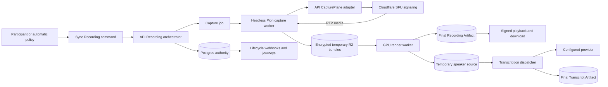
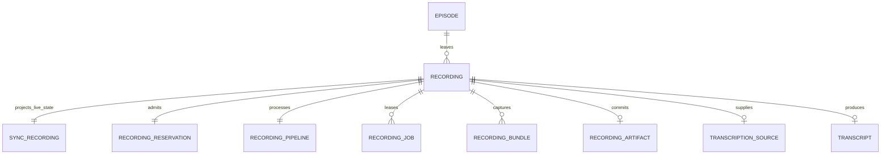
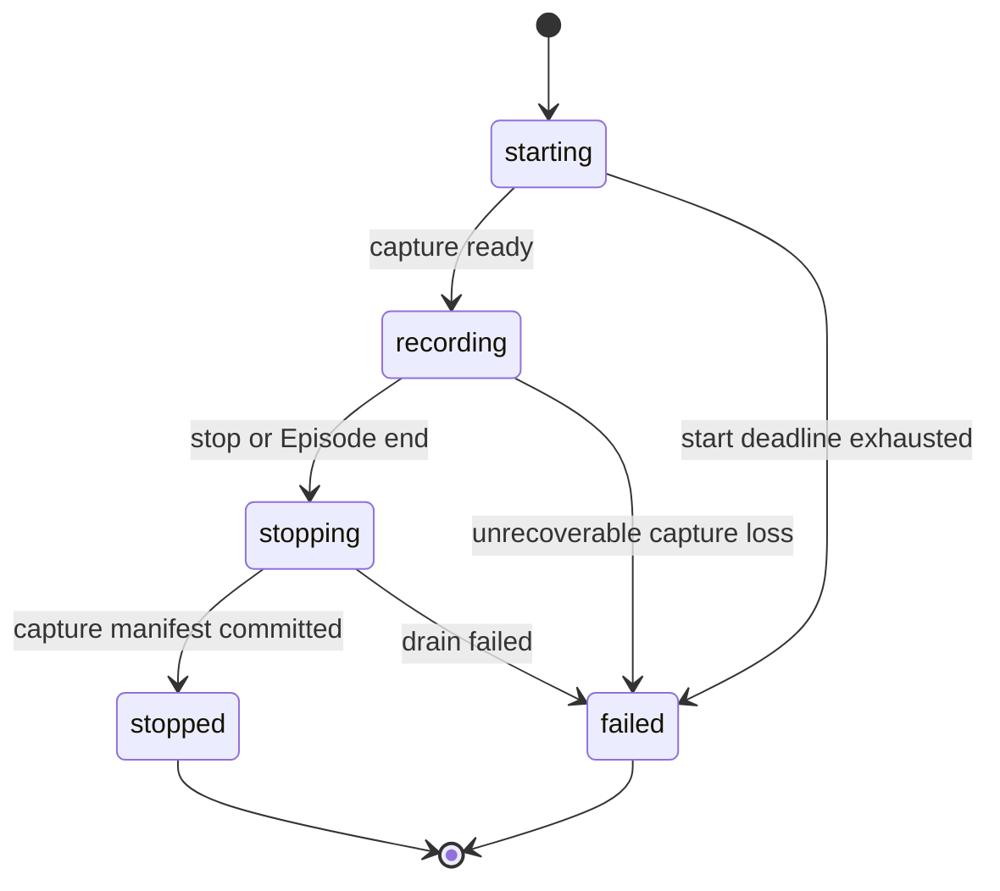
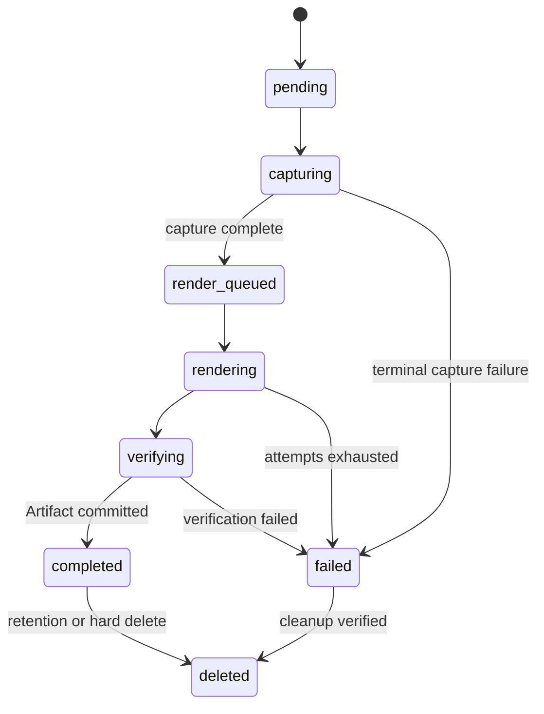
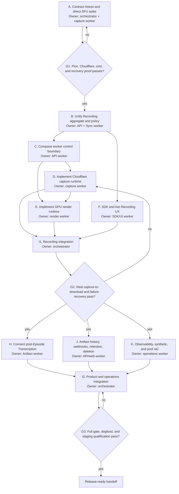

# Cloudflare SFU Recording and Post-Episode Transcription Spec

Status: Ready for product review
Owner: Hasan Shoaib

## Background

Chalk needs durable Recording and Transcript Artifacts for Episodes running on
the direct Cloudflare SFU media plane. Cloudflare forwards WebRTC media but does
not record, compose, store, attribute, or transcribe it. Chalk therefore owns
the headless recorder, deterministic composition, Artifact storage, and
post-Episode Transcription pipeline.

This is not a greenfield build. The repository already has:

- capability-gated Recording commands and durable live state in Sync;
- Recording CRUD, reservation, job, bundle, and Artifact tables in the API;
- fenced capture and render worker HTTP contracts;
- policy-only DigitalOcean, R2, and KMS infrastructure;
- a provider-neutral Transcription dispatcher, finalizer, and cleanup path;
- generated Recording and Transcript HTTP contracts; and
- dormant React Recording controls and Transcript presentation components.

The current pieces do not form one working journey. Sync sends
`recording.start` and `recording.stop` to the API provider bridge, but the
composed `SFUExecutor` returns `unsupported_effect`. The separate reservation
API mints another Recording identity. Recorder worker routes are not mounted in
the API runtime. Capture and GPU render providers are explicit placeholders.
Pipeline commit does not complete the public `recordings` row, and committed
Recordings do not start the post-Episode Transcript policy. No staging journey
has produced a verified downloadable Recording or final Transcript.

## Desired state

A Space declares how its Episodes are recorded, and a Tenant and Space declare
how completed Recordings are transcribed. The effective policy is frozen in the
Episode config snapshot. A permitted Participant can start or stop a manual
Recording. An automatic policy uses the same command and state machine without
blocking the Episode from becoming live.

Each start creates one immutable Recording identity that travels through Sync,
API control state, capacity reservation, capture and render jobs, R2 objects,
webhooks, SDK state, and any child Transcript. At most one Recording is active
in an Episode, but a later manual start can create a new Recording after the
previous one stops.

The launch Artifact is one deterministic, seekable 1280x720 MP4 at 30 frames
per second with H.264 video and AAC-LC mixed audio. Screen share has stage
priority. Without screen share, the active speaker owns the stage. A stable
strip shows at most six other Participants. Chalk does not retain customer-
facing isolated tracks or promise later layout editing.

Capture temporarily preserves isolated audio and an authenticated speaker-turn
manifest. Automatic Transcription starts after Recording commit. On-demand
Transcription can be requested before the temporary source deadline. The
default request window is 24 hours and cannot exceed the environment's 24-hour
v1 ceiling. Temporary audio is deleted within one hour after final Transcript
commit or when the request window expires. A Transcript uses authenticated
track ownership, not acoustic diarization, to attribute text.

Cloudflare SFU is the first `CapturePlane` adapter. A future mediasoup adapter
must pass the same conformance contract without changing domain state, public
SDKs, UI, Artifacts, or Transcription behavior. RealtimeKit managed Recording
and Transcription are not part of this design.

## Done

The work is complete only when all of these checks are observable:

1. A Space stores `disabled`, `manual`, or `automatic` Recording policy, and
   the resolved value is immutable in each Episode snapshot.
2. Tenant and Space Transcription policy resolves to `disabled`, `on_demand`,
   or `automatic`, with Tenant disablement overriding a Space setting.
3. Manual start and stop require `manageRecording`. Automatic start uses the
   same durable operation and cannot create a duplicate active Recording.
4. The same Recording ID exists across live state, public Artifact state,
   reservation, pipeline, jobs, bundles, final object, events, and Transcript
   source.
5. A real Cloudflare SFU Episode produces a verified 720p MP4 through the
   managed capture and render pools, then a signed download governed by the
   exact Artifact authorization contract below.
6. Starting, recording, stopping, stopped, and failed live states survive
   reconnects in the Sync projection. Pending, capturing, rendering, completed,
   failed, and deleted Artifact states appear through canonical history APIs on
   web and React Native.
7. Every Participant sees an accessible persistent Recording indicator. Manual
   start has confirmation; automatic Recording is disclosed and acknowledged
   before join on built-in and headless SDK paths.
8. Screen-share changes, active-speaker changes, Participant joins/leaves,
   track replacement, mute, and recorder reconnect follow the complete
   `composite_720p_v1` ordering, geometry, audio, and gap rules below. A golden
   timeline fixture produces the same output checksum on the qualified render
   image.
9. Killing a capture worker preserves committed bundles, fences the old
   attempt, resumes on a replacement, and records the exact gap.
10. Killing a render worker recovers through lease expiry without committing
    two final Artifacts.
11. Automatic Transcription completes from a real Recording. The one canonical
    on-demand endpoint completes before its source deadline, is idempotent, and
    returns typed `transcript.source_expired` after it.
12. Provider timeout, malformed response, retry, fallback, late result,
    finalization retry, and cleanup recovery reach correct terminal states.
13. The exact Recording and Transcript event matrix below is emitted through a
    transactional outbox, signed, retryable, idempotent, and linked to the
    originating journey and W3C trace.
14. Recording and Transcript retention and hard deletion stop new downloads,
    cancel or fence active work, remove every R2 object, preserve a minimal
    tombstone, and independently verify absence within the stated SLA.
15. The named Artifact-journey synthetic and monitor contract below proves
    user-visible success plus a real failure-to-recovery transition.
16. The Cloudflare SFU adapter passes a provider-neutral capture conformance
    suite that a future mediasoup adapter can run unchanged.
17. The focused API and Sync gates pass, generated contracts are current, the
    repository full gate passes remotely, and staging evidence records cost,
    capacity, latency, failure recovery, and object cleanup.

### Launch qualification ceiling

- 20 simultaneous recorded Episodes globally.
- 100 captured Participants globally.
- 10 Participants in one recorded Episode.
- 120 minutes per Recording.
- One active Recording per Episode.
- Capture input budget of 4 Mbps per recorded Episode.
- Capture bundles close every 10 to 15 seconds or earlier on a track-set
  boundary.
- Sync accepts start within five seconds. At the qualified load, capture reaches
  ready at p95 within 15 seconds or reaches a visible terminal start failure
  within 30 seconds.
- The final Recording becomes available within 30 minutes after capture stops
  under the qualified maximum ending-together workload.
- Automatic or on-demand Transcript becomes available within 30 minutes after
  Recording and source commit under that workload, or reaches a bounded visible
  failure by its job deadline.

If staging cannot prove these ceilings, production Recording remains disabled.
The implementation may lower a ceiling based on evidence, but it must not claim
an unproved value.

### Out of scope

- RealtimeKit managed Recording or Transcription.
- The mediasoup adapter implementation. Only its port and conformance contract
  ship now.
- Live captions or interim Transcript UI.
- A required-Recording mode that blocks an Episode from becoming live.
- Permanent isolated audio or video track Artifacts.
- Post-Episode layout editing or gallery re-rendering.
- Acoustic diarization or claims about multiple people behind one microphone.
- Client-side `MediaRecorder`, Chromium capture, or browser-owned persistence.
- End-to-end encrypted media that the recorder cannot decrypt.
- Recording beyond the launch Participant and duration ceilings.

## Canonical language

- A **Recording** is captured media left by an Episode.
- A **Transcript** is ordered attributed text left by a Recording.
- **Transcription** names the process that creates a Transcript.
- An **Artifact** is an immutable Episode output.
- A **Participant** is a per-Episode seat. Cloudflare sessions and tracks are
  provider references, not Participants.
- A **Capability** grants an action. UI and servers check `manageRecording` and
  never infer authority from a role name.
- A **CapturePlane** translates provider signaling into a provider-neutral
  recorder session. Cloudflare SFU and future mediasoup are adapters.

Meeting, room, session, call, host, attendee, and bot remain banned domain
terms. Vendored Cloudflare terms may appear only inside adapter code and
provider telemetry.

## Policy and behavior

### Policy resolution

Space owns mutable product policy:

```text
recording_policy.mode = disabled | manual | automatic
transcription_policy.mode = disabled | on_demand | automatic
```

Tenant owns `transcription_ceiling`, `transcription_default_mode`, provider
policy, final Artifact retention, and the maximum temporary-source window. The
ceiling and Space mode resolve as follows:

| Tenant ceiling | Space disabled | Space on-demand | Space automatic |
| -------------- | -------------- | --------------- | --------------- |
| disabled       | disabled       | disabled        | disabled        |
| on-demand      | disabled       | on-demand       | on-demand       |
| automatic      | disabled       | on-demand       | automatic       |

`transcription_default_mode` only seeds a newly created Space and must not be
consulted again for that Space. Tenant retention and source-window changes are
resolved with current Space policy when the next Episode starts. A later Space
or Tenant change never mutates a live or completed Episode.

Persistence uses non-null `spaces.recording_policy` and
`spaces.transcription_policy` enum columns with `disabled` defaults, plus one
`tenant_artifact_policies` row containing the ceiling, default, provider policy,
Recording retention, Transcript retention, and source-window seconds. The
Episode snapshot schema advances to `episode_config.v2` and freezes:

```text
artifact_policy.recording.mode
artifact_policy.recording.profile = composite_720p_v1
artifact_policy.recording.retention_seconds
artifact_policy.transcription.mode
artifact_policy.transcription.provider_policy_version
artifact_policy.transcription.retention_seconds
artifact_policy.transcription.source_window_seconds
```

Only a Tenant write principal can change Tenant policy. Space policy uses the
existing Space mutation authority. The API validates enum values, retention
bounds, the 24-hour v1 source ceiling, and default-versus-ceiling compatibility
before commit. Snapshot decoding is versioned and fails closed on an unknown
Artifact policy version.

The v1 Recording profile is server-owned and fixed at `composite_720p_v1`.
There is no public layout builder or codec selector.

### Manual Recording

1. A Participant with `manageRecording` selects Record.
2. UI confirms that Chalk will create a composite Recording, names who can
   access it, shows retention, and states that Transcription is separate.
3. Sync validates the effective policy, capability, Episode state, and absence
   of another active Recording. It mints one Recording ID and stores a durable
   start operation in the same transaction.
4. The API Recording orchestrator consumes the start operation idempotently. It
   creates the public Recording, reservation, pipeline, and capture job using
   the supplied ID, then acknowledges reservation within Sync's five-second
   external-operation deadline. This acknowledgment does not mean media is
   ready.
5. The capture worker claims the job, establishes its provider session, pulls
   the current track set, and reports media readiness.
6. The API writes a fenced `recording_capture_ready` operation back to Sync only
   after the capture worker has a connected PeerConnection and has observed the
   required initial media or an explicit audio-only/no-publisher state. The
   operation carries Recording ID, capture epoch, attempt, readiness timestamp,
   and a stable idempotency key. Only this operation changes `starting` to
   `recording`.
7. All Participants receive the persistent indicator, accessible announcement,
   and optional sound cue. `started_at` is actual capture readiness, not command
   time.

Capacity or provider failure leaves the Episode live. It produces a durable
failed Recording and visible failure. Chalk never represents the missed opening
as captured.

### Automatic Recording

Episode emergence reads only the effective immutable policy. `automatic`
creates a first-class internal `start_recording` operation authenticated as the
Chalk policy engine, with actor kind `system`, actor ID `recording_policy`, and
an idempotency key derived from Episode ID plus policy snapshot version. Sync's
internal-operation allowlist accepts this authority without inventing a
Participant, then calls the same validation, reducer, API effect, readiness, and
audit path as manual Recording. It does not block join or create a second state
machine.

The Entrance discloses automatic Recording before join. Once live, the same
starting, recording, failure, and stop UI applies to every Participant.

### Stop and Episode end

A Participant with `manageRecording` may stop an active Recording. Episode end,
the 120-minute limit, or a terminal capture failure can also request stop.

Stop moves live state to `stopping`, closes the current bundle, freezes the
capture manifest, and prevents new provider tracks from being pulled. The
provider acknowledgment confirms only that the stop was reserved; it leaves the
Recording in `stopping`. When capture completion is durable, the API writes an
idempotent `recording_capture_stopped` operation back to Sync with the Recording
ID, originating stop operation ID, capture epoch, attempt, completion timestamp,
and stable request key. Sync checks those fences before changing the Recording
to `stopped`. Rendering continues as Artifact processing and does not keep the
Episode live.

A later manual start in the same live Episode creates a new Recording ID. At
most one may be starting, recording, or stopping at a time.

### Recording failure

- Retryable control, worker, node, or provider failure keeps the operation
  fenced and bounded by its deadline.
- Replacement resumes from committed bundle sequence and creates a new capture
  epoch.
- Any unobserved interval becomes a `CaptureGap` with reason and timestamps.
- Exhausted capture failure creates no partial public download. Temporary
  objects enter verified cleanup.
- Render failure never changes the historical fact that capture occurred, but
  the Recording Artifact remains failed and unavailable.
- Failure codes are bounded domain codes such as
  `recording.capacity_unavailable`, `recording.capture_unavailable`,
  `recording.capture_lost`, `recording.render_failed`, and
  `recording.verification_failed`.

### Transcription

`disabled` rejects Transcript creation. `automatic` creates one Transcript job
after the Recording and its authenticated speaker source commit. `on_demand`
allows an authorized request before persisted
`transcription_source_expires_at`.

The request window defaults to 24 hours and cannot exceed 24 hours in v1. The
API and UI show the deadline. After expiry, the API returns HTTP 409 with
`transcript.source_expired`; it does not fall back to mixed-audio diarization.

The speaker-turn manifest maps every chunk-local timestamp to Recording time and
contains the opaque Participant ID, track epoch, track class, overlap state,
checksums, and the authorization-time display-name snapshot. Providers receive
audio and opaque job identifiers only. They do not receive display names,
Tenant IDs, Space titles, emails, or reusable object URLs.

`POST /v1/tenants/{tenant_id}/recordings/{recording_id}/transcripts` is the one
canonical request endpoint. It returns 202 with the Transcript and job. The
same idempotency key returns the original result; a different key returns
`transcript.already_exists` with the existing Transcript when one non-deleted
Transcript already exists. The legacy synchronous `/transcriptions` route and
mixed-MP4 provider path are removed from public contracts rather than aliased.
Generated SDK errors include `transcript.disabled`,
`transcript.source_expired`, `transcript.already_exists`, and bounded provider
failure codes.

`transcription_sources` persists source status, object manifest, checksum,
`expires_at`, active lease owner/deadline, and deleted timestamp. The request
transaction locks that row, rejects expiry before creating a job, and acquires
the source lease atomically.

One provider runs at a time. Retry and fallback are classified and fenced; no
request racing can create two paid successes. The final private
`transcript.v1` document preserves per-cue provider/model/version facts, sorted
languages, gaps, and overlap. A Transcript failure never invalidates its
Recording.

## System design

### End-to-end flow



### Authority boundaries

- Sync is authoritative for live Recording command state, capability checks,
  and the current active Recording in an Episode.
- API/Postgres is authoritative for public Recording state, reservation,
  processing jobs, Artifact facts, retention, and Transcript lifecycle.
- R2 is authoritative for immutable media/document bytes only after API-side
  verification and commit.
- Cloudflare SFU forwards media and owns opaque provider sessions/tracks. It is
  never the source of Participant identity or Artifact state.
- Worker memory owns plaintext media and data keys only for the bounded job.
- Notifications, worker processes, DigitalOcean nodes, and Lambda invocations
  are disposable projections.

### One Recording identity

The existing independent creation paths are collapsed into one aggregate:



Sync mints the Recording ID. The API `StartRecording` operation accepts that ID
and uses it for every downstream row. A unique partial index enforces one active
Recording per Episode. Because Sync acceptance and API materialization are
separate transactions, a reconciler detects any accepted operation without its
public aggregate and retries or terminates it. No second public reservation API
may mint a competing Recording.

Public pipeline reservation and inspection routes become internal operational
routes. Public API surfaces are list/get/delete Recording, signed download, list
Episode Artifacts, request/get/delete Transcript, and signed Transcript
download. Start and stop enter the durable Sync command path.

The existing public create/update Recording routes, public reservation routes,
legacy synchronous Transcription route, and their generated SDK methods are
removed. Internal materialization requires a Sync-originated operation whose
Recording ID and Episode ID match the current durable projection. Contract tests
prove there is no public route that creates, patches, reserves, or commits a
Recording.

Render commit is one database transaction. It verifies the server-generated
object key and object facts, inserts `recording_artifacts`, marks the render job
and pipeline committed, and updates the public `recordings` row to `completed`
with the same key, checksum, duration, and completion time. A failed transaction
publishes none of those facts. A reconciler reports and repairs any legacy or
corrupt aggregate where pipeline and public state disagree.

### Artifact authorization and API contract

V1 deliberately keeps the existing Tenant authorization model. Episode
participation alone grants no Artifact access:

| Operation                                 | Required scope                                      | Minimum Tenant role |
| ----------------------------------------- | --------------------------------------------------- | ------------------- |
| Recording or Transcript list/get/download | matching `recordings:read` or `transcriptions:read` | observer            |
| Request Transcript                        | `transcriptions:write`                              | collaborator        |
| Delete Recording                          | new `recordings:delete`                             | collaborator        |
| Delete Transcript                         | `transcriptions:delete`                             | collaborator        |

Every service method resolves Recording to Tenant, Space, and Episode before
authorization. A mismatched Tenant or parent returns the same 404 as an unknown
Artifact. List queries cannot escape the authorized Tenant. Cross-Tenant API
keys, a Participant without Tenant membership, and principals without the exact
scope are denied. Manual confirmation and automatic disclosure say that people
and services in the Chalk Tenant with Artifact read access can open the output.

`ChalkServerClient` exposes `recordings.list/get/delete/createDownloadURL` and
`transcripts.request/list/get/delete/createDownloadURL`. All accept typed IDs,
all mutation methods accept standard Chalk idempotency options, and no response
contains an R2 key. Download URLs are issued only for completed, non-deleting
Artifacts and inherit this authorization check.

### CapturePlane boundary

The API holds provider credentials. Capture workers never receive the
Cloudflare App Secret, DigitalOcean token, database credential, KMS credential,
or reusable R2 credential.

Each claim returns an immutable `recorder_job.v1` envelope with its SHA-256
digest: Tenant, Space, Episode, Recording, job, attempt, capture epoch, policy
snapshot version, hard deadline, initial plan revision, bundle schema, layout
profile, codec/input limits, and opaque handles for plan, signaling, key, and
object authority. Every worker mutation repeats job, attempt, epoch, envelope
digest, and lease token. The API rejects stale or cross-envelope authority.

The recorder worker router is mounted under the existing private worker
boundary in API composition. It gets an explicit service, verifier, mTLS or
private-network policy, readiness dependency, and route integration tests. Its
fenced endpoints cover claim, heartbeat, progress, fail, complete, plan wait,
SDP exchange, bundle allocation/commit, key access, render allocation/commit,
and cleanup. No recorder endpoint is mounted on the public router.

The provider-neutral signaling port is:

```text
CreateCaptureSession
PullCaptureTracks
RenegotiateCaptureSession
InspectCaptureSession
CloseCaptureTracks
CloseCaptureSession
```

Its inputs use Chalk `EpisodeID`, `RecordingID`, capture epoch, and a sorted set
of `CaptureTrack` values. A `CaptureTrack` contains an opaque provider owner
reference, opaque provider track reference, Participant ID and generation,
source, kind, and requested layer. Outputs contain opaque capture-session
references, SDP descriptions, negotiation requirements, and bounded provider
errors.

`CloudflareSFUCapturePlane` translates those operations to:

- `POST /v1/apps/{appId}/sessions/new`;
- `POST /v1/apps/{appId}/sessions/{id}/tracks/new` with remote owner session
  and track name;
- `PUT /sessions/{id}/renegotiate`;
- `GET /sessions/{id}`; and
- `PUT /sessions/{id}/tracks/close`.

The worker owns the Pion `PeerConnection` and exchanges SDP through job-scoped
internal control endpoints. The API calls Cloudflare with the App Secret.
`autoDiscover` is prohibited because random provider track names cannot prove
Chalk Participant identity.

One serialized command queue owns each provider capture session. A command is
keyed by Recording ID, capture epoch, plan revision, and operation kind; its
result is cached for retries. The queue waits for connected state, batches at
most 64 pulls, budgets below 50 API calls per second, and never applies an SDP
answer outside the epoch that created its offer. `tracks/new` handles both
Cloudflare-offer and client-offer response shapes exactly as the Connection API
defines, and `renegotiate` completes before the next SDP-changing operation.
An inactive pulled track is repulled before the 30-second deadline when the
authoritative publication still exists. A lost PeerConnection increments the
capture epoch, abandons all old SDP authority, creates a new provider session,
and records the gap.

Future `MediasoupCapturePlane` implements the same Chalk port and conformance
suite. Provider-specific session IDs, producers, consumers, transports, and
router vocabulary remain inside that adapter.

### Publication and layout feed

The existing authenticated publication reference is the source for capture
targets. Every target retains Participant generation so a reconnect cannot
reuse a stale provider session or track.

The recorder control API issues a `CapturePlan` containing:

- a monotonic plan revision and Episode control revision;
- Participant/display-name snapshots;
- current audio, camera, and screen-share publication references;
- requested simulcast layer and bitrate budget;
- layout policy version; and
- stop/deadline state.

The worker long-polls a job-scoped plan endpoint by revision. Each update
reconciles provider tracks idempotently. The capture worker derives active
speaker from RTP audio levels using versioned VAD and hysteresis. Screen-share
publication state selects stage priority. Track replacement creates a new
track epoch. Plan and observed-media transitions enter the immutable bundle
timeline.

`composite_720p_v1` freezes these rules:

1. Timeline events sort by media timestamp, plan revision, track epoch, event
   kind ordinal, and Participant ID. The renderer uses hard cuts with no
   timing-dependent animation.
2. A flowing screen share wins the stage. If several exist, the earliest
   observed start wins, with Participant ID and track epoch as tie-breakers. A
   winner remains until stop, replacement, or 500 milliseconds without a frame;
   the next candidate then wins.
3. Without a screen share, decoded audio is measured in 100-millisecond buckets.
   A candidate must be above -50 dBFS, lead the current speaker by 6 dB for one
   second, and win ties by Participant ID. A selected speaker stays for at least
   two seconds and is released after 1.5 seconds below threshold. With no
   candidate, the last valid stage remains; if it has left or lost video, the
   lowest join ordinal with a camera wins, then Participant ID.
4. The stage is pixels `(0,0)-(1280,540)`. Screen video uses `contain` with a
   black matte. Camera video uses centered `cover`. A missing stage camera uses
   the versioned Chalk no-video tile rendered with the packaged font. A video
   gap longer than 500 milliseconds changes immediately to that tile and adds a
   `CaptureGap`; no prior frame is stretched across it.
5. The strip is pixels `(0,540)-(1280,720)`. It contains at most six flowing
   camera sources, excluding a Participant whose camera owns the stage. Sources
   sort by immutable join ordinal then Participant ID. For `n` sources, cells
   divide 1280 pixels equally; remainder pixels are assigned left to right.
   Cells use centered `cover`; absent cells do not render.
6. All audible tracks are decoded to 48 kHz stereo. Muted, missing, and gap
   intervals contribute silence. The offline two-pass mix applies equal gain to
   overlapping speakers, targets -16 LUFS integrated loudness, and limits true
   peak to -1.5 dBTP. It never ducks non-stage Participants. The pinned render
   image, resampler, packaged font, colors, and H.264 encoder settings are part
   of the profile version.

The profile has one canonical timeline plus media fixture covering simultaneous
screen shares, equal audio levels, replacement, mute, reconnect, overlap, and
gaps. Any rule change creates a new profile version and never changes an
existing Recording.

Cloudflare sessions and tracks time out after 30 seconds without media. A muted
or reconnected source can therefore require a new pull. The worker treats this
as a track lifecycle change, not a new Participant unless Chalk generation also
changes.

### Capture bundles

Capture remains separate from rendering. Each 10 to 15-second immutable bundle
contains codec-native fragments, timeline events, track epochs, media and
monotonic timestamps, sequence, checksums, encryption facts, and capture epoch.
Track-set changes may close a bundle early.

Each bundle uses a per-Recording data key under the Singapore KMS key and
authenticated context containing environment, Tenant, Episode, Recording, job,
and bundle schema. Plaintext keys reach only the bounded worker process. Bundle
objects use conditional writes and are never overwritten.

The control plane is the key broker because worker roles have no reusable KMS
authority. After mTLS, lease, attempt, epoch, and envelope verification, it
returns a short-lived plaintext data key over the protected channel to the
specific capture or render process. The response is non-cacheable, never
persisted or logged, and bound to the complete KMS encryption context. Capture
gets generate authority once per Recording epoch; render gets decrypt authority
only for bundle contexts in its manifest. Broker audit facts contain identifiers
and outcome, never key material.

Object keys are generated by the API from the aggregate and sequence, never
submitted by a worker. Each upload token is opaque and bound to method, job,
attempt, epoch, canonical key, expected checksum/size range, content type, and
expiry. Commit rereads object version, size, checksum, and type from R2 and
compares them to the allocation before accepting worker metadata.

`recording_bundle.v1` is frozen before capture and render work splits. It
contains envelope digest, bundle schema/version, Recording ID, capture epoch,
strictly increasing sequence, closed time range, codec-native track fragments,
track and layout timeline, checksums, object version, and encryption context.
Unknown versions fail closed. Capture and render share canonical fixtures for
empty, track-boundary, overlap, gap, reconnect, and final bundles.

Capture subscribes to every audible Opus track, the active screen share at a
legible layer, the active speaker at the stage layer, and bounded low layers for
the Participant strip. Thumbnail quality degrades before screen-share
legibility. The admission controller enforces the 4 Mbps per-Recording input
budget.

### Rendering and speaker source

The render worker runs native FFmpeg/GStreamer processing, not Chromium. It
decrypts bundles in memory, replays the versioned layout timeline, mixes audio,
produces the MP4, verifies it with `ffprobe`, and uploads through a conditional
job-scoped URL. API-side verification checks object existence, size, checksum,
content type, codec/profile, resolution, frame rate, seekability, and duration
before atomic commit.

The same decode pass creates a speaker-turn manifest and bounded mono 16 kHz
audio chunks. Non-overlapping speech is emitted once from its authenticated
track. Overlap is emitted once per audible Participant and marked explicitly.
The final Recording does not depend on successful Transcription.

### State machines

Live state and Artifact processing are separate projections:





Transcript state remains `pending`, `processing`, `completed`, `failed`, and
`deleted` publicly, with fenced internal preparation, chunk, finalization, and
cleanup states.

## Public SDK and UI

### SDK surface

The closed hook set remains unchanged. React and React Native read Recording
state through `useConnection()` and issue commands through `useSpaceClient()`.
No `useRecording` or `useTranscript` hook is added.

`ConnectionSlice` gains `recording: RecordingProjection | null`:

```text
recordingId: string
state: starting | recording | stopping | stopped | failed
startedAt: string | null
stoppedAt: string | null
initiator: { kind: participant | system, participantId: string | null }
failureCode: RecordingFailureCode | null
```

`SpaceClient.startRecording()` resolves to `{ recordingId }` only after Sync has
durably accepted `starting`; it generates and persists one command ID and
Recording ID across retries. `SpaceClient.stopRecording()` resolves after Sync
durably accepts `stopping`. Both reject with typed capability, disabled,
conflict, ended, unavailable, or deadline failures. Reconnect replaces any local
projection with the authoritative Sync snapshot. `recordingChanged` is the only
new `ClientEventMap` event and carries the complete old and new projection.

Processing and completed states do not enter `ConnectionSlice`. Artifact
history and Transcript requests use the generated HTTP/server SDK contract
defined above. The server client returns typed domain values, idempotent mutation
results, and typed errors, never browser-visible storage keys.

React and React Native maintain identical component props, feature names,
states, and commands. Differences are limited to platform rendering, sound,
and OS accessibility seams.

Both packages export the same `RecordingNotice` value and
`EpisodeArtifactHistory` props. An access grant includes the signed effective
Recording mode, notice version, Artifact accessor description, and retention
summary. Built-in Entrance renders this value rather than accepting arbitrary
copy. A headless caller must pass the matching notice version as
`join({ recordingNoticeAcknowledged })` when mode is `automatic`; otherwise the
SDK and join endpoint reject before media publication. This acknowledges
disclosure, not legal consent.

### Live Recording UX

- `disabled` hides Recording actions.
- `manual` shows Record only when `useCan("manageRecording")` is true.
- `automatic` discloses Recording in the Entrance and starts without a second
  Participant confirmation.
- Starting shows progress and does not display a red active indicator until
  capture is ready.
- Active Recording shows persistent icon plus text, actual elapsed time, and an
  accessible announcement. Color is not the only signal.
- Stop requires capability and confirms the action.
- Unexpected stop or failure is announced to every Participant and remains in
  Episode history.
- Recording start, stop, and failure use distinct optional sound cues with an
  equivalent visual/text signal.

The persistent indicator has accessible name `Recording in progress`; elapsed
time is excluded from its live region. Start, stop, and failure produce one
polite live-region announcement and return focus to the invoking control after
confirmation. Controls have stable names `Start recording`, `Stop recording`,
and `Cancel`. React Native mirrors these through `accessibilityLabel`,
`accessibilityRole`, `accessibilityLiveRegion`, and one
`AccessibilityInfo` announcement. The feature supports keyboard operation,
200% text, WCAG AA contrast, reduced motion, and sound disabled through the
existing media preference. All copy uses versioned localization keys. Entrance
bypass cannot bypass the signed notice-version acknowledgment.

The existing live `TranscriptPanel` remains unwired because live captions are
out of scope. Post-Episode Transcript does not masquerade as interim live text.

### Episode Artifact history

The first-party web app and embedding examples consume canonical APIs to show:

- each Recording with captured interval, duration, state, failure, retention,
  playback, and download;
- Transcript policy and on-demand request deadline;
- Transcript processing, failure, retry eligibility, and completion;
- attributed Transcript search and export after completion; and
- hard-delete confirmation and terminal result.

The hosted Artifacts route stops using fixtures. Demo applications remain thin
and do not own Artifact state.

`EpisodeArtifactHistory` ships on React and React Native with the same Recording
and Transcript states, actions, accessor copy, expiry copy, and retry rules.
Platform-native playback and file sharing may differ, but neither package may
invent a local Artifact store or omit the on-demand Transcript deadline.

## Security, privacy, and retention

- Workers authenticate with replay-resistant job authority and mTLS where the
  existing worker boundary requires it.
- Every object URL is method, key, checksum, size, expiry, and attempt scoped.
- Provider credentials and plaintext data keys never enter worker images,
  environment logs, database rows, browser bundles, or Artifact metadata.
- Logs and traces exclude media, Transcript text, display names, object URLs,
  credentials, and unbounded provider responses.
- Manual confirmation and automatic Entrance disclosure are product notices,
  not a claim that Chalk supplies every jurisdiction's legal consent basis.
- Temporary capture objects are deleted within one hour after successful
  downstream commit. Temporary speaker sources follow the lease rules below;
  the 24-hour lifecycle rule is an orphan safety net, not the primary deletion
  mechanism.
- Final Recording and Transcript retention is Tenant-configurable. Hard delete
  overrides retention, stops new download authority, deletes R2 bytes, verifies
  absence, and records a durable tombstone for backup-restore reconciliation.
- Recording gains a real delete service and API. Transcript deletion keeps its
  existing fenced cleanup model.

Temporary speaker-source transitions are deterministic:

| Situation                         | Result                                                                                                   |
| --------------------------------- | -------------------------------------------------------------------------------------------------------- |
| No job starts before `expires_at` | Atomically mark expired, reject new jobs, and delete within one hour.                                    |
| A job leases before `expires_at`  | Keep source until that fenced job commits or reaches its hard deadline, at most two hours beyond expiry. |
| Transcript commits                | Release the lease and delete source within one hour.                                                     |
| Job fails retryably               | Keep the same bounded lease; fallback does not extend the hard deadline.                                 |
| Job fails terminally              | Release the lease and delete within one hour.                                                            |
| Hard delete begins                | Reject new work, cancel/fence the active job, wait up to 30 seconds for worker exit, then delete source. |

Recording deletion is an aggregate workflow, not a direct row delete. It marks
the Recording `deleting`, blocks new signed URLs and Transcript requests,
cancels/fences jobs, walks every bundle/source/final/transcript object from
server-owned manifests, deletes all R2 versions, and verifies absence before
marking `deleted`. Restrictive foreign keys remain until dependents reach
terminal cleanup; a minimal tombstone then retains Tenant, Recording, deletion
time, object-key hashes, and deletion journey without media or Transcript text.
The same tombstone suppresses restoration from backups.

Signed download URLs have a five-minute maximum, target private non-cached R2
objects, and return `Cache-Control: private, no-store`. Hard delete can prevent
future issuance and make an existing URL return 404 after origin deletion, but
it cannot retract bytes already downloaded or guarantee termination of an
in-flight response. The deletion SLA is one hour from accepted request to
verified origin absence; UI states `deleting` until then. Legal hold is not a v1
feature, so there is no hidden exception to that SLA.

### Lifecycle events

V1 emits exactly these public webhook events:

| Event                  | Commit boundary                                                     |
| ---------------------- | ------------------------------------------------------------------- |
| `recording.started`    | Capture readiness commits to the public aggregate.                  |
| `recording.completed`  | Verified final Artifact and public Recording commit atomically.     |
| `recording.failed`     | A start, capture, render, or verification failure becomes terminal. |
| `recording.deleted`    | Every known origin object is absent and the tombstone commits.      |
| `transcript.started`   | Automatic or on-demand job admission commits.                       |
| `transcript.completed` | Final Transcript Artifact commits.                                  |
| `transcript.failed`    | Transcription becomes terminally failed.                            |
| `transcript.deleted`   | Transcript bytes are absent and its tombstone commits.              |

Processing, source expiry, and internal cleanup do not add public events in v1.
Each transition inserts an immutable webhook snapshot into the generic outbox
in the same database transaction. The semantic key is Artifact ID plus event
name plus terminal generation. Delivery uses the existing signature,
idempotency, retry, fixture, and SDK verification contract. Journey ID, trace
context, policy/profile version, timestamps, and bounded failure code are
included; object keys, signed URLs, source manifests, and Transcript text are
not.

## Observability and operations

The originating journey ID and W3C trace context propagate through client,
Sync command, provider operation, API orchestration, job creation, worker claim,
Cloudflare signaling, bundle upload, render, verification, Transcript request,
provider call, finalization, webhooks, and cleanup. Async work uses span links
to its durable parent.

Metrics and structured logs cover:

- start/stop acceptance and rejection by bounded reason;
- admission capacity and qualified pool health;
- capture connect time, first-media time, pulled tracks, input bitrate, gaps,
  reconnects, and SFU egress bytes;
- bundle cadence, bytes, encryption, and upload failures;
- render queue delay, real-time factor, GPU time, output verification, and
  deadline misses;
- Recording completion/failure and signed-download creation;
- Transcript request, source expiry, provider/model/version, measured audio,
  retry/fallback, quality metadata, finalization, and cleanup; and
- lifecycle webhook delivery and hard-delete completion.

Identifiers with unbounded cardinality remain trace attributes or structured
fields, not metric labels. No sensitive payload is added for observability.

Recorder admission keeps the public-safe capture and render health endpoints.
The end-to-end monitor is separate:

- `artifact-journey` runs every 30 minutes with a dedicated synthetic Tenant,
  generated media, scoped API credential, and unique run ID. It starts and ends
  one bounded Episode, waits for Recording and Transcript completion, verifies
  authenticated reads and checksums, hard-deletes both, and verifies 404/absence.
- `GET /internal/monitors/artifact-journey` accepts only a read-only monitor
  bearer token from the uptime-worker secret binding. It returns sanitized
  `status`, `run_id`, `started_at`, `finished_at`, stage durations, bounded
  failure code, and cleanup result. It never returns customer or object data.
- `infrastructure/uptime-worker` registers key `artifact-journey` at critical
  severity. It polls every five minutes, requires the latest successful journey
  to be under 90 minutes old, opens after two consecutive failed/stale checks,
  and recovers after two consecutive healthy checks.
- The staging release run additionally kills one capture or render worker and
  one Transcription attempt, then proves replacement and recovery. Routine
  production synthetics do not inject failure.

Lane K adds
`pnpm run verify:artifact-journey -- --environment staging --run-id <unique>`.
It writes raw evidence with exact cloud identifiers under ignored `.private/`
and a redacted `artifact-journey-evidence.v1` summary under
`scratchpad/qualification/<commit>-<run-id>.md`. The summary records commit,
environment alias, run ID, profile/policy versions, qualified ceilings, cost,
stage latency, injected failure, recovery, object absence, monitor alert and
recovery timestamps, and links to private evidence. A handler-only Lambda or
worker liveness check is not acceptable proof.

## Verification

### Focused automated proof

- Full Tenant-ceiling/Space-mode policy matrix, mutation authorization,
  migration defaults, and immutable versioned Episode snapshot tests.
- Sync reducer and Postgres tests for manual, automatic, disabled, duplicate,
  reservation acknowledgment, fenced readiness, stop, Episode end, failure,
  and recovery.
- One Recording ID invariant across every persistence table, plus contract tests
  proving public create/update/reservation routes do not exist.
- Artifact authorization tests for every operation, exact scope/role boundary,
  parent mismatch, unauthorized Participant, and cross-Tenant isolation.
- `CapturePlane` conformance tests with a fake adapter and Cloudflare request
  contract tests.
- Pion media tests for codecs, simulcast selection, track replacement, mute,
  reconnect, gaps, and bounded backpressure.
- Worker auth, lease fencing, expired attempt, conditional object write, KMS
  context, checksum, and bundle sequence tests.
- Golden render tests for the complete `composite_720p_v1` tie-breakers,
  geometry, packaged font, audio mix, overlap, gaps, codec/profile, duration,
  and deterministic checksum on the pinned image.
- Atomic Recording/public-row completion, authorization-gated short download,
  exact lifecycle webhook matrix, retention, in-flight deletion races, every
  object version, hard deletion, and backup-suppression tombstone tests.
- Automatic/on-demand/disabled Transcript tests, source expiry, one-provider
  source lease and delete races, duplicate idempotency, legacy-route absence,
  fallback, late commit, finalization, and cleanup tests.
- React and React Native public-surface, capability, signed notice
  acknowledgment, focus/live-region/native announcement, and state parity tests.
- Monitor registry and failure/recovery projection tests.

### Direct Cloudflare SFU staging spike

Before production runtime implementation builds on the adapter, prove:

1. One native Pion capture session can pull Cloudflare Opus plus every supported
   video codec/profile required by Chalk.
2. `tracks/new`, Cloudflare-offer renegotiation, client-offer negotiation, and
   repeated track reconciliation are serialized, epoch-bound, and idempotent
   under retries.
3. Simulcast layer selection stays within the 4 Mbps input budget.
4. Intentional mute beyond Cloudflare's 30-second track timeout resumes through
   an explicit repull.
5. Recorder connection loss creates a new provider session, re-pulls the
   authoritative publication set, and records the exact gap.
6. A ten-Participant Episode remains stable for 120 minutes at the qualified
   node class.
7. Measured Cloudflare egress, DigitalOcean compute, R2 bytes, render GPU time,
   and Transcript provider seconds fit the launch cost model.

The Cloudflare limit baseline is 50 API calls per second per session, 64 tracks
per add call, practical session capacity bounded by bandwidth, and 30-second
inactive-track collection. These are verified against the current official
[Connection API](https://developers.cloudflare.com/realtime/sfu/https-api/),
[limits](https://developers.cloudflare.com/realtime/sfu/limits/), and
[pricing](https://developers.cloudflare.com/realtime/sfu/pricing/) before each
qualification run.

### Release proof

- Run API and Sync focused gates after their files change.
- Regenerate OpenAPI, Effect schemas, TypeScript SDKs, and webhook fixtures.
- Run the canonical repository gate on `agents-macmini` from an exact commit.
- Dogfood manual and automatic Recording plus on-demand and automatic
  Transcription in real web and React Native flows.
- Kill capture, render, and Transcription workers during staging journeys and
  verify user-visible recovery or correct terminal failure.
- Verify the scheduled synthetic, monitor ingestion, alert, public status
  projection where applicable, and recovery with the exact unique staging run
  ID and redacted evidence summary.
- Production remains untouched until Hasan explicitly approves the exact
  environment and deployment identifiers.

## Execution DAG



### Resumable phase checklist

| ID  | Owner                                | Interface contract and deliverable                                                                                                                                      | Scope fence                                           |
| --- | ------------------------------------ | ----------------------------------------------------------------------------------------------------------------------------------------------------------------------- | ----------------------------------------------------- |
| A   | Orchestrator plus one capture worker | Ratified `CapturePlane`, `recorder_job.v1`, `recording_bundle.v1`, and `composite_720p_v1` contracts plus recorded Cloudflare/Pion spike evidence                       | No product implementation, production cloud, or UI    |
| B   | API + Sync worker                    | One Recording ID, policy/snapshot schema, manual/system authority, reservation/readiness operations, removal of competing public routes, migrations, generated contract | No worker media runtime or UI                         |
| C   | API worker                           | Mounted private recorder routes, immutable envelopes, plan/SDP queue, key broker, and scoped object authority                                                           | No capture codec or render implementation             |
| D   | Capture worker                       | Cloudflare adapter, Pion runtime, plan reconciliation, versioned encrypted bundles, reconnect/gap proof                                                                 | No render, public API, or UI                          |
| E   | Render worker                        | Pinned GPU runtime, deterministic MP4, speaker source, server-verified atomic public commit                                                                             | No capture signaling or SDK                           |
| F   | SDK/UI worker                        | Live projection/commands, Artifact server client/history, React/RN parity, signed disclosure, indicators, sounds, accessibility tests                                   | No backend state invention or live captions           |
| I1  | Orchestrator                         | Reconciled capture, render, public Recording, SDK state, and real failure proof                                                                                         | No new feature scope                                  |
| H   | Artifact worker                      | Canonical idempotent Transcript endpoint, automatic/on-demand/disabled policy, persisted source leases/expiry, dispatcher, verified cleanup                             | No live captions or diarization                       |
| J   | API/web worker                       | Exact Artifact authorization, history, event matrix/outbox, delete/retention/tombstone, server SDK                                                                      | No duplicate Artifact model                           |
| K   | Operations worker                    | Pool reconciler/IaC, trace/metrics, named synthetic target, monitor thresholds, evidence command, and recovery proof                                                    | No fake handler-only health check or production apply |
| I2  | Orchestrator                         | Cross-surface product and operations integration, exact release candidate                                                                                               | No unresolved lane-owned changes                      |
| G3  | Orchestrator                         | Remote full gate, dogfood, staging qualification, bounded review                                                                                                        | No production mutation                                |

## Anti-slop rules

- Do not use RealtimeKit managed Recording or Transcription.
- Do not let Cloudflare session or track vocabulary leak into domain contracts.
- Do not give workers Cloudflare App Secrets, KMS credentials, database access,
  reusable R2 credentials, or DigitalOcean tokens.
- Do not create a second Recording ID, state machine, reservation path, or
  dashboard-only Artifact model.
- Do not use client-side capture, Chromium composition, or an application tab as
  the durability boundary.
- Do not retain isolated tracks as customer-facing Artifacts.
- Do not invent media to hide a gap or relabel a provider track without a valid
  Participant generation.
- Do not use Cloudflare `autoDiscover` for authenticated capture targets.
- Do not add public React/RN hooks outside the glossary's closed set.
- Do not wire the current live Transcript panel to post-Episode Artifacts.
- Do not infer authority from `owner`, collaborator, or any other role name.
- Do not expose object keys, provider choice, retry policy, or queue priority to
  public callers.
- Do not emit sensitive payloads, display names, Transcript text, or high-
  cardinality identifiers in metrics.
- Do not claim health from process liveness when the complete Artifact journey
  can still fail.
- Do not call local fixtures, mocked providers, IaC validation, or a green unit
  suite production qualification.
- Do not touch production without explicit approval in the active thread.

## Primary references

- [Chalk glossary](../GLOSSARY.md)
- [Product capability inventory](../product.yaml)
- [Chalk north star](../docs/redesign/north-star.md)
- [Cloudflare SFU example architecture](https://developers.cloudflare.com/realtime/sfu/example-architecture/)
- [Cloudflare SFU Connection API](https://developers.cloudflare.com/realtime/sfu/https-api/)
- [Cloudflare SFU limits](https://developers.cloudflare.com/realtime/sfu/limits/)
- [Cloudflare SFU pricing](https://developers.cloudflare.com/realtime/sfu/pricing/)
- [Recorder infrastructure contract](../infrastructure/recorder/README.md)
- [Transcription dispatcher contract](../apps/transcription-dispatcher/README.md)
