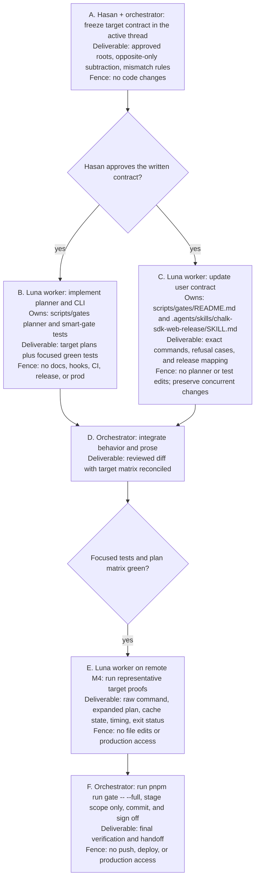

# Contextual SDK gate

## Background

Chalk already has an affected-workspace gate. A local `pnpm run gate` reads the staged diff, finds directly changed workspaces, and adds their transitive dependents. This works for a change that lives only in `apps/web` or only in `apps/mobile`, but a shared SDK change fans out to both platform lanes and every other workspace that depends on it.

That model answers “what can this change affect?” It does not answer “what are we shipping now?” As a result, a web shipment can pay for React Native and mobile checks, while a mobile shipment can pay for React and web checks. The release path has no supported way to state the intended platform.

The desired state has two layers of context:

1. The changed-file graph continues to find code that can be affected.
2. An optional shipment target bounds which consumer lane is relevant now.

The target is a safety boundary, not an arbitrary file filter. It may remove consumers on the other platform, but it may never remove directly changed shared packages, required upstream packages, global safety checks, or a check that owns a changed file.

## Current state

- `pnpm run gate` calls `scripts/gates/smart-gate.mjs` through `scripts/gates/commit.sh`.
- Local runs inspect staged files. The implemented CI mode compares `GATE_BASE_REF...GATE_HEAD_REF`, although no current GitHub workflow invokes the root gate.
- Workspace manifests are the dependency source of truth. The planner adds transitive reverse dependents and filters type checks, tests, builds, and package checks to those workspaces.
- A web app source change already checks only `web`; a mobile app source change already checks only `@q9labsai/chalk-mobile`.
- A React SDK change checks React, the web app, and the web SDK consumer. A React Native SDK change checks React Native and the mobile app.
- A shared client, whiteboard, facehash, or diagnostics change can reach both platform lanes. This is the main avoidable cost when only one platform is being shipped.
- Gate-definition changes, unknown paths, and root dependency or workspace changes fail closed to a broad plan.
- Routing self-tests, the language ratchet, hygiene, and the staged secret scan always run. They remain global because they protect the gate itself and the repository boundary.

## Language

- **Change set:** The staged files locally, or the merge-base-to-head files in CI.
- **Affected workspace:** A directly changed workspace or one of its transitive internal dependents.
- **Shipment target:** The platform consumer lane being validated now. Version one supports `web` and `mobile`.
- **Target universe:** The target roots and all their transitive internal dependencies.
- **Platform-exclusive workspace:** A workspace in one target universe but not the other.
- **Target-compatible change set:** A change set that does not directly change an opposite-platform-exclusive workspace and does not require the fail-closed full plan.
- **Escalation:** A target request that cannot be proved safe and must stop with instructions to run the automatic or full gate.

Do not call the feature a “partial gate” or “skip list.” Those names imply that the caller may suppress checks directly. The supported concept is a shipment target.

## Behavior

### Gate modes

| Command                            | Meaning                 | Safety contract                                                                               |
| ---------------------------------- | ----------------------- | --------------------------------------------------------------------------------------------- |
| `pnpm run gate`                    | Automatic affected mode | Preserve the current changed-file and reverse-dependent behavior.                             |
| `pnpm run gate -- --target web`    | Web shipment            | Remove affected mobile-exclusive consumers. Keep shared and non-platform affected workspaces. |
| `pnpm run gate -- --target mobile` | Mobile shipment         | Remove affected web-exclusive consumers. Keep shared and non-platform affected workspaces.    |
| `pnpm run gate -- --full`          | Full safety net         | Preserve the current full-mode contract and do not apply a target.                            |

The CLI accepts `--target web` and `--target=web`. A missing value, unknown value, or repeated target is an input error. `GATE_TARGET=web|mobile` provides the same target to automation. A CLI target and environment target may coexist only when they match. `--full` and either form of target are mutually exclusive.

### Target definitions

Targets declare consumer roots, not every shared package:

| Target   | Consumer roots                                                |
| -------- | ------------------------------------------------------------- |
| `web`    | `web`, `@q9labsai/chalk-react`, `@chalk/sdk-web-consumer-e2e` |
| `mobile` | `@q9labsai/chalk-mobile`, `@q9labsai/chalk-react-native`      |

The planner derives each target universe by walking from these roots to internal dependencies declared by package name in `dependencies`, `devDependencies`, `optionalDependencies`, and `peerDependencies`. Package manifests stay the source of truth, so a new shared dependency joins a target without another hand-maintained package list. Missing roots, duplicate workspace names, malformed dependency or script objects, and unresolved `workspace:` dependencies are planning errors.

The web-exclusive set is the web universe minus the mobile universe. The mobile-exclusive set is the mobile universe minus the web universe. Workspaces in both universes are shared. Affected workspaces in neither universe, such as the episode brokers and contract fixture tool, remain selected in either target mode. A target removes only the opposite-exclusive set.

Existing API, Sync, contract, recorder, architecture, dependency, and other non-platform routes remain selected exactly as they are today. A target does not suppress them and does not need a second path allowlist. Ordinary documentation paths are neutral. Files under `scripts/gates/**`, including `scripts/gates/README.md`, keep their current gate-definition classification and cannot be narrowed.

### Selection algorithm

For every run, the planner:

1. Resolves the change-set source in this order: `GATE_FILES`, CI refs, then the local staged index.
2. Canonicalizes every path to a repository-relative POSIX path before classification. Absolute paths, empty entries, paths that escape the repository, and paths containing `.` or `..` segments are input errors.
3. Reads workspace manifests from the same snapshot as the change set: the Git index for a staged run, `GATE_HEAD_REF` for CI, and the current worktree for the explicit diagnostic override.
4. Applies the current fail-closed rules for unknown paths, gate definitions, and repository-wide dependency configuration.
5. Finds directly changed workspaces and their transitive reverse dependents.
6. With no target, preserves the current affected-workspace plan.
7. With a target, derives both target universes and removes affected workspaces that are exclusive to the opposite platform. Shared and non-platform affected workspaces remain selected.
8. Rejects the target before any check starts when the change set directly changes an opposite-platform-exclusive workspace.
9. Adds the existing global, service, contract, architecture, recorder, dependency, public-package, and test-presence checks. Target selection never filters these path-owned routes.
10. Prints the stable plan summary before execution.

The planner must not parse source imports or duplicate TypeScript path aliases. The manifest graph is canonical. Existing hidden couplings in build scripts remain valid only when their owning workspace is selected; tests must cover the known mobile prepare and whiteboard paths.

### Required examples

- A client change with `--target web` selects the client, affected web consumers, and affected non-platform consumers such as the episode brokers. It does not select React Native or the mobile app.
- A client change with `--target mobile` selects the client, affected mobile consumers, and the same affected non-platform consumers. It does not select React, the web app, or the web SDK consumer.
- A whiteboard change can use either target because whiteboard is upstream of both. Each run selects only the chosen platform’s affected consumers, while the existing Sync reliability route still runs.
- A contract fixture tool change keeps that tool’s own type and test checks plus the contract route in either target mode.
- A React change with `--target mobile` fails as a target mismatch. It does not silently skip the React change.
- A React Native change with `--target web` fails in the same way.
- A direct API, Sync, recorder, or architecture change keeps its existing route. The target has no effect on that route and must not claim a speedup from it.
- A change to `pnpm-lock.yaml`, `pnpm-workspace.yaml`, `turbo.json`, a gate definition, or an unknown path cannot be narrowed. The command exits before checks and asks for full mode.
- A mixed staged diff containing web-only and mobile-only source changes cannot use either target. The automatic gate remains the safe route.
- An ordinary documentation-only target run keeps the existing global checks and does not invent workspace work. A gate README change remains a gate-definition change and requires full mode.
- `GATE_FILES` remains a diagnostic override. Target validation still applies to canonical supplied paths, and the output states that the plan came from explicit files.

### Failure behavior

All target errors exit with status `2` before the first gate subprocess starts. The error names the target, lists the incompatible paths or configuration, and explains why narrowing is unsafe.

- A target mismatch, unknown target, malformed target syntax, missing target root, malformed workspace metadata, or CLI/environment conflict prints `Run instead: pnpm run gate`.
- A full-required change or a target combined with `--full` prints `Run instead: pnpm run gate -- --full`.

None of these cases fall back silently. Planning errors and gate-check failures keep distinct exit statuses: `2` for input or planning, and the failed subprocess status for a gate check.

Existing Git and CI base-ref errors keep their current behavior. The feature does not guess a merge base in CI.

## Safety and correctness invariants

- The no-target plan stays backward compatible when the index, head, and worktree expose the same manifest metadata. Snapshot-consistency fixes may change a plan that currently leaks dirty unstaged metadata.
- Directly changed non-documentation code is never omitted from a successful target plan.
- Global routing tests, language checks, hygiene, and secret scanning remain selected in every mode.
- Publish checks run for every selected affected public package.
- Non-platform affected dependents remain selected in both target modes.
- Existing API, Sync, contract, architecture, recorder, dependency, and test-presence routing is not weakened.
- `packages/diagnostics-contracts/**` selects the contract check. The current classifier misses this contract producer and the target work must close that hole.
- Root configuration and unknown paths continue to fail closed.
- A staged target plan reads manifest names, scripts, and dependencies from the staged index. Dirty unstaged manifests cannot widen or narrow it.
- Explicit file paths cannot escape or change their classified workspace through lexical traversal.
- No new dependency is added for graph traversal or CLI parsing.

## Observability

Every successful plan prints these stable, single-line fields before it runs:

```text
Gate plan: mode=<automatic|targeted|full> target=<web|mobile|none> source=<staged|ci|explicit>
Gate workspaces: selected=<comma-separated names|none>
Gate exclusions: opposite-platform=<comma-separated names|none>
Gate checks: selected=<comma-separated labels>
```

An error prints `Gate plan error: reason=<stable-reason> target=<value|none>` followed by the incompatible paths and one `Run instead:` line. Tests assert the source precedence, fields, and the fact that this output appears before any subprocess.

Do not write gate results, changed paths, or timing artifacts into tracked files. Verification may save redacted timing evidence under `scratchpad/` only when it is useful and contains no private paths, identifiers, or secrets.

## Done

The change is complete when all of the following are true:

- `web` and `mobile` are accepted through the CLI and `GATE_TARGET` with the conflict rules above.
- Unit fixtures include the real web, mobile, React, React Native, shared client, whiteboard, diagnostics-contract, contract fixture tool, non-platform brokers, mixed-platform, root-config, unknown-path, ordinary docs, gate docs, and full-mode cases.
- A client fixture proves that each target removes every opposite-platform type, test, build, Publint, and ATTW invocation while keeping the selected platform, changed shared package, and non-platform dependent checks.
- Snapshot tests prove that a staged plan uses staged manifest metadata and a CI plan uses `GATE_HEAD_REF` metadata.
- Explicit-file tests reject absolute paths, traversal segments, duplicate separators that change meaning, and paths outside the repository.
- Target mismatch and escalation tests prove that no subprocess starts before the error.
- All existing smart-gate tests pass unchanged or are updated only where this spec intentionally changes behavior.
- The focused smart-gate test suite passes.
- A real web-target and mobile-target run on the remote M4 each pass from representative shared SDK changes.
- The verification record compares expanded workspace-by-check invocations, Publint/ATTW package invocations, and wall time for automatic, web-target, and mobile-target plans on the same revision. It records one forced uncached pass and three warm passes per mode in rotated order. There is no fixed percentage gate because cache state dominates wall time, but a target is not useful unless it removes the complete opposite-platform workspace lane.
- `scripts/gates/README.md`, root gate help, and the SDK/web release instructions explain when to use each target and when the gate refuses one.
- The canonical full verification passes after integration.

### Release mapping

- A target-compatible web app or web-platform change may use `pnpm run gate -- --target web`.
- A target-compatible mobile app or React Native change may use `pnpm run gate -- --target mobile`.
- The synchronized `sdk` and `sdk+web` release modes change packages from both platform lanes plus release tooling and lock data. They use the existing single automatic `pnpm run gate`, which expands broadly for that diff, and never infer a web target from the release mode name.
- A shipment target controls validation only. It never changes which packages publish or which app deploys.

## Out of scope

- Adding or restoring a GitHub PR or nightly workflow.
- Changing deployment or production state.
- Replacing pnpm or Turbo caching.
- Refactoring workspace build scripts only to improve target timing.
- Adding API, Sync, recorder, or infrastructure shipment targets. Their existing checks still run when their paths change.
- Inferring shipment intent from branch names, changed files, package versions, or the current app directory.
- Letting a target skip a directly changed incompatible workspace.
- Fixing the pre-existing full-mode formatting and staged-only Gitleaks semantics. Preserve them unless Hasan opens that work separately.
- Expanding generic workspace tests into every package-specific runtime proof. Existing specialized checks remain a separate gate-design decision.

## Implementation shape

Keep the planner pure and the executor at the edge. The smallest acceptable shape is:

- `scripts/gates/smart-gate.mjs` owns argument/environment input, Git snapshot discovery, plan display, subprocess execution, and exit behavior.
- A small gate-planning module owns target definitions, dependency closure, compatibility validation, and the selected task model if keeping those concerns in `smart-gate.mjs` would make them hard to test without I/O.
- `scripts/gates/smart-gate.test.mjs` owns the behavior matrix. Prefer table-driven fixtures over copied one-off setups.
- `scripts/gates/README.md` owns the user contract.

Do not create a generic rule engine, target DSL, plugin system, or second dependency graph. Two explicit target definitions plus graph functions are enough.

## Execution



### Phase checklist

- [ ] A. Hasan approves target roots, opposite-only subtraction, and mismatch behavior in the active thread.
- [ ] B. Implement the planner, CLI/environment target input, errors, and unit matrix.
- [ ] C. Update gate and release guidance without changing automation.
- [ ] D. Reconcile the implementation and documentation at the seam.
- [ ] E. After reading `~/.codex/remote-testing.md`, run `GATE_FILES=sdks/typescript/client/src/index.ts pnpm run gate` and both target variants on the remote M4. Use `TURBO_FORCE=true` for one uncached pass per mode, then run three warm passes per mode in rotated order without editing the checkout.
- [ ] F. Run `pnpm run gate -- --full` on the remote M4, stage only this scope with `git add -p`, create the conventional commit, stop spawned processes, and hand off without pushing or deploying.

## Anti-slop rules

- Do not make `--target` an allowlist that can hide arbitrary changed files.
- Do not hard-code every shared SDK package into both profiles; derive shared membership from manifests.
- Do not drop affected workspaces that are outside both platform universes. A target removes only the opposite-exclusive platform set.
- Do not infer a target when the user did not provide one.
- Do not weaken unknown-path or gate-definition fail-closed behavior to gain speed.
- Do not run the opposite platform and call the feature contextual only because Turbo returns cache hits.
- Do not duplicate checks in release scripts. The gate planner remains the one source of selection truth.
- Do not modify unrelated dirty files or depend on their current staged state in tests.
- Do not claim a speedup from one warm run. Report the selected lane reduction and the measured cache state.
