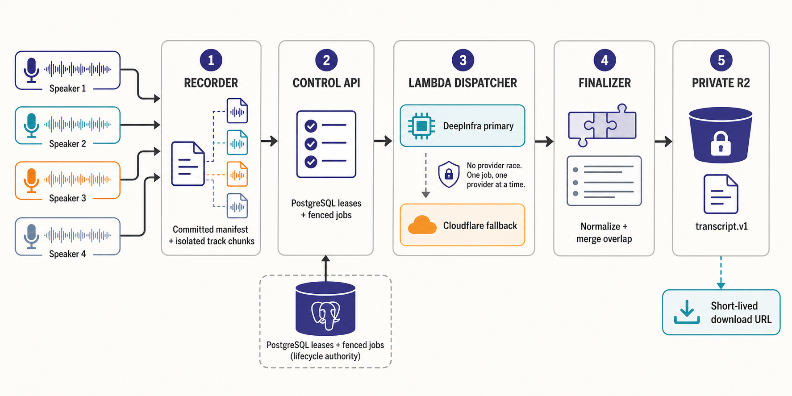
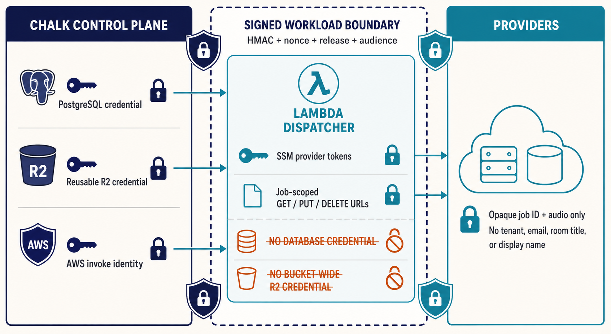
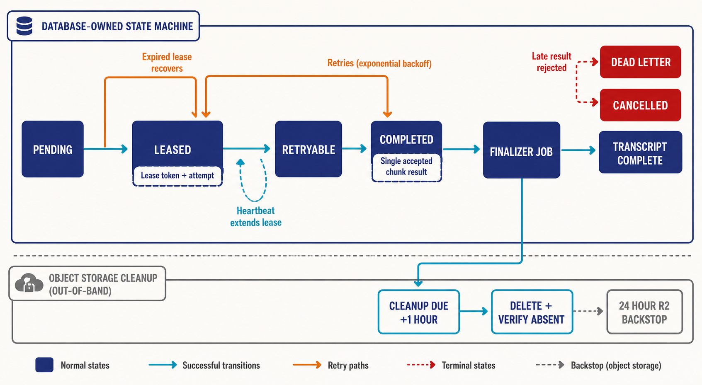

# Chalk track-aware transcription debrief

The local implementation is solid: it replaces synchronous application-node transcription with a fenced artifact pipeline whose lifecycle lives in PostgreSQL, whose bytes live privately in R2, and whose scale-to-zero Lambda can use DeepInfra or Cloudflare without holding database or bucket-wide credentials. The initial recorder foundation now supplies the control-plane, authenticated speaker-turn, chunk-planning, and deterministic media-fixture seams, but the combined system is not staging-ready because production capture/render loops, transactional transcription-source handoff, provider qualification, live cloud failure proof, and an end-to-end synthetic remain unproven; production enablement should stay prohibited until those gates have evidence.

## Walkthrough

1. **The schema establishes the authority model.** `apps/api/db/migrations/20260713090000_add_transcription_artifact_jobs.sql:14` moves transcript bodies out of PostgreSQL, `:66` records recorder-owned manifests and isolated track chunks, `:112` introduces fenced artifact jobs, and `:246` makes one accepted result per chunk and generation a database invariant.

2. **The domain layer separates old CRUD from worker lifecycle authority.** `apps/api/internal/transcripts/service_types.go:88` keeps ordinary transcript reads and metadata writes narrow, while `:95` gives the artifact repository the request, lease, result, finalization, and deletion state machine; this prevents legacy callers from mutating content or job state directly.

3. **The initial recorder foundation now produces the right local inputs.** `apps/api/internal/recorderworker/tracks.go:82` validates authenticated track epochs and constructs overlap-aware `speaker-turns.v1` manifests, while `:178` plans bounded mono 16 kHz transcription chunks; the capture and render executables at `apps/api/cmd/recorder-capture/main.go:15` and `apps/api/cmd/recorder-render/main.go:15` prove encrypted real-media fixture seams but deliberately reject non-fixture execution.

4. **A public request creates durable work after loading recorder-owned source metadata.** `apps/api/internal/transcripts/service_lifecycle.go:10` refuses an unprepared recording, validates its committed manifest and chunks, creates the transcript and jobs atomically, then emits a best-effort Lambda wake hint only after the database operation succeeds; the minute reconciler owns recovery when that hint is lost.

5. **The PostgreSQL adapter makes late and duplicate work harmless.** `apps/api/internal/adapters/postgres/transcript_results.go:53` checks the hashed lease token, attempt, owner, expiry, transcript generation, and singular chunk-result constraint in one transaction, then creates the finalizer only when every chunk has an accepted result.

6. **The public API exposes lifecycle, never infrastructure controls.** `apps/api/internal/httpapi/transcription_artifacts.go:80` accepts only an idempotency key and language hints, `:131` and `:155` expose tenant-authorized status reads, `:171` tombstones and schedules deletion, and `:196` returns a short-lived URL only for a complete private artifact.

7. **Worker calls are bound to one release and one request.** `apps/api/internal/httpapi/transcription_worker_auth.go:53` verifies the timestamp, body digest, environment, release, role, journey context, audience, and HMAC before atomically consuming a Redis nonce, so a captured request cannot be replayed or moved across environments.

8. **Claims return capability URLs instead of reusable credentials.** `apps/api/internal/httpapi/transcription_worker_claim.go:56` grants a leased job short-lived GET authority for one audio chunk and its manifest plus conditional PUT authority for the attempt-qualified result; the dispatcher never receives PostgreSQL credentials, object keys chosen by callers, or bucket-wide R2 credentials.

9. **The dispatcher is bounded orchestration, not a second state authority.** `apps/transcription-dispatcher/src/dispatcher.ts:28` limits claims by batch, concurrency, and remaining Lambda time, while `:79` divides every reconciliation invocation across transcription, finalization, and cleanup so sustained input cannot starve terminal work.

10. **Provider behavior is fail-closed and sequential.** `apps/transcription-dispatcher/src/config.ts:56` requires the privacy gate, qualified Cloudflare contract and corpus digest, and DeepInfra execution/model pins; `apps/transcription-dispatcher/src/dispatcher.ts:126` retries the primary under a bounded circuit policy before falling back, so the system never races providers or pays for two successful answers.

11. **Normalization joins provider timing to authenticated track identity locally.** `apps/transcription-dispatcher/src/dispatcher.ts:138` maps provider cues through the committed speaker-turn manifest, and `apps/transcription-dispatcher/src/finalizer-merge.ts:26` validates and deterministically merges chunk documents while retaining and flagging cross-track overlap rather than assigning it to the current active speaker.

12. **Finalization and erasure are separate fenced queues.** `apps/api/internal/adapters/postgres/transcription_finalizer.go:66` commits one verified final artifact and schedules attempt outputs for cleanup after one hour, while `apps/transcription-dispatcher/src/cleanup.ts:46` deletes through a scoped URL and asks the API to verify absence; the R2 lifecycle rule at `infrastructure/opentofu/modules/cloudflare-r2-transcription-lifecycle/main.tf:1` removes temporary orphans after 24 hours.

13. **Infrastructure preserves the same boundary.** `infrastructure/opentofu/modules/aws-transcription-dispatcher/main.tf:85` grants the Lambda logs, named SSM reads, constrained KMS decrypt, and failure-queue writes; `:139` pins the immutable release artifact and bounded runtime; `:249` and `:314` add async failure handling and one-minute reconciliation; `:385` alarms on errors, throttles, dropped events, and dead-letter depth.

14. **Releases are reproducible and auditable.** `scripts/transcription-dispatcher/build-release.sh:20` records the exact source revision and dirty-state digest, `:45` produces a deterministic ZIP, and `:58` names it by release ID and SHA-256; two clean builds produced the same recorded digest in `scratchpad/chalk-transcription-execution-ledger-2026-07-13.md:36`.

## Findings

- **Blocker — correctness:** The initial recorder implementation now covers the control plane, worker contracts, authenticated speaker-turn construction, chunk planning, and an encrypted capture-to-render fixture, but both executables remain fixture-only (`apps/api/cmd/recorder-capture/main.go:19`, `apps/api/cmd/recorder-render/main.go:19`) and the committed recording artifact does not yet transactionally seed the transcription manifest and chunk set. Implement the production claim/media/object/report loops and the atomic recorder-to-transcription handoff, then prove one composite recording through provider, finalization, download, and deletion.

- **Blocker — security/compliance:** DeepInfra has code-level identity pins and a privacy switch, but its DPA, processing/deletion terms, token isolation, spend controls, revocation drill, quota proof, and multilingual conformance corpus are unverified (`scratchpad/chalk-transcription-execution-ledger-2026-07-13.md:64`). Keep `DEEPINFRA_ENABLED=false` until each gate has durable evidence; code configuration cannot substitute for vendor qualification.

- **Blocker — operations:** No live AWS/R2 deployment has exercised SSM access, VPC egress, async wake loss, reconciliation, DLQs, alarms, lifecycle expiration, or deletion failure and recovery (`scratchpad/chalk-transcription-execution-ledger-2026-07-13.md:68`). Deploy to an approved staging environment and force each failure path before treating the OpenTofu validation as operational proof.

- **Major — observability:** The service has infrastructure alarms, but the daily provider drift canary, changelog watcher, and a synthetic that crosses queue, provider, final commit, download, and deletion are missing (`scratchpad/chalk-transcription-execution-ledger-2026-07-13.md:71`). Add the purpose-built synthetic to the uptime monitor registry and status projection, then prove both failure and recovery instead of treating a shallow HTTP check as availability.

- **Major — data migration:** The migration aborts when any legacy `transcriptions.text` value exists (`apps/api/db/migrations/20260713090000_add_transcription_artifact_jobs.sql:2`). Before applying it outside a fresh database, either prove the table contains no transcript bodies or ship a one-time, checksum-verified R2 backfill with rollback evidence; bypassing this guard would lose customer data.

- **Major — verification:** The isolated transcription gates passed, but the canonical monorepo gate is not green because of pre-existing format failures and the unrelated mobile Hermes `import.meta.env` build failure (`scratchpad/chalk-transcription-execution-ledger-2026-07-13.md:41`). Clear those base failures and rerun `pnpm run gate` on the integrated tree before any remote handoff, because focused green checks do not satisfy Chalk's canonical quality contract.

The combined implementation is a credible local foundation, but the next milestone is completing the recorder-to-transcription handoff plus a live staging canary, not production rollout.
