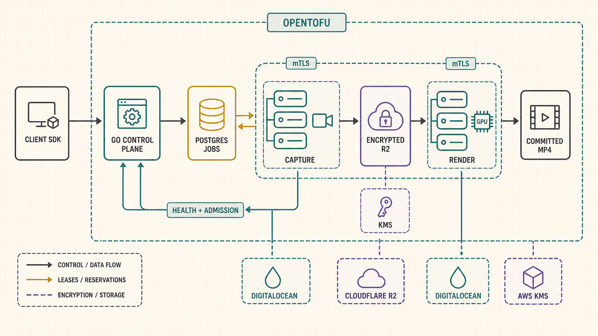
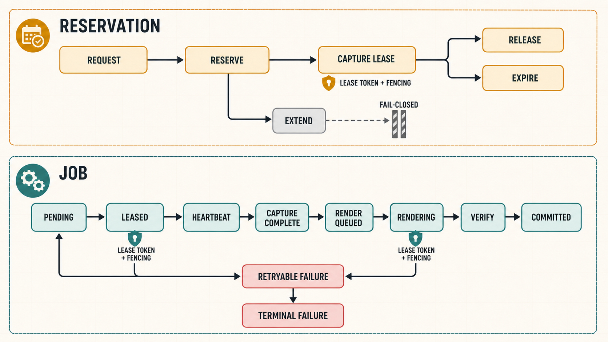

# Recorder pipeline debrief

The recorder change is a solid control-plane and infrastructure foundation: it gives Chalk bounded reservation admission, durable fenced jobs, encrypted capture bundles, deterministic rendering, worker identity, public-safe health projection, and generated SDK contracts. It still needs attention before anyone treats it as a usable recording service, because the production capture and render executables are intentionally absent, reservation extension is fail-closed, and nothing currently publishes authoritative pool health. The merged main-worktree state passes the recorder-specific proof, but it isn't a production-complete implementation of the spec.

## Walkthrough

1. **The database is the authority.** [`20260713100000_add_recording_pipeline.sql:2`](../apps/api/db/migrations/20260713100000_add_recording_pipeline.sql#L2) adds bounded capacity, pool health, reservations, pipelines, leased jobs, immutable bundle facts, and committed artifacts. The constraints matter because retries and stale workers can't be allowed to manufacture extra capacity or rewrite object identity.

2. **The domain model fixes the operational limits.** [`types.go:11`](../apps/api/internal/recordingpipeline/types.go#L11) caps concurrent meetings, participants, duration, bitrate, and attempts, while [`types.go:53`](../apps/api/internal/recordingpipeline/types.go#L53) defines the pipeline, job, and reservation states used across storage, HTTP, and workers.

3. **The service owns validation and transitions.** [`service.go:19`](../apps/api/internal/recordingpipeline/service.go#L19) builds reservations and capture jobs, then the remaining methods expose expiry, reconciliation, pool health, lease heartbeats, capture completion, retry, bundle insertion, and final artifact commit without leaking SQL into callers.

4. **PostgreSQL makes admission and leases race-safe.** [`recording_pipeline.go:69`](../apps/api/internal/adapters/postgres/recording_pipeline.go#L69) implements idempotent reservation creation against the capacity ledger, and [`recording_pipeline.sql:184`](../apps/api/db/queries/recording_pipeline.sql#L184) claims work with lease tokens and fencing generations. Capture completion creates render work transactionally, while expiry and recovery avoid reviving terminal or actively owned work.

5. **The HTTP surface is tenant-scoped and generated.** [`recording_pipeline.go:86`](../apps/api/internal/httpapi/recording_pipeline.go#L86) exposes create, read, extend, release, and pipeline-status endpoints with authorization, rate limits, bounded request schemas, stable errors, and metrics. [`contracts.go:65`](../apps/api/internal/httpapi/contracts.go#L65) feeds those routes into OpenAPI, which produces the typed client methods at [`http-api.ts:742`](../sdks/typescript/client/src/generated/http-api.ts#L742).

6. **The API process wires the repository once.** [`main.go:170`](../apps/api/cmd/main.go#L170) builds the transactional, diagnostics-decorated repository and domain service; [`main.go:284`](../apps/api/cmd/main.go#L284) passes the pipeline and recorder-health services into the router so the API and public health projection share one PostgreSQL authority.

7. **Worker identity fails closed.** [`identity.go:20`](../apps/api/internal/workeridentity/identity.go#L20) models capture and render roles, while [`tls.go:12`](../apps/api/internal/workeridentity/tls.go#L12) builds the mTLS boundary and rejects certificates that don't map to an allowed recorder identity.

8. **The worker library contains the reusable media contract.** [`protocol.go:26`](../apps/api/internal/recorderworker/protocol.go#L26) validates scoped, expiring jobs and fenced worker events; [`bundles.go:149`](../apps/api/internal/recorderworker/bundles.go#L149) encrypts versioned bundle payloads; and [`render.go:101`](../apps/api/internal/recorderworker/render.go#L101) builds the deterministic FFmpeg plan and verifies the output before commit.

9. **The local executable proof is real media, but deliberately stops there.** [`recorder-capture/main.go:15`](../apps/api/cmd/recorder-capture/main.go#L15) synthesizes and encrypts ten seconds of H.264/AAC input, and [`recorder-render/main.go:38`](../apps/api/cmd/recorder-render/main.go#L38) decrypts, renders, and verifies a 1280×720 MP4. This proves the codec, encryption, manifest, and render seams together without pretending a provider connection exists.

10. **Infrastructure is guarded against accidental mutation.** [`infrastructure/recorder/main.tf:1`](../infrastructure/recorder/main.tf#L1) composes separate DigitalOcean capture and render pools with Cloudflare R2 and AWS KMS. [`locals.tf:59`](../infrastructure/recorder/locals.tf#L59) refuses apply without staging evidence, separate short-lived provider tokens, attested images, one-time bootstrap endpoints, and the production bucket-adoption proof; [`gate.sh:7`](../scripts/recorder/gate.sh#L7) validates that contract while confirming mutation remains disabled locally.

The observed proof covered the recorder OpenTofu gate, six validator tests, the recorder domain and worker packages, focused HTTP and live PostgreSQL behavior, generated-contract drift, and the encrypted capture-to-render fixture. The fixture produced H.264 video plus AAC audio at 1280×720 with a ten-second duration.

## Findings

- **Blocker — correctness/operability:** [`recorder-capture/main.go:19`](../apps/api/cmd/recorder-capture/main.go#L19) and [`recorder-render/main.go:19`](../apps/api/cmd/recorder-render/main.go#L19) exit unless `--fixture` is supplied. There is no provider session join, media ingestion, durable claim loop, R2 transfer, GPU execution loop, or terminal report path, so deploying these binaries would produce no recordings. Implement the production worker processes against the existing protocol, object intents, mTLS identity, and fenced job APIs, then prove failure and recovery on staging before enabling infrastructure apply.

- **Major — product correctness:** [`recording_pipeline.go:207`](../apps/api/internal/adapters/postgres/recording_pipeline.go#L207) always returns `ErrExtensionUnavailable`. This is safely fail-closed, but clients receive an extension endpoint that can never succeed because qualified render capacity and the usage-ledger reservation do not exist. Either implement atomic extension admission against both constraints or remove the public operation until that invariant can be honored.

- **Major — operability:** [`service.go:113`](../apps/api/internal/recordingpipeline/service.go#L113) can persist pool health, but the repository search shows no production caller; [`recorderhealth/service.go:28`](../apps/api/internal/recorderhealth/service.go#L28) consequently projects unavailable whenever data is missing or stale. Build an authenticated reconciler that derives capture/render readiness, writes health with bounded freshness, and drives monitor status before relying on admission or public health endpoints.

- **Major — delivery:** the recorder files are merged into the shared `master` worktree but remain uncommitted because generated API, schema, router, and changelog files also contain concurrent webhook and sync work. Committing those files wholesale would claim someone else's changes. Once the concurrent work is committed, isolate the recorder delta, regenerate from that settled tree, stage only its paths and hunks, and commit it conventionally.

- **Minor — verification:** the combined HTTP suite currently expects 64 contracts while concurrent SyncEngine work emits two additional routes, and the shared local database lacks those concurrent sync migrations. Recorder-focused tests and compile proof pass, but the canonical full gate can't be called green until the route fixture and local schema are reconciled by their owning work.
