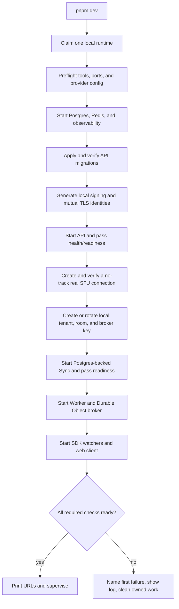
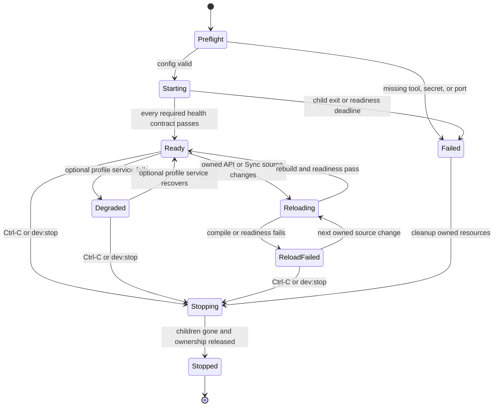
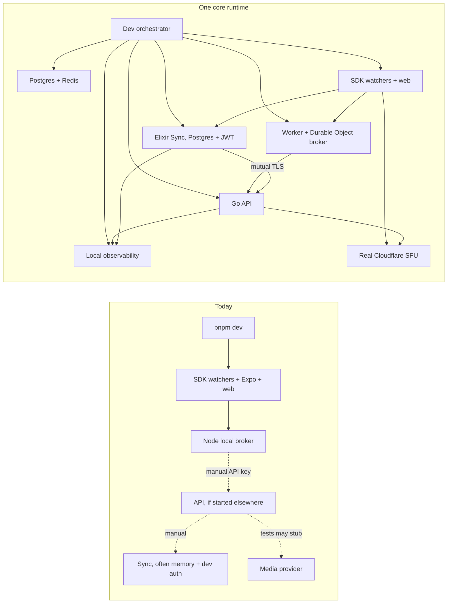
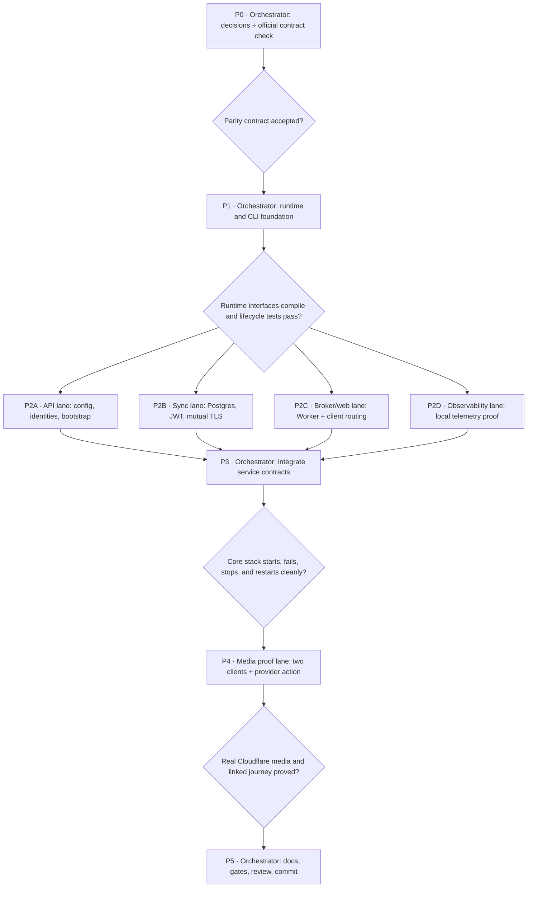

# Chalk Full Local Dev Experience

Status: **ready**
Date: 2026-08-03
Owner: Chalk
Companion: `full-local-dev-experience-spec-2026-08-03.html`

## Background

### Problem

Chalk has no one-command development environment that runs the product path an
agent needs to reproduce a meeting bug. The current root `pnpm dev` starts the
mobile packager and Turborepo development tasks. It does not start or configure
Postgres, Redis, database migrations, the Go API, the Elixir SyncEngine, the
meeting broker, or local observability. The web task starts a development-only
Node broker and requires a tenant API key to exist before startup.

The pieces can run separately, but success in one piece does not prove the
meeting. The ordinary Sync development config uses memory state and a
development token verifier. The checked-in broker proof uses a fake API. The
observability end-to-end test supplies an SFU stub. None of those paths proves
that two local clients can join through Chalk's real control path and exchange
media through Cloudflare.

### Current state

An agent must discover and sequence several private workflows:

1. Start local Postgres and Redis with the API helpers.
2. Apply the API migrations.
3. create signing keys and, for the production-shaped provider bridge, mutual
   TLS material.
4. start the Go API with Cloudflare credentials and a usable local bootstrap
   authority.
5. start Sync with Postgres, API-issued JWT verification, and the provider
   bridge instead of the default memory and development-auth path.
6. create a tenant, room, narrow broker API key, and meeting state without
   exposing the key to the browser or process list.
7. start the local Worker and Durable Object broker, point the web and mobile
   clients at it, and start the SDK package watchers.
8. start observability, connect API and Sync telemetry, and inspect several log
   locations when startup fails.
9. open two clients and find out whether actual media flowed.

No checked-in command owns that lifecycle, tells the agent which step failed,
or cleans up only what it started.

### Desired state

From a fresh checkout with dependencies installed and approved development
provider credentials available, an agent runs:

```text
pnpm dev
```

The command performs preflight checks, starts the complete core meeting stack
on localhost, applies migrations, creates disposable local credentials and
meeting resources, waits for real readiness, and prints one short summary with
the web room, API, Sync, broker, Grafana, logs, and proof command.

Mobile is additive and explicit. `pnpm dev -- --profile mobile` starts the same
ready core plus Expo and the existing simulator or device localhost bridges.
It never becomes part of an unnamed “full” profile.

Two browser clients can then create or join the same meeting through the local
Worker and Durable Object broker. The local API issues real Sync and media
credentials. Sync uses Postgres as its authority and verifies the API-issued
JWT. Camera, microphone, and screen media use Cloudflare's real SFU rather than
a fake endpoint. API, Sync, broker, web, and media journeys can be tied together
through the local observability stack.

Stopping the command stops only processes and containers that run owns. It
preserves reusable package caches and local database volumes unless the agent
asks for a reset.

## Done

The work is done when all of these checks pass in the current repository:

- [ ] `pnpm dev` brings up the core profile from a stopped local machine with
      no hand-run setup commands when the approved 1Password CLI item is
      readable.
- [ ] `pnpm dev -- --profile mobile` brings up the same core plus Expo and the
      localhost mobile bridge. No connected device is a named warning, not a
      failure. An Expo or bridge failure leaves the core supervised in
      `degraded` with mobile marked unavailable.
- [ ] Initial core startup either reaches `ready` or exits nonzero with the
      first failed stage, its typed error, and the relevant log path when one
      exists. The explicit mobile profile may remain alive in `degraded` only
      after the core is ready and only for an optional mobile failure. It never
      prints a ready URL for an unhealthy core.
- [ ] Postgres and Redis use the checked-in versions, all API migrations apply,
      and Sync runs against the migrated Postgres database rather than memory.
- [ ] The API signs Sync and media JWTs with a per-runtime local key. Sync
      verifies those JWTs. The private media-operation bridge uses generated
      local mutual TLS identities.
- [ ] Before printing ready, the API adapter creates one no-track connection
      through the real development SFU and verifies it. Cloudflare exposes no
      close-connection endpoint; the proof records no provider identifier and
      relies on provider expiry for that empty connection. Invalid or revoked
      credentials fail startup; the command does not substitute a stub.
- [ ] The local meeting broker runs the real Worker and Durable Object code.
      It receives a narrow, runtime-created API key without placing that key in
      browser code, command arguments, tracked files, or logs.
- [ ] Two fresh browser contexts join one room through the broker, publish
      audio and video, receive the other participant's tracks, and report
      increasing WebRTC packet or byte counters. The API must contact the real
      Cloudflare endpoint during this proof.
- [ ] A host media action that crosses Sync and the provider bridge, such as
      stopping another participant's camera, reaches a typed terminal result
      and becomes visible in both clients.
- [ ] API and Sync success and failure paths appear in local Grafana with a
      shared Chalk journey ID and W3C trace context where the browser permits
      propagation.
- [ ] `Ctrl-C` and a startup failure stop every process started by that run.
      A second `pnpm dev` starts cleanly without manual process cleanup.
- [ ] Editing owned Go or Elixir source restarts the affected service and its
      dependants without losing persistent local state. A compile failure makes
      `dev:status` report `reload-failed`, serves no stale backend, and recovers
      after a corrected edit passes readiness.
- [ ] `pnpm dev:status`, `pnpm dev:logs`, `pnpm dev:smoke`, `pnpm dev:stop`, and
      `pnpm dev:reset` provide inspection, proof, recovery, and explicit data
      removal without bypassing the one-command normal path.
- [ ] Focused tests, the API gate, the Sync gate, the root gate, and a fresh
      end-to-end media proof pass. The implementation updates the changelog and
      the root development guide.

### Where the work stops

The default command is a developer meeting environment, not a production
deployment. It does not reproduce Cloudflare Tunnel, PlanetScale synchronous
standby behavior, rootless Podman and systemd, public DNS or TLS, multi-node
Sync failover, the managed recorder fleet, or the AWS transcription runtime.
Those boundaries need their own staging proof.

The core and mobile profiles do not send email, run Google OAuth, call
Composio, create recordings, or dispatch transcripts. Those capabilities stay
disabled until a separate spec gives each one a safe local contract.

## Language

| Term              | Meaning                                                                                                                                                                  |
| ----------------- | ------------------------------------------------------------------------------------------------------------------------------------------------------------------------ |
| Core profile      | The smallest production-shaped stack that proves a real Chalk meeting: backing services, API, Sync, broker, web, SDK watchers, observability, and real Cloudflare media. |
| Optional profile  | Extra services layered on the same ready core, such as Expo/mobile, files, recording, or transcription.                                                                  |
| Runtime           | One invocation's identity, generated keys, private config, process ownership, ports, logs, and local broker state.                                                       |
| Production-shaped | The same code boundaries, auth, durable state, broker, and provider path as production, with named local exceptions.                                                     |
| Local exception   | A difference required to run safely on one machine, recorded and tested rather than hidden behind a stub.                                                                |
| Real media proof  | Two clients publish and receive tracks through the real Cloudflare SFU and show increasing transport counters.                                                           |
| Owned resource    | A process, container, or generated file created by the current runtime and safe for that runtime to stop or remove.                                                      |

Use these names in scripts, logs, help text, tests, and docs. Do not call a stub
or an in-memory Sync run “local parity.”

## Behavior

### Command surface

`pnpm dev` is the normal path and starts the core profile in the foreground.
The command accepts a small, stable set of flags:

```text
pnpm dev [-- --profile core|mobile] [--fresh]
pnpm dev:status
pnpm dev:logs [-- <service>]
pnpm dev:smoke
pnpm dev:stop
pnpm dev:reset [-- --yes]
```

`--fresh` removes and recreates only the runtime-marked local tenant, room,
narrow broker key, and Durable Object records in the reserved Chalk development
fixture namespace. It leaves unrelated local rows, Postgres, Redis,
observability, and package caches intact. `dev:reset` is the explicit destructive
path and must print the exact local containers, volumes, Worker state, and
private runtime directory before it removes them. It refuses while the owning
runtime or any recorded child is live and directs the caller to `dev:stop`
first. After it proves the owned processes are gone, it requires confirmation;
`--yes` skips only that prompt, not the ownership and live-process checks.

The `mobile` profile is additive. It waits for the core to become ready, then
starts Expo and configures Android reverse ports or the existing iOS localhost
relay without binding a Chalk service to the machine's network IP. With no
connected simulator or device, Expo remains ready and the summary says that no
device is connected. If Expo or bridge setup fails, the supervisor keeps the
ready core alive, reports `degraded`, marks mobile unavailable, and makes
`dev:status` return nonzero until mobile recovers; it does not print the normal
all-ready summary.

The ready summary contains no secrets and fits on one screen:

```text
Chalk dev ready
Web       http://127.0.0.1:3070/room
Broker    http://127.0.0.1:8787/local-chalk
API       http://127.0.0.1:8080
Sync      ws://127.0.0.1:4100/v3/sync
Grafana   http://127.0.0.1:3000/d/chalk-observability-v1/chalk-observability
Media     Cloudflare SFU, real provider path
Logs      .logs/dev-server.log
Proof     pnpm dev:smoke
```

### Startup flow



Startup is ordered by readiness, not by sleep. Independent long-lived services
may start in parallel after their inputs exist, but the orchestrator must not
bootstrap through an API that has not passed `/readyz` or expose the room before
the broker and Sync have passed their checks.

### Runtime states



During initial startup, or after an unexpected child exit, a required service
failure tears down the run and exits nonzero. A source-triggered API or Sync
compile or readiness failure is different: the supervisor and persistent
backing services stay alive, the affected service and its dependants stay
stopped, and `dev:status` reports non-ready until the next edit recovers. An
optional profile failure marks the run degraded and names the unavailable
behavior. The core meeting remains usable only when that optional failure
cannot corrupt its state or security boundary.

### Repeat runs and conflicts

One per-user machine-wide runtime can exist at once. Before checking ports, the
orchestrator acquires an atomic operating-system file lock and owner record in
the platform user-state directory. The record contains no secrets; it names the
checkout, revision, runtime ID, supervisor identity, status, ports, and
checkout-local manifest. The checkout-local manifest under
`.private/chalk-dev/` contains the detailed child process, container,
generated-file, and start-time records. Every stop or stale-record repair
validates process identity before acting.

From the owning checkout, another `pnpm dev` prints the ready summary only when
the live runtime is actually ready. During reload, reload failure, or an
optional degraded state, it prints the exact status and log path and exits
nonzero without starting a second supervisor. From another worktree,
`pnpm dev`, `dev:stop`, and `dev:reset` fail with the owning checkout, revision,
status, and URLs; `dev:status` stays read-only and works from either checkout.
A stale machine record is repaired only after both the recorded supervisor and
owned children are proved absent.

A second start that changes the live runtime contract, including `--fresh` or
a different profile, fails with the active profile and the exact stop/restart
sequence instead of mutating a supervised stack in place.

Fixed localhost ports keep web, mobile simulator, docs, and runbooks simple.
If an unrelated process owns a required port, preflight fails with the process
and port. The first version does not allocate a new port range or coordinate
parallel stacks across worktrees. That can be added only after concurrent local
runs become a proven need.

### Source changes

Go and Elixir source and owned config changes trigger automatic,
readiness-gated restarts. The orchestrator debounces each change, stops the
affected service and its dependants in dependency order, rebuilds, restarts,
and restores ready only after their health checks pass. A compile or reload
readiness failure enters `reload-failed` with the exact error and log path; it
never serves the last good binary while claiming the edited code is live.

TypeScript packages keep their existing watch builds and Vite hot reload.

## System design

### Current and intended boundaries



### Local parity contract

| Boundary            | Production                                  | Core local profile                                      | Named exception                                     |
| ------------------- | ------------------------------------------- | ------------------------------------------------------- | --------------------------------------------------- |
| API process         | Go binary, env config                       | Same `cmd/main` and real router                         | Localhost listener and local system bootstrap token |
| Database            | PlanetScale Postgres                        | Checked-in Postgres container and all migrations        | No remote HA or synchronous standby                 |
| Redis               | Ephemeral application cache                 | Checked-in Redis container                              | Single local node                                   |
| Sync authority      | Postgres                                    | Postgres stateholder                                    | One Sync node; standby check disabled               |
| Sync auth           | API-issued Ed25519 JWT                      | Same issuer and verifier with a runtime key             | Runtime key is generated locally                    |
| Provider operations | Sync to API provider bridge over mutual TLS | Same client, server, identity checks, and HTTPS         | Runtime CA and certificates are generated locally   |
| Meeting broker      | Cloudflare Worker and Durable Object        | Same Worker and SQLite Durable Object in local Wrangler | Local Worker runtime and storage                    |
| Media               | Cloudflare SFU                              | Real Cloudflare SFU                                     | Approved development app/account, not production    |
| Web                 | Cloudflare Pages plus broker route          | Vite plus a proxy to local Worker                       | HTTP localhost                                      |
| Observability       | Managed collector and stores                | Existing `otel-lgtm` stack                              | One local container and local retention             |

The design rejects three tempting shortcuts: the Node broker does not stand in
for the Worker in the core profile, the fake API does not stand in for the Go
API, and the SFU stub does not count as the media proof. Those tools may remain
for focused tests.

### Orchestrator ownership

The root command delegates domain work to existing scripts and adds one Node
orchestrator under `scripts/dev/`. The orchestrator owns process supervision,
config assembly, readiness order, the runtime manifest, combined output, and
safe cleanup. It does not reimplement migrations, container checks, or service
business logic.

Intended function shapes:

```text
resolveDevConfig(input: CLI + environment) -> DevConfig | ConfigProblem[]
prepareRuntime(config: DevConfig) -> RuntimeLease | OwnershipConflict
prepareIdentities(runtime: RuntimeLease) -> RuntimeIdentityFiles
startService(spec: ServiceSpec, runtime: RuntimeLease) -> RunningService | StartupFailure
waitForReady(service: RunningService) -> ReadyService | ReadinessFailure
bootstrapMeeting(api: ReadyService, runtime: RuntimeLease) -> BrokerBindings
runMediaProof(runtime: ReadyRuntime) -> MediaProofReport
shutdown(runtime: RuntimeLease, reason: StopReason) -> CleanupReport
```

Every outcome is typed. A boolean cannot hide whether startup failed because a
tool was missing, a port was busy, a service exited, readiness timed out, or a
provider rejected credentials.

### Config and secrets

The orchestrator has three config classes:

- Checked-in non-secret defaults: service names, localhost addresses, health
  paths, image versions, readiness budgets, and disabled optional capabilities.
- Generated runtime secrets: the local system token, Ed25519 signing key,
  verification keyring, mutual TLS CA and leaf identities, broker API key, and
  cookie state. Private key and certificate files live under the runtime's
  `.private/chalk-dev/` directory with restrictive permissions and are deleted
  when they are no longer needed.
- External provider secrets: the existing Cloudflare local-development SFU
  app ID and app secret. The current API SFU adapter needs only those two
  values; it does not need a broad Cloudflare account token.

The orchestrator discovers exactly one matching local-development SFU item
through the 1Password CLI, always passes the discovered vault to item reads,
and caches only the vault/item identifiers under `.private/chalk-dev/`. It
fetches the two values at each start and passes them only to the API child
process. It never writes a resolved provider env file. Zero or multiple matches
fail with candidate titles but no field values; a local untracked source
override resolves an intentional ambiguity.

The generated broker API key enters Wrangler through the child process
environment. The meeting-broker config declares its required secrets, so
Wrangler loads only those names from `process.env`; no `.dev.vars`, plaintext
Worker binding file, or secret command argument is needed. This follows
Cloudflare's current [local secret contract](https://developers.cloudflare.com/workers/local-development/environment-variables/)
and [required-secret contract](https://developers.cloudflare.com/changelog/post/2026-03-24-secrets-config-property/).

The API key never appears in a command argument, browser response beyond
short-lived participant access, Vite environment, or log line. The
orchestrator rejects a provider item marked for production and never loads
production broker or database identifiers. 1Password remains the source of
truth, consistent with its guidance to [load secrets into one script process](https://www.1password.dev/cli/secrets-scripts).

### API bootstrap

After API readiness, the orchestrator calls the real API with the local system
token to create a runtime-marked tenant configured for Chalk-managed `cf_sfu`,
an active room, and a narrow broker API key. On a reusable database it lists by
the exact runtime marker and rotates the dedicated key so the current run owns
the only raw value. The bootstrap result remains an in-memory `BrokerBindings`
value: Wrangler receives the key only in its child environment, while the
private runtime manifest may retain the non-secret tenant and room identifiers
needed for status and cleanup. No Worker bindings file contains the key. The
orchestrator drops the raw bootstrap result after Wrangler starts.

This bootstrap path uses public service behavior and authorization. It does not
insert application rows with shell SQL. Focused database test fixtures may keep
their direct inserts.

### Sync local-parity mode

Sync needs one explicit local-parity config because neither existing mode has
the right behavior:

- ordinary development uses memory state and the development verifier;
- the current production local-proof flag uses Postgres but also selects the
  development verifier;
- full production boot requires a synchronous standby that a one-machine local
  environment does not have.

The new mode is allowed only with a localhost Postgres URL and localhost API
provider-bridge origin. It selects the Postgres stateholder, production JWT
verifier, API issuer/audience/keyring, protocol v3, provider-bridge client,
production auth requirement, and durable-operation workers. It runs the real
boot checks except the named synchronous-standby requirement. Startup logs and
`/readyz` state that exception plainly.

### Broker and client wiring

Wrangler runs the checked-in Worker and Durable Object class with local
persistence. The web Vite server proxies `/local-chalk/*` to Wrangler instead
of starting `apps/web/scripts/local-chalk-backend.mjs` in the core profile. The
Node backend remains a focused unit-development tool unless later work proves
it has no distinct value.

The Worker receives the runtime tenant, room, API key, API URL, Sync URL, app
origin, and local Durable Object binding. Web and mobile receive only the broker
URL. The same invite capability and client-session contract work across a host
and guests.

### Logs and observability

All child output keeps its native service label and is also written to
`.logs/dev-server.log`. Per-service logs live under `.logs/dev/` so
`pnpm dev:logs api`, `sync`, `broker`, `web`, or `observability` stays useful.
Log files never include generated keys, bearer credentials, invite
capabilities, participant tokens, or media payloads.

The API exports OTLP to localhost over its local-only insecure option. Sync
exports to the same collector. Broker and web keep their current telemetry
contracts. The startup and smoke paths create one bounded journey that lets the
agent move from the client action to API, Sync, provider bridge, and provider
failure signals.

### Real media proof

Ordinary startup creates one no-track connection through the real SFU adapter
and verifies it before printing ready. Cloudflare's Connection API exposes no
close-connection endpoint, only close-track operations, so the empty connection
is left to provider expiry and its identifier is never written to proof output.
This proves that the provider accepted the current 1Password credentials
without paying the cost of two browsers and published tracks on every edit
cycle.

`pnpm dev:smoke` first requires a live manifest whose current status is ready;
it fails before launching a browser when the manifest is missing, stale,
reloading, reload-failed, or degraded. It then uses two clean browser contexts
with synthetic camera and microphone sources, creates one disposable meeting,
joins the guest through the invite capability, and proves:

1. both participants become active through the Worker, API, and Sync;
2. within 30 seconds, each client has live remote audio and video tracks from
   the other participant through the production Cloudflare SFU adapter;
3. during one 10-second observation window, each client reports positive
   increases in `bytesSent` and `packetsSent` for outbound audio and video and
   `bytesReceived` and `packetsReceived` for inbound audio and video;
4. the host's `stop_participant_camera` action resolves to the existing
   `:applied` terminal resolution, both clients observe the
   `participant_camera_stopped` event, and the guest video publication stops
   within 10 seconds;
5. both clients leave or end the meeting cleanly; and
6. the journey is queryable in local observability.

The proof records redacted JSON under `.private/chalk-dev/<runtime>/proof/` with
service versions, timestamps, provider type, track directions, bounded stats,
terminal outcomes, and journey IDs. It does not save camera frames, audio,
tokens, invite capabilities, or raw provider responses.

The smoke runner closes both browser contexts and leaves or ends the disposable
meeting in a `finally` path, whether the proof passes or fails. It deletes only
the smoke fixture's room, broker key, and reserved Durable Object records. A
browser, provider, assertion, or cleanup failure returns nonzero and writes one
redacted report with the failed stage; cleanup failure cannot replace the first
proof failure.

## Failure behavior

Preflight checks the exact required tools and versions before starting a
long-lived process: Node and pnpm, Go, Elixir and Erlang, OrbStack's
Docker-compatible CLI, Wrangler, OpenSSL or the selected certificate generator,
and the commands needed by the selected profile. The browser proof runner is
required only by `pnpm dev:smoke`, not by ordinary startup. Mobile bridge tools
are checked only for the explicit mobile profile.

Preflight and orchestration steps use the same first-failure shape as services:
the failed stage, typed reason, exact diagnostic, relevant log path when one
exists, and a redacted excerpt. Missing tools, unreadable secrets, busy ports,
ownership conflicts, provider rejection, and provider timeout are never forced
under a fake service name.

The startup SFU probe has a 30-second overall deadline. It creates one no-track
connection, verifies that connection, and drops the identifier from memory.
Create or verification failure makes startup fail and reports the redacted
provider operation stage without printing the provider response or connection
identifier. Track cleanup remains part of the full media smoke, where actual
tracks exist to close.

Each service has a readiness deadline and a last-log excerpt. When a required
service fails during startup or exits unexpectedly outside a source-triggered
reload, the orchestrator:

1. freezes the first root failure so later shutdown noise cannot replace it;
2. prints the service, failed contract, exit status or timeout, exact log path,
   and a short redacted excerpt;
3. sends graceful termination in reverse dependency order;
4. waits for bounded shutdown, then terminates only the owned process group;
5. stops containers it started but leaves pre-existing healthy containers
   alone; and
6. exits nonzero after verifying owned children are gone.

Provider-auth failure is not replaced with an SFU stub. The run is not ready and
the error says that the real media profile could not start.

## Accepted decisions

| ID  | Decision               | Outcome                                                                                                                                                                                                                                                                                                         |
| --- | ---------------------- | --------------------------------------------------------------------------------------------------------------------------------------------------------------------------------------------------------------------------------------------------------------------------------------------------------------- |
| D1  | Default scope          | `pnpm dev` starts the core browser meeting profile. `--profile mobile` explicitly adds Expo and localhost mobile bridging. There is no catch-all full profile.                                                                                                                                                  |
| D2  | Provider secrets       | The existing Cloudflare local-development SFU app is the real media provider. Its matching 1Password item is the source of the app ID and app secret; values enter only the API child environment.                                                                                                              |
| D2a | Worker secrets         | Wrangler receives its generated broker bindings through `process.env` plus declared required secrets, not a resolved `.dev.vars` file.                                                                                                                                                                          |
| D3  | Backend reloads        | Go API and Elixir Sync source changes trigger automatic, readiness-gated restarts. Compile or reload-readiness failures enter `reload-failed` instead of serving stale code as current.                                                                                                                         |
| D4  | Startup provider proof | Ordinary startup creates and verifies one no-track real SFU connection. Cloudflare has no close-connection endpoint, so the empty connection expires provider-side and no identifier is retained. The full two-client media and host-action proof remains `pnpm dev:smoke` and is required for release handoff. |
| D5  | State and isolation    | Backing volumes and local Durable Object state persist across normal stops. The first version uses fixed ports and one machine-wide stack; `pnpm dev:reset` is the only full wipe.                                                                                                                              |

The dashboard and 1Password item were matched by hashing the app ID. The app
secret was confirmed present without printing either value. No account, app,
vault, item, or credential identifier belongs in the tracked spec.

## Implementation plan

### Phase checklist

- [x] P0. Record the accepted reload, startup-proof, state-ownership,
      Cloudflare, Wrangler, 1Password, profile, and provider-secret contracts.
- [ ] P1. Add the runtime model, config resolver, ownership manifest, logging,
      preflight, safe shutdown, CLI help, and root command surface.
- [ ] P2A. Add API runtime config, local identity generation, migration and
      readiness wiring, and API-driven tenant/room/key bootstrap.
- [ ] P2B. Add Sync local-parity config, production JWT verification,
      Postgres authority, local mutual TLS provider bridge, and readiness proof.
- [ ] P2C. Run the local Worker and Durable Object broker from private bindings,
      route web and mobile to it, and preserve the focused Node backend path.
- [ ] P2D. Wire API and Sync into local observability and add redacted startup
      and journey checks.
- [ ] P3. Integrate all lanes in the orchestrator and prove ready, failure,
      signal shutdown, stale-manifest recovery, and a clean second run.
- [ ] P4. Add the two-client real-media smoke, provider-operation proof, and
      redacted evidence contract.
- [ ] P5. Update docs and changelog, run focused gates and the root gate, run
      the fresh end-to-end proof, review the nontrivial change, and commit only
      the intended files.

### Dependency DAG



### Fleet contracts and scope fences

| Node | Owner                     | Deliverable and interface                                                     | Scope fence                                                                 |
| ---- | ------------------------- | ----------------------------------------------------------------------------- | --------------------------------------------------------------------------- |
| P0   | Orchestrator              | Accepted reload, startup-proof, state, profile, secret, and parity contracts  | Implementation must preserve the accepted contracts                         |
| P1   | Orchestrator              | `scripts/dev/` runtime interfaces, root scripts, manifest and lifecycle tests | Does not edit API, Sync, broker, web, or observability behavior             |
| P2A  | Luna API worker           | API env builder contract, generated identities, bootstrap client/result       | Owns `apps/api` and API-facing helpers; no broker or Sync edits             |
| P2B  | Luna Sync worker          | Local-parity config and readiness contract                                    | Owns `apps/sync`; consumes identity paths, does not generate them           |
| P2C  | Luna broker/web worker    | Wrangler launch contract and Vite/mobile broker routing                       | Owns broker and client wiring; never stores provider secrets in client code |
| P2D  | Luna observability worker | Collector env and queryable startup/journey proof                             | Owns local observability; no changes to product authority                   |
| P3   | Orchestrator              | Reconciled service specs and complete lifecycle tests                         | Resolves shared files and decisions; workers do not merge each other        |
| P4   | Luna media-proof worker   | Automated real-provider report with bounded redacted evidence                 | Does not accept stubs, production credentials, or captured media            |
| P5   | Orchestrator              | Docs, changelog, all gates, end-to-end proof, bounded review, commit          | No unrelated formatting or worktree cleanup                                 |

## Anti-slop rules

- Do not make `docker compose up` the product contract. The API, Sync, SDK
  watchers, Worker, and browser proof have different native tools and failure
  signals; the orchestrator must preserve them.
- Do not put production or development provider secrets in tracked env files,
  command arguments, browser bundles, logs, snapshots, or proof artifacts.
- Do not call the stack ready because ports are open. Use each service's real
  health and readiness contract, then run an API bootstrap call.
- Do not count the existing fake API, SFU stub, development token verifier, or
  memory stateholder as parity evidence.
- Do not add a second source of migrations, room bootstrap rules, or broker
  behavior inside the orchestrator.
- Do not hide the missing synchronous standby, local HTTP, or single-node Sync
  differences. Keep every local exception named in help, logs, tests, and this
  parity table.
- Do not wipe persistent volumes during ordinary stop or failure cleanup.
- Do not kill a process by port or broad name without validating it against the
  runtime ownership manifest.
- Do not make optional recorder, transcription, file, integration, email, or
  OAuth credentials block the default meeting profile.
- Do not use production services or deploy anything while proving local dev.
