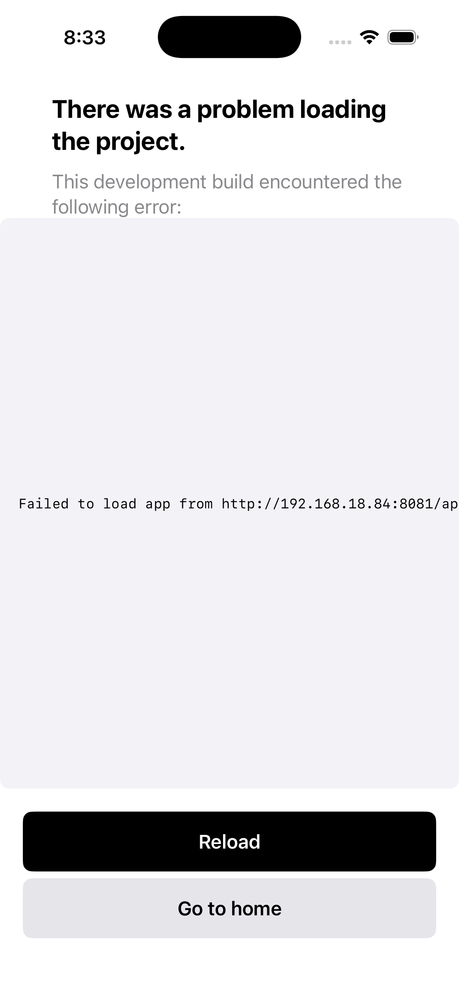

# App State Capture

**Timestamp:** 2026-04-03T08:33:03.100887

## Device
- Name: iPhone 17 Pro
- UDID: CD87FEDC-5C2A-4A29-93B3-943C431410E9
- State: Booted

## Screenshot

## Accessibility
- Elements: 19

## Logs
- Lines: 2
- Warnings: 0
- Errors: 0

## Files
- `screenshot.png` - Current screen
- `accessibility-tree.json` - Full UI hierarchy
- `app-logs.txt` - Recent app logs
- `device-info.json` - Device details
- `summary.json` - Complete capture metadata
