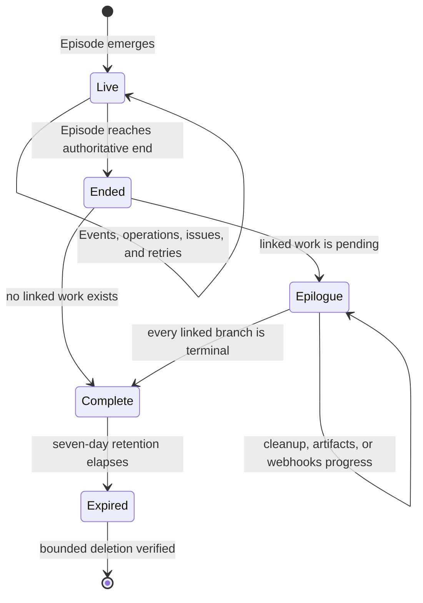
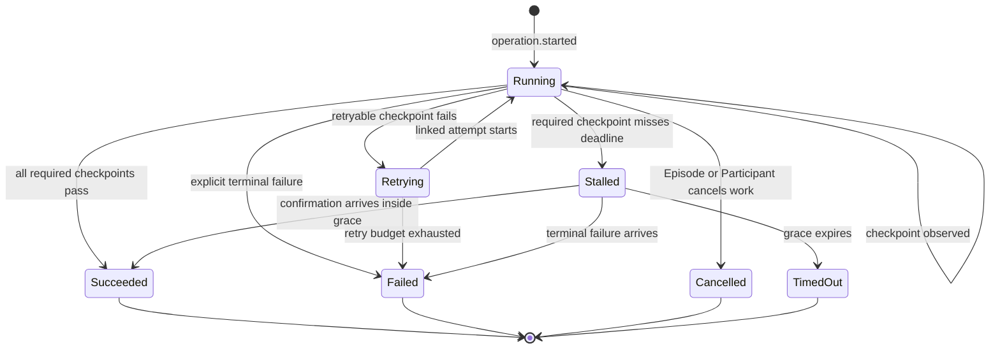
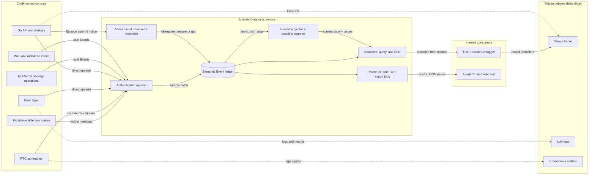
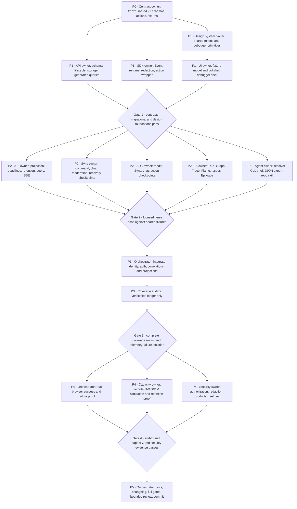

# Live Episode Debugger

- Status: ready for execution
- Date: 2026-08-03
- Project: Chalk

## Background

### The problem

When something fails during a live Episode, Chalk can expose fragments of the
story through client diagnostics, Journey events, distributed traces, logs,
RTC summaries, and a development-only Sync trace feed. A developer still has
to know which system owns each fragment, find several unrelated identifiers,
and reconstruct the order by hand. Silent failures are worse: an action may
start and never reach its expected confirmation without producing a terminal
error.

The reverted join-trace experiment showed the useful interaction: a running
flow becomes browsable as a timeline, graph, trace tree, and waterfall, and a
selected span explains state, duration, retries, errors, and identifiers. Its
scope was one local Participant's join, its storage was a bounded in-memory
diagnostic timeline, and its UI stopped being useful after the join reached
live.

### Current state

The current tree contains useful but separate foundations:

- `ChalkSessionDiagnostics` records eight parent-linked join steps in memory,
  bounded to at most 200 diagnostic events.
- the TypeScript telemetry package propagates `journey_id`, `traceparent`, and
  `tracestate`, and can emit HTTP, Sync, RTC, and diagnostic events;
- the API stores ordered events for one Journey in
  `observability_journey_events`, but the rows have no tenant, Space, Episode,
  or Participant ownership columns;
- the Journey query route is available only to a local system principal and
  resolves one Journey ID at a time;
- the API, Sync, database, webhook, and provider boundaries already emit
  OpenTelemetry signals into the local Grafana stack;
- the Sync development trace hub broadcasts a global 500-event memory ring,
  with no Episode scope, durable history, or operator authorization;
- mobile forwards Participant diagnostics into a Journey, while the hosted web
  surface does not yet own a complete Participant journey;
- the existing `apps/api/cmd/trace` command runs scripted local API scenarios.
  It does not inspect a live Episode.

These pieces do not form an Episode debugger. No source owns a complete,
queryable semantic record from Episode emergence through linked cleanup and
artifact work. No live query can answer which expected boundary failed to
confirm an action. No single reference gives an agent the surrounding evidence.

### Desired state

Every Episode in localhost, development, and staging has one internal **Episode
Diagnostic**. It starts when the Episode emerges, streams meaningful behavior
from every Chalk-owned layer in under two seconds at p95, freezes its main run
when the Episode ends, and keeps linked epilogue work live until that work
terminates.

The debugger records every meaningful product action and state transition:
access, admission, Participant lifecycle, media, SFU signaling, SDP negotiation,
remote tracks, Sync, chat, reactions, screen sharing, moderation, capability
changes, recovery, recording, transcription, cleanup, and webhooks. It records
safe metadata and confirmations, never content, credentials, raw SDP, media, or
packet streams. Whiteboard behavior may be added later through the same event
contract and is not required for this release.

An expected path accompanies each operation. If a required confirmation fails,
arrives late, or never arrives, the debugger emits an issue that names the last
confirmed boundary and the first missing boundary. Telemetry failure cannot
change product state, delay a product command, or make an otherwise successful
action fail.

A developer can inspect the Episode through Run, Graph, Trace, and Flame views,
select an issue or operation, and copy one stable Diagnostic Reference. An agent
can resolve that reference through a machine-readable API and repository CLI,
read the focused evidence and wider Episode context, inspect the matching source
revision, and investigate without asking the developer to assemble logs.

## Done

The change is done only when all of the following are observed in the current
state.

### Product behavior

- [ ] An Episode that emerges through the normal localhost path receives exactly
      one stable Episode Diagnostic through the after-commit observer, and every
      later Participant and service operation links to it. Concurrent observers
      and reconciliation cannot create a second Diagnostic.
- [ ] The same behavior is enabled in hosted development and staging, while a
      production configuration refuses to mount query, stream, export, or
      operator UI surfaces.
- [ ] Run, Graph, Trace, and Flame views update while the Episode is live without
      a manual refresh and resume after a browser reconnect from the last
      confirmed cursor.
- [ ] The complete debugger uses the new Chalk design system shown in
      `docs/redesign/chalk-design-system-board.png` and implemented through the
      canonical shared tokens and primitives. It ships as a polished Chalk
      product surface, not a generic observability dashboard, dark trace console,
      wireframe, or Reading Room-themed page.
- [ ] The Issues feed shows explicit failures, missed required confirmations,
      deadline overruns, recovery exhaustion, unexpected state transitions, and
      telemetry gaps.
- [ ] Selecting any operation shows its state, start and end times, duration,
      expectation version, checkpoint class and deadline, evidence, retry group,
      attempt, error class, request, command, and provider identifiers, Journey,
      trace, span, source layer, release and commit, and visibility gaps. Each
      promised field is populated or says `unknown` with a reason.
- [ ] The main run becomes immutable when the Episode ends. Authorized cleanup,
      recording, transcription, artifact, and webhook branches remain live in
      an Epilogue section until each reaches `succeeded`, `failed`, `cancelled`,
      or `timed_out`; they never mutate the ended Episode or an already committed
      artifact.
- [ ] Whiteboard is visibly marked unsupported by this release rather than
      silently presented as complete.

### Complete semantic coverage

- [ ] Every entry in the closed **Episode Diagnostic Action Set v1** has an
      owner, expectation contract, success fixture, failure or gap fixture, and
      machine-readable proof ID. An action outside v1 appears as unsupported or
      unclassified; it cannot silently inherit a nearby contract.
- [ ] Chat send, retry, commit, sender receipt, paging, read state, recipient
      projection, and attachment metadata lifecycle satisfy their v1 predicates;
      content and attachment bodies never enter diagnostics.
- [ ] Screen sharing shows permission, track acquisition, local preparation,
      Sync state, SFU publication, remote subscription, first remote frame,
      recovery, track end, and stop confirmation where those boundaries apply.
- [ ] Moderation shows initiating intent, capability decision, command commit,
      target delivery or target-unavailable result, target application when it
      can be observed, and terminal outcome.
- [ ] Media and Sync recovery preserve the same Episode Diagnostic while using
      bounded child operations and new W3C traces where reconnect boundaries
      require them.
- [ ] Recording, transcription, cleanup, and webhook delivery link back to the
      ended Episode without extending one hours-long OpenTelemetry span.

### Agent handoff

- [ ] Every Episode, operation, issue, and event has a copyable Diagnostic
      Reference. Raw request, Journey, trace, span, command, and provider IDs are
      searchable and copyable separately.
- [ ] **Copy for agent** produces the umbrella Episode Diagnostic reference,
      selected focus, capture cursor, capture time, short observed symptom, and
      resolver instruction.
- [ ] **Copy all** copies the entire prepared, redacted agent brief as versioned
      Markdown. It includes counts and explicit omissions; it never claims to
      contain the raw million-record ledger.
- [ ] **Download JSON** starts a bounded export job for the complete redacted
      diagnostic bundle and downloads it after success, compressed and split
      when required, with a manifest, schema version, checksums, cursor range,
      and omission counts.
- [ ] `pnpm trace:inspect <reference> --format agent` resolves an umbrella or
      focused reference, prints a bounded overview first, and can fetch related
      windows or branches as JSON without scraping the UI.
- [ ] A repository skill teaches an agent to recognize `chalkdiag:` references,
      run the resolver, preserve redaction, inspect the matching code revision,
      and report whether evidence proves a cause or only narrows it.

### Safety, scale, and proof

- [ ] Intake binds tenant, Space, Episode, and Participant ownership from the
      authenticated principal and authoritative rows. It never trusts client
      ownership attributes.
- [ ] No diagnostic path records chat text, attachment bodies, display names,
      tokens, credentials, raw SDP, ICE credentials or addresses, media frames,
      audio, whiteboard content, webhook bodies, or arbitrary exception payloads.
- [ ] Diagnostic queues, callbacks, exporters, stream subscribers, and retention
      work are bounded. Forced diagnostic storage and stream failures leave the
      tested product actions successful and expose a telemetry gap.
- [ ] Under the agreed capacity model of an 8-hour Episode, 100 concurrent
      Participants, and about one million Diagnostic Events, event-to-view
      latency remains at or below two seconds at p95 and the browser remains
      responsive through server-side paging, aggregation, and virtualized rows.
- [ ] Complete diagnostics remain queryable for seven days after the later of
      Episode end and epilogue completion. Epilogue branches have bounded leases
      and time out no later than 24 hours after Episode end, so stuck work cannot
      suspend retention forever. The cleanup proof observes expiry, bounded
      deletion, and retained content-free cleanup signals.
- [ ] A real-browser localhost proof covers two Participants, successful join,
      chat, reaction, screen share, one moderation action, Sync reconnect,
      Episode end, and linked epilogue completion.
- [ ] Real-browser visual proof covers Run, Graph, Trace, Flame, Issues, details,
      Participants, and Epilogue at 1440, 1280, and 1024 CSS pixels, plus loading,
      empty, live, stalled, failed, disconnected, reconnecting, ended, export-in-
      progress, export-failed, and permission-denied states. Approved screenshots
      show no overflow, clipped controls, unreadable density, token drift, or
      unfinished placeholder treatment.
- [ ] Separate proofs force an SFU or Sync failure, a silent missing
      confirmation, exporter loss, SSE reconnect, and an unauthorized query.
      The debugger shows the right issue and the product remains safe.
- [ ] A dropped stream notification, API restart, 100,000-Event reconnect gap,
      duplicate Event, same Event ID with a different fingerprint, projector
      replay, and dead-letter recovery each have a deterministic proof.
- [ ] The copied umbrella reference resolves through the CLI to the same focused
      failure, surrounding timeline, release, identifiers, gaps, and final
      epilogue state shown in the UI.
- [ ] Focused package tests, API and Sync gates, the root gate, the observability
      success/failure proof, the remote-Mac capacity proof, and one bounded
      `codex review` pass are green. Changelog and public-safe developer docs are
      current.

The verification ledger records the command, fixture, artifact path, and pass
or fail result for every item above. Hosted development and staging each run one
success smoke, one forced failure, and one unauthorized read. Production proof
checks that no diagnostics route, intake credential, observer, storage write,
projector, stream, export job, or retention worker exists or starts.

### Where the work stops

This release does not enable the debugger in production, expose it to customers
or Participants, add a public diagnostics API, retain data beyond seven days,
capture content or raw protocol payloads, trace packets or React renders, or
automatically edit code. It does not add whiteboard checkpoints beyond the
extension seam and an explicit unsupported marker. It does not replace Grafana,
Tempo, Loki, Prometheus, the execution trace harness, or normal distributed
tracing.

The debugger may identify the first missing boundary and present likely evidence.
It must not claim a root cause when Chalk cannot see inside a browser, operating
system, network, device driver, or Cloudflare's private SFU implementation.

## Language

The glossary at the repository root remains authoritative. This specification
uses the target language even where the current source still carries rename
debt. Implementation must not add new public `Room`, `Session`, `meeting`,
`host`, or `VideoConference` names.

| Term                 | Meaning                                                                                                                                |
| -------------------- | -------------------------------------------------------------------------------------------------------------------------------------- |
| Episode Diagnostic   | The internal, durable diagnostic aggregate for one Episode and its linked epilogue.                                                    |
| Diagnostic Reference | An opaque `chalkdiag:v1:<environment>:<id>[:<focus-kind>:<focus-id>][@<cursor>]` string that resolves a Diagnostic or focus.           |
| Diagnostic Event     | One append-only, content-free observation from a Chalk-owned boundary.                                                                 |
| Diagnostic Operation | A bounded action assembled from related Events and governed by an expectation contract.                                                |
| Checkpoint           | One expected observation inside an operation, marked required, conditional, or best-effort.                                            |
| Diagnostic Issue     | A live or resolved failure, stall, gap, or unexpected transition derived from Events and checkpoints.                                  |
| Cursor               | A monotonically increasing receive-order position used to page and resume the live stream. It does not claim perfect wall-clock order. |
| Episode run          | The portion from Episode emergence through Episode end. It is the subject of the Run view, not a separate domain object.               |
| Epilogue             | Linked post-Episode cleanup, artifact, and webhook work that may outlive the Episode run.                                              |
| Agent brief          | The bounded Markdown handoff copied by Copy all.                                                                                       |
| Diagnostic bundle    | The complete versioned, redacted machine export and manifest.                                                                          |

## Behavior

### Episode Diagnostic lifecycle



The product transaction never depends on diagnostics. Once an Episode emerges,
an idempotent after-commit observer ensures its Diagnostic from authoritative
tenant, Space, and Episode rows. A bounded reconciler finds missed observations.
The unique `(tenant_id, episode_id)` constraint makes concurrent observers safe.
If diagnostic storage is unavailable, the Episode still emerges; recovery emits
a `coverage.started_late` gap from the earliest authoritative time the observer
can prove. Exactly one Diagnostic exists per tenant and Episode. A Participant
may leave, reconnect, or be replaced without ending it.

The Diagnostic snapshots the policy, deadline, extension, and release settings
that govern the run. It covers explicit start, natural end, authorized end,
linger end, deadline end, and deadline extension. Concurrent end observations
reconcile to the authoritative Episode end and preserve conflicting evidence as
an issue.

Episode end closes the run but not the Diagnostic. New Episode actions cannot
attach to an ended Episode. Before end, the product authorizes stable epilogue
branch slots for `cleanup`, `recording`, `transcription`, `artifact`, and
`webhook` work. Each branch owns a stable ID, attempts, checkpoints, fan-in state,
and one terminal state: `succeeded`, `failed`, `cancelled`, or `timed_out`.
Callbacks after terminal state are recorded as `late_observed` and never reopen
the branch. Epilogue work may update only its diagnostic rows; it cannot alter
the ended Episode or rewrite committed artifact fields.

An epilogue lease ends at the earlier of its product deadline and 24 hours after
Episode end. The deadline scanner marks remaining branches `timed_out`, completes
the Diagnostic, and starts seven-day retention. Completion is the last branch
terminal time or timeout. An Episode with no authorized branch completes at end.

### Operation and expectation model

Every meaningful action begins a bounded Diagnostic Operation. An operation
names a versioned expectation contract whose checkpoints define:

- the source that can observe the checkpoint;
- whether the checkpoint is required, conditional, or best-effort;
- the state or evidence that satisfies it;
- its deadline relative to the operation or an earlier checkpoint;
- the safe failure class and plain summary for absence or rejection;
- whether a retry continues the operation or starts a linked attempt.



A stall is an observed diagnostic state, not a product cancellation. A late
confirmation inside the contract's bounded grace resolves the issue while
preserving the missed deadline. After grace, the operation stays terminal and a
later signal becomes `late_observed`. The contract records the configured
deadline, grace, and observed duration, so later tuning does not rewrite history.
For parallel checkpoints, the contract fixes display order; “first missing” is
the first unsatisfied required checkpoint in that order. Operation state and
issue state remain separate.

Recipient projection is conditional evidence. For chat, sender receipt and
authoritative commit are required. Each connected recipient that reports a
projection adds useful proof, but an absent report from a disconnected client
does not fail the sender's operation. The UI states the coverage, such as
“projected by 3 of 4 currently observable recipients.”

### Coverage

The checked-in `episode-diagnostic-actions.v1.json` contract and its generated
types define the closed action set. Each row below has one expectation fixture,
one success fixture, one explicit failure or visibility-gap fixture, and the
listed proof prefix. The build fails when a package-owned action root lacks a v1
entry or when an entry lacks either fixture.

| v1 group              | Exact operations                                                                                             | Semantic owner           | Required terminal proof                                                                                         | Proof prefix                     |
| --------------------- | ------------------------------------------------------------------------------------------------------------ | ------------------------ | --------------------------------------------------------------------------------------------------------------- | -------------------------------- |
| Episode lifecycle     | `emerge`, `start`, `end.natural`, `end.authorized`, `end.linger`, `end.deadline`, `deadline.extend`          | API                      | authoritative state and reason agree with the policy snapshot                                                   | `diag.v1.episode.*`              |
| Space access          | `access.request`, `access.approve`, `access.deny`, `access.refresh`                                          | API + client SDK         | auth decision and bound access bundle or safe denial                                                            | `diag.v1.access.*`               |
| Participant lifecycle | `join`, `reconnect`, `rejoin`, `leave`, `rename`, `raised_hand.set`                                          | client SDK + Sync        | authoritative membership transition and Participant result                                                      | `diag.v1.participant.*`          |
| Microphone            | `publish`, `unpublish`, `recover`                                                                            | client SDK + SFU adapter | intent, local track state, Sync commit, and SFU publication terminal                                            | `diag.v1.microphone.*`           |
| Camera                | `publish`, `unpublish`, `recover`                                                                            | client SDK + SFU adapter | intent, local track state, Sync commit, and SFU publication terminal                                            | `diag.v1.camera.*`               |
| Directed media        | `request`, `accept`, `decline`, `expire`                                                                     | client SDK + Sync        | capability decision, command commit, and target result or unavailable                                           | `diag.v1.media_request.*`        |
| Screen sharing        | `start`, `stop`, `unexpected_end`, `recover`                                                                 | client SDK + SFU adapter | permission result, track, Sync commit, SFU terminal, and remote first frame when an observable recipient exists | `diag.v1.screen.*`               |
| Sync                  | `connect`, `authenticate`, `snapshot`, `live`, `reconnect`, `disconnect`                                     | Sync + client SDK        | ordered state transition, restored cursor, and terminal result                                                  | `diag.v1.sync.*`                 |
| Chat                  | `send`, `retry`, `page`, `read`, `attachment.prepare`, `attachment.commit`, `attachment.fail`                | client SDK + Sync        | validation, authorization, durable commit or safe rejection, and sender result                                  | `diag.v1.chat.*`                 |
| Reactions             | `send`, `dedupe`, `expire`                                                                                   | client SDK + Sync        | authorization, accepted commit or fanout, sender result, dedupe key outcome, and expiry                         | `diag.v1.reaction.*`             |
| Admission             | `policy.snapshot`, `policy.change`, `request`, `admit`, `deny`                                               | API + Sync               | versioned policy decision, authoritative commit, and Participant result                                         | `diag.v1.admission.*`            |
| Roles and moderation  | `role.change`, `capability.check`, `microphone.disable`, `camera.disable`, `screen.disable`, `remove`, `ban` | API + Sync               | capability decision, command commit or denial, target delivery and application, or target-unavailable terminal  | `diag.v1.moderation.*`           |
| Recovery              | `access.refresh`, `media.retry`, `sync.retry`, `budget.exhaust`                                              | client SDK + API + Sync  | linked attempt chain and restored state or exhausted budget                                                     | `diag.v1.recovery.*`             |
| Recording             | `start`, `stop`, `provider.callback`, `finalize`                                                             | API + worker             | authorized branch, attempts, provider result, and terminal artifact reference state                             | `diag.v1.recording.*`            |
| Transcription         | `start`, `stop`, `provider.callback`, `finalize`                                                             | API + worker             | authorized branch, attempts, provider result, and terminal artifact reference state                             | `diag.v1.transcription.*`        |
| Cleanup               | `resource.release`, `fan_in`, `complete`                                                                     | API + worker             | every registered cleanup child terminal and branch fan-in terminal                                              | `diag.v1.cleanup.*`              |
| Artifact              | `reserve`, `write`, `commit`, `fail`                                                                         | API + worker             | pre-end slot, immutable commit result, and terminal branch state                                                | `diag.v1.artifact.*`             |
| Webhook               | `enqueue`, `attempt`, `retry`, `deliver`, `exhaust`                                                          | API + worker             | signed delivery attempt chain and terminal response class                                                       | `diag.v1.webhook.*`              |
| Whiteboard            | `unsupported`                                                                                                | whiteboard package       | explicit unsupported marker                                                                                     | `diag.v1.whiteboard.unsupported` |

`required`, `conditional`, and `best_effort` are the only checkpoint classes.
A conditional checkpoint stores the predicate and its evaluated inputs. When a
source cannot observe a required or active conditional checkpoint, it emits a
`not_observable` Event and the projector opens a visibility-gap issue; absence
never becomes success.

The acceptance fixtures make these high-risk predicates exact:

- Chat send proves intent, validation, enqueue, Sync authorization, durable
  commit, sender receipt, and paging visibility. Read state is its own operation.
  Each connected recipient with a live diagnostic credential activates a
  projection checkpoint; disconnected recipients remain counted as unobservable.
- Reactions prove accepted commit or fanout, sender result, dedupe outcome for
  the bounded semantic key, recipient projection coverage, and server expiry.
- Screen sharing has four fixtures: permission denied; start through at least
  one observable remote first frame; unexpected track end; and explicit stop.
- Moderation has four fixtures: capability denied; committed command with target
  delivery and application; target unavailable; and delivery observed without
  target application, which opens an issue rather than claiming success.
- Attachments expose only approved type, byte-count bucket, storage state, and a
  safe object reference class. Recipient projection and read proof never include
  chat text, filenames, URLs, or attachment bodies.

The framework-neutral TypeScript package owns action roots. React, React Native,
and Chalk's web or mobile apps may emit UI-intent and render-observed checkpoints,
but they cannot invent success or duplicate core state machines. API, Sync, and
provider adapters emit the boundaries only they can observe.

### Real-time debugger

The internal debugger lives at an environment-gated developer route, separate
from the Participant experience. A small developer-only link can open the
current Episode Diagnostic in a new view. Loading follows one contract:

1. resolve the Diagnostic Reference and authorize the operator;
2. fetch a snapshot containing current summary, issues, operations, lanes, and
   the latest cursor;
3. open a one-way stream after that cursor;
4. append or update virtualized projections as cursors arrive;
5. reconnect with the last confirmed cursor and fill any gap through normal
   paging before resuming live updates.

The debugger uses a dedicated internal stream. It does not share the product
Sync WebSocket, because diagnostic backpressure, authorization, or failure must
not affect Episode collaboration.

#### Run

Run is the default view. It shows Episode state, elapsed time, release mix,
Participant lanes, active issues, the latest confirmed boundary for open work,
and the first broken boundary for failed or stalled work. It answers “what is
happening now?” without requiring a trace search.

#### Graph

Graph is a causal and system graph, not a decorative service map. Nodes represent
the UI, SDK, access path, API, Sync, database, media engine, SFU, and relevant
epilogue workers. Edges show active, healthy, stalled, failed, or unobservable
relationships. Selecting an edge opens the operations and traces that justify
its state.

#### Trace

Trace is a searchable, filterable tree and table over Diagnostic Operations and
Events. It supports Participant, capability, source, state, issue, release,
Journey, trace, request, and time-window filters. Rows are server-paged and
virtualized. Selecting a row opens safe details and copy actions.

#### Flame

Flame is a zoomable waterfall. It lays bounded operations across Participant and
service lanes, renders retries as linked attempts, and uses heat strips or
aggregates for periodic RTC and runtime samples. It never draws one bar spanning
the entire Episode or calls periodic samples child spans.

#### Issues

Issues remain visible beside every view. Each issue shows severity, live or
resolved state, first and last observed time, affected Participant or service,
last confirmed checkpoint, first missing or failed checkpoint, retry state,
and its focused Diagnostic Reference. Resolving an issue does not erase it.

### Agent handoff

Each Episode Diagnostic owns one stable umbrella reference:

```text
chalkdiag:v1:development:<opaque-id>
chalkdiag:v1:development:<opaque-id>:op:<opaque-focus-id>@<cursor>
chalkdiag:v1:development:<opaque-id>:issue:<opaque-focus-id>@<cursor>
chalkdiag:v1:development:<opaque-id>:event:<cursor>@<cursor>
```

This grammar is the only focused-reference syntax in v1. The reference carries
environment routing and opaque identity, not credentials, URLs, tenant IDs, or
payload. A focused reference resolves the same umbrella plus one operation,
issue, or Event. Its cursor lets an agent distinguish the captured state from
later recovery or failure. A resolver must reject malformed or cross-environment
references instead of guessing.

A checked-in Safe ID Class Registry defines storage and display for each
correlation class. Chalk-generated request, command, Journey, trace, and span IDs
that pass length and alphabet checks may be stored raw, searched exactly, and
copied. Provider and integration IDs use a versioned HMAC for lookup by default;
an explicit allowlisted class may also keep a bounded raw value. Unknown classes
are HMAC-only and never copyable as raw IDs. The UI says `not retained` or
`unknown: <safe-reason>` rather than showing an empty field. The registry also
maps each release identifier to the exact source commit when known.

**Copy for agent** copies `AgentBrief/v1` in compact plain text: schema version,
umbrella reference, optional focused reference, capture time, run-end cursor when
present, selected cursor, short observed summary, environment, release-to-commit
mapping, visible gaps, and one exact resolver command. **Copy all** requests the
same server-generated `AgentBrief/v1` as Markdown. It adds the Episode summary,
open and resolved issues, expected-versus-observed paths, relevant windows,
safe identifiers, epilogue branches, counts, and explicit omissions. Both UI
actions, the brief endpoint, and CLI render from the same typed payload fixture.
They cannot drift field by field.

If clipboard access fails, **Copy for agent** selects its rendered text and shows
the keyboard copy command. If a brief exceeds the clipboard limit, **Copy all**
copies the compact brief plus an export-job reference and announces that it did
so. It never truncates without saying so.

The complete JSON bundle is asynchronous. `POST` creates a bounded export job;
the operator polls its state, may cancel it, and downloads a compressed bundle
only after success. Jobs have per-operator and per-Diagnostic quotas, a 30-minute
lease, a one-hour download lifetime, manifest checksums, schema version, cursor
range, and omission counts. No request holds a million-Event transaction or
server response open. The CLI resolves the same contracts used by the UI:

```text
pnpm trace:inspect <diagnostic-reference> [--around 30s] [--branch <id>]
  [--format text|agent|json] [--at-cursor <cursor>] [--latest]
```

Default agent output is bounded. It returns the Episode and focus summary,
issues, the smallest relevant timeline, source release, gaps, and available
follow-up queries. The agent explicitly requests broader windows or raw
machine pages. The repository skill never treats a missing upstream signal as
proof that the upstream system succeeded.

### Failure and offline behavior

- Client SDKs keep a bounded local ring and non-blocking export queue. When an
  error or stall occurs, they promote the relevant pre-failure window for
  delivery without exporting forbidden content.
- Queue overflow, rate limiting, invalid Events, storage failure, stream lag,
  missing client export, and backend query failure emit bounded gap records and
  service health signals. A gap is visible in the UI and Agent Brief.
- The intake acknowledges only durable acceptance and is idempotent by Event ID.
  Clients may retry without duplicating the semantic Event.
- A browser or mobile process can disappear before its final export. The
  diagnostic closes its observable operations through authoritative timeout or
  disconnect evidence and states that client-side visibility ended.
- Wrong clocks do not define global order. The UI can show occurred time, receive
  time, producer sequence, and uncertainty. The resume cursor uses durable
  receive order.
- Cloudflare's private SFU work remains an explicit blind spot. Chalk records
  adapter requests and responses, provider-exposed identifiers and analytics,
  and both endpoint symptoms without presenting hidden provider work as spans.

## System

### Boundaries and flow



The Episode Diagnostic service belongs in the Go control plane for v1 because
the API can authorize a purpose-specific intake principal, expose internal
system routes, and read authoritative Episode rows. It does not reuse the
Journey intake or join the product transaction. Instrumentation remains package-
owned in the TypeScript SDK and service-owned in Sync. The web app stays thin
and consumes the internal query contract.

### Data model

The existing Journey ledger remains a bounded lifecycle ledger. It is not
redefined as an Episode table. New diagnostic tables give Episode ownership,
retention, live projection, and alternate-reference lookup explicit homes.

```mermaid
erDiagram
  EPISODE_DIAGNOSTICS ||--o{ DIAGNOSTIC_EVENTS : contains
  EPISODE_DIAGNOSTICS ||--o{ DIAGNOSTIC_OPERATIONS : projects
  EPISODE_DIAGNOSTICS ||--o{ DIAGNOSTIC_ISSUES : derives
  EPISODE_DIAGNOSTICS ||--o{ DIAGNOSTIC_BRANCHES : authorizes
  EPISODE_DIAGNOSTICS ||--o{ DIAGNOSTIC_REFERENCES : resolves
  DIAGNOSTIC_OPERATIONS o|--o{ DIAGNOSTIC_EVENTS : groups
  DIAGNOSTIC_OPERATIONS ||--o{ DIAGNOSTIC_CHECKPOINTS : expects
  DIAGNOSTIC_OPERATIONS ||--o{ DIAGNOSTIC_ISSUES : explains
  DIAGNOSTIC_BRANCHES ||--o{ DIAGNOSTIC_OPERATIONS : contains
  EPISODE_DIAGNOSTICS ||--|| DIAGNOSTIC_PROJECTOR_OFFSETS : projects_through

  EPISODE_DIAGNOSTICS {
    uuid id PK
    uuid tenant_id
    uuid space_id
    uuid episode_id UK
    text environment
    text state
    timestamptz episode_started_at
    timestamptz episode_ended_at
    timestamptz epilogue_completed_at
    timestamptz expires_at
    bigint run_end_cursor
    bigint committed_cursor
    jsonb config_snapshot
  }

  DIAGNOSTIC_EVENTS {
    uuid diagnostic_id FK
    bigint cursor
    uuid event_id
    text event_fingerprint
    uuid operation_id nullable
    text producer_operation_ref nullable
    uuid participant_id
    text source
    text name
    text state
    timestamptz occurred_at
    timestamptz received_at
    bigint producer_sequence
    jsonb safe_attributes
  }

  DIAGNOSTIC_OPERATIONS {
    uuid id PK
    uuid diagnostic_id FK
    uuid parent_id
    text kind
    text expectation_version
    text state
    uuid retry_group_id
    int attempt
    timestamptz started_at
    timestamptz deadline_at
    timestamptz grace_ends_at
    timestamptz ended_at
    text error_class
    text release_id
    text source_commit
  }

  DIAGNOSTIC_CHECKPOINTS {
    uuid operation_id FK
    text checkpoint_key
    text class
    int display_order
    timestamptz deadline_at
    text state
    bigint evidence_cursor
    text unknown_reason
  }

  DIAGNOSTIC_BRANCHES {
    uuid id PK
    uuid diagnostic_id FK
    text kind
    text state
    timestamptz lease_ends_at
    bigint terminal_cursor
  }

  DIAGNOSTIC_ISSUES {
    uuid id PK
    uuid diagnostic_id FK
    uuid operation_id FK
    text kind
    text severity
    text state
    text last_confirmed_checkpoint
    text missing_checkpoint
    timestamptz first_observed_at
    timestamptz resolved_at
  }

  DIAGNOSTIC_REFERENCES {
    uuid diagnostic_id FK
    text id_class
    text raw_value nullable
    text hmac_version
    text value_hmac
    bigint event_cursor
    uuid operation_id
  }

  DIAGNOSTIC_PROJECTOR_OFFSETS {
    uuid diagnostic_id PK
    bigint projected_cursor
    timestamptz lease_until
    int failure_count
  }
```

The final schema may split large Event attributes into typed columns when query
proof shows a real access path. It must preserve these ownership rules:

- the composite foreign keys include tenant and Diagnostic identity so no child
  row can point across tenants;
- `(tenant_id, episode_id)` identifies exactly one Episode Diagnostic;
- the append transaction locks one Diagnostic cursor-head row once per batch,
  assigns one contiguous cursor range, inserts the batch, and advances the head
  before commit. A second writer cannot commit a later cursor first;
- `(diagnostic_id, cursor)` is unique and contiguous for accepted batches;
- `(diagnostic_id, event_id)` gives append idempotency. A repeated Event ID with
  the same canonical fingerprint returns the original cursor; a different
  fingerprint is rejected, audited, and counted as an intake conflict;
- producer sequence preserves local order and exposes gaps;
- `operation_id` is nullable because root observations, periodic summaries, gap
  records, and producer Events may arrive before a projector mints an operation.
  Producers send only a bounded correlation reference; the database operation
  ID is server-minted and mapped during projection;
- every promised operation field, checkpoint deadline, evidence cursor, attempt,
  retry group, branch, and safe reference has a typed home. Unknown values store
  an approved reason instead of disappearing;
- references follow the Safe ID Class Registry and link Journey IDs to matching
  correlation rows. They do not pretend that a hashed ID is copyable;
- operations, checkpoints, branches, and issues rebuild from immutable Events.
  The projector uses a leased per-Diagnostic offset, retry count, dead-letter
  record, and replay command. Deadline, stall, recovery, and issue transitions
  append synthetic Events before updating projections, so replay is stable;
- v1 uses a non-partitioned Event ledger with the primary access index on
  `(diagnostic_id, cursor)`, lookup indexes for accepted reference classes, and
  a BRIN index on `received_at`. Retention deletes child rows in bounded batches;
  it does not claim partition deletion that the schema cannot support;
- API changes use the repository's Goose migration history, update
  `db/schema.sql`, regenerate sqlc output, and pass the existing parity checks.

### Event contract

Every source writes the same versioned envelope. Attributes accept only bounded
booleans, numbers, and approved strings. Arbitrary JSON and exception objects
are rejected before enqueue.

```ts
type DiagnosticEventDraft = {
  readonly version: 1;
  readonly eventId: string;
  readonly producerOperationRef?: string;
  readonly parentProducerOperationRef?: string;
  readonly producerSequence: number;
  readonly occurredAt: string;
  readonly source: "ui" | "sdk" | "api" | "sync" | "rtc" | "provider" | "worker";
  readonly name: string;
  readonly phase: string;
  readonly state: "started" | "observed" | "succeeded" | "failed" | "cancelled" | "timed_out" | "not_observable" | "late_observed";
  readonly expectation?: {
    readonly name: string;
    readonly version: number;
    readonly checkpoint: string;
    readonly checkpointClass: "required" | "conditional" | "best_effort";
    readonly deadlineAt?: string;
  };
  readonly correlation?: {
    readonly journeyId?: string;
    readonly traceId?: string;
    readonly spanId?: string;
    readonly requestId?: string;
    readonly commandId?: string;
    readonly providerId?: string;
    readonly retryGroupRef?: string;
    readonly attempt?: number;
  };
  readonly release?: { readonly id: string; readonly sourceCommit?: string };
  readonly attributes?: Readonly<Record<string, boolean | number | string>>;
};
```

The central, versioned allowlist fixes names, phases, states, ID classes,
attribute keys, string alphabets, and maximum sizes. One encoded Event may not
exceed 2 KiB. Intake rejects forbidden keys and oversize values, applies
server-side redaction again, and proves a corpus of tokens, SDP, addresses,
payloads, names, chat text, URLs, exceptions, and webhook bodies cannot survive.

The existing Journey intake remains separate. Diagnostic clients receive a
short-lived, purpose-specific `chalk-diagnostics` append credential through the
normal access bundle. Its signed claims bind tenant, Space, Episode, Participant,
credential generation, capability, expiry, and environment. Intake verifies the
signature and generation, then confirms those claims against authoritative rows.
Clients do not send ownership, release, or expiry as trusted attributes. API,
Sync, provider, and worker sources use distinct service principals with the same
bounded append scope. A client Event that cannot bind to its active or grace-
eligible ended Episode is rejected and counted. A service-to-service failure to
append never rolls back or delays the product action.

### Query, stream, and resolver contracts

Internal query routes mount only when diagnostics are enabled and the runtime
environment is one of `localhost`, `development`, or `staging`. Hosted routes require
an environment-owned operator principal with an explicit internal diagnostics
capability and write an access audit record. Tenant Roles and Participant
credentials cannot read diagnostics. Participant credentials can only append
bounded Events for their authoritative Episode.

All participating services read one explicit mode:
`CHALK_EPISODE_DIAGNOSTICS=off|localhost|hosted`. `localhost` requires a localhost
request origin. `hosted` starts only when the authoritative environment is
development or staging and the operator identity provider is configured. API,
Sync, and web startup fail closed on inconsistent non-production modes. In
production the only accepted value is `off`; route registration, credential
minting, observers, exporters, projector, export jobs, and retention workers are
absent rather than hidden by UI alone.

The internal surface includes:

```text
POST /_internal/episode-diagnostic-events
GET  /_internal/episode-diagnostics/{reference}
GET  /_internal/episode-diagnostics/{reference}/operations
GET  /_internal/episode-diagnostics/{reference}/events?after=&before=&limit=&filters=
GET  /_internal/episode-diagnostics/{reference}/stream?after=&filters=
GET  /_internal/episode-diagnostics/{reference}/brief
POST /_internal/episode-diagnostics/{reference}/export-jobs
GET  /_internal/episode-diagnostics/{reference}/export-jobs/{job-id}
DELETE /_internal/episode-diagnostics/{reference}/export-jobs/{job-id}
GET  /_internal/episode-diagnostics/{reference}/export-jobs/{job-id}/download
GET  /_internal/episode-diagnostics/resolve/{alternate-reference}
```

Snapshot and page responses include `committedCursor`, `projectedCursor`,
`runEndCursor`, and a filter fingerprint. Event pages contain at most 1,000 rows.
The SSE route accepts `Last-Event-ID`, rejects a mismatched filter fingerprint,
and emits ordered bounded projection deltas with the durable cursor as SSE ID.
It sends a heartbeat every 15 seconds, expires connections after 30 minutes, and
closes a slow consumer with a resumable final cursor rather than buffering without
limit. Cache and proxy headers disable transformation and response buffering.

Postgres notification is only a wake-up hint. A committed batch notification
carries Diagnostic ID and highest cursor. On every wake, 500-millisecond idle
poll, reconnect, or process start, each API instance pages durable rows after the
subscriber cursor until it reaches `projectedCursor`. Because batch allocation
commits cursors in order, `Last-Event-ID` has no invisible lower cursor. Dropped
notifications, projector lag, restarts, and a 100,000-Event gap therefore use one
resume algorithm and never claim exactly-once network delivery; idempotent cursor
application yields exactly-once visible state.

The resolver accepts the canonical Diagnostic Reference and approved alternate
IDs. A span lookup requires trace and span together; a bare 64-bit span ID is not
treated as globally unique. Response shapes support overview-first agent use and
server paging instead of one enormous JSON response.

### Retention and capacity

Full diagnostic data remains for seven days after Diagnostic completion. A
branch lease cannot extend beyond 24 hours after Episode end. The retention
worker claims only expired, complete Diagnostics and deletes Events in batches
of at most 10,000 rows before removing projections, references, and the root. It
records content-free cleanup metrics and resumes idempotently after interruption.
It never deletes a live Episode, a branch inside its lease, or a Diagnostic still
inside retention. Late callbacks after expiry are rejected and counted without
recreating the Diagnostic.

The capacity fixture models one 8-hour Episode, 100 concurrent Participants,
about one million Events, and ten concurrent debugger viewers. Its documented
mix includes 576,000 five-second Participant RTC summaries plus lifecycle,
media, Sync, chat, reaction, moderation, recovery, issue, and epilogue Events.
The envelope limit is 2 KiB and the target median encoded size is at most 400 B.
The service must sustain 100 Events per second and a burst of 1,000 per second
for ten seconds; the full-run average target is at most 35 per second.

The measured thresholds are:

| Measure                                                 | Required threshold                       |
| ------------------------------------------------------- | ---------------------------------------- |
| append rejection caused by diagnostics under valid load | 0 product failures; gaps may be explicit |
| projector lag                                           | at most 1 second p95 and 5 seconds p99   |
| committed Event to visible stream delta                 | at most 2 seconds p95                    |
| initial snapshot                                        | at most 750 milliseconds p95             |
| 1,000-row filtered Event page                           | at most 500 milliseconds p95             |
| 100,000-Event reconnect catch-up                        | at most 30 seconds with bounded memory   |
| browser heap after 30 minutes of live viewing           | at most 300 MiB                          |
| debugger long task duration                             | at most 50 milliseconds p95              |
| retention batch lock time                               | at most 250 milliseconds p95             |

Append and query use separate database pools. Client and service exporters batch
within a 100-millisecond or 200-Event bound. The projector reads cursor windows,
and snapshots use stored projections and time buckets; no path aggregates one
million Events on demand. The implementation must avoid:

- a per-Diagnostic cursor lock for every Event rather than once per batch;
- broadcasting a raw Event to every subscriber;
- loading a whole Episode into API or browser memory;
- one timer per open operation when a bounded deadline scan or wheel suffices;
- using raw IDs, Participant names, or Diagnostic IDs as metric labels;
- storing high-frequency RTC samples as child spans.

RTC summaries use a default five-second cadence while connected, with immediate
state-change Events. The contract may coalesce healthy periodic samples under
backpressure, but it never coalesces state changes, failures, issue transitions,
terminal states, or gap records.

## UI and experience

The new Chalk design system is the UI contract. The design board at
`docs/redesign/chalk-design-system-board.png` defines the visual direction, and
the canonical code tokens and shared primitives define the implementation. The
debugger uses Paper `#f7f6f2`, white and tonal surfaces, Ink `#0c0e12`, the
documented line colors, six/eight/twelve/sixteen-pixel radius scale, restrained
elevation, Bricolage Grotesque for display text, Figtree for interface and body
text, and Spline Sans Mono for IDs, time, cursors, and numeric evidence.

State colors follow the same semantic palette: blue or Blue Wash for selected
and live focus, green or Green Wash only for confirmed success, yellow or Yellow
Wash for stalls and degraded visibility, and pink or Pink Wash for failures and
destructive outcomes. Dense timelines may use Ink for the plotting field only
when a shared design-system component defines that treatment; the debugger must
not invent a dark trace-console theme. It must not reuse the Reading Room visual
language or the older Inter/teal SDK preview theme.

The UI lane consumes design tokens and primitives from `packages/ui`. Where the
new implementation still exists only in `apps/web/src/styles/tokens.css`, the
design-system lane hoists the needed token or primitive into `packages/ui` first.
The debugger cannot copy hex values or one-off controls into its route. The app
may add diagnostic-specific compositions—timeline lane, checkpoint chain, issue
card, trace row, graph node, evidence field, stream-status badge—but each must be
built from the shared typography, surface, border, button, input, tab, badge,
popover, toast, skeleton, and focus behavior.

The desktop layout has four stable regions:

1. a top bar with the Episode Diagnostic reference, environment, live or ended
   state, elapsed time, retention, stream health, and Copy for agent;
2. a left rail with Run, Graph, Trace, Flame, Issues, Participants, and Epilogue;
3. a central canvas for the selected view, with time controls and filters;
4. a right details panel for the selected issue, operation, Event, or graph edge.

Copy all and Download JSON live beside Copy for agent, not inside a span-only
menu. Row-level menus offer Copy diagnostic reference, Copy focused context,
Copy raw IDs, and Open related trace. Copy success and any size fallback are
announced accessibly.

The details drawer renders the typed `OperationDetail/v1` shape used by the CLI:
state, start, end, duration, expectation version, attempt and retry group,
ordered checkpoints with class, deadline, evidence cursor and unknown reason,
error class, safe request/command/provider IDs, Journey, trace and span, source,
release and source commit, clock uncertainty, and visibility gaps. No renderer
may omit an empty field; it shows the approved reason. Branch details add lease,
attempts, fan-in children, terminal cursor, and late observations.

The UI supports keyboard navigation, visible focus, reduced motion, screen-reader
labels for state that do not rely on color, and a table alternative for graphs
and the waterfall. At one million Events it renders only the visible window.
Zoom, filters, and selected focus survive stream reconnects.

“Polished” is observable. The final UI has a clear information hierarchy at high
density, consistent spacing and alignment, deliberate empty space, no placeholder
copy or raw browser controls, complete hover/pressed/focus/disabled states, calm
design-system motion, useful skeletons, plain error recovery, and stable layout
as live data arrives. Copy and export actions use Chalk buttons and toasts. Every
view has intentional loading, empty, partial-evidence, disconnected, and terminal
states. Long identifiers truncate visually without losing their copy target, and
the details drawer keeps labels aligned across unknown and populated values.

The acceptance fixture captures the debugger beside the design-system board and
the current Chalk meeting surfaces for review. A visual-regression suite locks the
approved desktop states. Review rejects a screen that is merely functional: it
must look like the same product family as the board's lobby, meeting room, panels,
buttons, tags, and notifications.

## Implementation route

### Package and service ownership

- `sdks/typescript/client` owns the generated diagnostic types, bounded client
  runtime, action roots, media and Sync adapters, redaction, and tests.
- `sdks/typescript/react` and `sdks/typescript/react-native` own UI-intent and
  render-observed adapter checkpoints only.
- `packages/diagnostics-contracts` owns the v1 schemas, action set, expectations,
  Safe ID Class Registry, fixtures, generators, and verification ledger format.
- `packages/ui` owns the new-design-system tokens and reusable debugger
  primitives. It must expose compositions needed by the web route without
  pulling debugger semantics into the UI package.
- `apps/api` owns authenticated binding, after-commit lifecycle observation,
  reconciliation, Postgres storage, projection, expectation deadlines, retention,
  internal query and stream, export jobs, operator authorization, and audit.
- `apps/sync` owns Sync-only checkpoints, command and Space-action observations,
  recovery and runtime evidence, and authenticated batch append.
- `apps/web` owns the internal developer route and consumes typed query shapes.
  It does not reimplement Episode or action state machines.
- `infrastructure/observability` owns related-trace links, pipeline health,
  capacity fixtures, and success/failure proofs. It remains the detailed signal
  surface rather than becoming the semantic source of truth.
- `scripts` or a focused internal tools package owns `trace:inspect`; the repo
  skill owns agent instructions and no data access of its own.

Before implementation touches the API or Sync, executors must read the local
`AGENTS.md` in those applications. Package contracts land before app wiring.

### Intended function shapes

```text
ensureEpisodeDiagnostic(authoritative Episode) → EpisodeDiagnostic
reconcileEpisodeDiagnostics(authoritative window) → Ensured | CoverageGap
appendDiagnosticEvents(principal, drafts[]) → AcceptedRange | IntakeProblem
applyDiagnosticEvents(committed range) → ProjectionDelta
scanOverdueOperations(now, limit) → IssueTransitions
resolveDiagnosticReference(reference, principal) → DiagnosticFocus | NotFound
readDiagnosticSnapshot(reference, filters) → DiagnosticSnapshot
streamDiagnosticUpdates(reference, afterCursor) → resumable ProjectionDelta stream
buildAgentBrief(reference, focus, cursor) → AgentBriefV1
createDiagnosticExportJob(reference, cursorRange) → ExportJob
readDiagnosticExportJob(jobID) → ExportState | Download
inspectDiagnostic(reference, query) → AgentOverview | DiagnosticPage
```

### Expected flows

```text
ChatPanel intent
  → Episode action diagnostics wrapper
    → framework-neutral sendChatMessage
      → Sync client frame and receipt
        → Sync command authorization and durable commit
          → recipient projection observations
            → Episode Diagnostic projector

Copy for agent
  → internal debugger selection
    → brief/reference resolver
      → Episode Diagnostic snapshot and focused window
        → clipboard text

Agent receives chalkdiag reference
  → repository diagnostic skill
    → trace:inspect CLI
      → internal resolver API
        → bounded overview and explicit follow-up queries
```

### Verification strategy

Focused tests prove generated contract parity, every v1 success and negative
fixture, redaction, idempotency, projection replay, deadline transitions, paging,
cursor resume, field-for-field AgentBrief parity, and UI behavior. API PostgreSQL
tests prove after-commit isolation, missed-observer reconciliation, concurrent
uniqueness, ownership binding, Goose/schema/sqlc parity, retention, cursor commit
order, alternate-reference lookup, notification loss recovery, projector lease,
dead-letter replay, and unauthorized reads. Sync tests prove command checkpoints,
reconnect links, and diagnostic failure isolation.

The real-browser proof uses localhost, the normal API and Postgres-backed Sync,
two clean browser contexts, synthetic devices, and the real configured
development SFU path. It observes the live debugger while actions run. Failure
fixtures force one silent checkpoint loss and one explicit transport failure.
The browser also proves permission-denied and successful screen sharing, remote
first frame, unexpected end and stop; chat retry, page and read; reaction dedupe
and expiry; and every moderation predicate. A trace fixture proves W3C context,
Journey, release, and source commit propagate through the access request, V3
hello, Sync command, Space action, and SFU HTTP boundary without one Episode-long
span.

The UI proof imports the canonical `packages/ui` theme, renders the full named
state and width matrix, and compares approved screenshots with a fixed browser,
font load, viewport, and seeded Event fixture. The threshold catches pixel drift,
while a human design pass checks hierarchy, density, legibility, copy, interaction
states, and parity with `docs/redesign/chalk-design-system-board.png`. A passing
pixel diff cannot approve a visually poor baseline.

The one-million-Event capacity proof runs on `agents-macmini` in a uniquely named
temporary checkout. It measures append throughput, projector lag, p95 event-to-
stream latency, snapshot and page latency, memory, reconnect catch-up, and
retention cleanup, then removes the exact temporary checkout and task caches and
verifies that no process remains.

## Execution DAG



### Phase checklist and lane contracts

- [ ] **P0: contract freeze.** Owner: contract worker. Create only
      `packages/diagnostics-contracts`: `diagnostic-event.v1.schema.json`,
      `episode-diagnostic-actions.v1.json`, `agent-brief.v1.schema.json`,
      `safe-id-classes.v1.json`, expectation and redaction rules, generators, and
      shared success/negative fixtures. Map pre-glossary symbols to canonical
      targets. API, SDK, Sync, UI, and tool lanes consume these artifacts and may
      not redefine them. The orchestrator merges contract changes before P1.
- [ ] **P1 API lane.** Owner: API worker. Deliver migrations, schema snapshot,
      generated queries, repositories, after-commit observer, reconciler, and
      focused PostgreSQL tests.
      Scope fence: no SDK, Sync, web UI, or unrelated API refactor.
- [ ] **P1 SDK lane.** Owner: SDK worker. Deliver framework-neutral contracts,
      bounded runtime, approved attributes, redaction, and an action wrapper with
      fixtures. Scope fence: `sdks/typescript/client` only; no app wiring.
- [ ] **P1 design-system lane.** Owner: UI-system worker. Reconcile the board and
      `apps/web/src/styles/tokens.css` into canonical `packages/ui` tokens and
      primitives needed by the debugger, including typography, surfaces, tabs,
      buttons, fields, badges, toasts, skeletons, status treatments, focus, and
      diagnostic compositions. Add Storybook or focused visual fixtures and
      interaction tests. Scope fence: `packages/ui`, font/brand assets, and the
      smallest required token import wiring only; no debugger data or routing.
- [ ] **P1 UI lane.** Owner: web worker. Deliver typed fixtures and an internal
      route shell that renders no invented product state and uses only the new
      shared design-system surface. Scope fence: `apps/web` only and no production
      route mounting, copied token sheet, old Inter/teal styling, or one-off base
      controls.
- [ ] **Gate 1.** Owner: orchestrator. Reconcile generated types, migration
      parity, glossary names, fixture compatibility, package exports, board/token
      parity, primitive interaction proof, and UI shell visual proof before
      service behavior branches.
- [ ] **P2 API lane.** Owner: API worker. Deliver durable append, projection,
      issue deadlines, retention, alternate references, snapshot/query/SSE,
      operator auth/audit, brief service, and export jobs. Scope fence: no web UI.
- [ ] **P2 Sync lane.** Owner: Sync worker. Deliver safe checkpoints for
      lifecycle, commands, chat, reactions, moderation, recovery, and epilogue
      handoffs. Scope fence: `apps/sync` and shared generated contracts only.
- [ ] **P2 SDK lane.** Owner: SDK worker. Deliver client context propagation,
      media/RTC, Sync, chat, screen sharing, all public action checkpoints,
      bounded retry, gap records, and tests. Scope fence: TypeScript client and
      required React/React Native adapters; no app-specific state machine.
- [ ] **P2 UI lane.** Owner: web worker. Deliver the four views, Issues,
      Participant and Epilogue lanes, details, filters, resume, Copy for agent,
      Copy all, JSON export-job flow, virtualization, and accessibility against
      fixtures. Deliver approved visual-regression fixtures for every named state
      and desktop width. Scope fence: `apps/web` and shared UI primitives only.
- [ ] **P2 Agent lane.** Owner: tooling worker. Deliver the resolver CLI,
      machine shapes, bounded agent output, follow-up paging, tests, and the
      repository skill. Scope fence: tools/scripts and the new skill only.
- [ ] **Gate 2.** Owner: orchestrator. Run every focused gate, reconcile shared
      seams, and reject lanes that changed another owner's contract without the
      upstream contract being updated first.
- [ ] **P3 integration.** Owner: orchestrator. Connect authoritative Episode
      creation/end, Participant intake binding, API/Sync direct append,
      Journey/W3C links, web telemetry, UI query, and agent resolver. Resolve
      duplicate or missing checkpoints at the source.
- [ ] **P3 coverage audit.** Owner: coverage worker. Write only the generated
      verification ledger and missing-proof report under the shared contract
      package. Runtime gaps return to the owning P1/P2 lane; the auditor does not
      patch another lane. Every v1 action and epilogue predicate must close, and
      whiteboard remains the only allowed unsupported capability.
- [ ] **Gate 3.** Owner: orchestrator. Prove action coverage and that forced
      diagnostic failures do not alter product outcomes.
- [ ] **P4 browser proof.** Owner: orchestrator. Run the complete two-Participant
      success path, explicit failure, silent stall, reconnect, end, epilogue,
      copy, and CLI-resolution stories in a real browser. Capture the required
      desktop/state matrix and reject any screen that drifts from the new Chalk
      design system or lacks production-level finish.
- [ ] **P4 capacity proof.** Owner: capacity worker. Run the isolated M4 load,
      catch-up, and retention proof; return measurements and cleanup evidence,
      not generated data.
- [ ] **P4 security proof.** Owner: security worker. Prove server-side ownership,
      operator-only read, participant append-only limits, redaction, audit,
      production refusal, and safe bundle behavior.
- [ ] **Gate 4.** Owner: orchestrator. Reconcile browser, capacity, and security
      evidence; any missing end-to-end proof leaves the status not done.
- [ ] **P5 handoff.** Owner: orchestrator. Update public-safe docs and changelog,
      run API, Sync, root, and observability gates, run one bounded code review,
      fix findings, stage intended paths with `git add -p`, commit conventional,
      stop spawned processes, and report exact proof. Do not push or deploy.

## Anti-slop rules

- Do not revive the reverted local join panel or widen its in-memory Event type
  into the Episode source of truth.
- Do not create one OpenTelemetry trace or span that lasts for the Episode.
- Do not overload the product Sync WebSocket with debugger traffic.
- Do not make `apps/web` own diagnostic semantics that belong in the client
  package, API, or Sync.
- Do not ship the debugger in a generic dark observability theme, the old
  Inter/teal SDK theme, or a close-enough set of copied colors. Use the new Chalk
  design system and shared primitives.
- Do not call a functional wireframe polished. Missing empty/loading/error/
  reconnect/export states, raw controls, clipped data, weak hierarchy, and
  unreviewed visual baselines are release failures.
- Do not record content to make the demo look complete. Safe absence is a tested
  feature.
- Do not interpret a missing client or provider signal as success. Emit a gap or
  best-effort coverage statement.
- Do not let health summaries, RTC samples, or UI render observations create
  unbounded cardinality, storage, memory, or metric labels.
- Do not make Copy all a DOM scrape, silently truncate it, or call a summary a
  full raw export. The Agent Brief and JSON bundle are distinct contracts.
- Do not add new banned glossary terms because current source names have not yet
  completed their rename wave.
- Do not enable any production route, credential, retention job, or observer as
  a side effect of local, development, or staging work.
- Do not store a client-supplied tenant, Space, Episode, Participant, environment,
  release, or expiry as authority.
- Do not hide telemetry pipeline failure behind a green Episode state. Product
  state and diagnostic completeness are separate indicators.
- Do not use repo-wide formatting, refactors, or generated churn to land this
  feature. Every lane owns narrow paths and accommodates other agents' changes.
- Do not call the work done until a real browser and the agent CLI resolve the
  same forced failure and the full remote capacity cleanup is observed.
