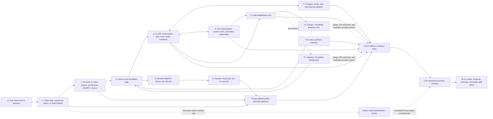

# Chalk full-stack observability plan

<!-- cspell:words microbursts symbolicated symbolication traceparent tracestate -->

Date: 2026-07-11

## Decision

Chalk should standardize internal telemetry on OpenTelemetry conventions and
OTLP. Every managed deployment should send telemetry through a collector
boundary. The first managed backend should be Grafana Cloud because one stack
can correlate metrics, logs, traces, profiles, browser real-user monitoring,
SLOs, alerts, and synthetic checks. Self-hosted Chalk should emit the same OTLP
data to a customer-selected backend or a documented Grafana OSS deployment.

First-party React Native apps also need a Sentry adapter for readable native
crash stacks, release health, source maps, and debug symbols. Sentry should not
become a dependency of the public client contract or a second server telemetry
pipeline.

The public TypeScript client should own a stable Chalk telemetry event model, a
bounded in-memory diagnostic timeline, and injected exporters. React and React
Native packages should consume that client surface. A package must never
silently send telemetry to Chalk or a vendor.

The goal is complete coverage of meaningful boundaries, state transitions,
invariants, and user-visible outcomes. Recording every loop iteration, media
packet, frame payload, or message body would create privacy, cost, cardinality,
and performance failures. High-volume activity should become aggregated
metrics, sampled spans, and transition events.

## Current state

Chalk has pieces of observability, but no connected production observability
system.

| Surface                        | What exists                                                                                                                                                                            | Material gaps                                                                                                                                                                                                                        |
| ------------------------------ | -------------------------------------------------------------------------------------------------------------------------------------------------------------------------------------- | ------------------------------------------------------------------------------------------------------------------------------------------------------------------------------------------------------------------------------------ |
| Go API                         | Structured `slog` records, opt-in request logs, opt-in SQL operation timing, startup/shutdown events, `/healthz`, `/readyz`, and local-only pprof in `apps/api/internal/observability` | Request and operation logging default off. There are no metrics, exported traces, request IDs, W3C trace propagation, correlated logs, runtime dashboards, alert rules, or telemetry for most provider adapters and domain outcomes. |
| Elixir sync                    | `/healthz`, BEAM/Logger runtime, Bandit and `:telemetry` available transitively, and one revision-conflict error log                                                                   | There is no readiness check, structured event vocabulary, metrics exporter, tracing, connection/room/command telemetry, VM dashboard, stateholder measurement, or alerting.                                                          |
| TypeScript client              | The Effect HTTP client provides a natural span boundary. The React Native tree retains development diagnostics and a wide-event shape.                                                 | The main client is currently minimal and the React Native compatibility core is a stub. There is no production event contract, exporter, trace propagation, remote error reporting, RTC stats pipeline, or cross-package ownership.  |
| Web and mobile apps            | Development diagnostics UI and some console records                                                                                                                                    | There is no browser RUM, Web Vitals, release correlation, source-map-backed error monitoring, native crash pipeline, or production session telemetry.                                                                                |
| External monitoring and status | A Cloudflare uptime worker, incident CLI remnants, and `/status` route shell                                                                                                           | The worker still checks pre-rebuild endpoints and posts to an ingest route the rebuilt API does not expose. The status route is blank. This is not an active monitoring loop.                                                        |

The immediate risk is silent failure. A process can be alive while joins,
provider calls, sync commands, media establishment, recordings, or transcripts
are failing. Current liveness checks cannot distinguish those cases.

## End-to-end layers and target architecture

Yes: the target covers the complete user journey through every Chalk-owned
layer, in both directions, from the initiating UI action to media rendered on a
remote client. It correlates a trace where propagation is possible and links
events, metrics, provider references, and synthetic results where a literal
trace cannot cross an opaque provider or peer-to-peer boundary.

Cloudflare Realtime SFU is the primary media plane. Cloudflare RealtimeKit is an
optional, uncommon adapter. Provider-specific events must sit behind the
`MediaPlane` observability contract so the everyday dashboards and SLOs do not
assume RealtimeKit.



The numbered layers are the review checklist for every join, reconnect,
publish, subscribe, command, recording, and leave path:

| Layer                   | What Chalk observes                                                                                                        | Proof of the layer                                                         |
| ----------------------- | -------------------------------------------------------------------------------------------------------------------------- | -------------------------------------------------------------------------- |
| 0. User outcome         | Intent, visible success/failure, and phase timings                                                                         | Join and recovery funnel reaches a defined UI terminal state               |
| 1. SDK and framework    | State transitions, commands, retries, generations, stable errors, and diagnostic timeline                                  | Client event and model tests plus real-user events                         |
| 2. Device runtime       | Permissions, app lifecycle, WebRTC connection/track state, adaptive `getStats()` summaries, web errors, and native crashes | Browser/device tests and privacy-safe client export                        |
| 3. Internet and edge    | DNS/TLS/request timing, edge status, ICE candidate class, RTT/loss/jitter, and regional synthetic results                  | Black-box probes and client-derived network indicators                     |
| 4. Go API               | HTTP, auth, domain outcomes, bootstrap, media-plane calls, and runtime health                                              | Correlated metrics, traces, and logs                                       |
| 5. Data and adapters    | Postgres, Redis, jobs, storage, OAuth, AI, email, webhook, and integration outcomes                                        | Dependency spans, saturation metrics, reconciliation, and fault tests      |
| 6. Elixir sync          | WebSocket lifecycle, room/stateholder state, commands, acknowledgements, broadcast, replay, revision, and BEAM health      | Protocol traces, runtime metrics, and multi-client tests                   |
| 7. Media plane          | Chalk's direct SFU control calls and references; RealtimeKit events only when that adapter is selected                     | Adapter contract tests, provider usage reconciliation, and synthetic media |
| 8. Remote media runtime | Receive/decode state, first audio/video, freezes, concealment, loss, jitter, and track terminal state                      | Subscriber-side WebRTC summaries and media canary assertions               |
| 9. Remote outcome       | Playable media/control state, recovery, and clean teardown                                                                 | End-to-end SLI and two-client journey result                               |
| Observability path      | Gateway, collector, exporters, dashboards, alert delivery, and probe freshness                                             | Independent monitoring-of-monitoring and stale-source alerts               |

### One operational surface

Grafana is the daily operational cockpit. It should contain the service and
journey dashboards, logs, traces, frontend sessions, SLOs, provider-usage
reconciliation, deploy annotations, alert state, incident links, telemetry
cost, and a coverage-health dashboard. Cloudflare consoles and Sentry are
forensic source systems, not normal navigation destinations.

One exception remains: readable React Native native-crash stacks require a
specialized symbolication service. The first-party Sentry adapter should project
a normalized crash count, affected release, issue state, and deep link into
Grafana. Opening the deepest native crash detail leaves Grafana. Everything
else should be diagnosable from the Grafana surface. This exception must remain
visible in the coverage register rather than being described as a literal
single-vendor system.

The public telemetry gateway is required for browser and mobile exports. It
authenticates or rate-limits clients, validates schemas, strips forbidden
fields, enforces payload limits, batches accepted events, and forwards only
approved data. Public clients must not send directly to an unrestricted
collector.

The collector applies resource enrichment, redaction, batching, retry, volume
limits, and tail sampling before export. A telemetry backend outage must not
make the API, sync server, or client session unavailable.

### End-to-end correlation

Every meaningful operation gets a `journey.id` at its first instrumented
boundary. A user action, SDK timer, reconnect detector, webhook, scheduled job,
queue consumer, reconciliation loop, and synthetic probe can all be roots.
`journey.id` is carried separately from the trace ID because retries, async
work, WebSocket broadcasts, and the two sides of a media connection may form
multiple linked traces.

Journeys do not have to begin at layer 0. The root records `origin.kind`,
`first_observed.layer`, and `upstream.visibility`. `upstream.visibility` is
`complete` when Chalk observed the causal origin, `external` when the operation
arrived from another system, and `unknown` when the origin cannot be proven.
The journey never invents history before its first observed boundary.

Examples include:

| First observed boundary   | Example root                                                                               | Required completion                                                                                      |
| ------------------------- | ------------------------------------------------------------------------------------------ | -------------------------------------------------------------------------------------------------------- |
| Client                    | User action, SDK timer, permission change, reconnect detector                              | Follow every resulting client, API, sync, media, and remote-client branch to a terminal state            |
| Go API                    | Public API request, authenticated integration callback, or administrative operation        | Follow service, database/cache, job, sync, provider, and response consequences                           |
| Elixir sync               | New socket, timeout, stateholder recovery, or internally detected revision fault           | Follow room, command, broadcast, persistence, disconnect, and recovery consequences                      |
| Background worker         | Scheduler, queue delivery, reconciliation, retry, or cleanup                               | Follow every attempt and side effect to success, failure, cancellation, expiry, or dead-letter state     |
| Provider boundary         | Provider webhook, usage discrepancy, provider response, or externally detected degradation | Mark the upstream provider history external and follow every Chalk reaction and user-visible consequence |
| Infrastructure or monitor | Process restart, capacity threshold, deployment, black-box probe, or alert self-test       | Follow remediation, alert delivery, incident state, recovery, and status projection where applicable     |

A journey may fan out. Every branch must terminate as `succeeded`, `failed`,
`cancelled`, `expired`, `superseded`, or an explicitly defined domain terminal
state. An open branch after its deadline is a stuck-state signal. A long-lived
WebSocket, room, or process is a resource lifecycle with many linked operation
journeys; it is not one unbounded trace.

W3C trace context follows synchronous HTTP and causal sync commands. Async
jobs, broadcasts, reconnect attempts, provider callbacks, and remote-client
work use span links back to the originating journey. Chalk stores a restricted
mapping from the journey to its API request, sync connection/command, SFU
application/session/track references, publisher, and subscribers. Those
references remain out of metric labels.

The resulting journey is one navigable causal graph in Grafana:

```mermaid
sequenceDiagram
  participant A as Publishing Chalk client
  participant API as Go API
  participant DB as Postgres or Redis
  participant Sync as Elixir SyncEngine
  participant CF as Cloudflare Realtime SFU
  participant B as Subscribing Chalk client
  participant G as Grafana journey view

  A->>API: Bootstrap with journey and trace context
  API->>DB: Room, auth, and media-plane state
  DB-->>API: Result
  API-->>A: Bootstrap result
  A->>Sync: Join or publish command with trace context
  Sync->>CF: Create session or publish track
  CF-->>Sync: SFU session and track result
  Sync-->>B: Track announcement with journey link
  B->>Sync: Subscribe command with linked trace
  Sync->>CF: Pull track and renegotiate
  CF-->>Sync: Subscription result
  A-->>CF: Encrypted RTP media
  CF-->>B: Forwarded encrypted RTP media
  B-->>G: First packet, decoded frame, and playable outcome
  API-->>G: Spans, events, and outcomes
  Sync-->>G: Spans, links, and outcomes
  Note over CF: Managed internals are opaque; entry, exit, usage, and effects remain linked
```

Media crosses a provider and device boundary that does not preserve Chalk trace
context inside RTP or expose Cloudflare's internal spans. The track announcement
through Chalk sync carries the journey link to the subscriber. Explicit events
record publish requested, SFU accepted, subscriber observed, first packet,
first decoded frame, first playable media, and terminal teardown. The operator
therefore sees the complete action and every Chalk-controlled handoff while the
Cloudflare segment is accurately shown as an opaque timed dependency.

### Trace completeness contract

Retain a lightweight journey skeleton for 100% of meaningful operations in
managed and first-party Chalk deployments. The skeleton contains the root,
every required layer boundary, phase timing, normalized outcome/error, missing
phase detection, release, and terminal state. A journey with no terminal event
becomes a detectable stuck journey rather than disappearing.

Detailed spans, logs, profiles, and high-frequency RTC evidence have a separate
retention policy:

- Retain 100% for failures, slow journeys, invariant violations, synthetic
  canaries, new-release canaries, and explicitly selected diagnostic cohorts.
- Sample healthy low-level detail after the complete skeleton is safely stored.
- Preserve continuous aggregate metrics and exemplars so a sampled journey can
  still be compared with its cohort.
- Allow a privacy-reviewed diagnostic switch to temporarily retain full detail
  for a bounded cohort, release, or time window.

Public packages remain opt-in and never silently export. Chalk can guarantee
the complete remote journey only for first-party deployments and adopters that
enable the exporter. Before initialization, after a hard process kill, or while
a client is fully offline, server-side absence signals can identify the missing
phase but cannot reconstruct client events that were never delivered.

“Everything” therefore means every defined operation, layer boundary, state
transition, dependency outcome, and user-visible result. It does not mean every
function call, loop iteration, RTP packet, media frame, or secret/content byte.
Capturing those would alter product performance, create prohibitive volume, and
violate the privacy boundary.

### Why the Cloudflare SFU segment is opaque

Cloudflare operates the Realtime SFU as a managed multi-tenant service on its
network. Chalk can instrument the clients, SyncEngine, and every HTTPS operation
at the service boundary, but cannot deploy an OpenTelemetry agent inside the
provider's processes. As of 2026-07-11, the public SFU surface documents
session creation/retrieval, track publication/subscription, renegotiation,
closure, limits, and usage queries at application/session/track level. It does
not document customer access to per-journey internal spans, node logs, queues,
routing decisions, or congestion-control traces. This is a conclusion about
the public product surface; an enterprise agreement or future API may expose
more.

Reduce this opaque segment by capturing the complete provider request outcome,
latency, retry, normalized error, and any safe provider request reference;
correlating SFU application/session/track references in restricted traces;
collecting publisher and subscriber WebRTC evidence; reconciling provider
usage; and running two-ended regional canaries. Build a provider escalation
bundle from those facts so Cloudflare can investigate its private side.

There are two ways to remove the provider-internal blind spot: Cloudflare must
expose supported internal telemetry, or Chalk must operate an SFU it can
instrument. Self-hosting would add substantial scaling, global routing,
capacity, security, upgrade, and on-call responsibility. It would still leave
the public Internet, client operating system, and hardware outside Chalk's
control. The planned direct Cloudflare SFU architecture accepts that ownership
boundary and makes it visible inside an otherwise complete journey.

## One telemetry contract

Every signal should use the same vocabulary across languages.

Required resource fields:

- `service.name`, `service.version`, `deployment.environment.name`, region,
  runtime name/version, instance ID, and SDK name/version.
- A build/release identifier shared by source maps, server images, logs,
  traces, and deploy markers.
- W3C `traceparent` and `tracestate` on HTTP. The sync protocol should carry
  trace context on handshake and command frames where a causal request exists.
- A Chalk request ID for support lookup. Trace IDs and request IDs should be
  returned in safe error responses and diagnostic reports.

Required event fields:

- Versioned `event.name`, timestamp, operation, outcome, duration, retry count,
  and stable error code.
- Old state, new state, transition cause, and generation/revision for state
  machines.
- Pseudonymous room, session, and participant correlation IDs only where a
  trace or restricted log needs them.
- Provider and platform names as bounded enums.

Metric labels must remain bounded. Service, environment, release, region,
normalized operation, outcome, error code, status class, provider, platform,
and SDK version are acceptable. Tenant, room, session, participant, request,
URL, SQL, and command IDs must never become metric labels.

Observability events, product analytics, audit records, and public status are
four separate data classes:

- Observability explains reliability and performance.
- Product analytics explains adoption and funnels using consented, minimized
  business events.
- Audit records are durable tenant-visible security facts and are never sampled.
- Public status is a deliberately redacted projection of confirmed incidents.

## Signal coverage

### Go API

Instrument the existing `internal/observability` boundary rather than placing
vendor calls in handlers or services.

- HTTP RED signals by normalized route: rate, errors, status class, response
  bytes, request duration, in-flight requests, cancellations, and timeouts.
- Authentication, authorization, CORS, and rate-limit outcomes using stable
  reason codes without tokens, emails, or IP addresses in application events.
- Domain outcomes for room/session lifecycle, participant admission, recording,
  transcription, storage, integrations, and webhooks.
- Postgres query duration/error by generated operation name; pool size, active,
  idle, wait count, wait duration, acquire failures, and transaction outcomes.
- Redis latency/errors/pool saturation and every external adapter call to the
  Cloudflare SFU, optional RealtimeKit, object storage, email, OAuth, AI, and
  integration providers.
- Retry, backoff, rate-limit response, circuit state, webhook deduplication,
  background work, dead-letter, and reconciliation signals when those paths
  exist.
- Go runtime metrics, goroutines, heap, GC pauses, file descriptors, CPU,
  process restarts, startup readiness time, and graceful shutdown duration.
- Short spans around HTTP, services, repositories, transactions, and outbound
  provider requests. Structured logs should automatically include trace/span
  IDs from context.

### Elixir sync server

Create `ChalkSync.Observability` as the single attachment and naming boundary.
Emit `:telemetry` events from transport, room, stateholder, and protocol code;
attach metrics, structured Logger metadata, and OpenTelemetry handlers at the
application edge.

- BEAM scheduler utilization, run queue, reductions, process count, memory,
  garbage collection, mailbox depth, supervisor restarts, and crash reasons.
- Bandit connection/request counts, open WebSockets, handshake duration,
  active connections, connection age, close code class, abnormal disconnects,
  frames/bytes by direction and frame type, and protocol decode failures.
- Hello/auth success and failure, join latency, command-to-ack latency,
  command result, duplicate command rate, replay versus snapshot, revision gap,
  replay depth, and resync rate.
- Active rooms, subscribers per room as histograms, room process lifecycle,
  command queue/mailbox depth, broadcast fanout duration, slow consumer
  detection, and dropped/closed slow clients.
- Stateholder load/commit/replay latency and errors, revision conflicts,
  split-brain stops, recovery outcomes, and authoritative revision lag.
- Short spans per handshake, command, stateholder operation, and recovery.
  A WebSocket connection should use lifecycle events and metrics rather than one
  unbounded span lasting the entire call.
- Add `/readyz` for stateholder readiness and a restricted diagnostic surface
  for aggregate process state. Profiling endpoints stay private.

### TypeScript client and UI packages

Put behavior and telemetry in `sdks/typescript/client`. React and React Native
should add framework/runtime facts without redefining events.

- Provide a versioned `TelemetryEvent` union, `TelemetryExporter`, sampling
  policy, bounded queue, and privacy filter. Export must be asynchronous,
  batched, flow controlled, and safe to drop.
- Provide `getDiagnosticReport()` with a bounded privacy-safe state snapshot and
  transition timeline. Preserve the existing rule that diagnostics exclude
  credentials, raw media, chat content, transcript text, and customer
  identifiers that have not been redacted.
- Instrument the join funnel: request started, token acquired, sync connected,
  provider joined, local tracks ready, first remote audio, first remote video,
  and join complete/failure. This is the top user SLI.
- Instrument every connection vector independently: API, Chalk sync socket,
  direct SFU control/session state, WebRTC peer connection, producing media
  tracks, and consuming media tracks. Add RealtimeKit signaling events only
  when that adapter is active.
- Record state transitions with cause, attempt, generation, elapsed time, token
  refresh result, and whether recovery used socket reconnect, provider recovery,
  or a full rejoin.
- Instrument commands, acknowledgements, timeouts, retries, revision gaps,
  snapshot/replay, media toggles, device changes, permission failures, screen
  share, recording controls, and clean versus failed leave.
- Consume WebRTC peer-connection, ICE, negotiation, and track transitions plus
  direct SFU control outcomes. Consume RealtimeKit media/socket transition
  events and reconnection attempts only for RealtimeKit sessions. Poll WebRTC
  `getStats()` on a low-frequency baseline and temporarily increase frequency
  during degradation or reconnect.
- Derive bitrate, RTT, jitter, packet loss, frames dropped, freeze duration,
  audio concealment, selected candidate type, codec, and quality level. Export
  deltas and summaries instead of raw stats reports.
- Web adds Web Vitals, navigation, resource/API spans, long tasks, uncaught
  errors, unhandled rejections, browser/network class, and release/source-map
  correlation.
- React Native adds native crashes, app state, network changes, permission
  outcomes, device/OS/app release, JS stalls, memory pressure where available,
  and native bridge failures. Sentry receives only crash/release signals through
  the first-party adapter.

### Providers, infrastructure, and external truth

- Record every direct Cloudflare SFU control operation: application/session
  creation or reuse, track publish/pull, negotiation, close, timeout, retry,
  rate limit, and normalized provider error. Reconcile Chalk references with
  the provider's application/session/track usage data where available.
- Expose bounded provider capabilities through the `MediaPlane` contract:
  control-operation telemetry, usage dimensions, lifecycle events, webhook
  availability, and provider-internal diagnostics. Dashboards must show
  `unknown` when an adapter does not supply a capability.
- For uncommon RealtimeKit sessions, ingest signed and deduplicated webhooks for
  meeting, participant, recording, transcript, and summary lifecycle. Measure
  delivery lag, duplicate rate, processing failures, and provider/API
  disagreement. Poll its usage analytics through the same media-plane
  boundary.
- Collect Postgres, Redis, host/container, DNS, TLS, edge, certificate, and
  deployment health from infrastructure exporters once the target deployment
  platform is selected.
- Replace the stale uptime checks with multi-region black-box checks for web,
  API liveness/readiness, sync liveness/readiness, and telemetry intake.
- Add a scheduled two-client synthetic meeting that creates or reuses an
  isolated canary room, joins through the API and sync plane, establishes media,
  exchanges a control command, observes audio/video, leaves cleanly, and cleans
  up all temporary resources.
- Add lower-frequency recording and transcription canaries with strict cleanup
  and no human content.

## Initial SLOs and alert policy

The existing north-star latency budgets remain the product targets. Availability
objectives below are initial proposals and should be ratified after two weeks of
clean baseline data.

| User outcome                   | Proposed objective                                              | Primary SLI                                      |
| ------------------------------ | --------------------------------------------------------------- | ------------------------------------------------ |
| API core availability          | 99.95% monthly                                                  | Successful eligible requests / eligible requests |
| Dashboard/API reads            | p95 under 200 ms                                                | Server request duration by normalized route      |
| Join funnel                    | At least 99.0% success; p50 under 1 s and p95 under 2.5 s       | Eligible join attempts reaching first media      |
| Sync commands                  | At least 99.9% accepted commands acknowledged; p95 under 100 ms | Command-to-authoritative-ack duration            |
| Published track visibility     | p95 under 500 ms                                                | Publish observed to remote playable track        |
| Unexpected disconnect recovery | At least 99% recover within the defined reconnect grace         | Recovered reconnects / eligible reconnects       |
| Recording and transcription    | 100% reach an explicit terminal or actionable stuck state       | Started work reconciled to terminal state        |

Page on user-visible SLO burn, broad join failure, sync correctness threats,
data-loss threats, or monitoring blindness. Create lower-urgency tickets for
capacity trends, single-provider degradation with working failover, and cost
drift. Use multi-window error-budget burn alerts so one isolated error does not
page. Every page must link to a dashboard, representative traces, a runbook, the
current release/deploy marker, and the responsible service owner.

The first page set should cover:

- API availability and latency burn.
- Join failure and join latency burn, split by bounded platform/provider/region.
- Sync command failure/latency, revision conflicts, and abnormal disconnects.
- Reconnect failure and no-first-media cohorts.
- Recording/transcription stuck or unreconciled work.
- Postgres/Redis saturation and external provider error budgets.
- Telemetry collector drops, exporter failures, stale synthetic probes, and
  alert-delivery failure. Monitoring must monitor itself through an independent
  path.

## Coverage boundary: what is and is not captured

Comprehensive means every meaningful Chalk-owned boundary, transition,
invariant, dependency call, and user-visible outcome has evidence. It does not
mean recording every byte. The coverage dashboard should classify every signal
as `observed`, `derived`, `inferred`, `unknown`, `stale`, or `intentionally
excluded` so operators can see the confidence of a diagnosis.

### Captured

- User journey phases and terminal outcomes from intent through remote playable
  media, recovery, and teardown.
- SDK state machines, commands, acknowledgements, retries, revisions, sync
  lifecycle, permissions, device/app lifecycle, and stable error codes.
- API, data-store, cache, job, external adapter, and media-plane control
  operations with latency, outcome, saturation, trace, and release context.
- Client-side WebRTC connection, ICE, negotiation, and track state plus derived
  bitrate, loss, jitter, RTT, freezes, concealment, and first-media timing.
- Go, BEAM, process, host, collector, gateway, probe, and alert-delivery health.
- Provider usage and lifecycle facts exposed by the active adapter, reconciled
  against Chalk state.

### Intentionally excluded

These exclusions protect user content, secrets, system performance, and metric
cardinality. They are design requirements, not unfinished instrumentation.

- Raw audio, video, screen-share, recording, packet, or decoded frame content.
- Chat messages, transcript text, whiteboard content, AI prompts or responses,
  display names, email addresses, and other meeting content.
- Credentials, authorization headers, cookies, tokens, provider secrets, raw
  request/response bodies, unrestricted exceptions, and raw SQL.
- Full URLs with query strings, raw IP addresses, raw SDP, ICE candidate
  addresses, and persistent device fingerprinting.
- Full WebRTC stats reports, per-packet/per-frame events, loop iterations, and
  healthy high-frequency state polling. The system exports bounded summaries
  and degradation windows instead.
- Session replay on meeting surfaces. A later privacy review may approve a
  tightly masked non-meeting surface, but media and customer content remain out.
- Tenant, room, session, participant, request, URL, SQL, and track identifiers
  as metric labels. Restricted traces or logs may use short-lived pseudonyms.

### Blind spots and what will still be missed

| Blind spot                                     | What is missed                                                                                                                                                      | Maximum practical mitigation                                                                                                                                                                                                      |
| ---------------------------------------------- | ------------------------------------------------------------------------------------------------------------------------------------------------------------------- | --------------------------------------------------------------------------------------------------------------------------------------------------------------------------------------------------------------------------------- |
| Cloudflare SFU internals                       | Provider node CPU/memory, internal queues, routing choices, congestion-control decisions, inter-data-center hops, and failure detail the public API does not expose | Correlate direct SFU API outcomes, usage, dual-ended `getStats()`, and regional canaries; keep the provider capability marked `unknown`; request additional Cloudflare telemetry if a supported product surface becomes available |
| Last-mile Internet, NAT, and firewall          | Exact physical hop or policy that caused loss, jitter, timeout, or blocked connectivity                                                                             | Infer from DNS/TLS timing, ICE candidate class, WebRTC stats, error codes, network-change events, and multi-region comparisons                                                                                                    |
| Browser, OS, hardware, and native runtime      | Encoder/decoder/GPU/thermal/driver internals the platform does not expose                                                                                           | Capture supported WebRTC/runtime metrics, normalized device/OS class, memory-pressure events, and reproduce on real devices                                                                                                       |
| Host application outside the Chalk package     | Consumer application code before it calls Chalk, custom UI behavior, and host errors unless the adopter integrates an exporter                                      | Publish an opt-in host instrumentation API and integration checklist; label the boundary as external                                                                                                                              |
| Hard crash, force kill, or sudden network loss | Buffered final events that cannot flush and events before telemetry initialization                                                                                  | Keep a bounded local queue, flush on lifecycle signals, use server-side absence/timeout signals, and accept that the final client cause may remain unknown                                                                        |
| Sampling and aggregation                       | Healthy traces that were not retained and sub-interval media microbursts hidden by summary windows                                                                  | Keep all errors/invariants, use tail and adaptive sampling, retain exemplars, and increase RTC sampling during degradation                                                                                                        |
| Cross-system causality                         | A literal span through Cloudflare's private SFU and across two client clocks                                                                                        | Use linked events and restricted correlation references; report clock skew and evidence confidence                                                                                                                                |
| Encrypted or excluded content                  | Whether media content itself was semantically correct, what a person said, or what appeared inside a shared screen                                                  | Synthetic media can assert known tones/test patterns only; production content remains deliberately inaccessible                                                                                                                   |
| RealtimeKit-only data                          | RealtimeKit webhooks, analytics, and high-level meeting lifecycle during direct SFU sessions                                                                        | Do not treat RealtimeKit telemetry as universal; implement direct-SFU client/control evidence and expose adapter capabilities                                                                                                     |
| Native crash forensic detail                   | The deepest symbolicated React Native crash detail inside Grafana                                                                                                   | Project normalized issue/release state into Grafana and deep-link to restricted Sentry detail                                                                                                                                     |

The coverage register is a versioned artifact owned with the signal catalog. A
new provider, adapter, platform, or user journey cannot ship until its row states
what is observed, inferred, excluded, and unknown. Unknown is an acceptable
state when the provider does not expose evidence; an unlabeled gap is not.

## Privacy, security, and retention

Create an allowlist schema before remote client export. Reject unknown fields at
the gateway and collector. Use keyed pseudonyms when per-session correlation is
required and rotate the key on a documented schedule. Keep raw correlation IDs
out of metrics. Treat debug telemetry as sensitive operator data with
role-based access and access audit.

Start with these collection policies and tune from measured volume:

- Metrics: aggregate all measurements; retain long enough to compare releases
  and seasonal behavior.
- Journey skeletons: retain 100% for managed, first-party, and exporter-enabled
  deployments so every meaningful operation remains searchable start to finish.
- Server errors, invariant violations, and slow traces: retain 100% through tail
  sampling.
- Healthy detailed server spans and logs: begin at 10% after the journey
  skeleton is stored; reduce only after RED metrics and exemplars remain useful.
- Client failures: retain 100% of allowed detail after privacy filtering.
  Retain every enabled client's journey skeleton and sample additional healthy
  client detail at 1-5%, adapting upward for new releases or affected cohorts.
- RTC stats: collect low-rate deltas during health, short high-rate windows
  during degradation, and one final session summary.

## Cost model and controls

There will be cost. It has five parts:

| Cost source                | What drives it                                                                                                                       | Primary control                                                                                    |
| -------------------------- | ------------------------------------------------------------------------------------------------------------------------------------ | -------------------------------------------------------------------------------------------------- |
| Grafana telemetry          | Active metric series/data points per minute, ingested and retained logs/traces/profiles, frontend sessions, and synthetic executions | Cardinality budgets, aggregation, adaptive/tail sampling, retention tiers, and synthetic frequency |
| Collector and gateway      | Compute, memory, egress, buffering, and high-availability replicas                                                                   | Batch/compress, bounded queues, load tests, and horizontally sized limits                          |
| Native crashes             | Sentry event volume and retention for first-party React Native apps                                                                  | Crash/release signals only, deduplication, and quota alerts                                        |
| Media canaries             | Two synthetic clients consume Cloudflare SFU egress and runtime minutes                                                              | Short isolated calls, known tiny media, cleanup, and frequency based on SLO risk                   |
| Engineering and operations | Instrumentation upkeep, dashboard/alert review, incident response, and privacy/security maintenance                                  | Generated contracts, ownership, tests, runbooks, and quarterly pruning                             |

Current public pricing on 2026-07-11 gives useful bounds, although the final
bill depends on plan and contract:

- Cloudflare Realtime SFU ingress is free; egress is currently `$0.05/GB` after
  the first `1,000 GB` shared monthly SFU/TURN allowance. Normal production
  media already incurs this cost. Synthetic meetings add a small amount.
- Cloudflare currently describes RealtimeKit as free during beta. Its published
  post-GA list price is `$0.002` per audio/video participant-minute and
  `$0.0005` per audio-only participant-minute, with exports billed separately.
  This affects only uncommon RealtimeKit sessions.
- Grafana Cloud separately meters metrics, logs/traces/profiles, frontend
  observability, and synthetics. Its current logs/traces/profiles documentation
  lists a `50 GB` free allotment and usage dimensions of `$0.05/GB` processed
  and `$0.40/GB` written, with retention charges beyond the included period.
  Contract pricing can differ, so the cost dashboard must use the actual plan.

Use this monthly estimator after Phase 0 measures real volumes:

```text
monthly observability cost =
  metric series/data-point cost
  + log/trace/profile ingest and retention
  + frontend observed sessions
  + synthetic executions
  + collector/gateway infrastructure
  + native crash quota
  + synthetic SFU egress
```

Add usage dashboards and hard warning/stop budgets for active metric series,
data points per minute, log bytes, spans, client events, retained days,
synthetic executions, SFU canary egress, collector drops, and vendor spend.
Forecast at 50%, 80%, and 100% of expected meeting volume. A release that
causes uncontrolled telemetry growth is a regression.

## Plan scope

This document defines the observability program's architecture, coverage, and
acceptance contract.

It covers:

- The end-to-end layers, variable journey roots, correlation/propagation rules,
  branch and terminal-state semantics, and trace completeness guarantee.
- Required signals for the Go API, Elixir sync server, TypeScript/React/React
  Native packages, WebRTC/media plane, data stores, adapters, infrastructure,
  synthetics, and the telemetry pipeline itself.
- Grafana as the operational surface, the restricted native-crash exception,
  SLO/alert principles, monitoring-of-monitoring, and public-safe status flow.
- Privacy exclusions, evidence-confidence labels, known blind spots, retention
  and sampling rules, cost dimensions, cost controls, and provider boundaries.
- Implementation order, phase deliverables, verification gates, continuous
  enforcement, and the program-level definition of done.

It deliberately does not cover:

- Raw or semantic meeting content, unrestricted session replay, credentials,
  secrets, or other excluded data.
- Product analytics, business funnels, billing ledgers, tenant audit-log
  implementation, security detection/response, or customer-support workflow
  beyond the correlation hooks that keep those data classes separate.
- Cloudflare's unexposed internal implementation or the public Internet and
  client internals that neither Chalk nor supported platform APIs can observe.
- Production identifiers, credentials, account configuration, contact routes,
  private incident data, or production deployment actions in the public repo.

It requires, but does not yet contain, the implementation artifacts produced by
the phases below:

- The final event and journey schemas, error-code catalog, generated language
  types, instrumentation map, storage schema, and file-level code design.
- Collector/gateway configuration, Grafana dashboard queries, alert expressions,
  SLO definitions, Terraform or other infrastructure code, and Sentry
  projection implementation.
- Measured baselines, instrumentation overhead results, actual volume and cost
  forecasts, ratified SLO targets, retention approval, and cardinality limits.
- Runbooks, ownership/on-call assignments, rollout calendar, migration plan,
  staging failure scenarios, provider escalation procedure, and live acceptance
  evidence.

Those artifacts are the next level of specification and implementation. Their
phase gates below prevent the program from being called complete before they
exist and work end to end.

## Implementation phases

### Phase 0 — Contract and baseline

Deliver:

- An observability ADR, signal catalog, naming rules, privacy classification,
  retention policy, cardinality budget, sampling policy, coverage register, and
  ownership map.
- Versioned cross-language event/error code definitions in the contract source
  of truth where transport-visible fields are needed.
- A journey schema defining every root type, required layer boundary, span-link
  rule, terminal state, and missing-phase timeout.
- Benchmarks for API requests, sync commands, join flow, client bundle/runtime,
  and current telemetry volume.
- A monthly cost forecast at 50%, 80%, and 100% expected meeting volume using
  actual vendor terms and a documented per-signal budget.
- Dashboards that show the existing health checks and establish the absence of
  the new signals without inventing data.

Gate:

- Schema tests reject forbidden fields and unbounded metric labels.
- The proposed instrumentation overhead budgets are written from measured
  baselines before code rolls out.
- Every layer in the end-to-end diagram has an explicit observed, derived,
  inferred, intentionally excluded, or unknown classification.

### Phase 1 — Telemetry pipeline and correlation

Deliver:

- Local and deployment-ready OTel Collector/Alloy configuration with OTLP
  receivers, memory limiter, batching, redaction, tail sampling, retry queues,
  health telemetry, and Grafana export.
- Infrastructure-as-code for data sources, folders, dashboards, alert rules,
  contact points, and deploy annotations. Secret values stay outside the public
  repository.
- A Grafana operations home that links every journey, service, SLO, incident,
  coverage-health, and telemetry-cost view from one surface.
- A protected public telemetry gateway for client batches.
- Shared resource attributes, release identifiers, trace propagation, request
  IDs, and log correlation.
- A local observability stack runnable through OrbStack for end-to-end tests.

Gate:

- One local request appears as correlated metric, trace, and log.
- One local multi-layer action produces a complete journey skeleton even when
  its healthy detailed spans are deliberately sampled out.
- A deliberately failed export is buffered or dropped within bounds and does
  not affect product behavior.
- A release marker can be followed to the exact service and SDK versions.

### Phase 2 — Go API coverage

Deliver the complete API signal set, instrument all outbound adapters, add
runtime/database/cache metrics, and convert existing request/operation logs into
the correlated contract. Keep handlers and domain services vendor-neutral.

Gate:

- Automated integration tests send traces and metrics to a test collector.
- Forced Postgres, Redis, provider timeout, rate limit, invalid auth, and panic
  paths produce the expected safe telemetry.
- A browser/API request can be followed through HTTP, service, database, and
  outbound provider spans.
- Load tests prove the agreed latency, CPU, allocation, and telemetry-volume
  budgets.

### Phase 3 — Elixir sync coverage

Deliver the `:telemetry` event catalog, structured metadata, OpenTelemetry
export, BEAM/runtime dashboards, readiness, connection/command/stateholder
signals, and correctness alerts.

Gate:

- A real WebSocket test produces hello, join, command, ack, broadcast, leave,
  and room-stop telemetry with one causal trace.
- Fault tests cover auth rejection, malformed frames, hello timeout, slow
  consumers, room crash, stateholder failure, revision conflict, replay, and
  snapshot fallback.
- Multi-client load verifies the sync latency budget and bounded mailbox,
  memory, metric-cardinality, and exporter behavior.

### Phase 4 — Client event model and diagnostics

Build the telemetry contract into the client while the current minimal client
and compatibility stubs are replaced. Wire React and React Native to the same
core events. Add the bounded DiagnosticReport, exporter interface, gateway
client, trace propagation, privacy tests, and failure-safe batching.

Gate:

- Unit/model tests prove every public state transition and stable error code
  emits the correct event exactly once.
- Offline, background, retry, exporter failure, queue overflow, and application
  shutdown remain bounded and never block meeting behavior.
- Package tests prove remote export is absent unless explicitly configured.
- Debug reports contain enough correlation to find server traces and contain no
  forbidden content.
- A first-party client journey remains searchable from root to terminal outcome
  after healthy detailed telemetry is sampled.

### Phase 5 — Real-user media quality and native crash coverage

Wire direct-SFU control and WebRTC connection/track events, adaptive WebRTC
stats, Web Vitals, web error monitoring, and first-party Sentry React Native
crash/release integration. Add RealtimeKit events behind its adapter. Upload
source maps, dSYMs, and Android symbols as release artifacts. Project normalized
native crash issue and release state into Grafana with restricted deep links.

Gate:

- Real browser and device tests visibly produce join timing, first-media,
  reconnect, quality-degradation, and clean-leave telemetry.
- An intentional web error and native crash resolve to readable source lines and
  the exact release.
- Grafana shows the native crash alert, issue state, affected release, and
  volume before an operator opens Sentry for the deepest stack detail.
- Network shaping proves packet loss, high RTT, offline/recovery, and failed
  recovery are classified correctly.
- Telemetry remains within client CPU, memory, battery, bandwidth, and package
  size budgets.

### Phase 6 — SLOs, synthetics, status, and operational proof

Replace the stale uptime worker contract, add multi-region black-box and
two-client media canaries, implement SLOs/error budgets, route alerts, write
runbooks, and connect confirmed incidents to a public-safe status projection.

Gate:

- Controlled staging failures trigger the expected alert, reach the configured
  human channel, link to actionable evidence, create no duplicate page, and
  resolve correctly.
- Independent monitoring detects a broken collector, telemetry gateway, probe,
  and alert route.
- The two-client canary proves API, sync, direct Cloudflare SFU control/media,
  remote playback, and clean teardown end to end. A separate lower-frequency
  adapter test covers RealtimeKit while it remains supported.
- Recording/transcription canaries prove terminal reconciliation and cleanup.
- Public status exposes component state and approved incident copy without raw
  internal telemetry.
- An operator can diagnose every exercised failure from Grafana; only a native
  crash symbolication drill may require the linked Sentry detail, and provider
  consoles remain confirmation sources rather than the primary workflow.

## Continuous enforcement

After these phases, observability becomes part of feature completion:

- Behavior changes add or update telemetry and focused tests.
- New external dependencies add latency/error/saturation dashboards and alerts.
- New state machines define valid transitions, stable reasons, and stuck-state
  detection.
- New user journeys define an SLI and synthetic or real-user proof.
- Schema and dashboard changes are reviewed like code and deployed from source.
- Release gates verify telemetry in staging before rollout and compare canary
  versus previous release.
- Quarterly game days exercise database/cache/provider failure, sync process
  loss, bad deploy, telemetry outage, alert delivery, and incident/status flow.

## Definition of done

The program is done only when a real client action can be followed in Grafana
from user interaction through the API, sync server, stateholder/database,
direct Cloudflare SFU control, remote WebRTC playback, and the user-visible
terminal state. The same proof must work through the optional RealtimeKit
adapter when it is selected. Failures page on a user-impact SLI; the page links
to correlated evidence and a runbook; the diagnostic report contains a safe
lookup key; every blind spot is visibly classified; monitoring blindness pages
through an independent path; and a telemetry outage cannot take down a meeting.
An arbitrary healthy managed journey must retain its complete skeleton after
detailed sampling, and missing or unterminated phases must be queryable as
failures.

Code presence, green unit tests, or dashboards with synthetic sample data do
not satisfy this definition.

## Primary sources

- [OpenTelemetry Collector](https://opentelemetry.io/docs/collector/)
- [OpenTelemetry signals](https://opentelemetry.io/docs/concepts/signals/)
- [OpenTelemetry JavaScript status](https://opentelemetry.io/docs/languages/js/)
- [OpenTelemetry browser exporters and security](https://opentelemetry.io/docs/languages/js/exporters/)
- [Effect OpenTelemetry integration](https://effect-ts.github.io/effect/docs/opentelemetry)
- [Cloudflare Realtime SFU overview](https://developers.cloudflare.com/realtime/sfu/)
- [Cloudflare Realtime SFU Connection API](https://developers.cloudflare.com/realtime/sfu/https-api/)
- [Cloudflare Realtime SFU sessions and tracks](https://developers.cloudflare.com/realtime/sfu/sessions-tracks/)
- [Cloudflare Realtime SFU limits](https://developers.cloudflare.com/realtime/sfu/limits/)
- [Cloudflare Realtime SFU pricing](https://developers.cloudflare.com/realtime/sfu/pricing/)
- [Cloudflare RealtimeKit connection metadata](https://developers.cloudflare.com/realtime/realtimekit/core/meeting-metadata/)
- [Cloudflare RealtimeKit webhooks](https://developers.cloudflare.com/realtime/realtimekit/webhooks/)
- [Cloudflare RealtimeKit analytics API](https://developers.cloudflare.com/api/node/resources/realtime_kit/subresources/analytics/)
- [Cloudflare RealtimeKit pricing](https://developers.cloudflare.com/realtime/realtimekit/pricing/)
- [Grafana Cloud application observability setup](https://grafana.com/docs/grafana-cloud/monitor-applications/application-observability/setup/)
- [Grafana Cloud frontend observability](https://grafana.com/docs/grafana-cloud/monitor-applications/frontend-observability/introduction/)
- [Grafana Cloud metrics usage and cost](https://grafana.com/docs/grafana-cloud/cost-management-and-billing/understand-usage-cost/metrics/)
- [Grafana Cloud logs, traces, and profiles invoice](https://grafana.com/docs/grafana-cloud/cost-management-and-billing/manage-invoices/understand-your-invoice/logs-invoice/)
- [Grafana Cloud frontend observability invoice](https://grafana.com/docs/grafana-cloud/cost-management-and-billing/manage-invoices/understand-your-invoice/frontend-observability-invoice/)
- [Grafana Cloud synthetic monitoring invoice](https://grafana.com/docs/grafana-cloud/cost-management-and-billing/manage-invoices/understand-your-invoice/synthetic-monitoring-invoice/)
- [Sentry React Native](https://docs.sentry.io/platforms/react-native/)
