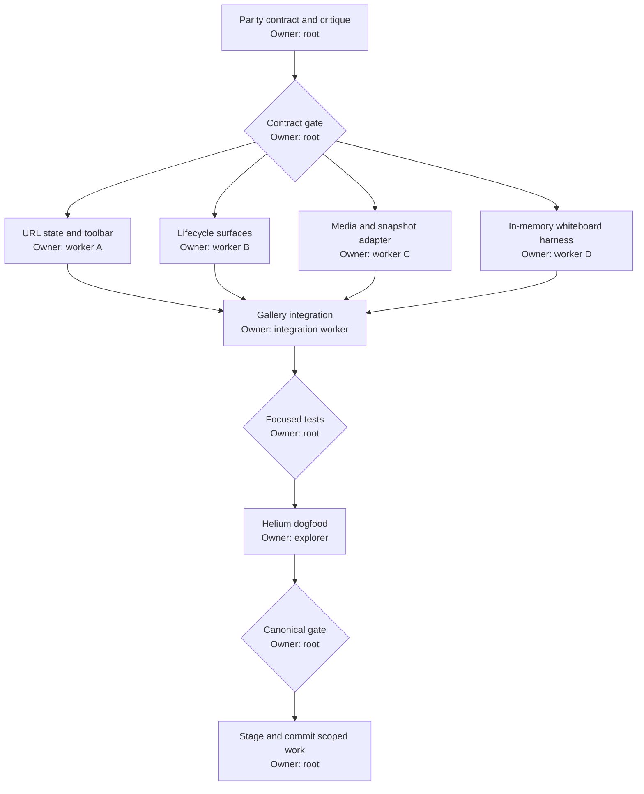

# SDK Preview Parity

## Background

The development-only `/sdk-preview` route reuses the React SDK's `SpaceView`, but its URL state and fixtures expose only a subset of the states that the production `Chalk` composition can render. The Entrance lifecycle is partly replaced with gallery-only screens, Space fixtures always grant broad capabilities, several production overlays cannot be selected, media controls do not produce representative visual state, and the theme picker collapses multiple supported palettes into five aliases.

The preview must become the deterministic visual and interaction harness for the production web `Chalk` composition. A developer must be able to open, copy, and restore every supported preview state from the URL or the Preview controls. The preview stays local: it does not request real media permission, connect to RealtimeKit, open real diagnostics, or mutate a real Space.

## Done

- Entrance renders the production ready, joining, and pre-live failure surfaces through `EntranceSurface`, with DOM-contract tests for the production copy and controls.
- Entrance can show a representative camera feed and the production media-permission error without calling `getUserMedia`.
- Space exposes leaving and left lifecycle surfaces with the same copy and actions as `Chalk`.
- Preview controls can show or hide Diagnostics and can select an incoming media request.
- The Leave dialog exposes End Episode when the selected capability preset permits it.
- A non-empty Admission queue auto-opens Admission without requiring `panel=admission`.
- The whiteboard state renders the real `WhiteboardView` with an in-memory collaboration adapter. No RealtimeKit transport is used; the production Excalidraw asset-loading behavior is allowed.
- Camera-on Participants have deterministic synthetic camera tracks; the preview can show an active speaker, local or remote screen share, and enabled, disabled, requesting, and failed local media states.
- Preview controls can select role/capability presets and independently enable or disable every `SpaceViewFeatures` key, including transcript and sounds.
- Every value in `THEME_PALETTES`, `THEME_TEXTURES`, and `THEME_SKINS` is selectable and URL-addressable without lossy aliases.
- Settings receive deterministic device lists and a synthetic camera track. Preview commands update the local snapshot or query when their production equivalent changes visible state.
- Existing preview URLs continue to parse: legacy palette and texture aliases normalize to their canonical SDK values.
- Focused state, toolbar, gallery, fixture, adapter, and route restoration tests pass. `/sdk-preview` is verified in Helium at desktop and narrow viewport sizes.
- `pnpm run gate` passes after integration.

Out of scope: production behavior changes, RealtimeKit connectivity, real browser media permission prompts, real Episode diagnostics pages, persistence beyond URL state, and a server-backed whiteboard. A behavior-preserving extraction of production presentation into a shared SDK component is in scope when reuse is required for parity.

## Behavior

Entrance lifecycle state selects only the lifecycle. Media state and permission failure remain independent so combinations are inspectable. The production web baseline always supplies display name and the Chalk logo, so those values remain fixed. Joining and failure must not use gallery-only substitutes when production `Chalk` uses Entrance.

Space lifecycle state is independent from panels, dialogs, Participant data, and feature availability. `reconnecting` is the only connection state rendered over `SpaceView`; post-live `failed`, `leaving`, and `left` use the same shared status surface as production `Chalk`. `ended` remains a gallery fixture but is labeled as an embedding-app callback state, not a production `Chalk` surface.

The selected Role controls the displayed Role only. The independently selected capability preset determines command visibility because Chalk never infers authority from Role names. Feature toggles then remove product features regardless of capability. The preview must never claim a command succeeded without updating visible local state or exposing that the command is unavailable.

Admission queue contents are source state. `SpaceView` owns the auto-open behavior. Selecting Admission directly may open an empty panel; selecting a waiting queue must exercise auto-open.

All synthetic media tracks are created and stopped by one adapter boundary. They must be silent or generated locally, deterministic, and cleaned up when their state is no longer selected.

The Preview controls are keyboard complete. Hiding them returns focus to the Show button; opening them moves focus to the controls heading or first field; Escape closes them. The toggle exposes its expanded state and controlled region.

## Canonical preview state

- Lifecycle: Entrance retains its existing states; Space adds `leaving` and `left`, and separates the post-live failed status surface from `reconnecting`.
- Entrance media: microphone and camera each use the five SDK local-media states: `unavailable`, `requesting`, `enabled`, `disabled`, and `failed`. Legacy boolean query values normalize to enabled or disabled.
- Space media: active speaker is `none` or a fixture Participant ID; screen share is `none`, `local`, or `remote`; incoming request is `none`, `unmute`, or `start-camera`.
- Admission: queue state is `empty` or `waiting`, independent from the selected panel.
- Access: Role and capability are independent named presets. Features are a typed map with one serializable boolean for every `SpaceViewFeatures` key.
- Embedding app integration: diagnostics is enabled or disabled. End Episode visibility comes from the capability preset, not a second contradictory toggle.
- Appearance: palette, texture, and skin derive directly from the SDK constants. Legacy aliases normalize once at the query boundary.
- Time: snapshot builders use a fixed preview epoch so the same URL produces the same Episode duration and Admission expiry after reload.

## System

- `preview-state.ts` is the canonical serializable contract and backward-compatible query normalizer.
- `PreviewGalleryToolbar.tsx` edits only that contract.
- Pure fixture builders map preview state to `SpaceSnapshot` without React or browser I/O.
- Preview media and whiteboard adapters own browser-shaped resources and cleanup.
- `SdkPreviewGallery.tsx` composes the production surfaces and adapters. It must not duplicate production UI.
- `preview-client.ts` remains a test-support adapter. Commands that affect visible state delegate to an injected local snapshot updater; unsupported commands resolve without side effects only when no visible parity claim depends on them.

### Preview command matrix

| Production command | Required local result |
| --- | --- |
| Set microphone or camera | Update the matching local media state and URL control. |
| Start or stop screen share | Change the selected local screen-share state. |
| Raise or lower hand | Update self hand state. |
| Rename self | Update the displayed preview name for the current preview. |
| Admit or deny | Remove the selected Admission request; close the panel when the queue becomes empty only if production does. |
| Allow or decline media request | Remove the incoming request and update the requested media state on Allow. |
| Send reaction | Add a deterministic local reaction event. |
| Leave | Select the leaving lifecycle, then expose the left direct state for inspection. |
| End Episode | Select the embedding-app callback ended fixture. |
| Diagnostics | Show a local invocation toast; never open a real diagnostics URL. |

Participant-management commands, chat publication, whiteboard collaboration, and file transfer may use deterministic in-memory adapters. A visible command must not report success while leaving every observable preview state unchanged.

## Execution

### Lane contracts

- Worker A owns `preview-state.ts`, `PreviewGalleryToolbar.tsx`, and their tests. It must not edit the gallery, fixture builders, or SDK components.
- Worker B owns a new preview lifecycle module and its tests. It returns production-shaped Entrance, leaving, and left surfaces without changing production components.
- Worker B may perform the smallest behavior-preserving extraction from `Chalk.tsx` needed to share the production Space status surface. It must preserve concurrent `Chalk.tsx` edits.
- Worker C owns preview media/snapshot adapter modules and their tests. It must not edit React gallery or toolbar files.
- Worker D owns an in-memory whiteboard preview adapter/component and its tests. It must use the real `WhiteboardView` and must not edit production whiteboard code.
- The integration worker owns `SdkPreviewGallery.tsx`, `sdk-preview-fixtures.ts`, gallery tests, and any narrow integration-only fixes. It consumes the four lane contracts without taking ownership of their files.
- Root owns integration review, dogfood decisions, the gate, staging, and commit.

## Anti-slop rules

- Do not add a second visual implementation of Entrance, Space, dialogs, panels, media requests, or whiteboard tools.
- Do not add a new dependency.
- Do not hide state in component-local toggles when it must survive a copied preview URL.
- Do not model roles as scattered booleans. Use named capability presets derived from existing `Capability` values.
- Do not use lossy theme aliases in the canonical state. Legacy aliases exist only at the URL boundary.
- Do not request hardware permission or connect to a remote service.
- Do not weaken tests to accommodate no-op commands.
- Do not couple the Empty preset to Participant count or chat data. Independent URL controls remain authoritative.
- Do not use `Date.now()` in preview fixture construction.
- Do not leave focus behind in unmounted Preview controls.
- Preserve concurrent edits in the shared worktree and do not stage, commit, reset, stash, or revert another agent's work.
