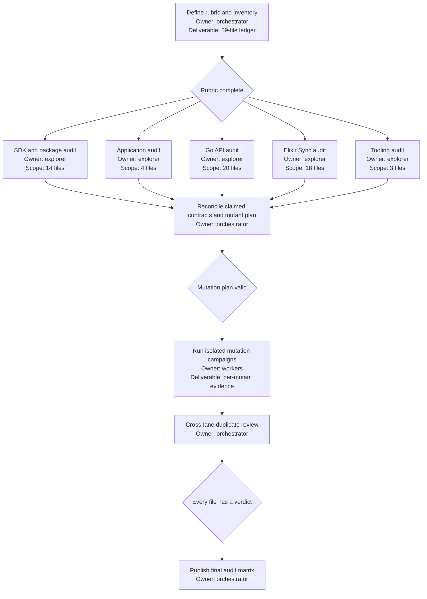

# Retained Test Mutation Audit

## Background

Chalk retains 59 test files after the maximum-reduction work: 14 in TypeScript SDKs and packages, 4 in applications, 20 in the Go API, 18 in Sync, and 3 in infrastructure or tooling. Their small count does not prove that they are current, unique, or effective. Old boundary tests can outlive the behavior they once protected, duplicate stronger integration proofs, or pass while meaningful defects survive.

The desired state is an evidence-backed decision for every retained file. A test remains only when it reaches a current production boundary, protects a material failure mode that no other retained proof covers, and kills a causal mutation of that boundary. Good structure, static types, schemas, construction rules, and builds remain the preferred proof for local behavior.

## Done

- All 59 files have one audit record containing their runner reachability, current production dependency, claimed contract, overlapping proofs, relevant history, mutation evidence, and verdict.
- Each file receives a `keep`, `merge`, `rewrite`, or `delete` verdict. A keep verdict names the unique failure mode that would otherwise have no executable proof.
- Mutation evidence uses behavior-changing mutants in production or operational code. Mutating assertions, fixtures, or test-only helpers does not count.
- A retained file kills at least one valid mutant for each contract used to justify retention. A surviving mutant makes that contract unproved until a stronger causal check explains the survival.
- Baseline failures, equivalent mutants, compile-only mutants, and mutations killed by an unrelated earlier gate are recorded separately and do not inflate effectiveness.
- The audit changes no production source, test source, manifests, or test routing. Mutants exist only in isolated temporary checkouts and are restored or deleted after each run.
- The final report gives exact deletion, merge, and rewrite candidates. Deletion is not executed without a new explicit instruction.

## Audit standard

A file is stale when its asserted behavior no longer has a reachable production caller, its fixtures describe an obsolete contract, its runner does not execute it, or its assertions no longer match the boundary's source of truth.

A file is duplicative when another retained proof crosses the same real boundary, injects the same failure, and asserts the same externally visible result. Different language, directory, or test framework does not make evidence unique.

A file is ineffective when a material mutant survives, the test only proves setup or framework behavior, the test passes without reaching its claimed boundary, or its assertions permit the broken result.

A file is unnecessary when static construction, schema validation, compilation, startup, or a stronger boundary proof necessarily rejects the same defect earlier and more cheaply.

Verdicts mean:

- `keep`: current, uniquely material, and mutation-sensitive.
- `merge`: material evidence exists, but another retained file can own it without losing the real boundary.
- `rewrite`: the boundary deserves evidence, but the current file is stale, weak, indirect, or mutation-insensitive.
- `delete`: no current unique runtime contract survives the audit.

## Mutation protocol

For each retained file:

1. Prove that the canonical runner selects the file and that its focused baseline passes.
2. Trace each retention claim to current production symbols and external effects.
3. Select the smallest causal mutants that break those claims, prioritizing removed rejection guards, inverted authorization, skipped persistence, corrupted wire values, reordered recovery, swallowed failures, and disabled destructive safeguards.
4. Apply one mutant at a time in an isolated checkout, run the narrowest command that should detect it, and record the exit result plus the assertion or gate that killed it.
5. Mark a mutant `killed`, `survived`, `invalid`, or `uncovered`. Do not treat compilation failure as a test kill when static compilation is already the intended proof.
6. Restore the checkout before the next mutant and verify that no mutation reaches the audit branch.

Generic mutation scores are supporting evidence, not the decision rule. The audit values meaningful boundary mutations over large counts of equivalent arithmetic, formatting, or syntax mutants.

## Execution

### Checklist

- [x] Freeze the exact 59-file inventory and runner map.
- [x] Complete the SDK and package audit.
- [x] Complete the application audit.
- [x] Complete the Go API audit.
- [x] Complete the Sync audit.
- [x] Complete the infrastructure and tooling audit.
- [x] Reconcile cross-language and cross-layer duplicates.
- [x] Execute and record valid mutation campaigns.
- [x] Assign and verify all 59 verdicts.
- [x] Remove all temporary checkouts, databases, processes, and mutation artifacts.

## Anti-slop rules

- Do not keep a file because it passed, is recent, is large, or has high coverage.
- Do not delete a file merely because a generic mutation tool emits equivalent or uncompilable mutants.
- Do not count a mutant killed by type checking when the test itself never observes the defect.
- Do not use mocks as evidence for a boundary that can be exercised against PostgreSQL, a real codec, a real process, or the shipped script.
- Do not run mutation lanes against production services, credentials, deployments, or databases.
- Do not edit tests to improve their audit result. A weak test receives a rewrite or delete verdict.
- Do not let two mutation lanes share a checkout, database, port, artifact directory, or long-running process.
- Do not recommend retaining two proofs for the same failure unless each catches a distinct causal path.
