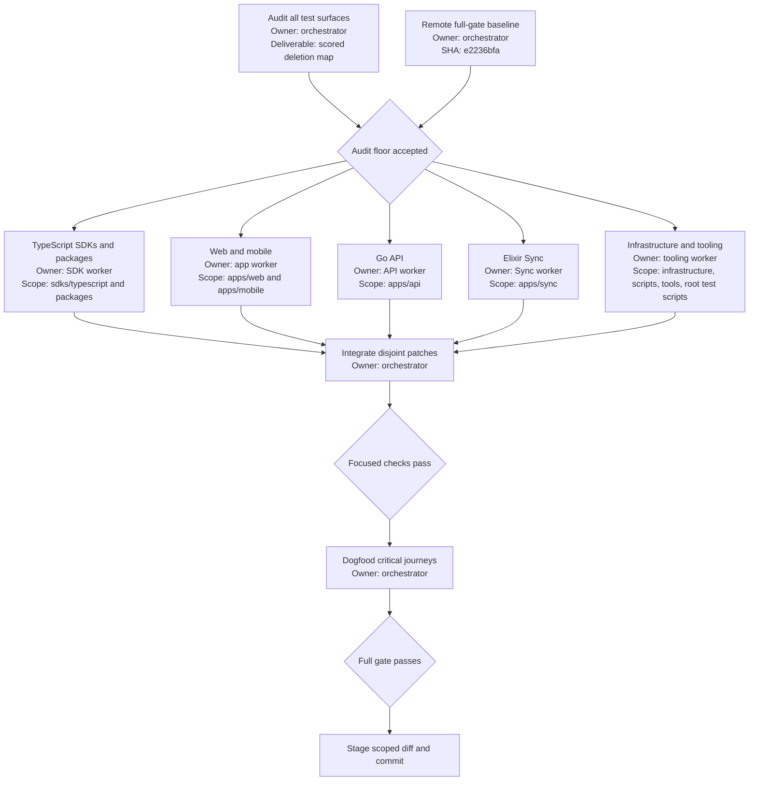

# Maximum Test Suite Reduction

## Background

Chalk has 773 tracked test files: 487 JavaScript or TypeScript suites, 191 Go suites, 87 ExUnit suites, and 8 executable shell suites. Many UI, wrapper, helper, projection, and duplicated layer tests protect the same behavior several times. This makes the suite expensive to understand and maintain.

The final state is a 162-file boundary-focused suite. It keeps one strong proof for each material security, persistence, protocol, recovery, shipped-surface, or destructive-automation contract and removes lower-level proofs that duplicate that boundary. Line coverage and the number of tests are not goals.

## Done

- Exactly 162 tracked test files remain, for a 79.0% whole-file reduction from the 773-file baseline.
- The execution baseline is commit `e2236bfa`. Its clean remote full-gate result is recorded before deletion, and the reduction stops if that baseline is not green.
- Type checking and builds replace tests that only prove symbols, exports already covered by a public-surface contract, static source text, styling, defaults, wrappers, or framework behavior.
- One integrated journey replaces component-by-component and handler-by-handler happy-path suites.
- The remaining suite still proves authentication and tenant isolation, token and webhook security, protocol and generated-contract compatibility, PostgreSQL migrations and concurrency, ordering and recovery, provider failure boundaries, observability propagation, and destructive deployment safeguards.
- Focused checks pass for each changed area, then `pnpm run gate -- --full` passes from the integrated tree.
- The API race lane, API migration proofs, Sync protocol/topology/failover proofs, managed deployment safeguards, and release verification pass explicitly because the full gate does not select all of them.
- No deployment, database migration, public API, or application behavior changes. One unreachable API route-mount wrapper with no callers is removed after the reduced suite exposes it to Staticcheck.
- The intended loss is accepted: the suite no longer catches most isolated presentation, default-prop, helper, mapper, wrapper, formatting, or exhaustive configuration-permutation regressions.

## Deletion rule

A test survives only when removing it leaves a material failure mode without another test that reaches the same real boundary. A test is deleted when type checking, startup, a public contract suite, a real provider or database integration, or a broader journey already fails for the same defect.

The floor keeps:

- Wire schemas, generated-contract parity, and one shipped-surface journey for each major client surface.
- Authentication, authorization, tenant isolation, credential binding, signing, replay, SSRF, encryption, and redaction boundaries.
- Database migrations, generated queries, locking, idempotency, retention, ordering, and failure recovery.
- Sync and whiteboard codecs, durable queues, reconnect behavior, topology failure, and browser/native transport seams.
- One end-to-end journey for each major SDK, application, diagnostics, release, and deployment path.
- Failure signals and W3C trace propagation at one representative boundary.

The mandatory security scenarios are:

- `SEC-TENANT`: an authenticated identity cannot read or mutate another Tenant and the denial leaks no resource data.
- `SEC-CREDENTIAL`: a mismatched, expired, revoked, replayed, or incorrectly bound credential fails closed.
- `SEC-WEBHOOK`: raw-body tampering, signature mismatch, replay, unsafe destination resolution, and encryption failure are rejected without exposing secrets.
- `SEC-REDACTION`: logs, traces, metrics, diagnostic exports, and operator errors contain no tokens, keys, webhook secrets, or sensitive payloads.

The mandatory protocol scenarios are generated-vs-runtime parity, golden valid frames, malformed frames, unknown fields, v1 version rejection, cross-language sync producer/consumer compatibility, whiteboard multipart ordering, and persisted replay after reconnect.

The mandatory concurrency and recovery scenarios are duplicate command idempotency, lock contention, ordered ACK/replay, provider timeout or terminal failure, process reconnect, multi-node partition healing, and PostgreSQL primary loss and recovery.

Observability remains proven at representative SDK-to-API, API-to-provider or database, client-to-Sync, and operator-diagnostics boundaries. The retained proofs assert journey continuity, valid W3C trace context, bounded structured signals, and visible failure state.

The reduction removes:

- Per-component existence, render, copy, styling, snapshot-like source, and default-prop tests.
- Unit tests for private helpers, wrappers, mappers, facades, constructors, and test support.
- Repeated happy paths at domain, handler, repository-mock, and route layers when a real route plus PostgreSQL suite covers them.
- Duplicate telemetry projections and exhaustive valid/default configuration permutations.
- Test files that no gate, package script, workflow, or retained suite executes.

## Audited floor

The baseline count uses tracked files from `e2236bfa` and this exact classifier:

```bash
node -e 'const {execFileSync}=require("node:child_process"); const files=execFileSync("git",["ls-files"],{encoding:"utf8"}).trim().split("\n"); const tests=files.filter((file)=>/\.(test|spec)\.[cm]?[jt]sx?$/.test(file)||/_test\.go$/.test(file)||/_test\.exs$/.test(file)||/(^|\/)scripts\/(test-[^/]+|[^/]*-test\.sh)$/.test(file)); console.log(tests.length)'
```

It returns `773` at the baseline. Fixtures and helpers are not counted unless their filename itself matches the classifier.

| Area                                               | Baseline | Final floor | Reduction |
| -------------------------------------------------- | -------: | ----------: | --------: |
| TypeScript SDKs and packages                       |      309 |          50 |     83.8% |
| Web and mobile applications                        |      136 |          17 |     87.5% |
| Go API, including auxiliary proofs                 |      196 |          47 |     76.0% |
| Elixir Sync, including auxiliary JavaScript proofs |       89 |          38 |     57.3% |
| Infrastructure, scripts, and tools                 |       43 |          10 |     76.7% |
| **Total**                                          |  **773** |     **162** | **79.0%** |

Counts are acceptance checks, not quotas. A retained unique critical proof is not deleted to improve the percentage, and an orphaned test is not retained because the floor has already been reached.

## Retained scenario matrix

| Scenario                                   | Retained proof                                                                                      | Required check                                  |
| ------------------------------------------ | --------------------------------------------------------------------------------------------------- | ----------------------------------------------- |
| `SEC-TENANT`                               | API route authorization and Web account-boundary suites                                             | API race gate and workspace tests               |
| `SEC-CREDENTIAL`                           | API key, Sync JWT, service-credential, and worker-identity suites                                   | API race gate and Sync gate                     |
| `SEC-WEBHOOK`                              | Go webhook codec and delivery suites plus TypeScript server-client verification                     | API race gate and workspace tests               |
| `SEC-REDACTION`                            | SDK telemetry, API observability, Sync diagnostics, and operator-probe suites                       | API race gate, Sync gate, and workspace tests   |
| Protocol parity and malformed frames       | Generated contract checks, TypeScript Sync client, whiteboard wire, and Sync protocol/socket suites | Contract checks, workspace tests, and Sync gate |
| Persistence, ordering, and replay          | Four migration scripts plus retained API and Sync PostgreSQL state-holder suites                    | Migration proofs, API race gate, and Sync gate  |
| Reconnect, partition, and provider failure | Sync transport/provider suites and replicated reliability profiles                                  | Sync gate and topology harness                  |
| Deployment safety                          | Managed configuration/controller checks and release/deploy suites                                   | Managed checks and release verification         |
| Shipped client journeys                    | SDK client, Web Space page, Mobile Space screen, and native lifecycle suites                        | Workspace tests and full gate                   |

## Execution



### Checklist

- [x] Audit all five ownership seams and challenge conservative keep-by-default results.
- [x] Set the boundary-focused floor and accepted confidence loss.
- [x] Record a green remote `pnpm run gate -- --full` baseline at `e2236bfa`.
- [x] Delete and consolidate TypeScript SDK and package tests.
- [x] Delete and consolidate Web and mobile application tests.
- [x] Delete and consolidate Go API tests.
- [x] Delete and consolidate Elixir Sync tests.
- [x] Delete and consolidate infrastructure, script, and tool tests.
- [x] Integrate patches and remove orphaned fixtures, helpers, scripts, and test references.
- [x] Run focused checks and repair only failures caused by the reduction.
- [x] Challenge the 319-file first-pass floor and reduce it to the 162-file hard boundary floor.
- [x] Run all four API migration scripts, the API race lane, Sync protocol/topology/failover checks, managed config/controller tests, and release verification explicitly.
- [x] Dogfood the surviving critical journeys.
- [x] Run the second-pass full gate, stage only this scope, and commit.

## Anti-slop rules

- Do not change production behavior to make the reduced suite pass.
- Do not replace many deleted tests with an equally large new suite.
- Do not preserve a test only because it is recent, detailed, or raises coverage.
- Do not delete migrations, generated contract fixtures, production scripts, or test helpers still imported by retained tests.
- Do not weaken security, migration, protocol, or deployment assertions merely to reach the target count.
- Do not change production behavior or push a branch. Dead production code may be removed only when the compiler or Staticcheck proves it unreachable after test deletion.

Before deleting an apparently orphaned suite, search package scripts, Turbo tasks, GitHub workflows, shell harnesses, and imports or dynamic paths. A suite is orphaned only when all five searches show that no command reaches it.

Before staging, inspect `git diff --name-status` and fail the handoff if a changed path is outside this allowlist:

- Test files selected by the baseline classifier.
- Test-only helpers, fixtures, and setup files that become unreferenced.
- `apps/sync/test/test_helper.exs` for removed ExUnit tags.
- `package.json`, test routing metadata, the language-ratchet baseline, and test-only gate configuration only for removing deleted test commands or references.
- Retained migration proof scripts when a stale harness runs beyond the migration it is meant to verify.
- Proven unreachable production code exposed by deletion.
- This spec, the session log, and public release notes.

No generated contract, migration, workflow, infrastructure definition, deployment behavior, public API, or reachable application behavior may change.

## Required verification outside the full gate

Run these in clean, isolated environments without production credentials:

```bash
apps/api/scripts/episode-control-snapshot-repair-migration-test.sh
apps/api/scripts/membership-role-migration-test.sh
apps/api/scripts/space-episode-bridge-migration-test.sh
apps/api/scripts/sync-retained-event-schema-repair-migration-test.sh
CHALK_API_RACE=1 apps/api/scripts/gate.sh

apps/sync/scripts/gate.sh
cd apps/sync && mix test test/chalk_sync/protocol_test.exs test/chalk_sync/contract/generated_whiteboard_v1_test.exs test/chalk_sync/transport/socket_test.exs test/chalk_sync/whiteboard_v1/socket_test.exs
cd apps/sync && mix test --include reliability_topology test/chalk_sync/reliability/topology_profile_test.exs test/chalk_sync/reliability/postgres_failover_profile_test.exs

infrastructure/managed-episode/scripts/test-config
infrastructure/managed-episode/scripts/test-deployment-controller
node --test scripts/deploy/verify-web-deploy.test.mjs scripts/npm-release.test.mjs scripts/security/image-size-patch.test.mjs

pnpm run contract:proof
pnpm run contract:check
pnpm run gate -- --full
```
